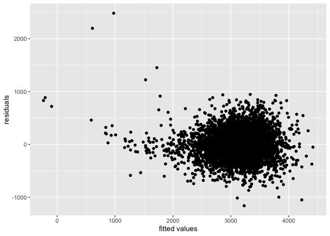
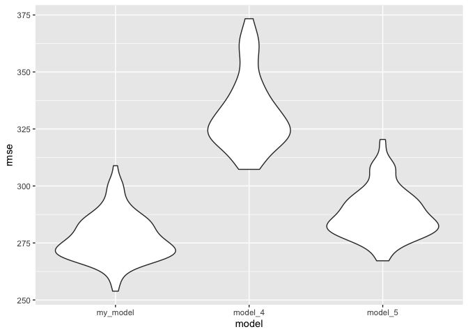
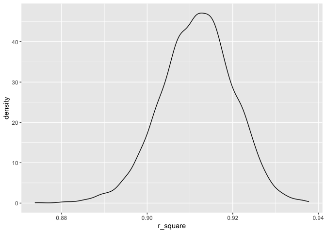
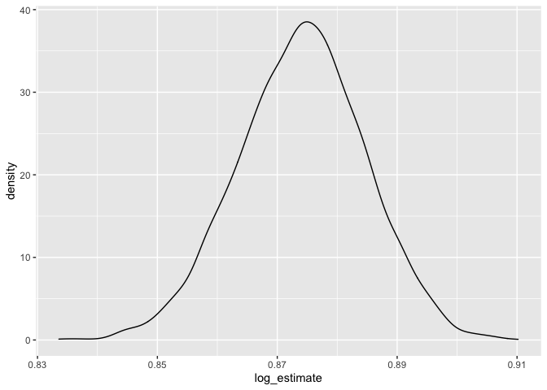

p8105_hw6_ms6358.Rmd
================

``` r
library(readxl)
library(tidyverse)
```

    ## ── Attaching packages ─────────────────────────────────────── tidyverse 1.3.1 ──

    ## ✓ ggplot2 3.3.5     ✓ purrr   0.3.4
    ## ✓ tibble  3.1.5     ✓ dplyr   1.0.7
    ## ✓ tidyr   1.1.4     ✓ stringr 1.4.0
    ## ✓ readr   2.0.2     ✓ forcats 0.5.1

    ## ── Conflicts ────────────────────────────────────────── tidyverse_conflicts() ──
    ## x dplyr::filter() masks stats::filter()
    ## x dplyr::lag()    masks stats::lag()

``` r
library(modelr)
library(mgcv)
```

    ## Loading required package: nlme

    ## 
    ## Attaching package: 'nlme'

    ## The following object is masked from 'package:dplyr':
    ## 
    ##     collapse

    ## This is mgcv 1.8-38. For overview type 'help("mgcv-package")'.

Problem 1

## Here is the data cleaning.

``` r
birthweight = read.csv("./birthweight.csv")

birthweight %>%
  mutate(
    babysex = as.factor(babysex),
    frace = as.factor(frace),
    malform = as.factor(malform),
    mrace = as.factor(mrace)) %>%
  drop_na()
```

    ##      babysex bhead blength  bwt delwt fincome frace gaweeks malform menarche
    ## 1          2    34      51 3629   177      35     1    39.9       0       13
    ## 2          1    34      48 3062   156      65     2    25.9       0       14
    ## 3          2    36      50 3345   148      85     1    39.9       0       12
    ## 4          1    34      52 3062   157      55     1    40.0       0       14
    ## 5          2    34      52 3374   156       5     1    41.6       0       13
    ## 6          1    33      52 3374   129      55     1    40.7       0       12
    ## 7          2    33      46 2523   126      96     2    40.3       0       14
    ## 8          2    33      49 2778   140       5     1    37.4       0       12
    ## 9          1    36      52 3515   146      85     1    40.3       0       11
    ## 10         1    33      50 3459   169      75     2    40.7       0       12
    ## 11         2    35      51 3317   130      55     1    43.4       0       13
    ## 12         1    35      51 3459   146      55     1    39.4       0       12
    ## 13         2    35      48 3175   158      75     1    39.7       0       13
    ## 14         1    36      53 3629   147      75     1    41.3       0       11
    ## 15         1    35      51 3544   129      65     1    39.6       0       12
    ## 16         2    33      49 2551   120      75     2    38.1       0       11
    ## 17         1    35      56 3232   147      55     1    42.1       0       13
    ## 18         2    36      52 3629   154      65     1    40.3       0       11
    ## 19         2    35      57 3374   147      45     1    39.6       0       12
    ## 20         2    35      53 3345   127      65     2    39.7       0       14
    ## 21         1    34      52 3203   134      25     1    41.1       0       14
    ## 22         2    35      50 3175   140      85     2    40.6       0       14
    ## 23         1    34      49 3175   148      96     2    39.7       0       10
    ## 24         2    36      51 2977   135      45     1    41.7       0       13
    ## 25         2    36      56 3685   170      95     1    40.3       0       12
    ## 26         1    34      63 3175   143      25     1    41.9       0       13
    ## 27         1    36      52 3629   152      45     1    39.6       0       11
    ## 28         2    33      49 2948   129      25     1    41.0       0       13
    ## 29         1    35      51 3345   145      75     1    41.3       0       12
    ## 30         2    35      52 3289   135      55     1    40.6       0       13
    ## 31         2    34      49 3118   161      45     2    38.9       0       10
    ## 32         2    34      52 3629   112      25     1    38.0       0       10
    ## 33         1    36      54 3402   161      95     1    40.1       0       11
    ## 34         2    35      51 3827   130      45     1    41.3       0       12
    ## 35         1    38      53 3799   167      75     1    39.9       0       12
    ## 36         2    33      54 3062   134      65     1    40.4       0       12
    ## 37         1    35      55 3856   171      85     1    41.1       0       13
    ## 38         2    34      51 3005   149      85     1    39.3       0       14
    ## 39         1    35      53 3175   130      45     1    40.4       0       13
    ## 40         2    34      54 3345   130      95     1    42.1       0       10
    ## 41         2    35      53 3600   141      35     1    42.3       0       14
    ## 42         2    34      51 3232   155      55     1    41.6       0       15
    ## 43         1    35      52 3232   121      75     3    42.3       0       13
    ## 44         2    34      51 3175   142      96     1    42.3       0       17
    ## 45         2    33      49 3147   140      45     1    40.6       0       12
    ## 46         2    34      49 3317   142      35     1    40.4       0       12
    ## 47         2    34      49 2948   135      75     1    42.7       0       12
    ## 48         2    34      49 3033   128      25     1    41.1       0       12
    ## 49         1    33      51 3345   140      85     1    38.6       0       13
    ## 50         1    34      53 3232   150      35     1    39.6       0       12
    ## 51         2    36      51 3317   136      65     1    42.6       0       14
    ## 52         1    35      51 3147   165      65     1    40.1       0       13
    ## 53         1    34      52 3118   130      75     1    41.0       0       12
    ## 54         1    33      50 3175   168      25     1    40.0       0       13
    ## 55         2    32      48 2551   170      35     1    39.9       0        8
    ## 56         2    33      51 3289   155      65     1    41.6       0       15
    ## 57         2    34      54 3402   154      75     1    40.7       0       14
    ## 58         2    35      52 3487   121      45     1    39.9       0       11
    ## 59         2    34      51 3203   132      85     1    43.7       0       13
    ## 60         1    37      54 3515   143      15     1    41.7       0       12
    ## 61         1    34      51 2920   129      45     1    39.4       0       11
    ## 62         2    30      42 2013   150      65     2    37.7       0       13
    ## 63         1    34      52 3033   172      85     1    41.1       0       16
    ## 64         1    31      46 2381   139      75     1    34.7       0       12
    ## 65         2    33      52 3118   155      45     1    37.9       0       11
    ## 66         2    34      53 3600   148      45     1    40.9       0       13
    ## 67         2    33      54 3402   150      45     1    41.4       0       14
    ## 68         1    34      51 3459   123      45     1    40.0       0       12
    ## 69         1    36      53 3203   140      55     2    39.7       0       14
    ## 70         1    35      50 3289   155      85     1    39.0       0       11
    ## 71         1    34      53 3544   128      35     1    40.4       0       13
    ## 72         2    36      52 4224   178      35     1    41.6       0       13
    ## 73         1    34      47 3090   147      85     1    42.1       0       12
    ## 74         1    35      56 3912   150      65     1    40.6       0       12
    ## 75         1    34      53 3459   150      35     1    41.7       0       13
    ## 76         1    34      50 3374   132      55     1    41.4       0       12
    ## 77         2    35      52 2778   165      25     2    30.4       0       13
    ## 78         1    33      48 2551   157      35     1    37.9       0       13
    ## 79         2    34      51 3232   123      96     1    38.4       0       11
    ## 80         1    35      52 3544   137      65     1    42.7       0       13
    ## 81         2    33      49 2920   135      45     1    38.6       0       10
    ## 82         2    34      51 3430   172      45     1    40.9       0       12
    ## 83         2    35      53 3799   189      96     1    44.6       0       14
    ## 84         1    32      47 2438   137      25     2    39.0       0       13
    ## 85         1    34      51 2977   149      15     3    40.3       0       13
    ## 86         2    34      50 3005   137      35     2    35.9       0       15
    ## 87         2    34      46 2977   145      75     2    47.7       0       11
    ## 88         1    35      50 3118   137      15     1    40.7       0       12
    ## 89         2    35      51 3062   115      96     3    41.4       0       13
    ## 90         1    34      50 3062   140      95     1    41.4       0       13
    ## 91         2    36      56 3969   160      96     2    42.6       0       12
    ## 92         1    35      51 3090   190      35     1    39.3       0       18
    ## 93         2    33      54 3175   173      75     1    35.1       0       12
    ## 94         2    33      48 2438   138      96     1    42.6       0       13
    ## 95         2    33      45 2211   129      65     1    40.3       0       13
    ## 96         1    35      55 3572   182      75     1    40.1       0       13
    ## 97         1    35      52 3487   138      55     1    40.0       0       13
    ## 98         1    34      52 3118   124      65     1    38.7       0       13
    ## 99         2    32      49 2778   140      55     1    38.3       0       12
    ## 100        2    35      51 3515   160      25     1    40.0       0       13
    ## 101        1    35      56 3487   142      45     1    40.4       0       12
    ## 102        2    31      48 2722   121      65     1    39.4       0       13
    ## 103        2    36      53 3799   135      55     1    40.3       0       12
    ## 104        2    32      49 3374   121      85     1    37.3       0       13
    ## 105        1    33      52 2835   140      35     1    40.7       0       12
    ## 106        2    35      55 3487   170      55     1    43.4       0        9
    ## 107        2    33      48 3685   135      55     1    39.7       0       12
    ## 108        1    37      58 4791   144      45     1    40.7       0       12
    ## 109        1    32      47 2693   149      65     1    35.0       0       12
    ## 110        1    33      49 2722   143      55     1    39.6       0       10
    ## 111        2    34      50 3459   145      35     1    41.1       0       13
    ## 112        2    36      50 3515   138       5     1    40.3       0       16
    ## 113        1    36      49 2863   138      96     2    41.6       0       13
    ## 114        1    35      53 3629   141      95     1    42.1       0       10
    ## 115        1    32      48 2637   120      65     1    35.7       0       15
    ## 116        1    33      50 3118   145      55     1    39.3       0       13
    ## 117        2    32      48 2665   145      15     1    38.3       0       15
    ## 118        1    32      46 2211   143      65     2    36.4       0       14
    ## 119        2    34      53 3317   143      35     1    40.3       0       11
    ## 120        2    33      50 2580   137      55     1    39.6       0       13
    ## 121        2    35      53 3912   145      55     1    40.1       0       11
    ## 122        1    35      52 3884   131      45     1    39.7       0       11
    ## 123        1    31      46 2126   118      75     1    36.3       0       11
    ## 124        2    34      52 3175   130      25     1    39.9       1       10
    ## 125        2    33      48 2778   175      35     2    30.6       0       12
    ## 126        1    34      52 3005   125       5     1    36.9       0       12
    ## 127        2    34      46 2750   127      75     1    37.0       0       13
    ## 128        2    33      52 2892   126      25     1    42.0       0       13
    ## 129        1    35      57 3147   125      96     1    41.6       0       14
    ## 130        2    35      53 3657   146      55     1    40.1       0       13
    ## 131        1    34      49 3090   152      96     1    38.7       0       13
    ## 132        1    36      55 4082   177      65     1    40.3       0       11
    ## 133        2    34      50 3090   145      85     1    38.4       0       12
    ## 134        2    32      48 2523   140      45     1    40.9       0       13
    ## 135        2    33      47 2977   137      65     1    41.6       0       13
    ## 136        1    35      51 3742   150      85     1    40.4       0       12
    ## 137        2    33      50 3090   130      25     1    42.0       0       12
    ## 138        2    34      55 3374   136      75     1    38.3       0       12
    ## 139        1    33      47 2750   149      95     1    36.9       0       15
    ## 140        1    35      46 3203   126      55     1    39.0       0       12
    ## 141        2    33      52 3600   152      96     1    40.6       0       12
    ## 142        1    35      49 3090   146      96     1    40.0       0       14
    ## 143        1    35      49 4082   156      35     1    38.7       0       12
    ## 144        1    33      48 2098   130      35     2    35.6       0       12
    ## 145        2    30      45 2325   118      15     1    36.4       0       13
    ## 146        2    35      53 3317   135      96     1    39.1       0       12
    ## 147        1    34      51 3515   149      75     1    40.6       0       12
    ## 148        2    35      55 3685   143      96     1    40.4       0       12
    ## 149        1    35      48 3969   154      45     1    48.3       0       14
    ## 150        1    34      52 2977   143      75     1    38.0       0       14
    ## 151        1    35      49 3430   133      55     1    40.9       0       14
    ## 152        2    34      53 3317   142      45     1    37.0       0       11
    ## 153        1    37      54 3515   176      85     1    40.4       0       13
    ## 154        1    34      56 3317   134      35     1    39.9       0       13
    ## 155        1    35      51 3402   195      75     1    42.0       0        9
    ## 156        1    33      52 3856   141      45     1    41.7       0       13
    ## 157        1    34      51 3203   118      35     1    40.0       0        9
    ## 158        2    33      48 2977   128      65     1    46.0       0       13
    ## 159        1    24      37 1049   143      15     2    27.1       0       13
    ## 160        2    33      53 3544   121      25     1    39.1       0       12
    ## 161        1    37      53 3685   156      75     1    41.4       0       13
    ## 162        2    37      57 3799   142      65     1    41.7       0       13
    ## 163        2    36      48 2778   133      75     1    35.3       0       12
    ## 164        2    34      52 3742   159      75     1    43.1       0       13
    ## 165        1    35      52 3912   144      35     1    41.1       0       14
    ## 166        2    33      49 3232   132      75     1    38.0       0       13
    ## 167        2    35      49 3685   130      55     1    39.9       0       12
    ## 168        2    34      53 3487   120      15     1    40.1       0       11
    ## 169        1    32      48 2608   141      75     1    37.1       0       10
    ## 170        2    34      50 2665   132      75     1    40.7       0       13
    ## 171        2    34      48 3515   141      75     1    40.7       0       12
    ## 172        1    33      48 2892   145      35     2    39.0       0       14
    ## 173        1    35      50 3175   140      15     1    39.6       0       10
    ## 174        2    35      52 3742   142      55     1    40.7       0       14
    ## 175        2    35      50 3515   132      45     1    42.0       0       12
    ## 176        2    35      50 3033   148      45     1    40.4       0       12
    ## 177        2    32      48 2948   151      75     1    40.1       0       12
    ## 178        2    34      50 3147   131      55     2    41.3       0       12
    ## 179        2    32      49 3005   145      45     2    39.1       0       12
    ## 180        1    33      48 3005   130      95     1    39.3       0       15
    ## 181        2    34      51 3232   116      35     1    39.6       0       14
    ## 182        1    36      51 3629    96      35     1    42.0       0       13
    ## 183        1    35      51 3685   138      35     1    41.6       0       11
    ## 184        1    34      51 3430   166      25     1    39.1       0       13
    ## 185        2    34      48 2948   139      25     1    38.0       0       11
    ## 186        1    35      55 4252   130      55     1    41.7       0       13
    ## 187        1    34      51 3090   144      15     1    38.9       0       13
    ## 188        2    33      49 3203   115      96     1    40.0       0       13
    ## 189        2    34      51 3742   124      55     1    40.3       0       12
    ## 190        1    34      51 3062   131      75     1    42.3       0       13
    ## 191        2    35      51 3742   135      55     1    41.6       0       13
    ## 192        2    32      48 2608   138      85     2    43.0       0       11
    ## 193        1    33      48 2892   139      75     1    38.7       0       13
    ## 194        2    31      46 2325   157      75     1    37.1       0       14
    ## 195        2    34      53 3459   147      65     1    41.9       0       12
    ## 196        2    32      48 2693   157      35     2    37.0       0       13
    ## 197        2    33      51 3175   115      35     1    39.0       0       12
    ## 198        1    35      51 3714   169      85     1    41.4       0       12
    ## 199        1    35      51 3544   142      55     1    39.7       0       16
    ## 200        2    33      50 3147   143      85     2    40.9       0       13
    ## 201        2    32      51 3005   120      35     1    40.3       0       13
    ## 202        1    34      54 3770   136      35     1    39.3       0       13
    ## 203        2    36      53 3629   145      95     1    40.6       0       15
    ## 204        2    34      50 3430   145      95     1    40.1       0       10
    ## 205        1    36      48 3345   140      55     1    41.1       0       15
    ## 206        2    33      51 3090   174      35     1    39.3       0       14
    ## 207        1    35      54 3969   137      75     1    41.3       0       10
    ## 208        1    34      51 3033   122      15     1    40.1       0       14
    ## 209        2    34      51 3317   162      15     1    40.3       0       11
    ## 210        2    33      48 3005   124      45     1    38.9       0       12
    ## 211        1    32      49 2523   132      75     1    38.3       0       16
    ## 212        1    36      50 3884   117      75     1    41.4       0       15
    ## 213        2    33      57 3827   145      25     2    38.7       0       12
    ## 214        2    34      50 3317   161      55     1    41.0       0       12
    ## 215        2    34      51 3515   139      55     1    42.6       0       14
    ## 216        1    33      47 2977   158      35     1    40.1       0       12
    ## 217        2    33      48 2438   125      96     1    38.1       0       12
    ## 218        2    33      50 3714   144      25     2    40.6       0       11
    ## 219        2    34      49 2948   127      35     1    35.6       0       12
    ## 220        2    34      48 3005   119      35     2    41.3       0       12
    ## 221        1    33      49 3118   139      15     1    39.3       0       13
    ## 222        1    34      54 3544   154      45     1    40.4       0       12
    ## 223        1    34      50 3203   175      45     1    40.1       0       13
    ## 224        1    34      49 2722   137      55     1    40.6       0       12
    ## 225        2    29      52 2892   127      45     2    40.0       0       12
    ## 226        1    35      51 3544   147      96     1    40.3       0       11
    ## 227        1    35      52 3572   201      65     1    41.1       0       10
    ## 228        1    35      50 3515   146      75     1    40.1       0       12
    ## 229        1    35      45 3402   139      45     1    39.9       0       13
    ## 230        2    33      53 3572   157      45     1    40.4       0       13
    ## 231        1    34      47 2211   149      25     1    34.3       0       11
    ## 232        1    35      50 3175   156      75     1    39.4       0       13
    ## 233        2    35      53 3912   156      35     1    42.4       0       12
    ## 234        2    35      54 3827   169      25     1    42.1       0       12
    ## 235        2    33      50 2948   146      45     1    39.0       0       15
    ## 236        1    35      53 3459   112      55     1    39.0       0       11
    ## 237        2    33      49 2778   133      75     3    39.7       0       12
    ## 238        1    35      52 3289   144      75     1    40.4       0       12
    ## 239        1    36      52 3374   157      55     1    42.1       0       13
    ## 240        2    35      54 3884   162      35     1    40.4       0       15
    ## 241        1    34      53 3487   137      55     1    39.6       0       13
    ## 242        1    35      48 2948   127      85     1    39.9       0       12
    ## 243        1    35      54 3770   129      65     1    42.1       0       12
    ## 244        1    36      49 3005   151      65     1    40.3       0       12
    ## 245        1    36      54 3997   132      65     1    42.0       0       13
    ## 246        2    36      52 3742   187      35     1    41.9       0       12
    ## 247        1    34      48 2835   104      55     1    42.1       0       14
    ## 248        1    35      55 3685   155      55     1    39.4       0       11
    ## 249        1    34      49 2665   137      45     1    39.7       0       13
    ## 250        1    34      51 2920   161      35     1    41.0       0       11
    ## 251        2    33      50 3090   133      55     1    40.3       0       12
    ## 252        1    36      54 4054   168      15     1    40.9       0       12
    ## 253        2    32      49 2948   134      25     1    39.3       0       10
    ## 254        1    34      52 3487   130      25     1    40.1       0       16
    ## 255        2    32      48 2353   140      35     1    38.0       0       13
    ## 256        1    29      42 1814   140      75     1    33.6       0       13
    ## 257        2    35      52 3544   143      15     1    40.4       0       14
    ## 258        1    34      50 3118   136      45     1    38.9       0       14
    ## 259        1    33      52 3033   169      75     2    39.4       0       11
    ## 260        1    36      51 3969   156      45     2    39.6       0       11
    ## 261        2    33      47 2608   117      96     2    33.4       0       13
    ## 262        1    35      53 3827   146      35     1    42.6       0       11
    ## 263        2    35      50 3374   131      45     3    42.3       0       13
    ## 264        1    31      47 2580   142      35     1    36.9       0       14
    ## 265        2    34      48 3260   138      75     1    38.4       0       13
    ## 266        2    36      54 4252   131      75     1    42.6       0       13
    ## 267        1    34      52 3374   139      85     1    43.7       0       12
    ## 268        1    33      52 2892   157      35     1    39.1       0       12
    ## 269        2    35      51 3770   156      75     1    42.4       0       12
    ## 270        1    35      50 3090   158      35     3    41.0       0       12
    ## 271        2    34      53 3118   156      75     1    39.3       0       13
    ## 272        1    34      50 3062   143      35     1    38.4       0       13
    ## 273        1    37      54 3770   215      35     1    46.4       0       16
    ## 274        1    35      50 3175   149      15     1    42.0       0       16
    ## 275        2    34      48 3544   158      96     1    44.7       0       16
    ## 276        2    33      47 3289   201      85     1    41.1       0       12
    ## 277        1    35      53 3544   123      65     1    40.6       0       14
    ## 278        1    36      52 3345   162      96     1    42.6       0       12
    ## 279        1    33      49 3232   168      96     2    38.0       0       15
    ## 280        1    36      52 3487   128      45     1    38.9       0       15
    ## 281        2    32      44 2183   133      65     1    35.3       0       10
    ## 282        2    36      52 3289   155      96     2    41.7       0       13
    ## 283        1    35      51 3203   127      35     1    44.1       0       16
    ## 284        1    35      52 3997   128      65     1    42.6       0       12
    ## 285        2    33      49 3147   128      65     2    42.0       0       11
    ## 286        1    32      49 2495   121      65     2    39.9       0       12
    ## 287        1    35      51 3175   145      45     1    41.0       0       13
    ## 288        2    34      50 3487   159      85     1    41.4       0       13
    ## 289        2    34      54 3714   138      15     1    35.9       0       10
    ## 290        1    32      49 2580   136      55     1    39.9       0       14
    ## 291        1    35      51 3402   120      85     1    40.1       0       15
    ## 292        1    34      53 3515   124      45     3    41.3       0       14
    ## 293        1    35      56 4111   184      75     1    41.0       0        8
    ## 294        1    34      54 3203   144      35     1    40.6       0       14
    ## 295        1    34      48 3005   144      35     1    38.7       0       11
    ## 296        1    33      48 3147   127       5     1    45.3       0       11
    ## 297        2    35      51 3402   128      65     1    40.1       0       14
    ## 298        1    36      51 3572   140      15     1    38.7       0       15
    ## 299        2    35      54 3260   163      75     1    39.7       0       15
    ## 300        2    33      48 3147   132      45     1    38.3       0       11
    ## 301        2    33      50 3317   129      55     1    43.1       0       14
    ## 302        2    34      48 3090   148      45     1    39.1       0       12
    ## 303        2    34      52 3799   137      75     1    40.7       0       12
    ## 304        1    32      50 2637   135       5     1    46.0       0       13
    ## 305        2    35      52 3345   123      65     1    39.3       0       11
    ## 306        2    33      53 3430   168      75     2    39.4       0       16
    ## 307        1    34      49 3374   120      45     1    41.9       0       12
    ## 308        2    31      49 2665   158      85     2    36.7       0       15
    ## 309        1    33      50 3005   140      96     2    39.6       0       12
    ## 310        1    34      55 3969   149      15     1    41.0       0        9
    ## 311        1    33      47 2750   137      85     1    39.9       0       11
    ## 312        2    34      53 3742   127      85     1    38.9       0       16
    ## 313        2    34      51 3572   131      95     1    41.7       0       13
    ## 314        1    35      53 3629   161      75     1    42.4       0       13
    ## 315        1    35      53 3657   135      35     1    39.0       0       14
    ## 316        2    33      49 2948   123      85     1    38.3       0       12
    ## 317        2    34      48 2948   143      45     1    39.1       0       12
    ## 318        2    34      50 3572   122      75     1    41.6       0       12
    ## 319        2    34      49 2750   147      35     2    39.7       0       14
    ## 320        1    35      53 4082   145      85     1    41.0       0       12
    ## 321        2    31      47 2637   128      85     1    36.6       0       15
    ## 322        2    32      48 2920   163      65     1    40.7       0       14
    ## 323        2    33      56 3714   163      65     1    41.3       0       13
    ## 324        1    35      52 3487   138      75     1    48.4       0       12
    ## 325        2    35      54 3827   153      25     1    41.7       0       13
    ## 326        1    34      50 3402   165      85     2    39.0       0        9
    ## 327        1    34      51 3685   150      85     1    37.4       0       14
    ## 328        1    34      51 3175   148      25     1    43.4       0       15
    ## 329        1    34      52 3317   145      15     2    43.0       0       12
    ## 330        1    33      50 2977   206      95     2    37.7       0       14
    ## 331        1    33      50 2410   137      75     2    40.3       0       19
    ## 332        2    34      51 3629   130      65     1    39.9       0       14
    ## 333        2    34      51 3912   145      95     1    39.4       0       10
    ## 334        2    34      49 2637   115       5     1    39.9       0       11
    ## 335        1    34      49 3203   128      45     1    40.0       0       12
    ## 336        1    35      54 3572   155      55     1    40.4       0       16
    ## 337        1    34      48 2863   148      25     1    42.1       0       11
    ## 338        1    33      51 3260   144      55     1    39.4       0       12
    ## 339        1    33      51 3175   168      45     1    39.0       0       11
    ## 340        1    31      46 2070   148      75     1    33.6       0       13
    ## 341        1    35      49 3685   140      75     1    38.3       0       13
    ## 342        1    34      52 3232   134      85     1    40.7       0       17
    ## 343        2    34      51 3175   125      95     1    39.9       0       12
    ## 344        2    33      48 2778   129      65     1    41.1       0       12
    ## 345        2    33      49 3544   153      95     1    37.9       0       12
    ## 346        2    33      51 3714   144      25     2    42.7       0       14
    ## 347        2    34      48 2948   135      45     1    39.1       0       13
    ## 348        2    35      49 3260   146       5     1    40.3       0       12
    ## 349        2    35      51 3629   142      95     1    43.0       0       12
    ## 350        1    35      50 3203   169      45     1    40.0       0       13
    ## 351        2    34      52 3459   143      35     1    40.1       0       13
    ## 352        2    34      51 3827   183       5     1    41.4       0       11
    ## 353        1    34      52 3232   148      15     1    40.4       0       13
    ## 354        1    35      51 3260   135      45     1    40.7       0       13
    ## 355        2    35      51 3203   179      65     1    39.3       0       12
    ## 356        2    29      42 1899   131      55     1    31.3       0       13
    ## 357        1    34      52 3317   107      55     1    40.7       0       12
    ## 358        2    33      50 3515   126      65     1    41.4       0       15
    ## 359        2    33      51 3260   142      85     1    38.9       0       11
    ## 360        1    35      51 3629   131      15     1    37.6       0       12
    ## 361        2    34      52 3033   149      45     1    37.6       0       12
    ## 362        2    34      49 3289   146      35     1    33.1       0       12
    ## 363        2    33      51 3402   142      75     1    38.4       0       13
    ## 364        1    36      52 3856   140      65     1    40.3       0       13
    ## 365        1    35      52 4111   184      45     1    49.1       1       13
    ## 366        1    33      50 3090   176      65     1    40.0       0       12
    ## 367        2    32      46 2381   121      75     1    34.1       0       14
    ## 368        2    31      49 2608   146      45     1    38.6       0       13
    ## 369        2    32      48 2665   129      95     1    38.1       0       12
    ## 370        1    33      47 2665   100      35     1    39.4       0       13
    ## 371        1    35      51 3317   153      95     1    40.0       0       17
    ## 372        2    34      49 3203   152      96     1    39.3       0       11
    ## 373        2    34      51 3175   140      75     1    39.1       0       12
    ## 374        1    34      51 2835   136      75     1    41.0       0       14
    ## 375        1    35      50 3289   167      35     1    39.7       0       10
    ## 376        2    34      48 3232   136      95     1    41.7       0       11
    ## 377        2    32      48 2863   139      55     1    41.0       0       13
    ## 378        1    34      51 3969   140      85     1    41.9       0       12
    ## 379        1    35      54 3515   134      35     1    39.9       0       13
    ## 380        1    33      47 2580   146      85     1    39.4       0       16
    ## 381        2    33      52 3033   154      55     1    41.1       0       11
    ## 382        2    32      49 3147   129      45     1    37.7       0       12
    ## 383        2    33      51 2722   132      65     1    41.6       0       14
    ## 384        1    34      49 2920   118      65     3    39.0       0       13
    ## 385        1    34      52 3090   132      35     1    40.4       0       12
    ## 386        1    34      50 3033   154      55     1    40.6       0       12
    ## 387        2    35      51 3289   134      45     1    41.9       0       13
    ## 388        2    35      52 3289   156      85     2    40.7       0       16
    ## 389        1    34      54 3459   160      45     1    45.7       0       15
    ## 390        2    37      53 3572   163      75     1    42.1       0       13
    ## 391        2    33      51 3033   122      55     1    41.6       0       10
    ## 392        2    34      48 2637   180      25     1    45.0       0       13
    ## 393        2    32      48 2863   118      96     1    38.3       0       13
    ## 394        2    36      46 2608   120      85     1    41.1       0       13
    ## 395        1    36      51 3600   135      25     1    40.1       0       11
    ## 396        2    34      49 3090   134      35     1    40.3       0       13
    ## 397        2    35      47 3175   177      45     1    42.4       0       12
    ## 398        2    33      51 3232   143      55     1    39.6       0       11
    ## 399        2    34      51 3232   140      65     1    43.7       0       12
    ## 400        2    30      46 2126   116      15     1    39.7       0       12
    ## 401        1    35      51 3345   136      15     1    37.3       0       14
    ## 402        1    33      49 3005   146      25     2    40.0       0       14
    ## 403        2    33      51 3062   140      55     1    41.6       0       13
    ## 404        2    36      51 3799   169      45     1    40.0       0       16
    ## 405        2    35      53 3374   155      25     1    42.4       0       12
    ## 406        1    34      50 2920   149      55     1    40.1       0       12
    ## 407        2    35      53 3714   146      45     1    41.3       0       13
    ## 408        2    34      49 3118   152      35     1    41.7       0       11
    ## 409        1    35      52 3912   169      96     1    39.9       0       13
    ## 410        1    34      50 3090   146      75     1    39.6       0       13
    ## 411        2    34      50 2920   125      15     1    40.1       0       14
    ## 412        1    33      50 2977   152       5     1    35.1       0       12
    ## 413        2    34      53 3402   151      55     1    40.7       0       13
    ## 414        1    35      52 3487   143      96     1    41.0       0       12
    ## 415        1    34      51 3600   141      75     1    40.0       0       12
    ## 416        1    35      52 3402   120      35     1    40.3       0       14
    ## 417        2    33      52 3544   177      75     1    40.7       0       13
    ## 418        1    34      51 2722   135      25     1    37.7       0       10
    ## 419        1    34      49 2750   151      25     1    41.4       0       10
    ## 420        1    34      52 3005   141      85     1    39.4       0       13
    ## 421        1    32      47 2466   162      96     1    36.6       0       11
    ## 422        1    34      49 3005   158      75     1    36.4       0       14
    ## 423        1    34      49 3005   133      35     1    40.3       0       11
    ## 424        1    34      53 3175   140      65     1    41.0       0       16
    ## 425        2    35      52 3515   134      55     1    40.0       0       12
    ## 426        2    35      51 3515   141      35     1    45.7       0       13
    ## 427        2    32      49 2523   135      95     1    37.9       0       12
    ## 428        2    34      51 3572   120      45     3    41.1       0       14
    ## 429        2    36      56 4281   185      45     1    42.6       0       12
    ## 430        1    35      52 3714   129      85     1    39.3       0       11
    ## 431        1    35      50 3260   142      55     1    40.1       0       12
    ## 432        2    34      49 3487   201      85     1    41.0       0       14
    ## 433        2    32      45 2296   150      65     2    35.0       0       13
    ## 434        1    34      51 3232   144      85     1    40.4       0       12
    ## 435        2    34      54 3402   133      96     1    40.4       0       11
    ## 436        1    33      49 3118   152      35     1    36.3       0       14
    ## 437        2    34      53 4252   154      45     1    41.6       0       13
    ## 438        2    35      52 3232   135      65     1    41.1       0       12
    ## 439        1    35      53 3742   142      45     1    41.4       0       13
    ## 440        2    32      51 3402   144      25     1    40.6       0       12
    ## 441        1    35      52 3289   143      25     1    40.4       0       11
    ## 442        1    36      51 3997   146      35     1    38.6       0       13
    ## 443        1    33      47 2325   126      75     1    39.3       0       12
    ## 444        1    34      54 3941   129      85     1    36.6       0       12
    ## 445        2    35      48 3289   153      35     2    40.0       0       15
    ## 446        2    34      47 2807   150      15     1    35.9       0       11
    ## 447        1    33      52 3459   189      55     1    42.4       0       11
    ## 448        1    34      48 3118   143      35     1    38.1       0       14
    ## 449        2    33      52 3062   122      75     1    39.7       0       12
    ## 450        2    32      49 2778   178      65     1    38.9       0       13
    ## 451        1    33      49 3203   170      35     1    41.3       0       13
    ## 452        1    35      51 2835   141       5     1    40.3       0       17
    ## 453        1    36      52 3856   143      25     1    36.9       0       13
    ## 454        2    34      53 3260   121      55     1    40.7       0       13
    ## 455        1    35      57 3742   175      35     1    39.7       0       11
    ## 456        1    34      52 3742   143      65     1    40.3       0       13
    ## 457        1    33      49 2835   129      55     1    38.7       0       12
    ## 458        2    35      55 3884   125      65     1    40.7       0       13
    ## 459        2    32      51 3402   204      65     2    38.9       0       12
    ## 460        2    31      48 2041   116      75     1    40.1       0       12
    ## 461        2    33      49 3062   135      55     1    39.0       0       13
    ## 462        1    34      48 3203   145      15     1    38.6       0       10
    ## 463        1    33      50 3260   161      25     1    39.0       0       13
    ## 464        1    35      51 3317   151      35     1    36.1       0       13
    ## 465        2    31      52 2665   121      45     1    39.1       0       13
    ## 466        1    33      52 3062   137      55     1    40.4       0       14
    ## 467        1    33      49 3062   138      45     1    39.1       0       12
    ## 468        2    33      45 2438   149      65     1    42.3       0       12
    ## 469        1    33      48 2722   130      35     1    40.7       0       14
    ## 470        1    33      50 3090   114      75     1    38.7       0       13
    ## 471        1    36      51 3884   137      45     1    41.4       0       14
    ## 472        1    34      50 3090   159      65     1    41.3       0       11
    ## 473        1    34      53 3374   145      55     1    38.9       0       11
    ## 474        1    34      49 2977   156      35     1    39.6       0       12
    ## 475        1    33      53 3232   166      35     1    35.1       0       11
    ## 476        1    35      53 4054   118      35     1    41.3       0       13
    ## 477        2    34      49 3147   146      85     1    40.9       0       12
    ## 478        2    35      47 3629   164      96     1    41.1       0       12
    ## 479        1    35      54 3827   147      75     1    41.7       0       13
    ## 480        1    34      51 3515   149      65     1    39.4       0       11
    ## 481        1    34      50 3260   140      75     1    40.9       0       17
    ## 482        1    34      52 3289   159      35     1    38.1       0       16
    ## 483        1    33      47 2495   141      25     1    36.9       0       11
    ## 484        1    32      48 2665   122      35     1    38.7       0       13
    ## 485        2    32      49 2637   145      45     1    39.4       0       13
    ## 486        1    37      56 3912   114       5     1    40.9       0       11
    ## 487        2    34      49 3033   164      96     1    41.6       0       13
    ## 488        1    36      53 4026   177      55     4    40.6       0       13
    ## 489        1    37      54 3969   145      85     1    42.9       0       14
    ## 490        2    35      51 3714   167      25     1    39.7       0       13
    ## 491        2    34      53 3203   136      96     1    40.1       0       11
    ## 492        2    31      46 2381   112      65     2    36.9       0       13
    ## 493        1    37      53 3912   164      55     1    40.7       0       16
    ## 494        1    34      53 3487   160      85     1    41.1       0       13
    ## 495        1    36      52 3232   143      45     1    41.0       0       11
    ## 496        1    35      52 3430   135      25     1    40.3       0       15
    ## 497        2    33      50 2835   145      25     1    40.9       0       14
    ## 498        1    35      20 3459   152      25     1    38.7       0       10
    ## 499        2    35      52 2778   153      35     1    41.4       0       10
    ## 500        2    35      51 3345   133      65     1    40.1       0       12
    ## 501        2    34      49 3430   162      65     1    40.0       0       11
    ## 502        2    33      50 3459   138      65     1    38.9       0       13
    ## 503        2    35      52 3884   156      45     1    41.9       0       12
    ## 504        1    35      55 3572   150      95     1    40.7       0       12
    ## 505        1    31      44 2183   112      75     1    36.7       0       13
    ## 506        2    32      50 2948   124      65     1    40.7       0       11
    ## 507        1    36      55 3657   124      55     4    40.6       0       13
    ## 508        2    35      53 3459   135      55     1    42.3       0       14
    ## 509        2    34      46 3062   178       5     1    39.1       0       10
    ## 510        2    35      51 3629   134      65     1    40.0       0       12
    ## 511        2    34      51 2778   180      95     1    40.3       0       10
    ## 512        1    34      51 3317   136      45     1    36.9       0       12
    ## 513        1    35      51 3118   135      95     1    39.1       0       12
    ## 514        1    34      53 3572   160      65     2    40.6       0       11
    ## 515        2    31      45 2466   147      85     1    37.3       0       13
    ## 516        1    35      50 3232   136      95     1    41.6       0       14
    ## 517        1    34      53 3430   149      55     1    41.4       0       11
    ## 518        2    35      52 3685   137      95     1    42.0       0       12
    ## 519        1    36      51 3685   126      45     1    40.0       0       11
    ## 520        2    32      47 2410   118      85     1    37.1       0       13
    ## 521        1    36      54 4167   129      85     1    39.7       0       13
    ## 522        1    38      54 4451   155      96     1    43.3       0       14
    ## 523        1    36      51 3260   120      95     2    39.3       0       13
    ## 524        2    35      53 3685   142      25     1    41.1       0       12
    ## 525        1    35      55 3572   141      45     1    41.3       0       12
    ## 526        1    35      53 3260   168      75     1    41.6       0       11
    ## 527        2    33      52 3629   156      35     1    41.7       0       12
    ## 528        2    34      49 2778   149       5     1    40.4       0       10
    ## 529        2    35      50 2835   133       5     1    42.6       0       14
    ## 530        2    32      50 2920   132      25     4    36.1       0       12
    ## 531        1    33      50 3430   164      75     2    38.4       0       12
    ## 532        1    32      48 2750   102      35     1    38.0       0       10
    ## 533        2    33      51 3147   122      15     1    38.6       0       12
    ## 534        2    30      46 2211   137      65     1    39.9       0       12
    ## 535        1    32      45 2410   119      55     1    37.7       0       11
    ## 536        1    35      49 3090   123      55     1    37.0       0       13
    ## 537        2    34      52 3941   134      65     1    36.9       0       14
    ## 538        2    33      52 3459   123      96     1    36.4       0       13
    ## 539        2    36      50 3317   173      85     1    38.1       0       13
    ## 540        2    32      46 2466   172      96     1    36.3       0       12
    ## 541        2    32      47 2835   146      85     1    37.0       0       13
    ## 542        1    34      49 3203   155      65     1    36.0       0       13
    ## 543        1    34      50 3203   146      25     1    35.6       0       16
    ## 544        2    34      47 3345   124      96     1    37.1       0       13
    ## 545        2    33      48 3374   141      96     1    36.9       0       12
    ## 546        2    33      52 3629   136      75     1    36.6       0       15
    ## 547        1    33      50 3090   148      96     1    37.0       0       12
    ## 548        2    35      54 3912   135      65     1    38.9       0       11
    ## 549        2    34      51 3572   167      55     1    41.3       0       14
    ## 550        1    33      49 3572   127      95     1    38.7       0       13
    ## 551        1    35      52 3685   153      65     1    40.4       0       12
    ## 552        2    32      50 2892   165      85     1    39.3       0       14
    ## 553        2    33      48 3033   133      45     1    39.9       0       13
    ## 554        2    34      52 3714   192      85     1    42.3       0       12
    ## 555        1    36      53 3827   139      45     1    39.3       0       12
    ## 556        1    35      51 3685   145      35     1    42.1       0       14
    ## 557        1    38      57 4026   186      45     1    41.9       0       11
    ## 558        1    33      51 3685   123      65     1    34.3       0       12
    ## 559        1    33      50 2948   143      35     1    40.9       0       12
    ## 560        2    32      49 3232   154      35     1    36.9       0       12
    ## 561        1    33      49 2892   130      96     1    39.3       0       12
    ## 562        1    35      53 3289   143      45     2    34.6       0       13
    ## 563        1    34      50 3515   150      65     1    40.7       0       13
    ## 564        1    34      50 3317   126      15     1    39.1       0       14
    ## 565        2    33      48 2948   130      45     1    39.0       0       13
    ## 566        2    33      49 2863   140      45     1    40.6       0       16
    ## 567        1    32      51 3289   147      65     1    42.9       0       13
    ## 568        2    38      51 4196   122      35     1    41.6       0       13
    ## 569        1    35      51 3969   196      55     1    41.4       0       13
    ## 570        2    31      44 2211   147      55     2    41.6       0       16
    ## 571        1    35      56 3600   142      85     1    40.6       0       12
    ## 572        2    33      51 2977   141      35     1    41.9       0       14
    ## 573        2    34      52 3118   148      96     1    39.6       0       13
    ## 574        1    33      53 3203   142      25     1    40.7       0       10
    ## 575        1    35      50 3629   155      25     1    39.6       0       14
    ## 576        2    34      53 3487   144      85     1    42.7       0       15
    ## 577        1    34      48 3005   185      75     1    40.1       0       13
    ## 578        1    33      51 3005   114      45     3    37.6       0       11
    ## 579        2    33      52 3487   193      55     2    40.1       0       15
    ## 580        1    34      53 3770   154      35     1    46.3       0       11
    ## 581        2    32      50 2835   133      15     1    40.3       0       13
    ## 582        2    37      55 4026   150      45     1    42.3       0       14
    ## 583        1    32      53 3118   135      55     1    41.0       0       14
    ## 584        2    34      56 3856   150      45     1    42.1       0       12
    ## 585        1    36      53 3402   165      85     1    41.4       0       12
    ## 586        1    31      48 2580   135      55     1    38.3       0       11
    ## 587        1    33      51 2920   119      25     3    39.7       0       13
    ## 588        2    32      50 2637   128      55     3    37.6       0       12
    ## 589        1    35      52 3742   202      96     2    42.3       0       14
    ## 590        2    34      48 3203   130      85     1    42.3       0       13
    ## 591        2    35      52 4252   169      55     1    41.4       0       14
    ## 592        1    35      51 3742   144      35     1    38.7       0       14
    ## 593        1    32      50 2750   129      55     1    38.1       0       12
    ## 594        1    36      52 3827   186      55     2    41.1       0       12
    ## 595        2    35      50 3487   142      25     1    44.0       0       13
    ## 596        1    38      56 4196   129      25     1    41.0       0       13
    ## 597        1    35      50 3175   162      35     1    41.0       0       13
    ## 598        1    34      51 3175   146      75     1    41.9       0       12
    ## 599        2    32      49 2948   225      45     2    39.3       0       11
    ## 600        2    34      53 3742   145      96     1    41.0       0       13
    ## 601        2    35      47 2977   140      85     1    39.7       0       15
    ## 602        1    34      50 3232   141      25     3    40.1       0       12
    ## 603        2    33      51 3232   155      45     1    41.1       0       14
    ## 604        1    34      49 3260   141      65     8    35.7       0       11
    ## 605        1    32      51 3260   134      75     1    39.6       0       11
    ## 606        1    35      51 3203   143      55     2    39.6       0       13
    ## 607        1    33      48 3033   134      25     1    37.6       0       13
    ## 608        1    35      53 4252   144      15     1    42.0       0       15
    ## 609        1    35      50 3147   172      45     1    33.1       0       12
    ## 610        2    33      47 2580   128      35     1    38.9       0       15
    ## 611        1    35      51 3714   140      25     1    39.9       0       12
    ## 612        1    36      50 2977   113      55     1    39.3       0       15
    ## 613        1    38      53 3430   191      55     1    39.7       0       12
    ## 614        1    32      50 3062   139      65     1    40.3       0       13
    ## 615        2    34      51 3345   123      35     1    37.1       0       13
    ## 616        2    34      49 2948   137      95     1    40.3       0       11
    ## 617        2    35      53 3685   150      45     1    42.1       0       13
    ## 618        1    35      53 3629   183      55     1    42.9       0       11
    ## 619        1    36      49 3459   165      35     1    40.7       0       13
    ## 620        1    31      49 2495   132      15     1    41.6       0       12
    ## 621        1    33      48 3260   162      45     1    39.1       0       13
    ## 622        1    35      52 3629   152      35     2    40.4       0       16
    ## 623        1    35      51 3317   129      85     1    37.6       0       12
    ## 624        2    35      51 3572   148      45     1    41.9       0       14
    ## 625        2    36      51 3515   137      75     1    40.7       0       13
    ## 626        2    33      49 2722   134      85     1    39.6       0       12
    ## 627        1    35      54 3685   154      75     1    40.6       0       14
    ## 628        2    35      52 3685   160      25     1    40.3       0       13
    ## 629        2    34      49 2948   143      15     1    37.9       0       14
    ## 630        1    35      53 3629   136      45     1    41.4       0       12
    ## 631        1    34      52 3629   164      45     2    38.7       0       14
    ## 632        2    32      47 3005   127      65     1    39.9       0       13
    ## 633        2    36      51 3317   120      75     1    40.7       0       14
    ## 634        1    34      50 3629   129      75     1    41.7       0       15
    ## 635        1    35      48 3118   133      35     1    39.6       0       13
    ## 636        2    34      51 3600   152      65     1    39.3       0       13
    ## 637        1    35      51 3289   173      65     1    37.0       0       10
    ## 638        1    34      51 3515   144      95     1    43.4       0       13
    ## 639        1    34      50 3147   128      85     1    39.3       0       14
    ## 640        2    32      46 2665   123      15     2    38.1       0       11
    ## 641        1    34      51 3345   121      45     1    40.3       0       11
    ## 642        2    33      46 2665   122       5     1    39.9       0       12
    ## 643        1    34      51 3969   129      75     1    47.3       0       14
    ## 644        2    34      48 3232   140      35     1    39.4       0       11
    ## 645        1    36      52 3685   174      95     1    41.3       0       14
    ## 646        2    36      53 3742   168      55     1    39.9       0       12
    ## 647        1    35      52 3827   159      35     1    41.3       0       12
    ## 648        1    35      53 3572   174       5     2    35.9       0       14
    ## 649        2    32      49 2948   165       5     1    41.9       0       13
    ## 650        1    33      49 3005   128      45     1    38.7       0       16
    ## 651        1    37      51 3770   135      75     1    39.4       0       14
    ## 652        1    35      53 3685   129      25     1    41.9       0       12
    ## 653        1    36      50 3260   126      15     2    39.7       0       13
    ## 654        2    35      52 3912   157      75     1    41.3       0       12
    ## 655        1    34      52 3289   130      95     1    42.0       0       12
    ## 656        2    33      49 3799   114      65     3    38.7       0       12
    ## 657        1    32      49 2495   119      35     3    37.6       0       14
    ## 658        1    33      49 3090   124      55     1    39.9       0       15
    ## 659        1    32      53 3629   145      95     1    39.3       0       12
    ## 660        1    34      50 3147   126      35     1    43.4       0       13
    ## 661        1    34      48 2722   146      96     1    38.6       0       13
    ## 662        1    36      49 3487   162      85     1    40.6       0       14
    ## 663        2    35      51 3856   169      25     1    39.1       0       14
    ## 664        1    35      54 3459   123      45     1    34.3       0       12
    ## 665        1    35      51 3827   143      85     1    40.0       0       13
    ## 666        2    34      53 3515   150       5     1    36.4       0       14
    ## 667        2    34      48 3005   134      96     1    38.3       0       11
    ## 668        1    36      52 3175   140      65     1    40.6       0       15
    ## 669        1    34      53 3572   168      15     1    40.1       0       11
    ## 670        2    34      48 3629   130      55     1    40.0       0       14
    ## 671        2    35      52 3289   190      75     1    44.9       0       11
    ## 672        1    34      49 2977   115      35     1    40.4       0       13
    ## 673        2    33      51 3147   136      45     1    38.7       0       13
    ## 674        2    33      48 2863   152      35     1    41.0       0       12
    ## 675        1    32      46 2155   111      25     1    37.4       0       12
    ## 676        2    34      53 4054   154      45     1    40.3       0       13
    ## 677        1    33      54 3374   150      45     1    39.0       0       14
    ## 678        2    35      50 3203   128      85     1    40.7       0       11
    ## 679        2    34      50 3232   191      85     1    40.3       0       15
    ## 680        1    35      55 3657   172      55     1    40.1       0       12
    ## 681        2    31      51 2778   146      25     1    38.0       0       13
    ## 682        1    34      50 3459   145      35     1    42.4       0       12
    ## 683        2    33      48 2948   118      35     2    38.7       0       14
    ## 684        1    36      50 3118   140      95     1    40.1       0       11
    ## 685        2    35      50 3118   162      25     1    41.1       0       11
    ## 686        2    34      51 3317   133      75     2    39.7       0       12
    ## 687        2    33      51 3118   128      55     1    40.1       0       13
    ## 688        2    33      51 3685   123      96     1    39.1       0       14
    ## 689        1    32      48 2693   168      65     2    37.9       0       11
    ## 690        2    33      51 3289   132      75     1    42.4       0       13
    ## 691        1    33      49 2381   172      85     1    37.7       0       13
    ## 692        1    32      48 2381   143      85     1    37.4       0       14
    ## 693        2    34      52 3402   164      65     1    41.7       0       12
    ## 694        1    35      55 3402   153      65     1    39.9       0       14
    ## 695        1    35      51 3402   164      85     1    40.0       0       13
    ## 696        1    33      49 3033   117      65     1    38.9       0       14
    ## 697        1    35      52 3685   142      25     1    42.1       0       13
    ## 698        2    33      50 2835   149       5     1    33.6       0       11
    ## 699        2    34      54 3629   150      55     1    41.3       0       11
    ## 700        1    33      51 3714   195      15     1    39.0       0       11
    ## 701        1    33      49 2920   155      55     1    40.3       0       13
    ## 702        2    34      52 3175   151      65     1    39.7       0       10
    ## 703        1    35      48 2948   135      25     1    41.7       0       13
    ## 704        2    35      50 3515   146      35     1    40.4       0       14
    ## 705        1    34      50 2920   117      15     3    39.3       0       14
    ## 706        2    36      49 2948   142      35     1    40.4       0       13
    ## 707        1    35      49 3515   181      75     1    36.4       0       13
    ## 708        1    33      60 2977   137      75     2    39.7       0       13
    ## 709        1    35      53 3856   158      25     1    39.1       0       11
    ## 710        1    34      52 3062   124      45     1    40.1       0        9
    ## 711        2    33      53 3572   143      35     2    41.0       0       13
    ## 712        1    33      52 2948   138      25     1    38.6       0       14
    ## 713        2    35      50 3005   177      85     1    37.0       0       15
    ## 714        2    34      49 3147   139      65     1    40.6       0       11
    ## 715        2    35      51 3260   143      85     1    39.7       0       14
    ## 716        1    35      51 3147   133      15     1    41.0       0       14
    ## 717        2    33      50 2835   127      65     1    38.9       0       13
    ## 718        2    34      50 3374   136      65     2    49.3       0       16
    ## 719        1    30      46 1956   120      65     1    36.1       0       12
    ## 720        1    32      50 3033   131      55     1    39.7       0       13
    ## 721        2    35      51 3203   156      85     1    39.6       0        9
    ## 722        2    34      53 3515   137      45     1    40.7       0       14
    ## 723        2    35      52 3203   116      85     1    40.1       0       13
    ## 724        2    33      51 3289   133      35     2    39.4       0       12
    ## 725        1    35      49 3062   138      45     3    41.6       0       16
    ## 726        1    33      45 2495   175       5     1    34.6       0       12
    ## 727        2    33      49 3033   150      25     1    39.4       0       15
    ## 728        1    33      48 2637   142      25     1    37.6       0       13
    ## 729        1    34      49 3118   119      45     1    37.9       0       12
    ## 730        1    35      53 3997   145      55     1    40.0       0       12
    ## 731        2    31      43 2126   141      75     1    28.4       0        9
    ## 732        1    32      45 1928   137      55     1    40.0       0       14
    ## 733        1    35      54 3941   205      15     1    42.3       0       13
    ## 734        2    34      47 3062   152      85     2    41.4       0       10
    ## 735        2    33      51 3203   158      45     1    39.9       0       12
    ## 736        2    33      51 3118   123      65     1    38.1       0       14
    ## 737        1    33      50 2920   170      75     1    41.9       0       12
    ## 738        1    35      52 3515   158      65     1    42.1       0       14
    ## 739        1    35      51 3317   179      65     1    39.0       0       11
    ## 740        2    35      54 4252   145       5     1    41.9       0       12
    ## 741        1    36      51 3487   120      45     1    37.9       0       12
    ## 742        1    35      51 3175   160      35     1    39.9       0       11
    ## 743        2    33      49 3374   142       5     1    40.1       0       14
    ## 744        2    33      51 3544   144      96     1    39.7       0       11
    ## 745        1    33      48 3175   139      55     1    39.4       0       12
    ## 746        2    36      49 3459   155      75     1    43.0       0       12
    ## 747        1    35      51 3260   168      45     1    39.7       0       13
    ## 748        1    37      52 4196   157      75     1    41.0       0       12
    ## 749        1    35      51 3544   140      25     1    40.1       0       13
    ## 750        1    36      52 3459   122      65     1    38.7       0       10
    ## 751        1    32      45 2268   140      65     1    35.0       0       13
    ## 752        2    34      50 3430   130      25     3    40.4       0       15
    ## 753        2    34      52 2977   134      65     1    37.9       0       13
    ## 754        1    35      54 3884   163      45     1    40.3       0       11
    ## 755        1    35      54 3714   186      35     1    43.3       0       12
    ## 756        2    33      49 3175   149      65     1    41.6       0       11
    ## 757        1    35      51 3430   160      75     2    43.6       0       12
    ## 758        1    35      49 3203   163      85     1    41.4       0       10
    ## 759        1    34      50 3033   153      35     1    37.9       0       12
    ## 760        2    35      53 3317   140      45     1    40.1       0       14
    ## 761        1    36      55 3856   142      55     1    41.6       0       13
    ## 762        2    33      47 3118   150      25     1    40.1       0       12
    ## 763        1    35      51 3515   167      35     1    40.7       0       12
    ## 764        2    31      44 2296   122      35     1    39.1       0       12
    ## 765        1    34      51 3515   164      35     1    41.3       0       12
    ## 766        1    35      52 3600   145      75     1    40.1       0       15
    ## 767        2    33      50 3289   140      85     1    38.7       0       13
    ## 768        1    35      51 3090   148      45     1    44.0       0       13
    ## 769        2    31      46 2778   150      95     2    37.0       0       14
    ## 770        1    34      50 3600   158      65     1    39.9       0       16
    ## 771        1    34      51 3402   163      65     1    40.6       0       12
    ## 772        1    35      50 3203   144      15     1    38.7       0       12
    ## 773        1    33      46 2722   211      55     1    43.1       0       13
    ## 774        1    33      53 3515   124      65     1    39.1       0       14
    ## 775        1    35      51 3260   119      95     1    43.1       0       13
    ## 776        2    30      49 2381   125      75     1    37.0       0       11
    ## 777        1    33      51 3203   134      45     1    38.1       0       13
    ## 778        1    32      51 3175   148      96     1    41.4       0       12
    ## 779        1    35      49 2892   132      85     1    42.6       0       17
    ## 780        1    34      49 2722   142      25     1    41.4       0       13
    ## 781        1    33      48 2722   132      45     1    40.9       0       15
    ## 782        1    32      50 2523    99      85     1    40.6       0       10
    ## 783        2    32      45 2863   157      75     1    38.0       0       11
    ## 784        1    35      51 3317   146      75     1    39.0       0       13
    ## 785        1    34      50 3175   139      85     1    40.4       0       12
    ## 786        1    34      51 3090   142       5     1    41.9       0       13
    ## 787        1    37      48 4196   157      55     1    40.4       0       13
    ## 788        2    36      53 3487   136      55     1    40.9       0       13
    ## 789        2    33      51 3203   143      65     1    40.4       0       12
    ## 790        1    35      49 3544   137      95     1    39.7       0       11
    ## 791        1    36      54 3572   165      45     1    42.4       0       14
    ## 792        2    32      50 2807   122      35     1    41.0       0       15
    ## 793        2    35      53 3515   154      65     1    42.6       0        9
    ## 794        2    30      46 2126   136      65     1    35.1       0       11
    ## 795        1    36      52 3090   164      35     1    37.9       0       11
    ## 796        1    36      56 3600   119      45     1    42.9       0       11
    ## 797        1    35      54 3317   134      96     1    37.9       0       13
    ## 798        2    33      48 2977   147      95     1    41.3       0       14
    ## 799        1    36      51 4111   169      65     1    40.9       0       11
    ## 800        2    33      46 2580   173      55     2    35.7       0       11
    ## 801        1    32      47 2608   134       5     1    36.6       0       11
    ## 802        1    35      52 3345   198      85     1    38.7       0       12
    ## 803        1    35      52 2807   137      55     1    41.0       0       12
    ## 804        2    35      53 3515   135      96     1    39.9       0       13
    ## 805        2    36      50 3033   149      96     2    42.9       0       11
    ## 806        1    35      51 2863   143      55     1    39.6       0       12
    ## 807        1    32      49 2551   133      65     1    35.0       0       12
    ## 808        1    35      54 3799   139      15     1    40.9       0       13
    ## 809        2    36      51 3572   125      45     1    40.6       0       12
    ## 810        2    35      54 3544   110      96     1    42.7       0       14
    ## 811        1    36      50 3345   145      45     2    39.1       0       15
    ## 812        1    35      50 3345   135      15     1    41.1       0       14
    ## 813        1    33      52 3175   165      95     4    41.1       0       13
    ## 814        2    35      53 3118   112      25     2    39.6       0       13
    ## 815        1    32      46 2070   134      45     1    32.3       0       12
    ## 816        1    35      48 3118   160      95     1    38.9       0       12
    ## 817        2    34      51 3260   153      96     1    41.7       0       16
    ## 818        1    33      50 3232   125      45     1    40.3       0       13
    ## 819        2    32      49 3118   139      65     1    40.3       0       11
    ## 820        1    38      53 4082   126      96     1    42.1       0       14
    ## 821        1    32      46 2296   144      35     1    39.0       0       13
    ## 822        1    34      49 3175   138      96     1    37.3       0       11
    ## 823        2    33      50 2948   158      96     1    41.1       0       12
    ## 824        2    34      51 3260   152      25     1    39.7       0       12
    ## 825        2    36      48 3118   134      96     1    34.9       0       13
    ## 826        1    35      51 3203   142      85     1    37.3       0       10
    ## 827        1    32      46 2296   113      85     1    36.0       0       14
    ## 828        1    31      44 1814   120      35     1    30.1       0       12
    ## 829        1    35      53 3515   160      75     1    41.9       0       11
    ## 830        2    33      32 2750   151      55     4    37.4       0       11
    ## 831        2    34      49 3090   141      45     1    39.4       0       11
    ## 832        2    34      50 2750   163      96     2    38.1       0       13
    ## 833        2    35      51 3856   134      35     1    41.0       0       12
    ## 834        1    35      49 3260   146      85     1    40.9       0       13
    ## 835        1    36      52 3941   214      25     1    42.7       0       11
    ## 836        2    33      48 2693   148      96     1    39.4       0       14
    ## 837        2    33      50 3544   177      95     1    41.4       0       13
    ## 838        2    34      48 2722   151      65     2    40.4       0       13
    ## 839        2    35      49 3118   133      85     1    40.7       0       13
    ## 840        1    35      52 3572   143      75     1    39.4       0       12
    ## 841        2    34      52 3544   153      96     1    40.9       0       11
    ## 842        2    36      52 3515   139      35     1    42.0       0       15
    ## 843        2    33      52 3033   144      96     1    41.3       0       13
    ## 844        2    34      49 3175   159      35     1    33.6       0       13
    ## 845        2    36      49 3289   134      75     1    41.9       0       13
    ## 846        2    36      53 3572   160      35     1    41.9       0       12
    ## 847        1    34      49 2693   128      35     1    38.4       0       10
    ## 848        2    35      52 3856   134      45     1    35.9       0       12
    ## 849        1    34      51 3714   148      35     1    39.3       0       12
    ## 850        2    35      53 3600   155      35     1    40.4       0       13
    ## 851        2    32      49 2892   155      15     1    41.6       0        9
    ## 852        1    35      47 3118   138      95     1    39.9       0       11
    ## 853        1    28      40 1474   164      85     2    35.3       0       13
    ## 854        2    36      54 4139   125      45     1    39.4       0       10
    ## 855        2    34      49 3175   129      35     1    41.6       0       11
    ## 856        2    34      52 3147   191      95     1    40.7       0       15
    ## 857        2    33      48 2580   112      65     1    37.9       0       12
    ## 858        1    32      48 2750   115      75     2    44.4       0       11
    ## 859        2    32      47 2580   139      55     1    39.1       0       12
    ## 860        1    35      52 3657   175      35     1    43.7       0       13
    ## 861        1    36      52 3856   140      55     1    41.0       0       13
    ## 862        1    35      50 3600   133      96     1    40.9       0       10
    ## 863        2    34      53 3374   144      95     1    41.6       0       12
    ## 864        2    29      45 1871   118      55     1    33.1       0       14
    ## 865        1    34      51 3487   238      25     2    39.4       0       14
    ## 866        1    30      47 1899   141      25     1    39.3       0       12
    ## 867        2    32      47 2155   144      85     2    35.1       0       11
    ## 868        1    38      52 4139   156      35     1    39.7       0       11
    ## 869        2    35      51 3147   120      35     1    40.3       0       12
    ## 870        1    36      53 4054   139      25     1    42.7       0       13
    ## 871        1    37      56 3742   166      45     4    40.3       0       12
    ## 872        1    34      51 3629   133      55     1    41.1       0       14
    ## 873        1    33      53 3572   155      55     1    42.0       0       14
    ## 874        1    31      37 2693   169      45     1    36.3       0       13
    ## 875        2    33      50 3515   170      35     1    40.9       0       14
    ## 876        2    34      52 3289   156      65     1    37.0       0       11
    ## 877        2    33      48 2608   113      55     1    36.7       0       12
    ## 878        1    35      50 3685   145      85     1    41.7       0       13
    ## 879        1    34      50 3175   129      25     1    39.0       0       10
    ## 880        1    34      50 2637   168      25     1    41.4       0       12
    ## 881        1    34      47 2637   114      85     1    38.9       0        9
    ## 882        2    32      49 3062   127      15     1    34.1       0       12
    ## 883        2    35      51 3203   129      85     1    40.9       0       11
    ## 884        2    31      48 2325   131      96     1    38.3       0       14
    ## 885        2    34      52 2920   161      25     1    35.3       0       14
    ## 886        2    33      48 3232   130      35     1    38.7       0       16
    ## 887        1    37      56 4706   169      25     1    41.9       0       13
    ## 888        2    34      51 3374   185      85     1    41.4       0       11
    ## 889        1    32      44 2296   140      85     1    36.0       0       12
    ## 890        1    33      49 2665   125      95     1    35.0       0       12
    ## 891        1    35      50 3260   136      65     1    40.3       0       13
    ## 892        2    34      52 3629   146      96     1    40.3       0       13
    ## 893        2    33      50 2835   117      75     1    39.9       0       14
    ## 894        1    34      50 3005   138      55     1    40.7       0       10
    ## 895        1    35      50 3770   153       5     1    43.1       0       12
    ## 896        2    35      52 3742   152      96     1    40.9       0       13
    ## 897        2    34      53 3969   147      96     1    41.1       0       11
    ## 898        2    33      49 2722   149      85     1    41.1       0       13
    ## 899        1    32      49 2750   122      96     1    38.7       0       13
    ## 900        2    33      53 3402   146      96     1    40.6       0       13
    ## 901        2    33      49 3374   152      35     1    41.0       0       11
    ## 902        2    33      49 3260   142      96     1    39.7       0       12
    ## 903        2    34      51 3374   132      96     1    40.1       0       13
    ## 904        1    34      48 2948   161      85     1    39.6       0       11
    ## 905        2    36      51 4026   170      96     1    42.6       0       13
    ## 906        1    35      52 3742   168      65     1    40.7       0       12
    ## 907        2    32      46 3005   159      85     1    38.7       0       12
    ## 908        1    32      45 2580   102      96     1    43.0       0       12
    ## 909        1    36      53 3317   152      96     1    40.3       0       14
    ## 910        1    35      50 3260   145      35     1    40.1       0       13
    ## 911        2    30      50 3175   127      65     1    41.0       0       11
    ## 912        1    34      49 3430   144      45     1    39.6       0       13
    ## 913        2    33      51 3402   138      55     1    41.7       0       12
    ## 914        2    29      50 2353   162      65     1    37.6       0       11
    ## 915        1    33      47 3090   170      35     1    41.0       0       11
    ## 916        1    36      52 4026   157      85     1    41.7       0       12
    ## 917        2    33      47 3090   136      95     1    38.7       0       13
    ## 918        2    34      49 2551   162      96     1    39.1       0       13
    ## 919        2    34      48 3005   173      45     1    39.6       0       12
    ## 920        2    32      46 2410   133      95     1    34.0       0       12
    ## 921        2    35      51 3232   136      85     1    42.4       0       11
    ## 922        1    35      50 3572   166      95     1    40.7       0       12
    ## 923        1    36      50 3856   146      45     1    38.9       0       12
    ## 924        2    36      49 3657   160      85     1    41.7       0       14
    ## 925        2    33      49 3260   163      75     1    40.1       0       12
    ## 926        1    33      47 3175   141      75     1    40.6       0        9
    ## 927        2    33      47 3175   142      96     1    40.4       0       11
    ## 928        1    36      52 3941   147      96     1    38.9       0       12
    ## 929        1    33      47 2807   132      85     1    39.1       0       13
    ## 930        2    34      50 3487   124      35     1    43.1       0       12
    ## 931        2    34      49 2920   125      95     1    38.9       0       14
    ## 932        1    34      49 3430   152      75     1    39.7       0       11
    ## 933        1    36      50 3657   150      85     1    41.3       0       10
    ## 934        2    32      54 3175   129      96     1    41.3       0       11
    ## 935        1    34      49 2920   115      96     1    41.0       0       12
    ## 936        1    33      49 2977   139      75     1    40.3       0       13
    ## 937        2    34      49 2977   149      65     4    34.3       0       11
    ## 938        2    33      47 3118   142      55     1    39.7       0       12
    ## 939        1    32      49 2892   131      96     1    36.3       0       14
    ## 940        1    35      52 3770   133      96     1    41.3       0       13
    ## 941        1    34      49 2750   150      75     1    39.3       0       13
    ## 942        1    32      49 2580   126      65     1    40.0       0       12
    ## 943        2    33      48 3232   155      96     1    43.0       0       13
    ## 944        1    33      48 3062   130      75     1    39.9       0       12
    ## 945        1    34      54 3799   146      85     1    41.0       0       12
    ## 946        2    34      48 3062   136      65     1    40.3       0       12
    ## 947        2    34      50 3289   157      85     1    40.4       0       14
    ## 948        1    31      44 2211   125      96     1    33.9       0       11
    ## 949        2    33      48 2637   150      96     1    39.7       0       13
    ## 950        2    34      50 3657   127      75     1    40.9       0       12
    ## 951        2    35      50 3884   174      96     1    40.9       0       12
    ## 952        1    34      49 3232   151      85     1    37.0       0       10
    ## 953        1    35      48 3459   135      96     1    40.1       0       10
    ## 954        2    34      48 2778   151      35     1    38.1       0       13
    ## 955        1    35      52 3714   143      96     1    41.7       0       13
    ## 956        1    34      48 3203   147      96     1    37.9       0       12
    ## 957        2    34      50 2863   127      95     1    42.0       0       13
    ## 958        2    32      48 3147   143      55     1    38.9       0       13
    ## 959        1    32      47 3203   126      75     1    37.6       0       12
    ## 960        2    33      48 2920   155      95     1    41.1       0       13
    ## 961        2    33      46 2750   159      65     1    40.4       0       12
    ## 962        2    32      46 2778   123      15     1    38.1       0       11
    ## 963        2    34      48 3005   140      55     1    39.1       0       14
    ## 964        1    34      47 2948   163      95     1    40.4       0       11
    ## 965        2    33      50 3459   160      65     1    39.9       0       13
    ## 966        2    32      46 2948   144      96     1    38.0       0       13
    ## 967        2    32      47 2778   136      96     1    38.6       0       12
    ## 968        1    35      51 3969   117      75     1    40.0       0       14
    ## 969        1    35      50 3430   150      55     1    39.0       0       11
    ## 970        1    36      51 3714   159      75     1    40.0       0       15
    ## 971        2    31      46 2155   127      65     1    36.0       0       13
    ## 972        1    35      52 4139   155      75     1    40.4       0       11
    ## 973        1    35      50 3515   146      96     1    41.4       0       11
    ## 974        2    34      49 3118   170      45     1    37.3       0       12
    ## 975        1    33      47 2920   149      45     1    39.4       0       13
    ## 976        2    33      49 3345   188      85     2    42.0       0       12
    ## 977        2    34      51 3402   128      85     1    39.7       0       13
    ## 978        2    35      50 4054   133      45     1    42.0       0       12
    ## 979        2    33      47 2948   129      85     1    39.9       0       12
    ## 980        1    35      52 4082   135      96     1    42.0       0       12
    ## 981        2    35      50 4082   162      96     1    40.7       0       13
    ## 982        1    36      51 3515   113      96     1    44.7       0       17
    ## 983        1    33      49 3005   150      45     2    40.6       0       11
    ## 984        2    34      50 3402   133      35     1    41.7       0       13
    ## 985        2    35      51 4167   166      96     1    42.9       0       13
    ## 986        1    37      52 3884   183      75     1    41.7       0       14
    ## 987        1    34      51 2977   125      96     1    39.1       0       12
    ## 988        1    33      48 2863   182      75     1    39.9       0       11
    ## 989        2    33      48 3629   147      25     1    44.4       0       13
    ## 990        2    33      49 3487   138      55     1    40.3       0       12
    ## 991        2    34      50 3402   145       5     1    40.4       0       13
    ## 992        2    32      49 2892   110      96     1    39.0       0       12
    ## 993        1    34      49 2722   144      75     1    43.3       0       13
    ## 994        1    35      50 3657   148      75     1    39.4       0       13
    ## 995        1    35      49 3289   144      85     1    39.6       0       10
    ## 996        2    36      50 4139   136      65     1    42.6       0       12
    ## 997        1    35      50 3941   160      96     1    39.1       0       12
    ## 998        2    34      49 3685   141      75     1    40.3       0       13
    ## 999        1    33      47 2920   132      96     1    39.7       0       11
    ## 1000       2    37      51 4082   188      45     1    41.6       0       13
    ## 1001       2    33      50 3515   152      45     1    43.1       0       11
    ## 1002       2    33      46 2948   122      65     1    39.4       0       11
    ## 1003       1    35      52 3544   148      96     1    40.9       0       11
    ## 1004       2    34      50 3402   162      96     1    38.7       0       13
    ## 1005       1    33      48 3487   179      85     1    39.6       0       13
    ## 1006       1    36      54 3742   154      95     1    42.3       0       13
    ## 1007       1    35      49 3345   155      75     1    40.3       0       11
    ## 1008       1    34      50 3884   128       5     1    39.6       0       11
    ## 1009       1    35      52 3544   145      96     1    42.7       0       14
    ## 1010       2    34      49 3402   125      96     1    41.3       0       10
    ## 1011       1    33      49 3203   176      96     1    41.4       0       13
    ## 1012       1    33      47 3260   157      25     1    38.7       0       11
    ## 1013       1    35      51 3260   133      45     1    42.9       0       13
    ## 1014       2    34      50 3289   158      75     1    40.1       0       13
    ## 1015       1    36      52 4082   144      45     1    39.6       0       12
    ## 1016       2    36      50 4224   150      25     1    42.0       0       15
    ## 1017       2    35      52 3345   128      85     1    41.1       0       12
    ## 1018       1    33      51 3515   147      55     1    38.6       0       12
    ## 1019       1    34      49 3515   128      75     1    43.0       0       13
    ## 1020       1    33      46 2693   121      96     1    39.3       0       10
    ## 1021       1    33      50 3232   122      96     1    40.1       0       12
    ## 1022       1    34      50 3600   141      96     1    42.1       0       14
    ## 1023       2    34      50 3600   171      85     1    41.4       0       12
    ## 1024       1    30      44 1928   169      75     1    32.4       0       10
    ## 1025       2    34      50 3147   160      96     1    41.0       0        8
    ## 1026       1    35      53 4082   180      96     1    41.0       0       14
    ## 1027       2    34      49 3289   118      55     1    41.7       0       13
    ## 1028       2    35      50 3515   118      85     8    42.0       0       16
    ## 1029       2    34      48 3118   115      96     1    41.4       0       11
    ## 1030       1    33      48 2778   151      96     1    39.0       0       12
    ## 1031       2    35      51 3856   150      45     1    44.6       0       12
    ## 1032       2    31      46 2381   136      45     1    39.4       0       12
    ## 1033       1    36      54 4026   139      75     1    41.3       0       12
    ## 1034       1    34      49 3175   141      65     1    40.3       0       11
    ## 1035       2    33      47 2948   147      55     1    40.4       0       13
    ## 1036       1    36      51 3856   153      35     1    41.3       0       15
    ## 1037       1    34      51 3317   118      96     1    40.4       0       11
    ## 1038       1    33      48 2637   144      96     1    39.7       0       14
    ## 1039       1    34      48 3033   125      75     1    40.3       0       15
    ## 1040       2    32      46 2495   133      65     1    41.6       0       13
    ## 1041       2    34      51 3657   172      75     1    41.6       0       12
    ## 1042       1    34      49 3232   202      75     1    39.3       0       13
    ## 1043       1    35      54 3742   132      75     1    43.3       0       12
    ## 1044       1    36      52 3912   152      75     1    40.4       0       12
    ## 1045       1    35      52 4281   155      65     1    41.7       0       12
    ## 1046       1    34      52 3884   162      65     1    40.4       0       10
    ## 1047       1    35      53 3799   209      96     1    39.3       0       12
    ## 1048       1    33      50 3289   125      75     1    40.1       0       13
    ## 1049       2    35      50 3260   122      85     1    40.4       0       11
    ## 1050       1    35      51 3657   134      75     1    40.0       0       11
    ## 1051       2    33      51 3629   164      55     1    41.0       0       12
    ## 1052       2    33      51 3345   124      95     1    40.4       0       13
    ## 1053       1    33      51 3260   129      55     1    38.9       0       12
    ## 1054       1    35      50 3770   180      65     1    40.4       0       13
    ## 1055       1    34      50 3515   144      95     1    40.3       0       15
    ## 1056       2    34      51 3005   137      96     1    42.6       0       16
    ## 1057       2    33      49 3317   140      96     1    40.0       0       13
    ## 1058       1    36      53 4139   145      85     1    41.0       0       12
    ## 1059       2    34      52 3742   139      96     1    41.6       0       13
    ## 1060       2    34      51 3714   173      96     1    40.0       0       10
    ## 1061       2    35      48 3430   220      96     1    42.6       0       11
    ## 1062       2    33      50 3203   139      96     1    40.3       0       11
    ## 1063       2    34      49 3232   147      65     1    40.7       0       15
    ## 1064       1    35      52 3799   141      96     1    41.1       0       14
    ## 1065       1    33      58 3714    95      45     1    40.6       0       10
    ## 1066       2    32      46 2665   122      95     1    39.3       0       13
    ## 1067       2    34      50 3515   141      85     1    41.0       0       10
    ## 1068       1    33      49 3317   132      96     1    39.6       0       15
    ## 1069       1    35      49 3430   123      96     1    40.0       0       16
    ## 1070       2    36      51 3884   143      45     1    40.7       0       13
    ## 1071       1    34      50 3515   133      75     1    39.1       0       12
    ## 1072       2    33      50 3260   120      45     1    40.9       0       11
    ## 1073       2    33      48 2438   124      96     1    40.6       0       12
    ## 1074       1    32      47 2693   106      96     1    41.0       0       11
    ## 1075       2    35      51 3657   154      95     1    40.1       0       11
    ## 1076       1    34      51 3799   143      96     1    40.7       0       13
    ## 1077       2    32      48 3090   179      65     1    37.7       0       11
    ## 1078       1    33      51 3402   164      65     1    35.3       0       11
    ## 1079       1    33      51 3629   140      85     1    40.9       0       13
    ## 1080       1    33      50 2920   134      75     1    40.4       0       14
    ## 1081       2    33      49 2750   149      96     1    38.3       0       13
    ## 1082       1    34      50 3515   154      96     1    36.4       0       13
    ## 1083       2    34      50 3799   130      55     1    40.0       0       12
    ## 1084       1    31      45 2211   134      75     1    38.9       0       16
    ## 1085       2    33      48 2948   131      95     1    40.6       0       13
    ## 1086       2    35      49 3572   148      96     1    40.7       0       13
    ## 1087       1    35      48 3118   151      96     1    40.0       0       12
    ## 1088       1    33      51 3544   140      96     1    40.4       0       12
    ## 1089       1    34      51 3203   165      96     1    38.0       0       14
    ## 1090       2    33      48 3232   123      96     1    39.3       0       13
    ## 1091       1    33      50 3062   154      95     1    39.7       0       12
    ## 1092       1    35      50 4082   140      96     1    41.0       0       12
    ## 1093       1    35      52 3289   119      85     1    41.1       0       11
    ## 1094       1    33      50 3317   130      75     1    40.9       0       11
    ## 1095       1    37      52 3856   193      85     1    37.3       0        9
    ## 1096       2    33      48 3147   166      96     1    38.9       0       12
    ## 1097       1    34      51 3629   156      96     1    40.0       0       14
    ## 1098       2    31      46 2523   154      25     1    35.7       0       14
    ## 1099       2    32      48 2892   136      75     1    40.3       0       14
    ## 1100       1    35      49 3232   137      95     1    35.1       0       16
    ## 1101       2    34      50 3969   135      95     1    42.1       0       11
    ## 1102       1    33      48 2948   145      75     1    38.9       0       12
    ## 1103       1    34      51 3515   127      15     1    40.1       0       11
    ## 1104       2    34      50 3629   141      75     1    40.7       0       14
    ## 1105       2    34      47 3147   139      55     1    41.6       0       12
    ## 1106       2    34      50 3345   131      35     1    40.9       0       11
    ## 1107       2    32      50 3090   155      96     1    41.1       0       11
    ## 1108       1    34      50 3600   143      85     1    41.3       0       14
    ## 1109       2    34      49 3459   131      85     1    40.3       0       11
    ## 1110       2    33      50 3374   179      96     1    39.7       0       13
    ## 1111       1    34      49 3289   128      96     1    40.0       0       13
    ## 1112       2    35      50 3232   144      96     1    41.7       0       14
    ## 1113       2    35      51 3969   145      96     1    39.6       0       13
    ## 1114       2    33      47 2608   122      95     1    36.6       0       12
    ## 1115       1    33      48 3118   124       5     1    40.7       0       11
    ## 1116       2    32      51 3005   130      65     1    40.0       0       14
    ## 1117       1    35      52 3515   161      45     1    42.1       0       10
    ## 1118       1    34      51 3572   136      96     1    41.6       0       12
    ## 1119       2    35      52 3572   152      95     1    40.9       0       12
    ## 1120       1    33      47 2807   129      55     1    39.9       0       11
    ## 1121       1    34      52 3884   141      45     1    37.9       0       15
    ## 1122       2    33      47 2722   150      35     1    41.1       0       10
    ## 1123       2    34      51 3430   139      96     1    40.1       0       13
    ## 1124       2    35      51 3997   153      96     1    40.0       0       11
    ## 1125       1    33      52 3997   163      75     1    41.3       0       10
    ## 1126       1    33      48 3118   142      35     1    44.6       0       12
    ## 1127       1    35      51 3600   149      55     1    40.6       0       10
    ## 1128       1    34      51 3487   183      96     1    32.3       0       15
    ## 1129       2    35      51 3969   197      96     1    44.1       0       13
    ## 1130       1    34      51 3600   166      45     1    39.4       0       11
    ## 1131       2    33      50 3260   128      96     1    41.3       0       10
    ## 1132       2    34      51 3374   140      25     1    41.1       0       11
    ## 1133       2    35      50 3742   136      96     1    45.1       0       14
    ## 1134       1    35      50 3260   166      96     1    39.7       0       10
    ## 1135       1    33      48 2807   152      65     1    37.7       0       13
    ## 1136       2    34      51 3685   147      96     1    41.0       0       12
    ## 1137       1    35      49 3487   150      96     1    39.0       0       13
    ## 1138       1    34      51 3147   143      96     1    40.4       0       12
    ## 1139       1    33      48 2750   119      85     1    40.0       0       13
    ## 1140       2    32      50 3260   159      96     1    40.1       0       12
    ## 1141       1    32      46 2580   140      65     1    39.0       0       12
    ## 1142       2    31      50 2835   177      95     1    40.9       0       12
    ## 1143       1    32      46 2693   134      75     1    37.9       0       12
    ## 1144       2    33      51 3572   200      96     1    39.1       0       13
    ## 1145       1    34      51 3515   157      96     1    40.1       0       13
    ## 1146       1    35      51 3374   152      55     1    40.7       0       13
    ## 1147       2    34      47 2948   149      96     1    40.6       0       13
    ## 1148       1    34      52 3969   172      85     1    40.4       0       13
    ## 1149       2    34      47 2892   151      96     1    38.9       0       13
    ## 1150       1    34      50 3374   165      85     1    39.1       0       11
    ## 1151       1    33      51 3232   140      25     1    39.6       0       13
    ## 1152       1    35      51 3742   146      55     1    41.1       0       12
    ## 1153       2    35      49 3430   135      95     1    39.4       0       14
    ## 1154       2    34      50 3714   195      96     1    41.6       0       12
    ## 1155       2    32      50 2863   139      95     1    40.4       0       14
    ## 1156       1    32      48 2381   113      96     1    37.3       0       13
    ## 1157       1    33      50 3459   135      85     1    39.4       0       12
    ## 1158       2    33      49 3090   130      15     1    37.4       0       12
    ## 1159       1    35      51 3515   265      85     1    40.6       0       12
    ## 1160       2    31      46 2580   119      96     1    38.1       0       14
    ## 1161       1    34      48 3175   155      85     1    38.7       0       12
    ## 1162       1    36      52 3856   152      85     1    39.0       0       10
    ## 1163       2    33      48 2835   146      55     1    38.6       0       13
    ## 1164       1    35      52 3856   154      96     1    42.0       0       14
    ## 1165       1    33      49 3033   171      96     1    40.1       0        9
    ## 1166       2    35      53 4054   146      95     1    42.3       0       15
    ## 1167       1    35      51 3317   117      75     1    41.4       0       14
    ## 1168       2    33      50 3345   156      96     1    39.7       0       13
    ## 1169       2    36      53 4196   153      96     1    42.0       0       11
    ## 1170       1    34      50 3203   143      75     1    43.0       0       14
    ## 1171       1    34      49 2948   128      95     1    45.1       0       12
    ## 1172       1    35      52 3799   163      35     1    42.3       0       15
    ## 1173       1    32      46 2523   141      75     1    39.3       0       16
    ## 1174       1    35      49 3203   148      96     1    39.6       0       12
    ## 1175       2    34      52 3487   135      96     1    42.0       0       14
    ## 1176       2    34      51 3062   141      75     1    42.3       0       12
    ## 1177       2    33      48 3374   135      96     1    39.3       0       13
    ## 1178       1    34      48 3005   154      45     1    35.9       0       11
    ## 1179       1    35      50 3062   118      95     1    38.6       0       12
    ## 1180       1    34      50 3260   135      95     1    38.9       0       16
    ## 1181       1    34      49 3175   137      45     1    38.9       0       14
    ## 1182       2    33      48 3203   181      35     1    42.0       0       13
    ## 1183       1    36      54 4196   151      96     1    40.9       0       11
    ## 1184       1    33      51 3515   124      96     1    41.9       0       12
    ## 1185       2    33      50 3345   187      96     1    40.1       0       13
    ## 1186       1    36      53 3997   141      96     1    40.4       0       13
    ## 1187       2    33      47 3033   136      85     1    39.4       0       12
    ## 1188       1    34      50 3175   134      95     1    41.4       0       12
    ## 1189       1    36      52 3884   165      55     1    43.4       0       12
    ## 1190       1    34      47 2920   147      85     1    37.4       0       11
    ## 1191       2    35      50 3572   133      96     1    43.0       0       13
    ## 1192       2    33      50 3289   140      96     1    40.9       0       11
    ## 1193       1    34      50 3402   147      75     1    40.1       0       14
    ## 1194       1    34      49 2722   148      96     2    39.1       0        9
    ## 1195       2    35      52 3544   145      55     1    40.4       0       12
    ## 1196       1    33      50 3402   145      95     1    39.9       0       11
    ## 1197       1    33      49 3260   115      85     1    39.6       0       12
    ## 1198       1    35      52 3685   156      96     1    40.0       0       14
    ## 1199       1    33      47 3289   146      75     1    38.9       0        8
    ## 1200       2    33      46 2948   168      96     1    39.9       0       14
    ## 1201       1    35      50 3345   140      96     1    43.6       0       14
    ## 1202       2    33      50 2778   140      45     1    41.0       0       12
    ## 1203       1    34      50 3118   132      85     1    40.3       0       14
    ## 1204       2    35      51 3175   143      75     1    40.1       0       12
    ## 1205       2    36      51 3430   133      85     1    41.1       0       14
    ## 1206       2    34      49 3742   190      75     1    40.4       0       10
    ## 1207       2    33      48 2920   146      75     1    37.6       0       11
    ## 1208       1    34      49 2977   147      75     1    41.3       0       12
    ## 1209       1    34      48 2892   137      95     1    40.3       0       11
    ## 1210       2    35      52 3657   161      96     1    41.7       0       14
    ## 1211       2    34      49 3147   150      96     1    37.1       0       11
    ## 1212       1    35      47 2807   145      75     1    41.7       0       12
    ## 1213       1    35      51 3600   138      96     2    37.3       0       11
    ## 1214       1    34      47 2807   163      96     1    35.1       0       13
    ## 1215       2    33      49 2948   142      85     1    41.1       0       12
    ## 1216       2    36      48 3657   135      65     1    41.6       0       12
    ## 1217       1    32      49 3005   116      65     1    37.6       0       12
    ## 1218       1    35      50 3175   136      96     1    40.0       0       10
    ## 1219       2    35      54 4593   159      75     1    42.7       0       13
    ## 1220       1    36      53 4196   155      85     1    37.1       0       16
    ## 1221       2    33      48 2948   131      96     1    39.1       0       11
    ## 1222       2    35      53 3685   150      96     1    41.9       0       14
    ## 1223       1    35      50 3289   164      96     1    39.9       0       11
    ## 1224       1    32      42 2013   165      96     1    37.4       1       13
    ## 1225       1    35      50 3175   136      45     1    39.1       0       11
    ## 1226       2    32      48 2977   130      85     1    39.4       0       12
    ## 1227       2    33      49 3175   127      96     1    41.6       0       11
    ## 1228       1    34      48 2665   133      35     1    37.9       0       12
    ## 1229       2    34      50 3345   143      96     1    40.1       0       13
    ## 1230       2    36      54 3969   160      96     1    45.7       0       11
    ## 1231       1    32      47 2495   133      96     1    42.9       0       13
    ## 1232       2    33      48 3005   135      85     1    39.4       0       14
    ## 1233       1    34      49 3232   158      85     1    41.6       0       11
    ## 1234       1    34      49 3203   165      45     1    39.4       0       13
    ## 1235       1    33      51 3714   147      96     1    41.4       0       12
    ## 1236       2    34      50 3770   163      75     1    40.3       0       11
    ## 1237       2    32      50 3260   130      96     1    40.4       0       12
    ## 1238       1    34      49 3033   157      96     1    39.1       0       12
    ## 1239       2    33      50 2807   133       5     2    37.4       0       13
    ## 1240       1    36      50 3544   169      96     1    42.3       0       11
    ## 1241       1    36      52 3799   148      95     1    41.1       0       15
    ## 1242       2    31      49 3090   121      96     1    39.4       0       14
    ## 1243       2    32      49 3175   159      65     1    40.4       0       11
    ## 1244       1    33      50 3033   170      45     1    39.4       0       13
    ## 1245       1    33      48 3147   139      95     1    40.9       0       13
    ## 1246       1    34      48 3175   138      65     1    41.3       0       13
    ## 1247       2    31      45 2438   123      96     1    39.4       0       14
    ## 1248       2    33      48 3005   155      65     1    40.4       0       12
    ## 1249       1    33      46 2977   135      85     2    44.1       0       15
    ## 1250       2    33      52 3345   150      65     1    43.3       0       12
    ## 1251       2    34      49 2835   135      96     1    40.6       0       10
    ## 1252       2    33      47 2778   165      95     1    39.9       0       10
    ## 1253       1    34      50 3515   138      96     1    37.7       0       12
    ## 1254       1    35      49 3487   161      85     1    42.4       0       12
    ## 1255       1    33      52 3260   146      96     1    40.6       0       12
    ## 1256       2    33      51 3317   161      96     1    40.7       0       13
    ## 1257       2    32      46 3090   125      96     1    39.0       0       14
    ## 1258       1    34      46 2948   156      85     1    36.9       0       14
    ## 1259       1    34      48 3033   154      85     1    39.6       0       11
    ## 1260       2    34      50 3629   133      96     1    39.7       0       13
    ## 1261       2    33      48 3175   147      96     1    41.4       0       10
    ## 1262       1    33      46 2920   136      25     1    43.0       0        9
    ## 1263       1    36      52 3459   170      25     1    42.3       0       12
    ## 1264       2    33      48 2807   148      25     1    39.7       0       13
    ## 1265       1    35      50 3742   180      85     1    41.3       0       13
    ## 1266       1    35      52 3742   180      96     1    44.7       0       13
    ## 1267       1    34      50 3289   161      96     1    39.1       0       12
    ## 1268       1    33      46 2807   140      55     2    37.9       0       13
    ## 1269       1    35      50 3260   115      96     1    41.7       0       13
    ## 1270       1    35      51 3374   155      85     1    41.4       0       11
    ## 1271       2    34      51 3544   153      96     1    41.9       0       12
    ## 1272       2    32      47 2948   128      45     1    39.4       0       13
    ## 1273       2    34      48 3175   127      96     1    41.7       0       13
    ## 1274       1    34      46 3005   164      25     2    36.1       0       16
    ## 1275       2    33      49 3062   178      15     2    41.9       0       15
    ## 1276       2    33      50 3260   154       5     2    40.1       0       12
    ## 1277       1    32      46 2381   111      15     2    35.6       0       13
    ## 1278       1    35      48 3203   147      75     2    40.6       0        9
    ## 1279       1    33      45 2835   113      25     2    36.4       0       14
    ## 1280       2    35      50 3203   179      15     2    42.3       0       12
    ## 1281       1    35      50 3402   207      15     2    41.0       0       12
    ## 1282       2    33      48 2750   137      25     2    41.3       0       14
    ## 1283       1    33      49 2948   167      25     2    40.6       0       12
    ## 1284       2    32      46 2551   131       5     2    37.6       0       13
    ## 1285       2    35      48 3033   242      25     2    40.1       0       12
    ## 1286       1    34      49 3175   152      15     2    40.7       0       11
    ## 1287       1    35      50 3033   158      35     2    40.7       0       13
    ## 1288       2    33      50 3402   152      45     2    39.6       0       14
    ## 1289       1    35      51 3147   140      25     2    41.0       0       13
    ## 1290       2    34      50 2098   137      25     2    36.3       0        9
    ## 1291       2    34      52 3430   163      25     2    35.6       0       14
    ## 1292       1    31      42 2098   126      15     2    35.7       0       12
    ## 1293       2    32      47 3033   112      35     2    41.4       0       13
    ## 1294       2    32      46 3005   169      35     2    41.3       0       13
    ## 1295       1    31      47 2807   133      55     2    35.7       0       10
    ## 1296       2    34      49 3033   148      25     2    34.6       0       13
    ## 1297       1    33      48 2665   130      35     2    38.7       0       11
    ## 1298       1    36      51 3487   135      25     2    41.1       0       14
    ## 1299       2    30      43 1956   130      45     2    32.0       0       13
    ## 1300       2    38      53 3742   240      35     2    38.3       0       15
    ## 1301       2    32      49 3118   120      25     2    41.3       0       11
    ## 1302       2    33      48 2835   122      25     2    41.4       0       16
    ## 1303       1    34      51 3657   178      15     2    39.4       0       13
    ## 1304       1    32      46 2523   129      15     2    28.1       0       12
    ## 1305       1    35      49 3317   140      45     2    31.0       0       13
    ## 1306       1    32      46 2551   114      15     2    42.4       0       10
    ## 1307       1    33      48 3005   132       5     2    39.3       0       14
    ## 1308       2    34      47 2977   110       5     2    37.1       0       12
    ## 1309       1    35      48 2977   131      35     2    48.7       0       11
    ## 1310       1    33      51 2920   153      15     2    40.0       0       12
    ## 1311       2    32      48 2665   128      15     2    37.4       0       15
    ## 1312       2    32      45 2438   132      25     2    38.0       0       14
    ## 1313       2    33      52 3062   120      25     2    39.3       0       14
    ## 1314       1    35      46 2892   108      15     2    39.1       0       13
    ## 1315       2    35      48 2807   192      35     2    38.9       0       13
    ## 1316       1    32      46 2665   134      25     2    37.7       0       13
    ## 1317       1    33      48 2863   136      15     2    35.7       0       12
    ## 1318       1    35      49 3544   131      25     2    42.4       0       12
    ## 1319       2    35      52 3799   144      15     2    40.0       0       14
    ## 1320       1    27      39 1276   137      35     2    28.3       0       13
    ## 1321       1    32      50 3090   115      35     2    41.7       0       15
    ## 1322       2    32      47 2637   137      25     2    42.9       0       13
    ## 1323       1    35      50 3033   134      15     2    38.0       0       11
    ## 1324       2    33      51 3175   162      15     2    40.1       0       11
    ## 1325       1    33      44 2211   142      15     2    39.3       0       13
    ## 1326       2    33      47 2523   133      35     2    44.0       0       12
    ## 1327       1    35      50 3572   195      25     2    44.7       0       12
    ## 1328       1    34      48 2750   151      15     2    39.0       0       11
    ## 1329       1    33      47 2495   111      55     2    36.7       0       13
    ## 1330       1    32      50 3005   170       5     2    38.4       0       15
    ## 1331       2    35      47 3033   139      35     2    40.3       0       13
    ## 1332       1    34      48 3232   215      65     2    36.0       0       12
    ## 1333       1    32      42 1616   107      15     2    33.7       0       13
    ## 1334       2    33      47 2835   159      25     2    40.1       0       13
    ## 1335       1    33      50 2977   121      25     2    38.1       0       12
    ## 1336       2    35      48 3232   112      15     2    40.3       0       14
    ## 1337       2    33      49 2835   127      15     2    36.3       0       12
    ## 1338       1    35      50 3005   133      35     2    37.0       0       11
    ## 1339       1    32      47 2835   162      25     2    38.4       0       13
    ## 1340       1    35      48 3515   128      15     2    40.0       0       14
    ## 1341       1    30      44 2381   156      15     2    40.7       0       13
    ## 1342       1    31      44 2410   130      35     2    37.7       0       15
    ## 1343       2    27      41 1503    95      25     2    27.9       0       13
    ## 1344       2    33      44 2155   136      15     2    35.1       0       12
    ## 1345       1    35      49 3203   133      25     2    39.1       0       14
    ## 1346       2    32      46 2523   125      25     2    37.6       0       14
    ## 1347       1    35      50 3572   132      15     2    38.1       0       12
    ## 1348       1    36      51 4082   159      25     2    40.3       0       13
    ## 1349       2    35      50 3374   204      25     2    40.6       0       14
    ## 1350       1    33      48 2693    99      25     2    39.0       0       13
    ## 1351       2    33      45 2325   119      25     2    39.4       0       12
    ## 1352       2    33      50 3175   135      15     2    39.3       0       11
    ## 1353       2    33      48 2580   155      25     2    39.4       0       13
    ## 1354       1    31      45 2098   146      15     2    36.0       0       12
    ## 1355       2    31      47 2381   104      25     2    36.6       0       11
    ## 1356       1    33      46 2580   127      35     2    39.0       0       11
    ## 1357       1    32      41 2268   109      55     2    38.1       0       16
    ## 1358       2    33      49 3005   171      25     2    45.9       0       11
    ## 1359       2    34      47 3203   154      15     2    40.1       0       14
    ## 1360       1    34      51 3090   112       5     2    39.6       0       12
    ## 1361       2    34      51 3487   158      15     2    40.9       0       15
    ## 1362       1    28      42 1701   116      15     2    35.9       0       12
    ## 1363       1    33      49 2722   184      35     2    40.7       0       11
    ## 1364       2    34      47 2920   113      15     2    35.1       0       14
    ## 1365       1    34      47 2750   130      25     2    33.6       0       12
    ## 1366       2    33      48 3430   143      25     2    40.3       0       11
    ## 1367       2    35      50 3289   159      15     2    40.3       0       10
    ## 1368       2    32      45 2722   120      35     2    39.9       0       14
    ## 1369       1    35      49 3147   124      25     2    39.6       0       11
    ## 1370       2    33      48 2863   136      25     2    39.7       0       12
    ## 1371       2    34      50 3062   126      25     2    43.1       0       12
    ## 1372       1    32      51 2551   106      25     2    37.9       0       14
    ## 1373       1    34      48 3033   114      55     2    39.4       0       12
    ## 1374       1    32      47 2438   111      15     2    34.6       0       13
    ## 1375       2    33      49 3203   203      35     2    36.0       0       14
    ## 1376       2    35      50 2948   140      35     2    38.4       0       13
    ## 1377       2    35      52 3941   168       5     2    39.1       0       13
    ## 1378       2    33      48 2608   108      15     2    40.1       0       13
    ## 1379       1    34      50 3402   136      15     2    34.0       0       13
    ## 1380       1    29      40 1758   131      15     2    32.1       0       12
    ## 1381       2    32      44 2608   139      15     2    38.4       0       14
    ## 1382       2    31      47 2353   118      15     2    36.1       0       13
    ## 1383       2    33      49 2863   122      35     2    37.4       0       15
    ## 1384       2    34      50 3203   146      25     2    39.9       0       13
    ## 1385       1    35      48 2863   141      25     2    38.7       0       13
    ## 1386       2    32      49 3402   122       5     2    37.0       0       13
    ## 1387       2    34      49 3005   108      25     2    37.3       0       13
    ## 1388       2    34      49 3118   135      25     2    46.6       0       15
    ## 1389       1    32      49 2948   150      15     2    39.9       0       11
    ## 1390       2    33      50 3572   137      25     2    41.9       0       13
    ## 1391       1    35      49 3345   142      55     2    40.6       0       11
    ## 1392       1    34      49 2920   135      25     2    39.4       0       14
    ## 1393       2    34      52 3232   130      65     2    40.1       0       13
    ## 1394       1    33      46 2523   113      25     2    35.4       0       13
    ## 1395       2    33      46 2693   132      35     2    38.9       0       12
    ## 1396       2    34      50 3685   158      35     2    41.4       0        9
    ## 1397       2    32      46 2580   115      25     2    40.9       0       14
    ## 1398       1    36      51 3629   123      15     2    37.1       0       12
    ## 1399       1    34      47 2665   133      15     2    40.4       0       11
    ## 1400       2    31      46 2155   180      15     2    28.3       0       13
    ## 1401       2    32      45 2098   130      25     2    34.4       0       12
    ## 1402       1    34      49 3260   146      15     2    38.9       0       13
    ## 1403       1    33      48 2863   115      25     2    17.7       0       12
    ## 1404       1    33      47 2665   155      55     2    35.6       0       12
    ## 1405       2    36      49 3770   181      25     2    38.6       0       10
    ## 1406       1    36      50 3487   143      15     2    42.4       0       13
    ## 1407       2    33      47 2750   133      35     2    35.3       0       14
    ## 1408       2    35      51 3260   238      15     2    44.0       0       11
    ## 1409       1    35      48 2835   133      45     2    39.0       0       13
    ## 1410       1    32      48 2722   131      15     2    39.3       0       11
    ## 1411       1    33      49 3147   143      45     2    41.6       0       12
    ## 1412       1    32      47 2778   166      25     2    37.1       0       13
    ## 1413       2    34      46 2892   129      35     2    33.6       0       12
    ## 1414       1    34      47 3033   139      15     2    36.7       0       16
    ## 1415       1    34      48 2665   175      15     2    41.7       0       11
    ## 1416       1    35      48 2863   133      25     2    38.7       0       15
    ## 1417       2    34      50 3402   154      15     2    41.1       0       13
    ## 1418       2    32      49 2920   158      25     2    37.3       0       13
    ## 1419       1    34      49 3600   155      25     2    40.4       0       11
    ## 1420       1    35      50 3515   113      35     2    41.6       0       13
    ## 1421       1    34      50 2948   180       5     2    41.0       0       13
    ## 1422       2    31      47 2410   132       5     2    40.6       0       13
    ## 1423       1    32      45 2410   126      15     2    35.1       0       14
    ## 1424       2    31      44 1928   109      15     2    34.1       0       16
    ## 1425       1    34      48 2977   160      15     2    40.0       0       12
    ## 1426       2    32      45 2296   125      35     2    29.9       0       11
    ## 1427       2    33      48 2835   128      25     2    38.3       0       11
    ## 1428       1    34      49 2977   136      25     2    41.1       0       12
    ## 1429       1    32      50 3118   175      15     2    41.0       0        9
    ## 1430       1    35      52 3799   147      15     2    44.3       0       11
    ## 1431       2    35      51 3714   149       5     2    36.1       0       11
    ## 1432       1    33      49 2750   159      15     2    39.1       0       13
    ## 1433       2    35      47 3289   150      15     2    42.4       0       14
    ## 1434       1    34      48 3459   131      25     2    42.1       0       17
    ## 1435       1    34      48 3005   114      25     2    40.0       0       12
    ## 1436       1    34      49 3374   136      15     2    45.6       0       14
    ## 1437       2    35      50 3629   150      35     2    42.1       0       14
    ## 1438       1    33      50 3345   138      35     2    38.1       0       12
    ## 1439       1    32      48 2778   143       5     2    41.6       0       14
    ## 1440       1    35      49 3345   155      15     2    40.3       0       13
    ## 1441       1    35      47 3799   131      25     2    36.3       0       14
    ## 1442       2    32      47 2637   137      25     2    39.6       0       13
    ## 1443       2    33      48 2863   137      45     2    43.4       0       13
    ## 1444       1    28      43 1474   114       5     2    30.6       0       11
    ## 1445       2    32      50 3118   155      15     2    40.9       0       12
    ## 1446       2    34      50 3232   161      55     2    41.7       0       15
    ## 1447       1    31      48 2637   122      25     2    36.6       0       14
    ## 1448       2    32      49 3175   140      25     2    37.6       0       13
    ## 1449       1    35      50 3033   165      35     2    39.0       0       12
    ## 1450       1    32      49 3203   201      25     2    39.4       0       10
    ## 1451       2    34      51 3289   162      15     2    35.4       0       14
    ## 1452       2    35      49 3459   160      25     2    41.1       0       14
    ## 1453       1    32      49 2750   128      35     2    36.9       0       12
    ## 1454       2    32      47 2551   122      15     2    38.0       0       12
    ## 1455       1    36      52 3912   175      45     2    42.3       0       12
    ## 1456       2    34      46 2807   128      25     2    36.3       0       12
    ## 1457       2    32      46 2722   158      35     2    37.9       0       15
    ## 1458       2    32      46 2353   134      45     2    38.3       0       11
    ## 1459       2    32      48 2892   124      25     2    39.0       0       13
    ## 1460       1    32      47 2381   174      45     2    39.1       0       13
    ## 1461       2    32      45 2495   102      25     2    41.9       0       13
    ## 1462       2    35      49 3544   121      65     2    40.9       0       10
    ## 1463       1    35      50 3289   204      35     2    44.6       0       15
    ## 1464       1    33      48 2977   117      15     2    42.9       0       10
    ## 1465       2    33      46 2523   110      35     2    42.3       0       14
    ## 1466       1    34      46 3062   153      35     2    38.9       0       13
    ## 1467       1    33      49 3033   119      15     2    50.7       0       15
    ## 1468       1    34      49 3062   172      15     2    39.0       0       11
    ## 1469       1    33      46 2750   141      55     2    37.1       0        9
    ## 1470       2    31      45 2637   131      25     2    40.9       0       13
    ## 1471       1    32      47 2240   138       5     2    39.3       0       13
    ## 1472       2    35      48 2778   169      15     2    38.3       0       13
    ## 1473       2    34      49 3175   197      25     2    43.1       0       10
    ## 1474       2    33      46 2750   126      45     2    37.3       0       13
    ## 1475       1    31      48 2835   145      25     2    35.3       0       14
    ## 1476       2    37      51 3544   140      15     2    42.7       0       11
    ## 1477       2    22      39 2807   114      25     2    39.6       0       12
    ## 1478       2    32      48 3090   139      45     2    34.0       0       13
    ## 1479       1    33      49 3232   168      45     2    37.6       0       12
    ## 1480       2    32      45 2126   121      55     2    38.0       0       11
    ## 1481       1    33      49 3260   126      15     2    41.3       0       11
    ## 1482       2    33      50 3260   183      15     2    37.4       0       12
    ## 1483       2    34      50 3600   160      25     2    42.3       0       12
    ## 1484       1    33      46 3147   133      45     2    29.9       0       10
    ## 1485       1    34      48 3033   162      45     2    38.1       0       14
    ## 1486       1    35      49 3090   157      25     2    39.4       0       12
    ## 1487       1    35      49 3430   113      25     2    43.0       0       11
    ## 1488       1    32      47 2580   123      15     2    42.0       0       14
    ## 1489       2    34      46 2722   115      35     2    38.1       0       13
    ## 1490       2    32      47 2665   180      25     2    33.4       0       13
    ## 1491       2    34      47 2807   116      25     2    36.6       0       14
    ## 1492       1    35      50 3232   123      15     2    40.0       0       14
    ## 1493       1    33      46 2637   112      15     2    41.1       0       13
    ## 1494       2    35      49 3260   177      35     2    39.6       0       12
    ## 1495       2    33      47 3289   165      25     2    39.7       0       13
    ## 1496       2    34      50 3430   167      35     2    45.9       0       11
    ## 1497       2    33      47 2807   137      35     2    36.4       0       12
    ## 1498       2    35      50 3232   160      45     2    41.0       0       12
    ## 1499       2    32      50 3062   145      15     2    38.7       0       14
    ## 1500       1    35      50 2438   128      15     2    37.6       0       11
    ## 1501       2    33      50 3345   181      15     2    38.3       0        9
    ## 1502       1    29      41 1701   128      15     2    35.7       0       14
    ## 1503       2    30      43 1956   120      15     2    34.1       0       14
    ## 1504       1    31      44 2155   148      15     2    28.9       0       14
    ## 1505       2    33      32 3175   173       5     2    44.7       0       15
    ## 1506       2    32      45 2608   134      35     2    37.4       0       11
    ## 1507       1    35      50 3175   142      35     2    37.4       0       13
    ## 1508       1    33      49 3232   134      25     2    35.4       0       11
    ## 1509       2    34      49 2807   140      15     2    35.4       0       13
    ## 1510       1    36      49 3203   128      15     2    43.1       0       13
    ## 1511       1    33      50 2381   138      25     2    38.6       0       15
    ## 1512       1    33      49 3374   156      15     2    40.0       0       14
    ## 1513       1    32      45 2637   134      25     2    38.1       0       11
    ## 1514       2    33      46 2608   120      25     2    39.4       0       15
    ## 1515       1    34      49 3289   127      35     2    41.4       0       15
    ## 1516       2    33      50 3629   144      15     2    39.7       0       13
    ## 1517       2    34      50 3374   133      15     2    41.7       0       13
    ## 1518       1    35      50 3289   120      25     2    35.1       0       12
    ## 1519       1    32      47 2495   162       5     2    36.6       0       11
    ## 1520       2    35      49 3175   160      25     2    41.1       0       13
    ## 1521       1    36      51 4139   173      25     2    34.3       0       14
    ## 1522       1    35      51 3175   129      45     2    37.1       0       15
    ## 1523       1    31      46 2240   132      55     2    40.6       0       14
    ## 1524       2    34      49 3289   143      15     2    38.3       0       11
    ## 1525       1    32      49 2296   127      35     2    36.6       0       12
    ## 1526       1    35      53 3487   175      45     2    43.4       0       12
    ## 1527       1    36      50 3374   142      45     1    42.0       0       12
    ## 1528       2    33      49 3175   120      55     4    40.6       0       10
    ## 1529       1    34      52 2920   141       5     2    34.7       0       13
    ## 1530       2    32      50 2948   143      96     2    36.7       0       13
    ## 1531       2    33      50 2665   133      45     2    39.7       0       12
    ## 1532       1    34      48 3345   170      25     1    42.7       0       11
    ## 1533       1    34      51 3062   173      45     2    39.7       0       12
    ## 1534       2    32      51 2523   149      15     2    35.0       0       12
    ## 1535       1    35      54 3260   120      35     1    41.7       0       13
    ## 1536       1    34      50 3374   141      65     2    39.6       0       14
    ## 1537       1    33      49 2863   135      25     1    34.6       0       12
    ## 1538       2    33      49 2977   138      55     2    41.6       0       11
    ## 1539       2    33      50 3203   140      35     2    41.6       0       14
    ## 1540       2    35      50 3203   148      15     2    37.4       0       13
    ## 1541       1    33      49 2523   149      25     2    38.7       0       13
    ## 1542       1    35      52 2778    97      45     2    28.4       0       12
    ## 1543       1    30      48 1729   146      35     2    32.7       0       16
    ## 1544       2    34      51 3430   162      15     1    41.4       0       12
    ## 1545       2    32      48 2948   133      45     1    37.7       0       15
    ## 1546       2    31      46 2041   129      45     2    38.3       0       11
    ## 1547       1    34      50 3232   149      25     2    42.3       0       17
    ## 1548       1    34      50 3402   138      15     1    40.6       0       11
    ## 1549       2    35      53 3487   160      45     2    41.1       0       11
    ## 1550       1    32      48 2551   150      15     2    38.1       0       11
    ## 1551       2    34      50 2778   198      25     2    41.7       0       11
    ## 1552       1    35      50 3317   159      15     2    39.9       0        9
    ## 1553       1    32      48 2325   145      35     2    36.7       0       11
    ## 1554       2    35      50 3345   134      15     2    37.3       0       13
    ## 1555       2    31      50 2693   146      75     2    39.6       0       14
    ## 1556       2    32      50 3118   174      55     2    39.9       0       13
    ## 1557       2    34      51 4082   167      35     1    35.9       0       12
    ## 1558       1    33      49 2693   141      45     2    24.1       0       13
    ## 1559       1    32      49 2523   116      15     2    37.1       0       10
    ## 1560       2    34      50 3402   166      15     2    42.1       0       13
    ## 1561       1    32      52 2948   179      65     2    38.7       0       14
    ## 1562       1    34      47 2778   142      25     2    42.4       0       12
    ## 1563       1    36      52 3487   130      45     2    38.3       0       13
    ## 1564       1    33      48 2608   113      55     2    37.6       0       10
    ## 1565       2    33      49 3005   151      35     2    38.9       0       13
    ## 1566       1    33      49 2523   111      35     2    39.0       0       10
    ## 1567       2    35      49 3317   168      45     2    40.9       0       12
    ## 1568       2    32      49 3147   136      35     1    39.6       0       13
    ## 1569       1    35      51 3544   157      55     2    38.9       0       12
    ## 1570       1    32      46 2410   172      55     1    39.3       0       11
    ## 1571       1    33      49 2863   149      35     2    37.0       0       11
    ## 1572       1    37      52 3770   180      35     8    43.6       0       11
    ## 1573       1    34      47 3289   134      75     2    37.6       0       13
    ## 1574       1    34      51 3912   135      35     2    40.3       0       11
    ## 1575       2    31      48 2863   139      25     2    34.0       0       11
    ## 1576       1    34      46 3090   213      45     2    43.6       0       14
    ## 1577       2    35      51 3515   227      35     2    40.1       0       13
    ## 1578       2    35      52 3714   154      65     1    40.1       0       11
    ## 1579       1    31      52 3345   193      35     2    46.3       0       13
    ## 1580       1    31      46 2155   142      65     2    35.9       0       12
    ## 1581       2    31      47 2438   107      25     2    34.3       0       10
    ## 1582       2    33      50 2778   142      25     2    37.7       0       12
    ## 1583       1    33      49 3090   120      96     1    40.4       0       11
    ## 1584       1    35      47 3203   155      35     2    37.1       0       11
    ## 1585       2    34      49 2778   104      25     2    42.3       0       12
    ## 1586       2    34      49 3345   132      55     1    39.0       0       13
    ## 1587       2    32      47 2438   145      35     2    43.4       0       12
    ## 1588       2    32      50 2977   132       5     2    39.3       0       13
    ## 1589       1    34      47 2948   133      85     2    38.7       0       12
    ## 1590       2    30      46 2126   167      96     2    43.3       0       11
    ## 1591       2    34      53 3515   144      25     2    45.0       0       13
    ## 1592       1    35      50 3544   156      96     2    37.9       0       11
    ## 1593       1    34      46 3317   141      35     2    42.1       0       14
    ## 1594       2    34      50 3033   129      35     2    45.3       0       13
    ## 1595       2    30      47 1843   216      35     2    39.1       0       11
    ## 1596       1    33      50 3203   149      35     2    35.7       0       13
    ## 1597       2    33      50 3203   136      25     2    38.6       0       11
    ## 1598       1    34      49 3203   135      55     1    23.9       0       12
    ## 1599       2    34      48 3005   118      25     2    40.4       0       13
    ## 1600       2    33      53 3459   134      55     1    37.9       0       11
    ## 1601       1    35      50 3203   150      55     2    38.7       0       14
    ## 1602       2    32      48 2778   137       5     2    35.7       0       13
    ## 1603       2    33      48 3118   164      75     2    41.4       0       12
    ## 1604       2    32      46 2013   115      35     2    36.9       0       11
    ## 1605       2    33      53 3232   184      96     2    49.0       0       13
    ## 1606       1    34      49 3203   136      45     2    32.3       0       12
    ## 1607       1    36      52 3374   151      75     2    42.1       0       11
    ## 1608       1    34      49 2892   169      35     1    43.6       0       13
    ## 1609       2    33      47 2665   156      55     2    36.0       0       13
    ## 1610       1    35      51 3005   147      75     1    41.4       0       12
    ## 1611       1    32      49 2353   140      25     2    34.4       0       12
    ## 1612       1    33      50 2551   125      45     2    41.6       0       11
    ## 1613       2    33      50 2920   168      25     2    43.7       0       12
    ## 1614       2    32      49 2750   129      25     2    36.4       0       14
    ## 1615       2    34      53 3572   152      15     1    39.9       0       12
    ## 1616       2    35      54 3742   206      35     2    38.4       0       12
    ## 1617       2    32      50 2722   112      25     1    40.1       0       15
    ## 1618       2    33      48 2750   135      15     2    40.0       0       12
    ## 1619       1    31      45 2353   175      25     1    39.1       0       13
    ## 1620       1    33      49 2835   174      25     2    40.7       0       11
    ## 1621       2    34      52 3005   163      35     2    46.3       0       12
    ## 1622       1    31      44 2353   135      35     2    32.4       0       12
    ## 1623       1    34      49 3260   145      25     2    41.7       0       10
    ## 1624       2    34      47 2892   160      45     2    38.0       0       11
    ## 1625       2    33      50 2892   167      45     2    43.6       0       11
    ## 1626       1    35      49 3118   140      25     2    38.7       0       13
    ## 1627       2    34      49 3062   150      55     1    40.6       0       13
    ## 1628       2    30      47 2240   142      15     2    37.6       0       13
    ## 1629       2    31      45 2070   133       5     2    36.1       0       12
    ## 1630       1    34      49 3147   160      25     2    40.3       0       13
    ## 1631       2    34      48 3090   174      45     1    40.0       0       12
    ## 1632       1    33      49 2948   104      45     1    39.3       0       13
    ## 1633       1    32      45 2466   167      35     2    40.7       0       10
    ## 1634       2    34      51 2637   141      25     1    42.6       0       11
    ## 1635       1    33      50 3374   173      25     2    39.0       0       13
    ## 1636       2    34      52 3203   190      35     2    36.3       0       14
    ## 1637       2    34      49 3118   143      55     2    42.0       0       14
    ## 1638       1    34      50 3033   148      45     2    40.7       0       11
    ## 1639       1    35      50 3685   134      45     2    29.9       0       12
    ## 1640       2    34      48 3118   115      15     2    40.4       0       12
    ## 1641       1    34      47 3402   141      95     2    42.0       0       11
    ## 1642       1    36      51 3600   120      35     2    46.7       0       13
    ## 1643       2    32      47 3005   150      96     2    37.3       0       13
    ## 1644       1    34      49 3062   177      85     2    49.9       0       11
    ## 1645       2    32      49 2381   126       5     2    39.0       0       11
    ## 1646       2    35      50 3402   110      25     2    47.1       0       10
    ## 1647       1    33      51 2948   150      55     2    41.1       0       12
    ## 1648       1    31      47 1956   144      25     2    41.6       0       11
    ## 1649       2    34      52 3317   135      25     1    40.0       0       13
    ## 1650       1    32      49 2466   130      55     1    31.9       0       13
    ## 1651       1    29      42 1673   117      25     2    35.0       0       11
    ## 1652       1    35      51 2863   148      65     2    35.9       0       12
    ## 1653       2    35      50 3289   144      25     2    35.0       0       13
    ## 1654       2    34      50 3147   142      55     2    40.6       0       12
    ## 1655       1    34      48 3147   155      45     2    37.6       0       12
    ## 1656       1    37      53 3515   150      85     2    40.0       0       10
    ## 1657       1    35      51 3289   141      45     2    42.7       0       14
    ## 1658       2    32      47 2665   124      35     1    36.9       0       11
    ## 1659       1    33      49 2211   126      85     2    39.6       0       13
    ## 1660       1    33      50 3005   148      25     2    37.9       0       13
    ## 1661       1    35      50 3487   166      45     2    39.4       0       13
    ## 1662       2    33      47 2268   150      65     1    38.0       0       14
    ## 1663       1    33      48 2580   141      45     2    38.9       0       15
    ## 1664       1    35      52 3572   141      45     1    42.9       0       13
    ## 1665       2    35      50 3118   125      15     2    39.6       0       11
    ## 1666       2    34      49 3345   140      55     2    41.0       0       15
    ## 1667       2    33      52 3260   165      25     1    37.4       0       12
    ## 1668       2    34      52 3260   156      25     2    45.4       0       13
    ## 1669       2    33      47 2381   124      35     2    36.4       0       11
    ## 1670       1    36      54 3799   145      55     2    40.3       0        9
    ## 1671       1    36      52 3629   165      75     2    40.9       0       11
    ## 1672       1    35      50 3175   156      25     2    36.3       0       13
    ## 1673       2    33      49 2807   152       5     2    38.1       0       12
    ## 1674       1    34      49 3232   125      25     2    35.1       0       13
    ## 1675       1    35      50 3289   186      45     2    33.6       0       12
    ## 1676       2    35      52 3827   150      15     1    41.0       0       10
    ## 1677       1    35      47 2948   149      45     2    38.9       0       13
    ## 1678       1    33      52 3147   143      35     2    39.6       0       14
    ## 1679       1    34      50 2807   179      45     2    40.1       0       15
    ## 1680       1    33      48 2807   140      25     2    37.3       0       12
    ## 1681       2    26      39 1191   121       5     2    27.7       0       15
    ## 1682       2    35      54 3515   174      25     2    42.4       0       12
    ## 1683       2    34      50 2070   172      55     2    38.7       0       12
    ## 1684       2    33      46 2466   171      45     2    41.4       0       11
    ## 1685       2    34      50 3289   168      55     1    43.7       0       11
    ## 1686       2    32      44 2098   136      75     1    35.9       0       12
    ## 1687       2    33      48 2948   132      15     2    39.7       0       11
    ## 1688       1    35      50 3317   196      25     2    38.9       0       12
    ## 1689       1    36      53 3459   144      45     2    40.0       0       12
    ## 1690       2    36      52 3714   163      15     2    44.1       0       12
    ## 1691       2    32      46 2495   132      75     2    35.1       0       11
    ## 1692       2    32      51 2693   136      25     2    40.1       0       14
    ## 1693       2    34      50 3345   185      35     2    41.4       0       13
    ## 1694       1    35      52 3402   138      55     1    39.0       0       13
    ## 1695       1    34      48 3005   132      35     2    37.3       0       13
    ## 1696       1    35      51 3487   150      45     2    39.4       0       15
    ## 1697       2    35      54 3827   136       5     2    35.6       0       13
    ## 1698       1    32      48 3090   113      25     2    39.7       0       10
    ## 1699       1    35      52 3600   150      25     1    43.7       0       13
    ## 1700       2    34      49 2892   125      35     1    40.3       0       16
    ## 1701       1    35      51 3118   149      35     2    39.3       0       12
    ## 1702       1    33      49 3005   173      75     2    37.7       0        9
    ## 1703       2    34      49 2863   128      35     2    43.4       0       13
    ## 1704       1    35      48 2778   125      96     2    39.3       0       12
    ## 1705       2    35      51 3487   139      15     2    39.6       0       12
    ## 1706       1    34      48 3033   152      96     1    42.7       0       12
    ## 1707       2    34      50 3118   187      25     2    39.7       0       10
    ## 1708       2    35      49 2778   133       5     2    38.1       0       11
    ## 1709       2    34      49 3090   160      55     2    39.3       0       12
    ## 1710       1    28      42 1503   135      25     1    34.3       0       13
    ## 1711       2    35      50 2778   110      15     2    40.1       0       13
    ## 1712       2    33      50 2977   128      45     2    37.6       0       13
    ## 1713       2    30      49 2778   142      15     2    37.9       0       11
    ## 1714       1    34      51 3374   186       5     2    41.0       0       12
    ## 1715       2    33      51 3090   227      96     1    38.6       0       12
    ## 1716       2    33      51 3260   182      95     2    37.6       0       11
    ## 1717       1    34      51 3374   178      45     2    36.7       0        9
    ## 1718       2    33      52 3232   132       5     2    36.9       0       11
    ## 1719       1    31      43 2353   140      85     2    37.0       0       12
    ## 1720       1    35      50 3147   133       5     2    40.9       0       11
    ## 1721       1    30      42 1758   125      95     2    32.7       0       10
    ## 1722       1    33      45 2296   125      85     2    42.4       0       13
    ## 1723       2    33      51 3289   124      35     1    42.6       0        9
    ## 1724       1    34      49 3118   161      25     2    40.0       0       11
    ## 1725       2    34      46 2608   125      75     2    39.3       0       12
    ## 1726       2    32      43 2211   104      15     2    36.1       0       11
    ## 1727       1    35      54 3799   137      15     2    38.4       0       12
    ## 1728       1    35      49 3203   152      25     1    37.9       0       13
    ## 1729       1    33      47 2466   141      25     2    39.4       0       12
    ## 1730       1    34      49 2892   231      45     2    37.3       0       14
    ## 1731       1    36      52 3884   146      85     2    39.7       0       13
    ## 1732       2    34      49 2580   148      25     2    40.9       0       12
    ## 1733       2    35      46 2722   118      15     2    39.6       0       14
    ## 1734       1    34      49 2637   142      25     2    39.3       0       10
    ## 1735       1    33      46 2637   148      45     2    41.6       0       10
    ## 1736       1    35      50 3289   148      65     1    44.0       0       12
    ## 1737       2    33      47 2551   124      45     1    41.4       0       11
    ## 1738       2    33      50 3033   146      55     2    42.3       0       13
    ## 1739       1    31      46 2240   139      45     2    35.4       0       12
    ## 1740       2    32      48 2778   141      15     2    35.3       0       13
    ## 1741       2    33      40 2410   153      15     2    38.1       0       11
    ## 1742       2    36      50 3912   173      35     2    41.0       0       12
    ## 1743       1    35      50 3459   112      15     1    35.0       0       15
    ## 1744       1    31      48 2835   166      15     2    39.4       0       12
    ## 1745       1    35      47 3147   121      15     2    35.3       0       16
    ## 1746       2    34      49 2892   139      55     2    39.6       0       16
    ## 1747       1    31      47 2070   108      45     2    38.0       0       12
    ## 1748       2    27      39  680   146      96     2    27.9       0       13
    ## 1749       2    38      52 4337   175      45     1    42.9       0       11
    ## 1750       2    32      50 2608   116      25     2    37.9       0       14
    ## 1751       2    34      49 2722   137      55     2    37.4       0       12
    ## 1752       1    34      49 2637   143      85     1    40.6       0       13
    ## 1753       2    30      44 2013   118      55     2    34.0       0       11
    ## 1754       2    30      42 1701   118      96     2    32.7       0       11
    ## 1755       2    32      47 2013   147      25     2    41.6       0       15
    ## 1756       1    31      47 2296   124      55     2    42.9       0        9
    ## 1757       1    34      50 3657   180      25     1    39.0       0       13
    ## 1758       2    34      51 3203   142      35     1    39.7       0       13
    ## 1759       2    34      50 3062   110      35     2    34.9       0       12
    ## 1760       1    33      50 2920   135      15     2    37.9       0       12
    ## 1761       2    33      47 2750   135       5     2    38.6       0       14
    ## 1762       1    35      52 3799   135      85     2    37.6       0       13
    ## 1763       2    32      49 2920   147      55     2    39.3       0       13
    ## 1764       1    31      45 1786   144      55     2    38.3       0       15
    ## 1765       1    34      49 2807   140      25     2    38.1       0       13
    ## 1766       2    33      51 3260   131      45     1    45.3       0       12
    ## 1767       1    34      48 2722   142      35     2    40.4       0       15
    ## 1768       2    34      51 3600   150      25     2    47.3       0        9
    ## 1769       1    34      51 3062   148      15     1    35.3       0       15
    ## 1770       2    33      48 2722   123       5     2    40.7       0       13
    ## 1771       2    33      47 2750   155      95     2    40.6       0       11
    ## 1772       1    34      49 3572   137      65     2    44.4       0       11
    ## 1773       2    32      49 2920   182       5     2    42.4       0       13
    ## 1774       1    32      48 2183   221      65     2    33.6       0       12
    ## 1775       1    26      43 1219   138      35     2    28.6       0       11
    ## 1776       1    34      49 3203   149      15     1    41.0       0       12
    ## 1777       1    34      49 3345   131      45     2    41.6       0       13
    ## 1778       2    34      50 3033   123      45     2    35.9       0       10
    ## 1779       1    35      53 3544   128      45     2    39.6       0       12
    ## 1780       2    33      50 2637   118      45     2    41.3       0       13
    ## 1781       1    33      48 2920   135      95     2    43.7       0       12
    ## 1782       1    35      50 2948   146      65     2    41.7       0       12
    ## 1783       1    35      52 3402   163      25     2    40.0       0       11
    ## 1784       1    33      49 2863   105      45     1    39.6       0       12
    ## 1785       2    31      49 2523   145      45     2    40.7       0       12
    ## 1786       1    34      50 3459   124      25     2    35.9       0       13
    ## 1787       1    35      49 3884   156      75     2    36.3       0       12
    ## 1788       2    32      49 2551   133      55     2    39.4       0       14
    ## 1789       2    35      47 3459   126      25     1    39.4       0       14
    ## 1790       1    34      49 2807   248      35     2    39.1       0       15
    ## 1791       1    33      49 2863   105      25     2    38.1       0       14
    ## 1792       1    35      51 3572   161      35     2    39.0       0       11
    ## 1793       1    35      50 3260   127      25     2    38.9       0       10
    ## 1794       1    34      50 2835   124      45     1    39.7       0       14
    ## 1795       2    32      47 2296   118      25     2    37.0       0       12
    ## 1796       2    34      51 3260   128      55     2    39.4       0       12
    ## 1797       1    33      51 2863   155      65     2    38.0       0       11
    ## 1798       1    33      49 3005   172      55     2    38.0       0       12
    ## 1799       1    35      52 4224   155      55     1    40.4       0       14
    ## 1800       2    33      49 3345   229      35     2    42.3       0       11
    ## 1801       2    31      43 2126   110      96     2    37.9       0       10
    ## 1802       2    32      46 2466   138      35     2    38.1       0       11
    ## 1803       2    33      48 2580   147      45     1    34.7       0       13
    ## 1804       1    34      50 3260   173      25     2    42.1       0       10
    ## 1805       2    34      50 3487   126       5     2    41.9       0       13
    ## 1806       2    34      48 2807   194      75     1    43.9       0       13
    ## 1807       2    34      50 3062   163      35     1    36.0       0       14
    ## 1808       1    35      51 3544   132      35     2    35.9       0       13
    ## 1809       1    32      45 2637   135      55     2    37.7       0       12
    ## 1810       2    35      51 3600   188      45     1    39.7       0       13
    ## 1811       1    30      46 2070   137      35     2    28.0       0       13
    ## 1812       2    35      47 2977   152      75     2    35.4       0       13
    ## 1813       2    30      44 1644   137      25     2    32.4       0       10
    ## 1814       1    34      52 3629   149       5     2    42.7       0       12
    ## 1815       1    36      50 3317   144      55     2    42.0       0       11
    ## 1816       1    33      48 2637   163      45     2    38.6       0       13
    ## 1817       1    34      49 3260   130      75     1    39.9       0       11
    ## 1818       1    33      47 2608   131      15     2    39.1       0       13
    ## 1819       1    31      45 1559   171       5     2    30.3       0        9
    ## 1820       1    34      50 3459   156      15     2    38.3       0       13
    ## 1821       2    35      50 3203   171      96     2    41.4       0       13
    ## 1822       1    29      43 1786   116      55     2    35.6       0       13
    ## 1823       1    33      48 2523   194      35     2    34.9       0       11
    ## 1824       1    33      49 2750   104      45     1    38.1       0       12
    ## 1825       1    35      50 3118   120      55     2    40.6       0       11
    ## 1826       2    32      46 2580   131      15     2    37.1       0       13
    ## 1827       1    33      51 3005   120      35     1    39.4       0       13
    ## 1828       2    35      50 3090   174      15     1    42.0       0       13
    ## 1829       1    35      49 3062   157      65     1    40.6       0       12
    ## 1830       2    28      41 1361   160      15     2    35.6       0       12
    ## 1831       2    32      49 3062   148      25     2    40.4       0       14
    ## 1832       2    35      51 3345   188      25     1    42.4       0        9
    ## 1833       2    35      50 3232   121      25     1    41.9       0       11
    ## 1834       2    36      52 3742   171      35     1    39.1       0       11
    ## 1835       2    35      50 3374   160      85     2    38.9       0       11
    ## 1836       2    34      48 2892    97      15     2    36.4       0       11
    ## 1837       1    33      49 3260   129      25     2    39.7       0       12
    ## 1838       1    34      51 3203   176       5     2    39.9       0       13
    ## 1839       1    36      53 3799   221      45     2    39.9       0       12
    ## 1840       2    35      49 3147   153      75     2    31.9       0       16
    ## 1841       1    35      49 3203   146      95     1    38.7       0       12
    ## 1842       1    34      50 3090   150      65     2    40.1       0       14
    ## 1843       1    35      49 2863   163      45     1    34.1       0       13
    ## 1844       2    33      49 2863   142      25     2    38.6       0       12
    ## 1845       1    35      49 3232   161      25     2    39.1       0       11
    ## 1846       1    31      49 2750   130      45     2    44.7       0       12
    ## 1847       1    35      51 3657   152      15     1    40.9       0       12
    ## 1848       2    35      52 3685   156       5     2    40.7       0       10
    ## 1849       2    33      47 2863   212      96     2    39.4       0       12
    ## 1850       2    34      51 3289   188      25     1    38.6       0       11
    ## 1851       1    32      45 2495   112      55     2    43.9       0       15
    ## 1852       2    33      47 2750   145      45     2    41.6       0       13
    ## 1853       1    35      49 3374   137      75     1    40.6       0       14
    ## 1854       1    33      47 2892   129       5     2    39.0       0       11
    ## 1855       2    33      46 2722   142       5     1    41.9       0       12
    ## 1856       1    34      52 3289   167       5     2    45.7       0       10
    ## 1857       2    33      48 2665   125      65     2    38.9       0       13
    ## 1858       2    33      48 2863   135      25     2    36.0       0       13
    ## 1859       1    26      38 1106   134      15     2    28.0       0       13
    ## 1860       2    34      47 2835   132      25     2    38.1       0       11
    ## 1861       2    33      49 2948   164      65     2    40.9       0       14
    ## 1862       1    33      48 2722   123      15     2    38.9       0       12
    ## 1863       2    31      44 2155   109      25     2    34.0       0       13
    ## 1864       1    35      48 2892   140      75     2    40.9       0       13
    ## 1865       2    32      48 2438   124      25     2    41.4       0       12
    ## 1866       2    31      44 2296   176      45     2    37.0       0       15
    ## 1867       2    32      46 2551   115      15     2    41.6       0       12
    ## 1868       1    33      50 2835   165      25     2    39.0       0       12
    ## 1869       1    33      47 2778   131      25     2    43.0       0       12
    ## 1870       1    34      49 3515   141      45     2    41.4       0       13
    ## 1871       2    35      53 3742   166      25     1    40.3       0       12
    ## 1872       2    35      48 3459   158       5     2    41.7       0       12
    ## 1873       1    33      45 2608   114      15     2    37.0       0       13
    ## 1874       1    32      47 2580   136      35     2    37.3       0       16
    ## 1875       1    33      50 2807   156      25     2    40.1       0       10
    ## 1876       1    33      49 2920   122      15     2    40.1       0       14
    ## 1877       1    37      52 3799   122      55     2    40.3       0       12
    ## 1878       1    34      49 3969   190      45     2    40.7       0       10
    ## 1879       1    33      48 2948   131      25     2    39.4       0       14
    ## 1880       2    32      47 2183   114       5     2    37.3       0       16
    ## 1881       2    35      49 3374   146      75     2    40.3       0       13
    ## 1882       1    33      52 3600   144      25     1    33.1       0       12
    ## 1883       2    34      47 3203   146       5     2    41.7       0       15
    ## 1884       2    34      46 3033   146      25     2    28.6       0       13
    ## 1885       2    35      48 3289   172      15     2    40.6       0       12
    ## 1886       1    36      50 4082   186      45     2    37.0       0       13
    ## 1887       2    32      45 2722   145       5     2    37.4       0       11
    ## 1888       1    35      50 3090   134      85     1    40.9       0       12
    ## 1889       1    32      45 2325   119      25     2    35.9       0       11
    ## 1890       2    35      47 2920   159      65     2    35.1       0       12
    ## 1891       2    34      52 4082   164      55     2    39.9       0       13
    ## 1892       1    32      47 2608   145       5     2    39.3       0       11
    ## 1893       2    33      50 3175   130       5     2    37.9       0       14
    ## 1894       2    33      48 3203   148      15     2    41.9       0       13
    ## 1895       1    34      49 3317   198      15     2    39.7       0       12
    ## 1896       1    34      51 3714   130      25     1    40.1       0       12
    ## 1897       2    33      51 3232   147      55     1    42.4       0       11
    ## 1898       2    33      48 3118   162      25     2    35.6       0       12
    ## 1899       1    32      48 3062   150      55     1    34.1       0       12
    ## 1900       2    33      48 3033   147       5     2    39.7       0       11
    ## 1901       1    34      48 3430   138      35     2    40.4       0       13
    ## 1902       2    33      50 3147   127       5     2    39.4       0       12
    ## 1903       1    34      49 2750   183      15     2    40.1       0       13
    ## 1904       1    35      50 3374   150      35     2    38.6       0       12
    ## 1905       1    34      49 3317   174       5     2    39.3       0       10
    ## 1906       1    34      48 3090   131      25     1    39.0       0       14
    ## 1907       2    35      47 3090   128      15     2    35.9       0       14
    ## 1908       2    35      51 3770   166      15     2    42.4       0       13
    ## 1909       2    32      47 2920   143      15     2    38.6       0       16
    ## 1910       1    34      50 3544   138      25     2    40.1       0       11
    ## 1911       1    34      48 3203   160       5     2    40.7       0       11
    ## 1912       1    33      47 2977   124      25     1    36.3       0       12
    ## 1913       2    32      46 2807   150      15     2    38.7       0       13
    ## 1914       1    36      53 3459   154      35     2    45.7       0       13
    ## 1915       1    36      54 3714   150      35     1    39.7       0        9
    ## 1916       1    35      50 3317   168      55     2    44.7       0       10
    ## 1917       1    33      47 2778   152      35     2    37.3       0       12
    ## 1918       2    30      42 2070   118       5     2    41.0       0       13
    ## 1919       1    32      47 2438   131      35     2    42.9       0       11
    ## 1920       2    33      47 2948   122      25     2    38.0       0       14
    ## 1921       2    32      49 2892   132       5     2    36.1       0       11
    ## 1922       2    34      49 3118   156      35     2    35.7       0       10
    ## 1923       2    32      51 3175   155       5     8    39.0       0       12
    ## 1924       2    33      50 3232   163      45     2    45.7       0       12
    ## 1925       2    34      50 3260   158      35     1    43.7       0       12
    ## 1926       2    34      52 3317   170      25     1    39.9       0       12
    ## 1927       2    33      46 2807   130      15     2    42.9       0       14
    ## 1928       1    36      54 3317   129      25     1    40.6       0       13
    ## 1929       1    34      50 3317   145      35     2    40.3       0       14
    ## 1930       1    37      50 3685   154      35     2    41.0       0       13
    ## 1931       2    32      45 2580   144      45     2    35.7       0       13
    ## 1932       1    31      45 2211   134      15     2    35.1       0       18
    ## 1933       2    30      45 2268   152      15     2    37.0       0       14
    ## 1934       1    34      47 2665   152      15     2    39.6       0       12
    ## 1935       1    36      48 3600   156      25     2    40.9       0       11
    ## 1936       1    34      47 2608   132      15     2    38.9       0       11
    ## 1937       2    32      47 2750   110      45     2    40.7       0       11
    ## 1938       1    30      47 1814   189       5     2    36.7       0       11
    ## 1939       2    35      50 3232   205      15     2    40.0       0       15
    ## 1940       1    36      51 3260   129       5     2    39.4       0       10
    ## 1941       2    32      47 2495   139      15     2    43.4       0       11
    ## 1942       2    34      49 3657   216      35     2    40.7       0       12
    ## 1943       1    34      47 2750   116      65     2    36.6       0       11
    ## 1944       1    33      48 3147   141      95     2    38.7       0       13
    ## 1945       2    33      47 2523   138      25     2    40.9       0       11
    ## 1946       1    29      44 1786   143      25     2    37.3       0       13
    ## 1947       2    34      49 3062   128       5     1    41.1       0       12
    ## 1948       1    31      42 2126   126      55     1    38.0       0       15
    ## 1949       1    34      50 3203   115      25     1    38.0       0       11
    ## 1950       2    33      50 3402   125      35     2    40.3       0       12
    ## 1951       1    36      51 3459   157       5     2    39.4       0       12
    ## 1952       2    33      48 2778   126      96     2    39.4       0       13
    ## 1953       2    31      44 2466   154      45     2    39.9       0       13
    ## 1954       1    34      49 3232   165      55     2    39.7       0       14
    ## 1955       2    35      49 3544   174      25     1    41.4       0       14
    ## 1956       1    34      49 3544   156      45     1    44.0       0       12
    ## 1957       1    35      50 4026   168      25     1    44.3       0       14
    ## 1958       2    33      48 3459   127      25     2    39.7       0       12
    ## 1959       2    37      52 3430   139       5     1    39.7       0       13
    ## 1960       1    33      50 3232   133      65     1    42.9       0       12
    ## 1961       2    35      49 3827   125      35     1    32.1       0       13
    ## 1962       2    35      53 3997   138      25     1    42.3       0       13
    ## 1963       2    33      48 2977   181      25     2    35.9       0       11
    ## 1964       2    33      48 3374   144      15     2    40.9       0       10
    ## 1965       1    35      51 3572   124      35     1    39.4       0       14
    ## 1966       2    33      49 2948   135      15     2    36.1       0       14
    ## 1967       1    31      47 2778   116       5     2    38.1       0       13
    ## 1968       1    32      47 2750   140      15     2    42.0       0       13
    ## 1969       2    32      48 2722   118      25     2    37.9       0       12
    ## 1970       2    35      47 3374   148      35     2    36.6       0       11
    ## 1971       1    34      46 2693   120      15     2    44.4       0       12
    ## 1972       1    32      49 3203   119      35     2    38.7       0       12
    ## 1973       2    32      48 3260   130      55     1    40.7       0       11
    ## 1974       2    27      44 1644   110      15     2    32.3       0       11
    ## 1975       2    33      51 3260   146      45     2    43.6       0       12
    ## 1976       2    33      48 2722   119      55     2    41.1       0       12
    ## 1977       2    32      48 2892   137      15     2    40.9       0       13
    ## 1978       2    34      46 2863   148      25     2    39.1       0       12
    ## 1979       2    33      49 3005   175      75     1    37.7       0       14
    ## 1980       1    32      42 2183   106      35     2    34.1       0       15
    ## 1981       2    33      42 2551   107      55     2    40.0       0       11
    ## 1982       2    33      48 2778   125      15     2    39.9       0       12
    ## 1983       2    33      49 3005   128      25     2    42.6       0       10
    ## 1984       2    32      52 3487   148       5     2    41.7       0       11
    ## 1985       1    33      47 2863   167      45     2    38.4       0       12
    ## 1986       2    31      45 2551   157      15     2    36.7       0       14
    ## 1987       1    33      49 3260   148      45     1    41.3       0       14
    ## 1988       2    33      48 3033   117       5     2    38.3       0       11
    ## 1989       2    36      51 3487   136      35     2    42.9       0       11
    ## 1990       2    35      48 3232   147      15     2    30.4       0       13
    ## 1991       1    33      49 3118   151      96     2    46.0       0       13
    ## 1992       1    35      51 3685   151       5     2    39.4       0       11
    ## 1993       2    31      43 2523   122       5     2    20.1       0       14
    ## 1994       2    30      49 2920   180      25     1    41.3       0       12
    ## 1995       1    31      43 2013   148      35     2    32.0       0       14
    ## 1996       1    34      47 3289   164      35     1    41.1       0       14
    ## 1997       1    33      48 2807   129       5     2    35.4       0       16
    ## 1998       1    34      49 3062   123      15     2    38.7       0       14
    ## 1999       2    33      49 3430   148      45     1    38.1       0       13
    ## 2000       1    34      49 3175   144      25     2    39.3       0       13
    ## 2001       2    34      50 3402   180      35     2    39.4       0       13
    ## 2002       2    33      49 2920   134      45     1    41.6       0       17
    ## 2003       2    33      46 2722   120      15     2    41.4       0       14
    ## 2004       2    33      48 3090   127      96     1    41.3       0       13
    ## 2005       1    36      51 3685   161      55     1    45.0       0       13
    ## 2006       1    32      44 2892   117      96     2    38.3       0       12
    ## 2007       2    34      52 3118   130      15     2    40.6       0       11
    ## 2008       2    35      51 3600   166      25     2    40.3       0       11
    ## 2009       2    31      45 2325   152      45     2    34.9       0       12
    ## 2010       2    33      48 2778   138      35     2    37.4       0       14
    ## 2011       1    34      47 2722   144      45     1    35.9       0       12
    ## 2012       1    32      49 3147   174      55     2    37.6       0       13
    ## 2013       2    31      46 2325   155      45     2    39.4       0       13
    ## 2014       1    35      55 3345   170      25     2    38.7       0       14
    ## 2015       1    33      50 3345   122      15     1    38.3       0       12
    ## 2016       1    33      48 2637   125      45     2    35.1       0       12
    ## 2017       2    30      41 1928   150      55     2    36.4       0       14
    ## 2018       2    34      49 3402   124      25     1    36.3       0       13
    ## 2019       2    31      45 2438   121      25     2    30.4       0       15
    ## 2020       1    36      47 3374   142      25     2    37.3       0       14
    ## 2021       1    32      51 3118   117      45     2    36.9       0       14
    ## 2022       1    35      50 3232   158      15     2    33.0       0       13
    ## 2023       2    33      46 2637   115      25     1    37.0       0       10
    ## 2024       1    32      42 2211   117      55     2    33.0       0       14
    ## 2025       1    32      49 3005   154      55     2    37.9       0       12
    ## 2026       2    33      48 3062   145      15     2    40.3       0       12
    ## 2027       1    31      44 1956   124      25     2    30.4       0       13
    ## 2028       2    34      46 2835   130       5     2    37.0       0       13
    ## 2029       2    33      46 3118   155      96     1    39.1       0       13
    ## 2030       2    34      50 2778   150      55     2    40.3       0       12
    ## 2031       1    35      47 3175   121      55     2    40.7       0       14
    ## 2032       2    33      49 3118   134       5     2    38.9       0       11
    ## 2033       1    29      40 1446   138      25     2    35.0       0       12
    ## 2034       1    35      47 3118   104      15     2    41.0       0       13
    ## 2035       2    30      43 2240   114      25     1    35.9       0       12
    ## 2036       1    34      48 2920   143      65     2    39.0       0       12
    ## 2037       1    30      44 2155   144      25     1    35.4       0       14
    ## 2038       2    32      45 2041   115      15     2    34.4       0       17
    ## 2039       1    34      51 4054   173      35     1    38.6       0       14
    ## 2040       2    33      50 3317   121       5     2    47.0       0       11
    ## 2041       1    33      45 2466   133      25     2    40.4       0       11
    ## 2042       2    31      46 2495   143      35     2    30.1       0       14
    ## 2043       2    33      47 3005   141      25     2    41.1       0       11
    ## 2044       2    35      51 3657   166      15     2    37.6       0       13
    ## 2045       1    32      49 2296   125      45     1    34.4       0       15
    ## 2046       2    34      50 2863   143      95     1    41.7       0       15
    ## 2047       1    34      49 2977   126      25     1    37.4       0       11
    ## 2048       2    35      52 3459   155      25     1    40.4       0       11
    ## 2049       1    35      55 3685   155      35     1    40.0       0       14
    ## 2050       2    33      50 2892   128      75     1    40.6       0       15
    ## 2051       2    33      51 2835   140      75     1    40.4       0       14
    ## 2052       1    35      48 3090   125      45     1    38.4       0       13
    ## 2053       2    34      53 3685   120      55     1    46.4       0       13
    ## 2054       1    34      48 2807   128      65     3    39.3       0       14
    ## 2055       1    35      51 3317   141      15     1    40.6       0       12
    ## 2056       1    35      50 2863   151      75     1    41.7       0       12
    ## 2057       1    35      51 3487   122      35     1    40.0       0       12
    ## 2058       1    34      52 3459   157      65     1    41.9       0       11
    ## 2059       1    35      47 2750   131      55     1    40.1       0       11
    ## 2060       2    35      48 3629   193      75     1    42.7       0       15
    ## 2061       2    34      50 3260   121      95     1    39.3       0       14
    ## 2062       1    34      50 2835   142      35     1    40.9       0       12
    ## 2063       2    34      50 3289   148      55     1    42.7       0       13
    ## 2064       2    34      50 3118   141      35     1    39.6       0       12
    ## 2065       2    34      52 3572   120      45     3    40.4       0       13
    ## 2066       1    35      49 3203   144      45     1    40.1       0       16
    ## 2067       1    35      50 3402   152      45     1    41.4       0       16
    ## 2068       2    34      51 3203   139      35     2    40.4       0       13
    ## 2069       2    34      52 3402   138      65     1    41.0       0       11
    ## 2070       2    33      51 2807   170       5     1    38.9       0       11
    ## 2071       2    36      55 4791   172      35     1    41.4       0       11
    ## 2072       2    32      52 3062   137      35     1    41.3       0       15
    ## 2073       2    34      51 3629   115      45     1    40.6       0       14
    ## 2074       2    31      50 2580   121      25     1    39.1       0       10
    ## 2075       1    32      50 2580   144      15     1    39.1       0       13
    ## 2076       1    32      48 2665   134      65     1    40.9       0       16
    ## 2077       2    31      49 2325   132      15     1    36.6       0       13
    ## 2078       1    34      48 2835   148       5     1    38.0       0       13
    ## 2079       1    36      53 3912   163      35     1    41.7       0       14
    ## 2080       1    33      47 2353   125      25     1    35.6       0       13
    ## 2081       2    34      48 2863   156      25     1    35.1       0       16
    ## 2082       1    32      48 2608   135      55     1    38.7       0       12
    ## 2083       2    33      52 3232   147      35     1    41.7       0       10
    ## 2084       2    36      52 3600   157      45     1    42.7       0       12
    ## 2085       2    33      50 3062   146      35     1    35.3       0       14
    ## 2086       1    34      51 3374    98      25     3    38.7       0       13
    ## 2087       2    33      51 3657   150      65     1    39.6       0       13
    ## 2088       1    33      52 3033   148      96     1    40.6       0       14
    ## 2089       1    35      51 3118   150      65     1    42.0       0       13
    ## 2090       1    35      51 3912   134      55     1    40.6       0       12
    ## 2091       1    35      52 3118   139      25     1    40.4       0       13
    ## 2092       2    32      52 3175   163      15     1    41.3       0       14
    ## 2093       1    35      51 3827   142       5     1    39.7       0       12
    ## 2094       1    36      53 3629   145      96     1    39.4       0       14
    ## 2095       1    34      52 3544   152      45     1    39.4       0       13
    ## 2096       1    35      50 3430   143      96     1    39.6       0       12
    ## 2097       2    32      48 2353   125      25     1    38.3       0       11
    ## 2098       1    33      50 3345   125      35     1    39.0       0       12
    ## 2099       2    35      53 3799   122      35     1    41.7       0       13
    ## 2100       2    33      51 3544   139      65     1    40.7       0       13
    ## 2101       2    34      52 3856   151      35     1    40.4       0       13
    ## 2102       1    33      50 2807   121      25     3    38.6       0       18
    ## 2103       2    34      52 3289   142      25     1    39.3       0       11
    ## 2104       1    34      50 3203   162      75     1    43.9       0       12
    ## 2105       1    37      56 3997   181      35     1    38.6       0       11
    ## 2106       1    35      54 3629   144      85     1    41.4       0       12
    ## 2107       2    35      52 3657   166      45     1    38.7       0       12
    ## 2108       1    35      48 3062   152      55     1    40.3       0       16
    ## 2109       2    35      50 3147   157      45     1    41.3       0       13
    ## 2110       2    33      47 2807   136      25     1    39.4       0       12
    ## 2111       1    33      47 2268   139      45     1    36.7       0       12
    ## 2112       1    33      50 3402   168      35     1    39.9       0       11
    ## 2113       1    35      51 3147   164      45     1    37.0       0       15
    ## 2114       1    34      48 3090   139      35     1    37.3       0       13
    ## 2115       1    36      55 4139   176      25     1    40.6       0       10
    ## 2116       2    36      52 3742   153      25     1    41.3       0       13
    ## 2117       1    37      55 4508   210      45     1    40.6       0       14
    ## 2118       1    35      52 3657   148      96     1    42.6       0       12
    ## 2119       2    34      50 3203   131      55     1    40.7       0       16
    ## 2120       1    33      53 3515   157      45     1    40.0       0       13
    ## 2121       1    32      48 2892   132      65     1    36.0       0       13
    ## 2122       2    35      51 3714   163      95     1    38.7       0       11
    ## 2123       2    34      50 3459   140      35     1    42.4       0       13
    ## 2124       1    36      52 3742   145      75     1    41.3       0       12
    ## 2125       1    36      52 3062   125      75     1    38.6       0       13
    ## 2126       1    34      49 3289   158      35     1    39.6       0       14
    ## 2127       2    34      54 3912   163      65     1    40.7       0       12
    ## 2128       1    33      52 3345   177      35     1    40.0       0       12
    ## 2129       1    33      51 3289   132      65     1    44.7       0       11
    ## 2130       1    33      45 2013   140      35     1    29.3       0       14
    ## 2131       1    35      52 3657   142      96     1    41.3       0       12
    ## 2132       2    34      50 3487   157      45     1    40.0       0       13
    ## 2133       1    35      53 3459   145      35     1    39.4       0       14
    ## 2134       1    35      50 3289   206      55     1    40.7       0       11
    ## 2135       2    34      51 3147   135      25     1    40.9       0       14
    ## 2136       1    33      52 3232   153      35     1    40.6       0       11
    ## 2137       1    35      52 3969   159      96     1    42.7       0       12
    ## 2138       1    34      51 3260   140      15     1    38.7       0       12
    ## 2139       1    34      49 3005   125      75     1    40.1       0       13
    ## 2140       1    36      51 3402   157      95     1    41.4       0       14
    ## 2141       2    35      51 3714   156      25     1    39.3       0       12
    ## 2142       1    34      52 3232   130      96     1    40.9       0       13
    ## 2143       2    33      51 3374   174      65     1    41.7       0       12
    ## 2144       2    34      52 3289   153      65     1    38.6       0       12
    ## 2145       1    34      51 3402   155      65     1    39.3       0       13
    ## 2146       2    35      52 3629   150      85     1    40.7       0       13
    ## 2147       2    36      51 3912   152      75     1    40.7       0       13
    ## 2148       1    34      53 3203   131      45     1    41.0       0       12
    ## 2149       2    34      49 3260   150      96     1    40.9       0       13
    ## 2150       1    36      55 3175   134      55     1    41.6       0       11
    ## 2151       2    33      50 2977   155      96     1    35.9       0       12
    ## 2152       1    36      52 3430   130      75     1    41.0       0       12
    ## 2153       1    33      51 3175   142      55     1    41.1       0       11
    ## 2154       2    33      49 2948   139      55     3    42.1       0       12
    ## 2155       1    35      54 3799   148       5     1    41.4       0       13
    ## 2156       1    35      50 3062   138      55     1    41.1       0       11
    ## 2157       1    33      47 2551   126      45     1    36.9       0       13
    ## 2158       1    34      52 3941   143      75     1    38.3       0       13
    ## 2159       1    36      54 3912   147      15     1    39.9       0       15
    ## 2160       1    33      49 3062   138      25     1    37.4       0       10
    ## 2161       1    37      53 3969   141      85     1    41.9       0       12
    ## 2162       2    35      51 3317   172      96     1    39.0       0       14
    ## 2163       1    31      46 2410   158       5     8    37.3       0       12
    ## 2164       1    35      50 3005   181      35     1    40.7       0       12
    ## 2165       1    34      49 2750   146      35     1    38.4       0       13
    ## 2166       2    36      51 3402   176      25     1    40.4       0       11
    ## 2167       1    32      52 3515   133      25     1    39.7       0       14
    ## 2168       2    34      51 3289   164      35     1    43.1       0       13
    ## 2169       1    35      51 3430   140      35     1    40.6       0       11
    ## 2170       2    33      48 2892   136      45     1    40.7       0       14
    ## 2171       2    32      50 2637   136      85     1    39.6       0       13
    ## 2172       2    34      47 3005   187      15     1    40.6       0       11
    ## 2173       2    33      47 2863   138      65     1    37.0       0       13
    ## 2174       1    36      54 4224   161      45     1    40.1       0       14
    ## 2175       2    34      52 3487   151      35     1    41.0       0       12
    ## 2176       2    34      50 3062   134      15     1    38.7       0       11
    ## 2177       2    34      49 3260   154      35     3    39.1       0       13
    ## 2178       1    33      54 3572   170      25     1    38.9       0       13
    ## 2179       1    35      52 3544   144      15     1    50.9       0       12
    ## 2180       1    36      53 3572   134      55     1    37.4       0       12
    ## 2181       1    36      52 3657   140      25     1    41.1       0       13
    ## 2182       2    32      50 3033   128      55     1    40.7       0       13
    ## 2183       2    35      51 3515   148      35     1    42.7       0       12
    ## 2184       1    31      51 3203   121      35     1    40.0       1       12
    ## 2185       1    36      53 4309   148      65     1    38.7       0       12
    ## 2186       2    32      48 2835   121      25     1    40.7       0       13
    ## 2187       1    34      52 3515   132      45     1    40.3       0       12
    ## 2188       1    34      50 3062   137      45     1    40.9       0       13
    ## 2189       2    34      51 3118   125      75     1    37.3       0       14
    ## 2190       2    32      48 2438   211      96     1    40.0       0       13
    ## 2191       2    35      50 3629   152      45     1    40.6       0       11
    ## 2192       2    33      53 4281   142      25     1    41.6       0       13
    ## 2193       2    32      47 2155   147      25     1    38.9       0       14
    ## 2194       1    35      49 3232   126      65     1    40.6       0       11
    ## 2195       1    35      49 3374   146      45     1    39.9       0       12
    ## 2196       2    34      47 2495   147      96     1    39.0       0       13
    ## 2197       1    35      54 3884   134      55     1    44.0       0       11
    ## 2198       1    35      50 3289   186      55     1    41.3       0       12
    ## 2199       2    35      51 3515   186      65     1    40.1       0       15
    ## 2200       2    34      49 3118   136      65     1    41.3       0       11
    ## 2201       1    35      51 3629   164      45     1    41.4       0       17
    ## 2202       2    34      49 2977   156      55     1    38.9       0       12
    ## 2203       2    34      48 3033   160      55     1    38.1       0       12
    ## 2204       2    35      48 3232   140      25     1    40.7       0       14
    ## 2205       1    35      52 2807   134      96     1    39.4       0       15
    ## 2206       1    34      48 3033   127      55     1    38.3       0       12
    ## 2207       1    36      52 3402   138      55     1    38.3       0       13
    ## 2208       2    34      46 2580   127      55     1    38.9       0       13
    ## 2209       2    35      53 3969   164      45     1    42.0       0       12
    ## 2210       1    35      52 3969   134      25     1    40.4       0       12
    ## 2211       1    36      51 3459   138      25     3    42.4       0       12
    ## 2212       1    34      50 3260   126      35     1    40.1       0       12
    ## 2213       1    32      50 3232   133      25     1    41.4       0       10
    ## 2214       1    34      50 3402   156      55     1    38.4       0       14
    ## 2215       2    35      53 3969   160      45     1    42.3       0       12
    ## 2216       2    35      49 3374   149      75     1    40.7       0       16
    ## 2217       2    35      50 3345   205      65     1    41.3       0       14
    ## 2218       1    33      50 2807   128      35     1    41.1       0       13
    ## 2219       1    32      47 2155   120      25     1    39.9       0       11
    ## 2220       2    31      47 2466   100      35     1    36.3       0       14
    ## 2221       1    35      51 3459   176      45     1    40.1       0       13
    ## 2222       1    34      50 3317   143      55     1    40.7       0       13
    ## 2223       1    35      50 3600   144      95     1    39.6       0       12
    ## 2224       2    33      46 2580   135      45     1    38.6       0       12
    ## 2225       1    34      51 3657   143      55     1    40.1       0       14
    ## 2226       1    32      49 2750   151      35     1    35.9       0       13
    ## 2227       1    33      44 2296   125      55     2    36.6       0       13
    ## 2228       2    33      51 2835   139      25     1    28.4       0       13
    ## 2229       2    34      48 2778   133      15     1    39.7       0       13
    ## 2230       2    36      51 3402   159      25     1    41.6       0       13
    ## 2231       2    35      48 2948   171      45     1    41.9       0       13
    ## 2232       2    34      48 2807   135      15     1    39.7       0       12
    ## 2233       1    34      51 3544   155      55     1    42.0       0       14
    ## 2234       2    34      49 2920   111      25     1    40.0       0       16
    ## 2235       1    34      46 2722   139      35     1    38.0       0       14
    ## 2236       2    36      52 3685   149      35     1    42.6       0       13
    ## 2237       1    34      50 2977   124      35     1    40.0       0       15
    ## 2238       2    32      49 2693   130      45     1    40.4       0       11
    ## 2239       2    33      48 2948   133      95     1    40.3       0       13
    ## 2240       2    34      53 3969   177      35     1    40.3       0       13
    ## 2241       1    31      48 2551   114      25     3    36.6       0       14
    ## 2242       1    33      51 3544   136      95     1    41.9       0       14
    ## 2243       1    32      51 3232   160      45     1    39.4       0       11
    ## 2244       1    35      49 3090   144      65     1    41.3       0       13
    ## 2245       1    35      53 3856   195      85     1    37.4       0       13
    ## 2246       1    35      55 4026   201      25     1    41.3       0       11
    ## 2247       1    35      50 3118   108      55     3    43.3       0       15
    ## 2248       2    33      48 2580   124      15     1    40.9       0       13
    ## 2249       1    36      53 4082   167      15     1    36.4       0       12
    ## 2250       2    32      50 3572   143      55     1    41.1       0       12
    ## 2251       1    35      50 3402   156      25     1    40.6       0       12
    ## 2252       2    33      47 2466   137      35     1    40.6       0       13
    ## 2253       2    36      49 3289   145      55     1    41.1       0       11
    ## 2254       1    35      51 3147   165      25     1    39.3       0       11
    ## 2255       1    32      47 2637   149      25     1    40.6       0       12
    ## 2256       1    33      48 2977   131      55     1    41.1       0       12
    ## 2257       1    36      52 3799   192      96     1    42.6       0       11
    ## 2258       1    35      53 3799   150      65     1    40.1       0       13
    ## 2259       1    34      51 3033   147      35     1    43.1       0       12
    ## 2260       1    34      53 3657   137      55     1    40.0       0       12
    ## 2261       1    35      53 4082   169      95     1    40.3       0       12
    ## 2262       1    36      51 3572   144      35     1    41.0       0       12
    ## 2263       2    36      50 3827   167      45     1    40.6       0       13
    ## 2264       1    35      49 3232   147      35     1    40.9       0       12
    ## 2265       2    35      49 3402   127      25     1    41.7       0       13
    ## 2266       1    37      54 4309   174      85     1    40.0       0       12
    ## 2267       1    35      50 3742   130      96     1    40.1       0       15
    ## 2268       2    35      52 3799   159      55     1    39.4       0       13
    ## 2269       1    35      52 3090   135      55     1    41.6       0       11
    ## 2270       1    34      51 3657   150      15     1    39.1       0       13
    ## 2271       2    37      48 3260   129      35     1    40.7       0       14
    ## 2272       2    34      51 3544   134      25     1    37.6       0       11
    ## 2273       2    33      51 3203   134      45     1    37.3       0       15
    ## 2274       1    36      58 3827   154      45     1    41.0       0       12
    ## 2275       1    35      51 3572   138      45     1    39.9       0       12
    ## 2276       1    33      49 2948   135      65     1    37.0       0       12
    ## 2277       1    34      47 2750   117      95     1    40.9       0       12
    ## 2278       1    35      54 3969   156      45     1    44.0       0       14
    ## 2279       1    36      49 3147   123      95     3    41.3       0       13
    ## 2280       2    34      51 3459   144      25     1    40.0       0       14
    ## 2281       1    35      51 3714   145      45     1    38.7       0       12
    ## 2282       1    36      52 4054   153      75     1    40.1       0       12
    ## 2283       2    34      53 3912   156      25     1    40.3       0       12
    ## 2284       1    36      52 3856   136      75     1    36.7       0       13
    ## 2285       2    34      50 3487   147      45     1    40.0       0       13
    ## 2286       1    36      51 3969   154      85     1    42.6       0       13
    ## 2287       2    36      51 4224   146      45     1    42.7       0       13
    ## 2288       2    35      51 3657   125      96     1    41.1       0       12
    ## 2289       2    36      50 3345   135      75     1    41.7       0       12
    ## 2290       2    34      47 2892   162      15     1    41.4       1       11
    ## 2291       2    32      46 2296   114       5     1    39.0       0       13
    ## 2292       1    37      54 4054   133      96     1    41.0       0       12
    ## 2293       2    34      50 3629   137      35     1    44.4       0       12
    ## 2294       1    36      52 3912   148      75     1    42.0       0       14
    ## 2295       1    35      51 3827   148      96     1    42.4       0       10
    ## 2296       1    35      46 3232   134      55     1    43.1       0       13
    ## 2297       1    33      50 3487   142      55     3    41.0       0       14
    ## 2298       2    34      48 3005   140      35     1    39.9       0       13
    ## 2299       2    35      53 3402   173      55     1    43.0       0       11
    ## 2300       1    35      51 3459   240      65     1    39.3       0       15
    ## 2301       1    39      51 3912   156      35     1    40.4       0       13
    ## 2302       1    34      50 3260   144      35     1    40.9       0       10
    ## 2303       1    34      47 2693   152       5     1    40.1       0       11
    ## 2304       2    34      53 3714   145      25     1    39.6       0       13
    ## 2305       1    34      50 3374   137      25     1    40.3       0       13
    ## 2306       2    34      46 2778   151      96     1    47.9       0       13
    ## 2307       2    33      50 3714   187      45     1    40.9       0       13
    ## 2308       1    34      48 2948   140      75     1    41.0       0       11
    ## 2309       1    34      51 3572   142      75     1    38.7       0       11
    ## 2310       2    35      53 3685   141      45     1    41.4       0       12
    ## 2311       2    34      48 3005   138      35     1    39.7       0       14
    ## 2312       2    34      50 3232   146      25     1    39.3       0       12
    ## 2313       2    33      48 3345   151      35     1    41.3       0       15
    ## 2314       1    33      48 2778   147      65     1    40.3       0       12
    ## 2315       2    36      52 3600   153      96     1    40.0       0       11
    ## 2316       2    34      53 3799   155      85     1    35.6       0       16
    ## 2317       1    31      47 2551   163      25     1    38.3       0       11
    ## 2318       1    35      50 3430   142      65     1    39.7       0       14
    ## 2319       1    35      53 3685   147      65     1    40.3       0       12
    ## 2320       1    31      45 2381   117       5     1    39.4       0       14
    ## 2321       1    35      48 3118   140      35     1    38.4       0       13
    ## 2322       1    33      51 3260   144      25     1    43.6       0       13
    ## 2323       1    33      48 3175   159      35     1    38.0       0       11
    ## 2324       2    33      49 3600   123      35     3    40.4       0       15
    ## 2325       2    36      50 3714   139      35     1    41.6       0       12
    ## 2326       1    34      50 3317   166      45     3    37.0       0       13
    ## 2327       1    35      49 3033   114      45     3    41.0       0       16
    ## 2328       1    32      50 3260   121      35     1    42.1       0       13
    ## 2329       2    33      51 3742   143      25     1    43.4       0       11
    ## 2330       1    34      49 3487   153      45     1    45.1       0       11
    ## 2331       2    35      50 3005   135      35     1    40.6       0       12
    ## 2332       1    32      50 2977   130      35     1    40.4       0       12
    ## 2333       2    34      52 3856   173      95     1    41.6       0       11
    ## 2334       1    36      51 3544   137      85     1    39.1       0       10
    ## 2335       2    35      50 3600   141      75     1    39.9       0       14
    ## 2336       2    35      51 3714   173      85     1    43.7       0       13
    ## 2337       1    32      49 2807   174      75     2    38.9       0       10
    ## 2338       1    32      51 3317   137      96     1    40.1       0       12
    ## 2339       1    34      49 3062   160      75     1    43.4       0       14
    ## 2340       1    35      50 3600   132      45     1    39.6       0       13
    ## 2341       1    35      53 4366   139      55     1    39.9       1       13
    ## 2342       1    34      52 3430   161      25     1    41.1       0       14
    ## 2343       1    37      53 4564   163      45     1    39.3       0       12
    ## 2344       2    34      51 3345   158      25     1    39.4       0       11
    ## 2345       2    36      51 3742   165      35     1    40.3       0       11
    ## 2346       2    33      49 3062   137      35     1    39.6       0       13
    ## 2347       1    31      44 2296   151      35     1    42.1       0       14
    ## 2348       2    35      51 3544   125      35     1    39.3       0       14
    ## 2349       1    32      51 3402   143      25     3    40.6       0       13
    ## 2350       2    35      52 4224   151      45     1    39.3       0       12
    ## 2351       2    32      48 2892   140      85     1    38.7       0       13
    ## 2352       1    35      55 3430   173      15     1    41.3       0       13
    ## 2353       2    34      49 2977   141      25     1    39.3       0       14
    ## 2354       1    33      49 3005   133      35     1    38.7       0       12
    ## 2355       1    35      52 3685   138      95     1    40.3       1       13
    ## 2356       1    34      48 3147   154      95     1    38.0       0       11
    ## 2357       1    35      53 3799   155      35     1    39.6       0       13
    ## 2358       2    33      49 3742   138      95     1    41.1       0       14
    ## 2359       1    36      53 3941   158      45     1    41.7       0       12
    ## 2360       1    36      52 4649   260      35     1    41.4       0       14
    ## 2361       1    35      49 3402   142      35     1    39.3       0       13
    ## 2362       1    33      48 3090   156      35     1    40.3       0       12
    ## 2363       1    35      51 3487   141      65     1    38.9       0       11
    ## 2364       1    35      58 4337   191      35     1    40.4       0       11
    ## 2365       1    34      49 3062   139      55     1    40.6       0       14
    ## 2366       1    34      49 3317   122      25     3    37.9       0       13
    ## 2367       1    36      52 3685   131      65     1    41.3       0       15
    ## 2368       2    35      49 3090   134      45     1    42.1       0       11
    ## 2369       1    34      52 3402   136      25     1    41.7       0       16
    ## 2370       2    34      51 3487   172      55     1    41.7       0       13
    ## 2371       1    31      46 2410   127      55     1    33.6       0       15
    ## 2372       2    36      53 4026   177      15     1    41.4       0       11
    ## 2373       2    33      54 3572   147      15     1    40.6       0       13
    ## 2374       2    30      45 2296   147      25     1    38.4       0       13
    ## 2375       1    34      51 3799   134      65     1    40.6       0       11
    ## 2376       2    35      50 3374   142      85     1    39.4       0       12
    ## 2377       2    34      52 3118   164      15     1    39.3       0       13
    ## 2378       1    34      51 3232   120      65     3    39.4       0       16
    ## 2379       2    33      49 3629   176      75     1    41.7       0       14
    ## 2380       2    35      52 3856   170      45     1    41.3       0       13
    ## 2381       1    35      50 2977   142      96     1    39.7       0       13
    ## 2382       2    33      48 2807   110      55     3    39.0       0       13
    ## 2383       2    31      45 2466   133      65     1    32.7       0       13
    ## 2384       2    32      51 2807   130      65     1    42.4       0       11
    ## 2385       2    34      49 3175   179      65     1    41.9       0       12
    ## 2386       1    32      49 2948   134      45     3    37.7       0       13
    ## 2387       2    34      50 3062   142      45     1    41.6       0       13
    ## 2388       1    34      52 3714   140      45     1    40.9       0       15
    ## 2389       2    34      51 3289   138      35     1    41.3       0       14
    ## 2390       1    35      52 3572   144      55     1    38.0       0       12
    ## 2391       1    34      51 3260   152      55     1    39.7       0       12
    ## 2392       1    35      52 3742   161      35     1    39.7       0       12
    ## 2393       1    33      51 3515   137      35     1    39.3       0       12
    ## 2394       1    34      50 3374   130      35     3    40.4       0       14
    ## 2395       1    34      49 3203   147      95     1    38.7       0       13
    ## 2396       1    35      51 3629   131      45     1    40.4       0       14
    ## 2397       2    35      50 3203   134      75     1    39.6       0       14
    ## 2398       1    34      49 2863   139      75     1    35.0       0       14
    ## 2399       1    35      51 3629   126      45     1    41.6       0       12
    ## 2400       1    35      51 3799   142      65     1    38.6       0       11
    ## 2401       2    33      48 2778   106      65     3    39.3       0       13
    ## 2402       1    35      48 3090   120      25     1    20.3       0       11
    ## 2403       1    33      49 2693   168      45     1    39.3       0       12
    ## 2404       2    34      48 3260   147      35     2    42.0       0       10
    ## 2405       1    35      48 2835   152      85     1    39.9       0       12
    ## 2406       1    35      50 3487   172      45     1    43.0       0       15
    ## 2407       2    35      49 3685   138      65     1    40.1       0       13
    ## 2408       2    33      49 3430   112      55     1    40.3       0       14
    ## 2409       1    34      53 3969   154      35     1    40.0       0       11
    ## 2410       2    34      49 3175   138      75     1    45.3       0       15
    ## 2411       2    35      50 3147   132      96     1    41.6       0       15
    ## 2412       1    37      51 3629   130      75     1    39.9       0       12
    ## 2413       2    32      49 2892   127      25     4    38.3       0       11
    ## 2414       2    33      49 3090   177      25     2    46.7       0       10
    ## 2415       1    33      51 2892   143      35     4    33.4       0       12
    ## 2416       1    32      50 3033   130      25     4    42.1       0       12
    ## 2417       1    34      49 3175   145      15     2    41.1       0       14
    ## 2418       2    33      48 2863   122      15     1    37.7       0       13
    ## 2419       2    34      50 2778   142      55     1    40.1       0        9
    ## 2420       2    34      50 3374   112      65     4    39.3       0       11
    ## 2421       1    34      47 2523   131      35     4    38.4       0       14
    ## 2422       1    36      51 3685   145      25     4    41.1       0       14
    ## 2423       2    33      50 2807   130      85     4    38.7       0       15
    ## 2424       2    32      50 2948   128      25     4    39.1       0       16
    ## 2425       1    36      49 3147   150      25     4    49.3       0       11
    ## 2426       2    35      53 3232   168      55     4    35.1       0       12
    ## 2427       2    31      48 2807   106      25     4    39.3       0       11
    ## 2428       1    36      51 3090   146      55     2    40.6       0       15
    ## 2429       1    36      50 3033   160      75     4    39.0       0       16
    ## 2430       1    35      49 2977   130      25     1    41.1       0       12
    ## 2431       2    34      50 3118   138      55     2    38.7       0       12
    ## 2432       2    35      51 3799   125      25     4    42.1       0       13
    ## 2433       1    35      51 3629   172      15     2    42.7       0       11
    ## 2434       1    34      47 2551   162      55     2    38.6       0       10
    ## 2435       1    35      51 3374   137      35     4    44.6       0       12
    ## 2436       1    35      48 3118   140      55     4    46.7       0       13
    ## 2437       1    34      50 3033   158      25     1    42.1       0       14
    ## 2438       2    34      50 3005   126      55     2    37.0       0       14
    ## 2439       1    34      50 2835   164      65     2    41.1       0       13
    ## 2440       2    35      50 3459   161      55     4    39.0       0       14
    ## 2441       2    33      51 3402   159      35     4    41.4       0       14
    ## 2442       2    33      51 3714   135      45     2    37.6       0       14
    ## 2443       2    33      48 3062   122      35     4    34.9       0       11
    ## 2444       1    36      54 3685   161      25     4    39.9       0       11
    ## 2445       1    36      52 3912   148      35     4    38.3       0       11
    ## 2446       2    35      53 3289   168      35     4    40.1       0       11
    ## 2447       1    35      49 3090   174      55     4    39.7       0       12
    ## 2448       2    32      48 2722   158      45     4    39.4       0       10
    ## 2449       1    33      49 2580   118      25     1    35.0       0       13
    ## 2450       1    33      51 2920    96      25     4    35.9       0       12
    ## 2451       2    35      51 3005   146      35     1    39.4       0       10
    ## 2452       1    34      51 3147   139      25     2    39.1       0       14
    ## 2453       1    36      52 4026   138      35     2    38.4       0       13
    ## 2454       1    34      50 2948   129      25     2    44.4       0       17
    ## 2455       1    27      43 1417   156      25     2    30.3       0       11
    ## 2456       1    35      53 4252   170      55     4    38.9       0       12
    ## 2457       2    35      49 3317   128      25     2    38.0       0       10
    ## 2458       2    35      50 3459   104      25     4    38.7       0       12
    ## 2459       1    35      50 3260   135      25     2    41.4       0       13
    ## 2460       1    34      50 2977   156      55     2    42.4       0       11
    ## 2461       2    29      45 1758   129      25     2    37.1       0       13
    ## 2462       1    36      51 3799   139      35     4    40.6       0       12
    ## 2463       1    38      51 3997   130      55     4    41.6       0       11
    ## 2464       2    34      54 3203   154      25     2    41.6       0       13
    ## 2465       1    41      48 3515   124      25     1    39.7       0       14
    ## 2466       1    35      55 3997   170      55     2    41.7       0       13
    ## 2467       2    34      50 2863   172      45     2    40.4       0       13
    ## 2468       1    34      49 3033   123      35     4    39.6       0       14
    ## 2469       1    36      51 3374   142      55     1    40.0       0       14
    ## 2470       1    35      54 3203   161      35     3    34.9       0       11
    ## 2471       2    31      40 1786    99       5     4    32.0       0       11
    ## 2472       2    34      51 2835   126      35     4    35.0       0       11
    ## 2473       1    33      49 3317   153      25     2    39.1       0        9
    ## 2474       2    36      51 3175   190      25     4    38.3       0       14
    ## 2475       2    31      49 2835   157      25     4    39.1       0       13
    ## 2476       2    34      50 3118   158      15     2    41.0       0       12
    ## 2477       2    33      50 2693   106      15     1    40.7       0       14
    ## 2478       2    32      49 2892   156      25     4    40.1       0       11
    ## 2479       2    35      53 3374   146      35     4    43.3       0       12
    ## 2480       1    35      50 2863   141      45     4    41.4       0       14
    ## 2481       1    36      52 2892   123      95     4    36.3       0       12
    ## 2482       1    36      53 3657   160      45     2    35.6       0       15
    ## 2483       2    33      48 2835   157      35     1    39.6       0       11
    ## 2484       2    35      49 3289   134      15     2    37.9       0       12
    ## 2485       2    33      50 2807   109      25     1    38.3       0       12
    ## 2486       2    34      50 3175   173      15     2    43.9       0       12
    ## 2487       2    34      48 2637   116      45     4    40.7       0       13
    ## 2488       1    35      50 3232   146      15     1    40.7       0       14
    ## 2489       2    33      48 2948   154      35     2    33.9       0       12
    ## 2490       1    32      47 2722   131      25     4    35.0       0       13
    ## 2491       2    34      48 2920   125      25     4    37.3       0       10
    ## 2492       1    33      48 3062   131      15     2    31.1       0       13
    ## 2493       1    35      52 2977   140      55     2    37.3       0       12
    ## 2494       1    34      50 3118   142      25     4    39.6       0       14
    ## 2495       2    35      49 3005   149      35     2    42.6       0       13
    ## 2496       2    35      50 2523   147      25     2    41.3       0       13
    ## 2497       1    33      50 2863   120      35     4    38.9       0       12
    ## 2498       2    35      52 3062   130      45     4    43.6       0       13
    ## 2499       1    34      50 3260   138      45     4    41.0       0       12
    ## 2500       1    35      48 2523   130      35     4    40.4       0       11
    ## 2501       1    35      50 3572   113      35     4    39.7       0       15
    ## 2502       1    27      40 1191   119      25     2    29.7       0       11
    ## 2503       1    33      47 3033   171       5     4    38.4       0       14
    ## 2504       1    32      49 2778   170      55     2    37.3       0       15
    ## 2505       1    35      52 3062   153      65     4    40.6       0       10
    ## 2506       2    34      50 3515   172      45     1    37.6       0       11
    ## 2507       1    35      50 3402   127      25     4    40.7       0       10
    ## 2508       2    33      51 3203   158      35     4    38.9       0       13
    ## 2509       1    34      52 3232   152      35     4    39.4       0       13
    ## 2510       2    34      50 2722   160      35     2    39.4       0       12
    ## 2511       2    34      50 3345   138      75     4    39.6       0       14
    ## 2512       2    33      47 2580   132      25     2    35.3       0       11
    ## 2513       1    36      52 3487   174      55     1    40.0       0       15
    ## 2514       1    34      52 3260   154      35     4    41.0       0       12
    ## 2515       2    34      52 3317   161      35     4    36.6       0       13
    ## 2516       1    35      50 2778   130      55     2    37.9       0       13
    ## 2517       2    34      50 2807   214      55     2    40.1       0       14
    ## 2518       2    34      53 3714   158      55     4    38.4       0       11
    ## 2519       2    32      49 3033   157      65     2    38.9       0       13
    ## 2520       2    34      50 3005   142      75     4    38.6       0       11
    ## 2521       2    33      46 2495   125      25     4    33.4       0       11
    ## 2522       2    34      49 2863   129      85     2    39.0       0       15
    ## 2523       1    32      48 2778   145      35     4    40.4       0       13
    ## 2524       2    35      49 3033   133      25     2    41.0       0       12
    ## 2525       2    34      50 3544   151      65     4    41.4       0       11
    ## 2526       1    33      47 2637   130      35     4    39.7       0       13
    ## 2527       2    34      51 3459   192      35     4    37.1       0       15
    ## 2528       1    33      49 2466   130      35     4    42.9       0       10
    ## 2529       1    37      54 4054   237      35     4    39.9       0       10
    ## 2530       1    34      51 3600   140      35     4    36.1       0       15
    ## 2531       2    30      49 2580   115      65     4    42.6       0       11
    ## 2532       1    34      51 3629   155      35     1    39.9       0       12
    ## 2533       2    34      49 3118   146      35     2    45.6       0       13
    ## 2534       1    35      53 3345   127      35     4    25.0       0       13
    ## 2535       1    30      48 2523   152      65     2    37.4       0       14
    ## 2536       2    31      42 2155   129      45     1    34.4       0       11
    ## 2537       2    34      48 3175   108      35     4    42.6       0       15
    ## 2538       1    35      51 3260   140      25     4    35.3       0       12
    ## 2539       2    36      51 3317   109      25     4    40.7       0       13
    ## 2540       1    35      52 3657   158      35     4    38.3       0       16
    ## 2541       2    33      53 3289   129      25     2    41.0       0       15
    ## 2542       2    32      47 2637   128      35     4    41.0       0       15
    ## 2543       2    32      47 2495   107       5     2    40.4       0       17
    ## 2544       1    36      53 3402   149      55     4    40.7       0       13
    ## 2545       2    32      50 3062   161      35     2    40.0       0       12
    ## 2546       1    34      50 3033   114      15     4    41.1       0       15
    ## 2547       2    34      50 3345   129      25     4    38.3       0       10
    ## 2548       2    36      52 3856   117      25     2    43.4       0       11
    ## 2549       1    33      48 2722   138      25     2    40.7       0       13
    ## 2550       2    32      47 2892   138      25     2    35.3       0       13
    ## 2551       2    35      49 2977   187      75     2    38.3       0       13
    ## 2552       2    30      50 2863   234      35     2    38.4       0       10
    ## 2553       1    31      48 2892   163      35     2    34.1       0       12
    ## 2554       2    32      49 2495   133      45     4    35.6       0       11
    ## 2555       2    33      51 3175   182      96     2    40.6       0       12
    ## 2556       2    33      49 2807   158      25     2    39.7       0       12
    ## 2557       2    34      52 3487   178      55     4    46.4       0       11
    ## 2558       1    33      49 2466   128      35     2    39.4       0       13
    ## 2559       2    33      48 2608   128      35     4    38.0       0       11
    ## 2560       2    28      40  907   126      25     2    32.3       0       13
    ## 2561       1    34      49 2948   155      55     2    39.9       0       12
    ## 2562       2    35      52 3374   155      35     4    40.4       0       15
    ## 2563       2    33      51 3147   143      45     2    41.7       0       10
    ## 2564       1    36      51 3997   172      25     2    31.3       0       14
    ## 2565       2    35      54 3090   142      35     4    35.6       0       12
    ## 2566       1    34      48 3232   158      25     4    40.6       0       13
    ## 2567       1    34      49 2863   125      35     4    39.9       0       13
    ## 2568       2    37      51 3317   155      25     4    44.4       0       14
    ## 2569       1    35      50 3345   168      25     1    37.1       0       12
    ## 2570       1    31      43 1871   116      25     1    38.0       0       13
    ## 2571       1    33      49 2892   127      25     2    39.0       0       16
    ## 2572       1    36      54 3600   149      35     1    45.4       0       11
    ## 2573       1    34      48 2551   156      35     1    35.9       0       13
    ## 2574       2    34      52 3742   176      25     4    42.9       0       13
    ## 2575       2    34      49 3062   143      15     4    40.1       0       10
    ## 2576       1    35      52 3969   158      65     4    40.4       0       11
    ## 2577       1    34      47 2325   123      25     4    35.3       0       14
    ## 2578       1    34      50 3402   131      45     1    41.3       0       13
    ## 2579       2    34      51 2807   120      45     2    40.1       0       14
    ## 2580       2    35      52 3515   146      45     1    41.7       0       13
    ## 2581       2    31      49 2325   126      35     2    40.4       0       12
    ## 2582       1    35      51 4054   123      25     4    44.1       0       13
    ## 2583       1    33      51 3175   158      35     2    40.1       0       14
    ## 2584       2    32      50 2665   138      25     2    26.6       0       13
    ## 2585       1    34      49 3147   134      15     4    38.6       0       12
    ## 2586       2    33      50 2750   139      35     4    40.6       0       12
    ## 2587       2    34      48 2665   112      35     4    40.0       0       14
    ## 2588       2    35      53 3827   186      35     1    41.7       0       11
    ## 2589       1    33      49 2948   149      35     2    39.1       0       11
    ## 2590       1    35      51 3175   143      55     4    37.6       0       13
    ## 2591       1    34      50 3203   124       5     2    33.9       0       12
    ## 2592       2    34      50 3317   147      35     1    39.7       0       12
    ## 2593       1    34      52 3884   155      45     2    43.9       0       10
    ## 2594       1    32      49 3572   134      35     4    41.4       0       15
    ## 2595       2    34      51 3459   142      45     4    42.3       0       11
    ## 2596       1    34      47 2438   147      25     4    38.1       0       16
    ## 2597       1    34      53 3629   154      75     1    39.3       0       14
    ## 2598       2    35      49 2948   156      55     2    39.9       0       14
    ## 2599       2    34      53 4139   151      65     2    41.3       0       13
    ## 2600       1    36      51 3147   122      55     4    44.1       0       13
    ## 2601       1    35      50 2948   160      35     2    41.4       0       13
    ## 2602       2    33      53 3515   147      25     4    34.3       0       12
    ## 2603       2    34      51 3430   140      45     1    41.0       0       15
    ## 2604       1    33      47 2722   172       5     2    38.3       0       12
    ## 2605       2    34      50 3033   150      25     2    40.1       0       14
    ## 2606       1    32      46 3147   143      15     2    40.6       0       13
    ## 2607       1    32      49 2608   125      25     4    36.9       0       13
    ## 2608       2    32      50 2892   145      35     4    41.6       0       14
    ## 2609       1    34      49 3090   174      25     2    43.9       0       14
    ## 2610       2    34      48 2977   115      25     4    34.1       0       13
    ## 2611       2    33      52 3232   117      45     1    42.6       0       13
    ## 2612       1    34      50 2863   151      35     2    41.0       0       13
    ## 2613       2    34      50 3147   139      35     4    41.4       0       13
    ## 2614       2    33      50 3289   144      35     4    35.9       0       13
    ## 2615       2    33      50 3147   106      45     2    40.4       0       11
    ## 2616       2    34      51 3430   180      35     2    41.0       0       12
    ## 2617       1    34      48 2948   127      45     4    39.6       0       11
    ## 2618       2    35      46 3629   143      15     1    40.9       0       13
    ## 2619       2    35      55 3402   142      35     4    39.6       0       14
    ## 2620       2    32      50 2551   111      25     4    35.9       0       13
    ## 2621       2    35      55 3827   140      35     8    41.1       0       12
    ## 2622       2    33      48 2920   114      35     4    39.9       0       14
    ## 2623       1    34      52 3770   165      25     4    42.1       0       13
    ## 2624       2    34      50 3459   236      55     2    39.3       0       12
    ## 2625       2    34      50 3515   132      45     4    41.1       0       11
    ## 2626       2    34      50 3572   143      55     4    41.0       0       15
    ## 2627       1    33      48 2438   127      35     4    39.1       0       13
    ## 2628       2    31      45 1871   123      35     4    20.4       0       11
    ## 2629       1    34      50 3289   146      15     2    40.9       0       13
    ## 2630       2    33      47 2580   124      25     4    35.0       0       12
    ## 2631       1    33      50 3062   116      35     4    39.1       0       12
    ## 2632       1    35      47 3005   156      35     4    40.1       0       13
    ## 2633       2    33      46 2948   149      35     4    39.0       0       10
    ## 2634       2    35      50 3402   168      35     2    39.4       0       13
    ## 2635       2    33      48 2977   205      55     2    39.1       0       13
    ## 2636       1    37      53 3685   110      35     1    38.9       0       14
    ## 2637       1    34      50 3090   120      35     1    44.4       0       16
    ## 2638       2    34      50 3289   218      25     2    34.3       0       16
    ## 2639       2    34      51 3289   152      45     2    38.1       0       12
    ## 2640       1    34      52 3799   148      15     2    41.6       0       10
    ## 2641       1    34      51 3203   118      55     4    39.9       0       16
    ## 2642       2    32      49 3175   136      55     4    40.9       0       14
    ## 2643       2    36      51 3657   167      25     4    45.4       0       13
    ## 2644       2    33      49 3062   143      45     4    41.1       0       13
    ## 2645       2    34      48 3232   173       5     2    39.3       0       12
    ## 2646       1    32      47 2551   160      45     2    35.7       0       13
    ## 2647       2    31      47 2410   139      35     4    41.0       0       12
    ## 2648       2    33      46 2551   132      25     1    33.0       0       12
    ## 2649       1    33      49 2863   130      75     2    39.1       0       12
    ## 2650       1    35      51 3118   163      55     4    39.0       0       14
    ## 2651       2    32      47 2608   115      25     4    32.0       0       14
    ## 2652       2    33      50 3005   134      25     4    38.1       0       13
    ## 2653       1    35      49 3459   168      35     4    43.3       0       12
    ## 2654       2    33      49 2551   107      25     4    28.4       0       11
    ## 2655       2    35      50 3402   177      25     4    37.9       0       12
    ## 2656       2    34      50 3572   167      55     4    33.1       0       11
    ## 2657       2    33      49 2637   130      25     1    38.4       0       10
    ## 2658       1    37      52 3175   174      35     2    40.0       0       11
    ## 2659       2    36      49 3487   172      35     2    40.7       0       13
    ## 2660       1    36      50 3289   119      65     1    39.9       0       14
    ## 2661       2    31      47 2183   150      45     2    30.0       0       16
    ## 2662       1    33      48 2835   150      45     2    37.0       0       11
    ## 2663       2    34      51 3317   134      35     4    38.0       0       15
    ## 2664       2    30      43 1814   132      35     2    33.1       0       12
    ## 2665       1    31      47 2466   113      15     2    33.9       0       14
    ## 2666       2    34      51 3459   129      45     1    37.1       0       14
    ## 2667       2    34      50 3289   245      25     4    42.6       0       13
    ## 2668       2    21      32  595   113      15     2    27.0       0       12
    ## 2669       2    35      52 3317   120      55     4    43.7       0       13
    ## 2670       1    34      49 3203   152      25     2    38.1       0       11
    ## 2671       2    33      52 3175   135      25     4    41.9       0       13
    ## 2672       2    33      49 3062   122      35     2    40.3       0       12
    ## 2673       1    33      48 2410   114      35     4    36.7       0       11
    ## 2674       1    36      54 3742   133      35     1    41.9       0       13
    ## 2675       2    33      50 3289   117      35     2    39.1       0       17
    ## 2676       1    34      52 3345   143      45     4    41.6       0       10
    ## 2677       2    31      48 2608   110      35     2    39.7       0       13
    ## 2678       1    35      53 3685   189      35     4    25.9       0       12
    ## 2679       1    35      50 3062   151      35     4    49.9       0       14
    ## 2680       2    33      51 3090   141      35     4    35.3       0       12
    ## 2681       1    33      51 3232   139      35     4    34.6       0       11
    ## 2682       2    33      46 2495   110      45     4    38.4       0       12
    ## 2683       2    34      52 3374   149      35     2    39.4       0       12
    ## 2684       2    33      49 3232   133      45     4    39.7       0       16
    ## 2685       2    32      49 2863   147      35     2    18.7       0       13
    ## 2686       1    34      51 2835   133      35     4    41.0       0       12
    ## 2687       1    34      50 3317   146      35     4    42.4       0       12
    ## 2688       1    33      51 3062   159      45     4    38.7       0       15
    ## 2689       2    31      50 2948   134      15     2    39.1       0       16
    ## 2690       1    31      44 1956   147      35     4    31.7       0       13
    ## 2691       1    23      33  624   110      35     4    20.1       0       11
    ## 2692       2    33      48 2977   158      45     2    39.1       0       14
    ## 2693       2    34      52 3118   131      15     2    37.1       0       13
    ## 2694       1    35      51 3289   167      55     2    42.0       0       13
    ## 2695       2    36      51 3685   139      25     4    40.4       0       12
    ## 2696       2    34      47 2835   169      35     2    41.6       0       13
    ## 2697       2    34      51 3629   154      25     2    39.3       0       15
    ## 2698       1    33      50 2665    96      25     4    43.4       0       12
    ## 2699       1    35      48 2722   174      35     1    26.9       0       12
    ## 2700       1    37      54 3402   120      35     4    37.9       0       11
    ## 2701       2    28      43 1588   135      15     2    30.6       0       11
    ## 2702       1    35      50 3402   158      35     2    41.3       0       13
    ## 2703       2    35      52 3685   188      15     2    31.9       0        9
    ## 2704       2    34      52 3005   130      15     4    41.6       0       13
    ## 2705       1    35      51 3402   176      25     2    40.0       0       15
    ## 2706       2    31      45 2892   117      35     4    39.4       0       11
    ## 2707       1    34      50 3175   136      35     4    39.4       0       12
    ## 2708       1    32      46 2098   137      25     4    36.7       0       11
    ## 2709       2    34      49 3770   122      25     4    42.4       0       12
    ## 2710       2    34      50 3402   142      25     4    43.3       0       15
    ## 2711       1    35      48 3175   147      45     4    41.4       0       12
    ## 2712       2    35      51 3062   130      35     4    36.9       0       13
    ## 2713       1    35      52 3317   140      15     2    39.3       0       12
    ## 2714       2    35      49 3289   146      25     4    38.0       0       12
    ## 2715       1    34      52 2863   138      35     4    39.9       0       14
    ## 2716       2    30      44 2013   137      35     4    34.1       0       12
    ## 2717       1    35      51 3487   183      55     2    38.1       0       13
    ## 2718       1    33      48 2523   150      65     2    34.6       0       11
    ## 2719       2    33      50 2807   135      35     1    41.9       0       11
    ## 2720       2    33      49 3175   158      85     2    40.9       0       13
    ## 2721       1    34      50 2863   160      55     4    29.1       0       13
    ## 2722       1    35      50 2948   136      35     2    39.9       0       12
    ## 2723       1    35      53 3770   118      35     4    41.3       0       12
    ## 2724       2    35      49 3685   184      25     2    39.1       0       15
    ## 2725       2    34      49 3090   111      25     4    41.7       0       13
    ## 2726       1    37      51 4082   134      25     1    40.7       0       10
    ## 2727       2    35      50 3203   144      55     2    41.1       0       11
    ## 2728       2    30      44 1814   103      35     4    35.7       0       14
    ## 2729       2    33      46 2495   146      15     2    37.1       0       15
    ## 2730       2    33      51 3430   177      25     4    40.9       0       12
    ## 2731       1    34      49 3118   138      15     2    38.7       0       13
    ## 2732       2    34      51 3033   183      35     4    39.4       0       12
    ## 2733       2    34      50 2920   150      15     1    40.1       0       14
    ## 2734       1    34      49 3232   135       5     1    39.7       0       13
    ## 2735       1    35      51 3487   119      35     4    43.0       0       11
    ## 2736       2    32      48 2977   118      35     2    42.6       0       14
    ## 2737       2    35      50 3175   127      25     4    39.4       0       11
    ## 2738       1    35      52 3374   150      55     4    39.9       0       12
    ## 2739       2    35      49 2722   116      35     4    34.0       0       12
    ## 2740       2    35      50 2948   134      25     4    39.7       0       13
    ## 2741       1    34      53 3941   135      25     4    42.0       0       13
    ## 2742       1    31      46 2296   100      35     4    32.7       0       13
    ## 2743       1    34      49 3062   136      35     2    38.9       0       10
    ## 2744       2    33      50 3033   111      35     4    44.1       0       16
    ## 2745       2    34      49 2977   132      25     4    39.6       0       14
    ## 2746       2    33      47 2523   146      25     4    39.9       0       14
    ## 2747       1    34      47 2693   131      45     4    39.3       0       13
    ## 2748       2    34      51 3260   129      45     2    38.7       0       14
    ## 2749       2    32      49 2495    95      35     1    32.7       0       14
    ## 2750       2    33      49 3175   129      35     1    40.4       0       14
    ## 2751       2    36      49 2495   141      45     4    36.9       0       11
    ## 2752       2    35      51 3714   173      25     1    39.9       0       10
    ## 2753       2    35      51 3203   165      25     4    37.3       0       13
    ## 2754       2    35      49 3062   125      45     4    35.3       0       15
    ## 2755       1    34      47 2977   183      25     2    38.9       0       13
    ## 2756       2    33      51 3175   141      45     4    38.1       0       13
    ## 2757       1    31      45 2155   129      45     2    31.9       0       14
    ## 2758       1    37      53 4082   147      35     1    41.1       0       11
    ## 2759       2    34      49 3147   164      25     4    36.6       0       11
    ## 2760       1    35      53 3487   143      65     2    40.0       0       12
    ## 2761       2    30      46 2325   178      45     2    35.0       0       13
    ## 2762       1    34      51 3175   157      35     1    40.3       0        9
    ## 2763       2    33      48 2863   144      15     3    38.9       0       11
    ## 2764       2    33      51 2807   148      35     2    39.6       0       13
    ## 2765       1    32      44 2041   141      25     4    39.0       0       14
    ## 2766       1    34      49 2778   133      35     2    37.0       0       12
    ## 2767       2    30      44 2438   109      35     4    37.3       0       10
    ## 2768       1    33      48 2920   147      35     4    37.0       0       11
    ## 2769       1    32      52 3118   189      35     2    41.0       0       13
    ## 2770       2    34      50 3459   134      25     4    41.4       0       12
    ## 2771       2    31      49 3175   230      35     2    38.7       0       15
    ## 2772       2    32      47 2863   118      35     4    40.4       0       13
    ## 2773       1    34      50 3175   145      35     4    39.1       0       11
    ## 2774       2    33      52 3232   139      25     4    40.0       0       11
    ## 2775       1    34      54 3799   125      25     2    39.0       0       12
    ## 2776       2    35      51 2920   144      55     2    40.3       0       13
    ## 2777       2    32      50 2665   141      35     4    43.0       0       14
    ## 2778       2    35      50 3374   159      35     4    43.6       0       14
    ## 2779       1    33      49 2778   154      45     2    39.3       0       12
    ## 2780       1    35      51 3402   188      25     2    39.6       0       13
    ## 2781       2    32      50 2977   137      65     4    44.3       0       12
    ## 2782       1    34      51 3487   146      25     2    38.4       0       13
    ## 2783       2    35      47 3005   184      55     4    36.0       0       13
    ## 2784       1    34      52 3629   129      25     4    35.1       0       11
    ## 2785       2    31      46 2381   127      25     4    41.3       0       13
    ## 2786       1    33      49 3402   142      55     1    40.1       0       14
    ## 2787       2    34      49 2892   155      35     4    41.1       0       12
    ## 2788       2    35      48 2863   162      55     4    39.3       0       11
    ## 2789       2    34      50 3090   143      35     4    45.3       0       13
    ## 2790       2    33      48 3175   151      25     1    38.3       0       11
    ## 2791       2    33      50 3005   158      35     4    40.6       0       16
    ## 2792       1    34      52 3289   152      55     4    39.3       0       12
    ## 2793       2    34      51 3374   162      35     2    38.3       0       16
    ## 2794       2    34      47 3203   118      35     4    39.3       0       11
    ## 2795       1    36      50 3374   122      45     1    41.0       0       13
    ## 2796       2    33      50 2977   128      55     4    39.7       0       15
    ## 2797       2    27      42 1332   120      35     4    31.6       0       12
    ## 2798       2    35      49 3033   115      25     4    40.7       0       14
    ## 2799       1    37      53 3969   199      35     2    44.0       0       12
    ## 2800       2    34      51 3515   169      35     4    40.6       0       12
    ## 2801       2    36      50 3374   114       5     4    40.1       0       15
    ## 2802       1    37      49 3572   162      35     4    37.3       0       11
    ## 2803       1    37      51 3374   133      25     2    39.0       0       14
    ## 2804       2    33      48 3232   150      55     2    39.4       0       12
    ## 2805       2    35      51 3515   115      25     4    40.0       0       13
    ## 2806       2    33      47 2665   137      55     2    39.7       0       13
    ## 2807       1    33      47 2580   118      35     4    37.9       0       10
    ## 2808       1    35      48 2750   156      65     4    36.6       0       12
    ## 2809       2    32      47 2637   128      25     2    33.9       0       13
    ## 2810       2    34      48 3175   134      35     2    40.3       0       11
    ## 2811       1    32      47 2920   143      15     1    38.9       0       11
    ## 2812       1    35      50 3374   126      35     4    40.4       0       15
    ## 2813       1    36      50 3090   139      35     4    37.3       0       12
    ## 2814       1    35      52 3260   140      35     4    40.3       0       11
    ## 2815       2    34      50 3175   119      55     4    39.6       0       14
    ## 2816       1    32      49 2608   133      35     2    39.3       0       13
    ## 2817       2    35      51 3629   146      25     2    41.6       0       12
    ## 2818       1    33      50 2807   119      35     2    41.1       0       13
    ## 2819       2    35      50 3147   132      55     2    40.6       0       11
    ## 2820       2    35      49 3118   138      45     2    41.3       0       14
    ## 2821       1    34      50 3289   165      25     2    39.0       0       12
    ## 2822       2    33      49 2892   161      35     2    39.0       0       12
    ## 2823       2    34      49 3175   110      15     4    40.9       0       14
    ## 2824       2    31      46 2183   107      35     4    39.3       0       12
    ## 2825       1    38      58 4366   182      45     2    41.9       0       15
    ## 2826       1    35      54 3856   198      25     2    45.3       0       11
    ## 2827       2    32      49 2863   135      15     2    39.9       0       13
    ## 2828       1    34      53 3912   195      45     1    41.1       0       13
    ## 2829       1    34      49 2863   159      15     1    45.0       0       12
    ## 2830       1    32      48 3033   123      25     2    39.6       0       12
    ## 2831       1    34      50 3544   149      35     1    39.0       0       13
    ## 2832       2    33      47 2778   139      35     1    39.3       0       12
    ## 2833       1    35      52 3374   180      25     1    40.9       0       12
    ## 2834       1    33      54 3203   129      25     2    39.7       0       13
    ## 2835       2    35      50 3487   154      45     1    45.0       0       12
    ## 2836       2    35      52 4026   215      35     3    39.6       0       16
    ## 2837       2    34      50 2778   111      25     1    42.1       0       14
    ## 2838       2    32      52 2835   139      25     1    36.6       0       15
    ## 2839       1    36      54 3657   177      15     8    35.4       0       12
    ## 2840       1    35      53 3289   165       5     1    42.1       0       15
    ## 2841       1    35      52 3714   186      95     1    43.9       0       11
    ## 2842       1    36      52 3317   168      15     1    41.4       0       10
    ## 2843       1    36      53 3062   145      15     1    41.7       0       13
    ## 2844       2    32      48 2892   141      15     1    40.7       0       12
    ## 2845       1    34      51 3317   152      35     1    40.1       0       13
    ## 2846       2    33      51 2892   127      35     1    36.3       0       11
    ## 2847       1    35      52 3742   146      25     1    42.1       0       13
    ## 2848       2    34      51 3459   139      35     1    40.7       0        9
    ## 2849       2    34      51 2863   152      55     1    39.1       0       12
    ## 2850       2    31      47 2183   126      65     1    40.1       0       15
    ## 2851       1    35      52 3884   137      45     1    41.6       0       11
    ## 2852       2    32      47 2551   107      25     2    37.6       0       12
    ## 2853       2    32      48 2778   154       5     1    37.7       0       13
    ## 2854       1    33      50 3033   128       5     1    40.6       0       13
    ## 2855       2    33      51 2693   124       5     1    40.7       0       14
    ## 2856       1    32      44 2126   136      45     2    33.9       0       14
    ## 2857       1    34      51 3629   145      25     1    40.1       0       15
    ## 2858       2    33      48 2750   172       5     2    36.4       0       14
    ## 2859       1    33      49 2551   165      25     1    39.4       0       11
    ## 2860       2    34      50 3005   180       5     1    40.7       0       12
    ## 2861       1    33      50 3345   139      25     1    40.7       0       13
    ## 2862       2    34      50 3487   168       5     1    38.1       0       15
    ## 2863       2    32      49 2807   165      35     2    43.1       0       12
    ## 2864       2    33      49 3374   130      15     1    39.6       0       14
    ## 2865       2    35      52 3600   156      25     1    40.9       0       13
    ## 2866       2    35      51 3459   173      25     2    41.0       0       13
    ## 2867       1    36      53 2830   160      55     1    46.7       0       13
    ## 2868       2    32      49 2580   114      45     2    44.0       0       10
    ## 2869       1    35      52 3884   152      25     1    42.9       0       13
    ## 2870       1    34      51 2948   189      75     2    40.4       0       11
    ## 2871       2    34      49 2722   117      25     2    32.4       0       13
    ## 2872       2    33      46 2381   106       5     2    38.1       0       12
    ## 2873       1    37      53 3884   178      65     1    41.1       0       11
    ## 2874       2    31      48 3062   143      35     2    41.9       0       14
    ## 2875       2    34      51 3317   143      35     1    41.4       0       12
    ## 2876       1    34      54 3402   171      25     1    38.4       0       15
    ## 2877       2    33      52 3033   131      15     2    39.1       0       12
    ## 2878       1    34      53 4139   153      55     1    42.0       0       13
    ## 2879       1    35      50 2863   149      45     1    38.3       0       13
    ## 2880       2    34      50 2722   142      35     1    42.3       0       11
    ## 2881       2    34      52 3090   142      45     2    39.3       0       12
    ## 2882       2    33      48 2551   149      35     8    41.4       0       13
    ## 2883       1    33      49 3005   146      45     2    37.7       0       16
    ## 2884       1    36      53 3402   137      45     1    42.1       0       11
    ## 2885       1    32      51 3118   152      45     2    40.0       0       15
    ## 2886       1    33      47 2325   144      25     1    35.3       0       14
    ## 2887       1    37      54 4309   182      45     1    42.1       0       12
    ## 2888       2    34      49 3459   232      15     2    39.6       0       12
    ## 2889       2    35      51 4337   175      45     1    40.9       0       12
    ## 2890       2    32      52 2750   146      96     1    33.7       0       14
    ## 2891       1    36      54 3941   165      15     1    47.0       0       15
    ## 2892       1    36      53 3430   164      45     1    37.7       0       12
    ## 2893       1    35      52 3969   160      35     1    45.3       0       13
    ## 2894       2    25      37 1049   153      15     1    27.4       0       11
    ## 2895       2    32      48 2693    86      25     1    39.1       0       13
    ## 2896       1    33      50 2778   124      25     1    38.0       0       13
    ## 2897       2    32      48 2693   150      45     2    40.6       0       13
    ## 2898       2    33      54 3402   142      25     1    41.0       0       13
    ## 2899       1    33      47 2920   180      25     2    43.3       0       10
    ## 2900       2    35      51 4196   149      25     1    41.7       0       14
    ## 2901       1    31      47 2863   140      45     2    38.7       0       13
    ## 2902       2    32      49 3033   142      25     1    44.7       0       12
    ## 2903       1    34      50 3572   159      35     1    40.0       0       12
    ## 2904       1    33      50 3317   136      15     1    40.9       0       13
    ## 2905       1    32      47 2240   120      65     2    37.4       0       13
    ## 2906       2    34      54 3685   232      15     1    43.3       0       15
    ## 2907       2    31      45 2410   174       5     1    35.7       0       11
    ## 2908       2    38      55 3856   131      25     1    41.9       0       10
    ## 2909       2    34      49 3033   140      35     1    41.7       0       11
    ## 2910       2    36      50 3430   139      45     1    33.0       0       14
    ## 2911       1    35      50 3062   191      35     2    37.1       0       12
    ## 2912       1    36      53 4593   187      25     1    38.6       0       13
    ## 2913       2    34      50 3345   152      65     1    37.6       0       11
    ## 2914       1    32      48 2665   199       5     1    39.7       0       11
    ## 2915       2    34      51 3459   122      65     2    41.3       0       13
    ## 2916       2    28      42 1644   101       5     1    33.9       0       15
    ## 2917       1    33      49 2835   145      25     1    42.4       0       13
    ## 2918       1    32      48 2608   133      45     2    37.7       0       12
    ## 2919       2    34      47 2722   123      15     2    20.3       0       13
    ## 2920       1    37      53 3629   177      55     1    40.7       0        9
    ## 2921       2    35      50 3430   167      15     2    40.3       0       14
    ## 2922       2    34      50 3402   153      25     2    39.9       0       11
    ## 2923       2    33      48 3289   157      25     1    40.6       0       13
    ## 2924       2    32      49 2778   122      45     1    40.1       0       13
    ## 2925       1    34      53 3941   131      15     1    41.9       0       17
    ## 2926       2    33      50 3487   125      55     1    41.3       0       11
    ## 2927       2    35      50 3374   150       5     1    37.4       0       13
    ## 2928       2    33      52 3657   171      95     1    41.7       0       11
    ## 2929       2    36      51 3572   135      75     2    41.3       0       15
    ## 2930       1    34      49 3544   158      96     2    39.7       0       11
    ## 2931       1    34      50 3260   149      15     2    39.1       0       12
    ## 2932       1    34      52 3062   161      25     1    40.9       0       11
    ## 2933       2    35      49 3374   124      15     1    39.4       0       14
    ## 2934       1    33      48 2551   156      15     2    38.6       0       13
    ## 2935       1    34      51 3827   144      45     1    43.7       0       14
    ## 2936       1    34      48 3941   157      95     1    39.1       0       12
    ## 2937       1    35      52 3600   131      25     1    40.6       0       12
    ## 2938       2    35      51 3203   190      15     1    42.9       0       15
    ## 2939       2    33      50 3147   147      35     2    42.9       0       13
    ## 2940       1    32      46 2325   161      15     1    36.1       1       13
    ## 2941       2    34      49 3260   142       5     1    39.4       0       13
    ## 2942       1    34      50 3459   185      55     1    41.7       0       12
    ## 2943       1    32      49 3203   166      15     1    38.3       0       12
    ## 2944       1    36      52 3203   245      25     1    39.7       0       13
    ## 2945       2    31      48 2665   165      25     1    32.9       0       10
    ## 2946       2    34      49 3544   125      25     2    43.6       0       13
    ## 2947       1    34      52 3402   185      45     1    40.1       0       11
    ## 2948       2    32      49 2807   126      25     1    41.6       0       13
    ## 2949       2    33      49 3090   144      55     1    39.3       0       12
    ## 2950       2    30      47 2948   154      35     2    40.1       0       11
    ## 2951       1    34      52 3459   161       5     2    38.7       0       14
    ## 2952       1    33      48 2863   144      35     2    41.0       0       12
    ## 2953       2    34      50 3289   148      35     1    41.3       0       12
    ## 2954       1    34      50 3600   136      15     1    47.4       0       14
    ## 2955       2    34      49 2722   153      25     1    32.3       0       14
    ## 2956       2    33      49 3600   156      45     2    43.1       0       14
    ## 2957       1    37      50 3544   174      25     1    39.1       0       13
    ## 2958       1    33      48 2778   154      35     1    41.6       0       13
    ## 2959       1    33      51 2863   145      45     1    36.3       0       12
    ## 2960       1    30      45 2325   131      75     2    35.4       0       12
    ## 2961       2    33      51 3090   133      35     1    38.3       0       10
    ## 2962       2    32      52 3147   131      45     1    41.0       0       12
    ## 2963       1    34      50 3232   153      25     1    39.0       0       15
    ## 2964       2    35      51 3430   225      55     1    41.9       0       10
    ## 2965       2    34      49 3033   113      25     2    39.9       0       13
    ## 2966       2    31      45 2353   148      15     1    43.9       0       11
    ## 2967       2    33      48 2778   170      25     2    39.4       1       14
    ## 2968       2    34      49 2892   126      96     1    33.4       0       13
    ## 2969       2    33      50 2863   134       5     1    34.7       0       13
    ## 2970       2    35      53 4706   243      15     2    40.4       0        9
    ## 2971       1    37      51 3969   165      25     1    41.1       0       12
    ## 2972       1    33      51 3232   154      65     1    39.3       0       12
    ## 2973       2    33      50 3232   141      15     1    40.0       0       13
    ## 2974       1    34      50 3090   180      35     1    40.0       0       12
    ## 2975       2    33      48 3203   165      45     2    36.6       0       11
    ## 2976       1    33      47 2410   132      25     1    39.6       0       14
    ## 2977       1    33      51 3317   127      35     1    45.6       0       16
    ## 2978       2    33      48 2551   134      25     1    38.9       0       13
    ## 2979       2    35      50 3118   134      35     2    42.3       0       12
    ## 2980       1    33      48 3005   108      96     1    43.1       0       11
    ## 2981       1    36      55 4394   334      45     1    35.7       0       10
    ## 2982       2    33      50 3062   141      55     1    41.0       0       10
    ## 2983       2    35      50 2807   190      25     2    42.0       0       13
    ## 2984       2    33      48 3062   136      35     1    43.9       0       12
    ## 2985       1    34      53 4026   185      45     1    39.4       0       12
    ## 2986       1    36      52 3714   171      55     1    46.1       0       12
    ## 2987       1    34      52 3232   142      15     1    42.3       0       12
    ## 2988       1    33      52 3005   128      15     1    40.7       0       15
    ## 2989       1    35      52 3969   162      55     1    39.4       0       12
    ## 2990       2    34      50 3005   173      15     1    43.6       0       15
    ## 2991       1    36      53 4337   147       5     1    38.6       0       13
    ## 2992       2    33      49 2495   163       0     1    36.7       0       12
    ## 2993       2    32      47 2523   167      35     2    38.0       0       13
    ## 2994       2    32      45 2296   145      15     8    39.1       0       14
    ## 2995       1    33      50 3175   135      25     1    33.9       0       12
    ## 2996       2    35      53 3402   153      35     2    39.6       0       13
    ## 2997       1    35      52 3997   211      45     1    38.7       0       14
    ## 2998       1    34      50 3260   132      45     1    38.1       0       12
    ## 2999       1    34      47 3062   149       5     1    37.6       0       14
    ## 3000       2    34      49 2977   150      45     1    41.1       0       11
    ## 3001       1    35      52 3289   140      15     1    42.3       0       11
    ## 3002       2    35      51 3118   152       5     1    43.1       0       12
    ## 3003       1    33      51 3544   152       5     2    26.4       0       14
    ## 3004       1    33      50 2948   131      55     1    39.0       0       12
    ## 3005       2    33      51 3912   152      25     1    41.6       0       13
    ## 3006       2    32      51 2863   234      35     1    45.4       0       12
    ## 3007       1    34      49 2948   120       5     1    39.9       0       13
    ## 3008       2    32      46 2523   155      95     1    40.1       0       14
    ## 3009       1    34      51 3260   122      65     1    36.4       0       11
    ## 3010       1    34      51 3033   192      45     1    38.0       0       13
    ## 3011       1    33      49 2863   163      25     1    37.4       0       13
    ## 3012       1    33      49 3118   146      45     1    38.1       0       13
    ## 3013       2    34      48 3175   139       5     2    37.1       0       12
    ## 3014       2    34      46 2523   162      35     1    36.7       0       11
    ## 3015       2    33      49 3572   173       5     2    41.6       0       11
    ## 3016       1    33      51 3260   127      96     1    38.0       0       13
    ## 3017       1    36      53 4252   163      55     1    40.4       0       12
    ## 3018       1    34      50 3459   141      25     1    39.6       0       13
    ## 3019       2    35      45 2722   127      25     1    41.7       1       11
    ## 3020       2    34      50 3005   145      25     2    40.0       0       12
    ## 3021       1    35      48 2863   110      75     8    40.0       0       11
    ## 3022       1    38      54 4593   186      25     1    42.1       0       12
    ## 3023       2    32      47 2750   126      25     1    43.1       0       10
    ## 3024       1    33      46 2693   113      25     1    40.9       0       12
    ## 3025       1    33      50 3203   137      45     2    37.3       0       12
    ## 3026       2    36      53 3997   170      55     1    39.4       0       13
    ## 3027       2    35      53 4026   162      55     1    35.1       0       11
    ## 3028       1    34      51 3345   153      45     1    39.9       0       11
    ## 3029       1    36      53 3402   130      25     1    41.0       0       12
    ## 3030       1    35      49 3487   153      45     1    41.1       0       13
    ## 3031       2    33      50 3544   125      15     1    41.4       0       13
    ## 3032       2    33      48 2977   192      35     1    37.1       0       14
    ## 3033       2    35      51 2948   138      25     1    42.1       0       13
    ## 3034       1    34      48 3487   163      25     2    38.3       0       12
    ## 3035       1    32      50 2863   192      25     2    39.3       0       12
    ## 3036       2    34      53 3005   161      25     2    40.1       0       17
    ## 3037       1    31      50 2807   137      55     2    40.7       0       14
    ## 3038       2    33      50 2835   133      25     2    39.9       0       15
    ## 3039       1    34      49 2835   141      25     2    41.7       0       16
    ## 3040       2    34      50 2977   144       5     2    40.9       0       12
    ## 3041       1    33      49 2637   122      45     2    40.9       0       10
    ## 3042       1    33      47 2608   129      35     2    40.1       0       13
    ## 3043       2    32      49 3090   122      25     2    40.7       0       15
    ## 3044       1    32      50 2778   150      25     2    40.4       0       13
    ## 3045       2    34      51 3118   152      35     2    40.0       0       14
    ## 3046       1    33      53 3714   171      55     2    40.3       0       11
    ## 3047       1    34      55 3742   193      35     2    42.1       0       13
    ## 3048       2    31      46 2693   144      55     2    43.0       0       14
    ## 3049       2    33      48 3147   168      15     2    40.1       0       11
    ## 3050       1    33      47 3487   155      55     2    25.7       0       12
    ## 3051       2    35      50 3147   141      35     1    39.7       0       12
    ## 3052       2    33      50 3090   146       5     2    30.3       0       13
    ## 3053       2    33      49 3005   148      55     2    39.1       0       11
    ## 3054       2    31      50 2551   145      45     2    39.0       0       12
    ## 3055       1    31      49 3175   135      15     2    39.6       0       12
    ## 3056       1    32      51 2977   177      65     2    38.4       0       12
    ## 3057       1    36      54 3515   169       5     2    41.4       0       14
    ## 3058       2    35      52 3515   160      25     2    40.3       0       12
    ## 3059       2    33      49 2637   170      25     2    40.4       0       11
    ## 3060       2    33      52 3203   140      15     2    39.9       0       13
    ## 3061       2    33      51 3459   172      15     2    41.6       0       13
    ## 3062       1    32      47 2381   138       5     2    39.4       0       13
    ## 3063       1    31      44 1928   114       5     2    35.6       0       15
    ## 3064       1    32      48 2807   115      15     2    40.9       0       13
    ## 3065       2    32      50 2863   139      25     2    40.3       0       12
    ## 3066       1    32      51 2948   138      35     2    39.6       0       13
    ## 3067       2    34      51 2977   141      45     2    38.1       0       11
    ## 3068       1    34      50 2977   140      15     2    44.7       0       14
    ## 3069       2    35      51 3175   140      25     2    40.0       0       12
    ## 3070       2    32      49 2722   134      45     2    36.0       0       12
    ## 3071       1    33      53 3345   164      25     2    34.6       0       15
    ## 3072       2    33      53 3430   192      25     2    32.9       0       11
    ## 3073       2    32      50 3033   158      25     2    40.7       0       13
    ## 3074       1    33      50 3260   155      25     2    35.9       0       14
    ## 3075       2    30      46 2325   138      25     2    26.0       0       10
    ## 3076       1    32      49 3232   144      25     2    33.9       0       12
    ## 3077       2    33      51 2977   117      15     2    40.6       0       13
    ## 3078       1    30      48 2353   158      25     2    33.4       0       10
    ## 3079       1    35      51 3090   136      15     4    39.6       0       12
    ## 3080       1    36      54 3714   140      25     1    43.7       0       11
    ## 3081       1    35      53 3459   161      55     2    41.6       0       11
    ## 3082       2    34      47 2778   153       5     2    40.3       0       10
    ## 3083       1    32      47 2296   142      65     2    37.0       0       12
    ## 3084       1    33      54 3317   148      45     2    42.1       0       12
    ## 3085       1    33      50 3289   135      55     2    33.6       0       13
    ## 3086       1    33      51 3005   149      25     1    40.0       0       13
    ## 3087       2    33      51 2722   108      25     2    40.4       0       12
    ## 3088       1    32      49 2637   127      25     2    40.7       0       13
    ## 3089       1    34      49 2438   143      35     2    41.4       0       14
    ## 3090       2    26      37 1304   137      25     2    31.9       0       14
    ## 3091       1    36      53 3232   139      25     2    42.0       0       11
    ## 3092       2    33      48 2722   136      25     2    25.4       0       13
    ## 3093       2    32      50 2920   147       5     2    32.9       0       12
    ## 3094       2    33      53 3147   181      15     2    42.7       0       11
    ## 3095       2    32      52 2750   110      15     2    39.7       0       16
    ## 3096       2    34      52 2977   158      75     2    40.9       0       12
    ## 3097       2    28      38 1247   166      55     2    32.7       0       13
    ## 3098       2    33      49 2948   148      15     2    39.7       0       12
    ## 3099       1    33      50 2268   128      25     2    40.7       0       12
    ## 3100       2    32      50 3005   153       5     2    35.0       0       15
    ## 3101       2    33      48 2665   132      15     2    38.6       0       14
    ## 3102       1    34      55 3260   169      25     2    41.4       0       11
    ## 3103       1    35      56 3997   208      25     2    40.6       0       12
    ## 3104       2    33      51 2693   138      15     2    40.6       0       12
    ## 3105       2    34      49 3175   165      25     2    39.6       0       11
    ## 3106       2    32      50 2778   158      15     2    43.0       0       13
    ## 3107       2    34      51 3600   201      45     2    30.3       0       12
    ## 3108       1    33      50 2948   126      35     2    39.1       0       14
    ## 3109       2    36      54 4054   149      15     2    36.9       0       14
    ## 3110       1    34      50 2977   123      25     2    35.4       0       13
    ## 3111       1    36      56 3941   172      35     2    42.4       0       11
    ## 3112       2    34      52 2920   126      25     2    40.9       0       12
    ## 3113       1    34      49 3005   179      45     2    19.6       0       14
    ## 3114       2    33      48 2750   166      35     2    40.6       0       11
    ## 3115       1    32      48 2665    92      35     2    39.4       0       10
    ## 3116       2    34      52 3515   148       5     2    39.1       0       10
    ## 3117       2    35      53 3459   168      15     2    40.0       0       11
    ## 3118       1    33      50 2495   172      55     2    36.9       0       12
    ## 3119       1    33      46 2722   168      15     2    36.7       0       11
    ## 3120       1    31      50 2807   109      25     4    38.4       0       11
    ## 3121       1    33      54 3515   190       5     2    36.0       0       12
    ## 3122       2    35      49 3402   206      45     2    40.9       0       12
    ## 3123       1    35      51 3742   158      25     2    39.7       0       13
    ## 3124       1    35      51 2977   159      15     2    36.4       0       12
    ## 3125       1    35      54 3657   152      35     2    41.3       0       11
    ## 3126       1    35      49 3062   214      25     2    35.7       0       13
    ## 3127       2    22      31  680   110       5     2    25.7       0       11
    ## 3128       1    33      49 2665   139      45     2    43.7       0       12
    ## 3129       2    32      48 2268   149      25     2    36.1       0       16
    ## 3130       1    34      51 3033   120      35     2    35.3       0       13
    ## 3131       2    35      53 3515   171      25     2    38.9       0       15
    ## 3132       1    35      53 3629   121      25     2    39.9       0       17
    ## 3133       2    34      48 3062   162      25     2    40.9       0       13
    ## 3134       2    33      48 2920   147      35     2    41.3       0        5
    ## 3135       2    32      49 2778   163      35     2    27.6       0       12
    ## 3136       2    33      51 3203   140      35     2    39.9       0       15
    ## 3137       2    34      50 3147   114       5     2    39.0       0       11
    ## 3138       2    34      51 2920   129      25     4    44.6       0       12
    ## 3139       2    34      53 3260   158      35     2    36.9       0       12
    ## 3140       1    35      52 3033   126      35     2    39.7       0       13
    ## 3141       1    35      54 3430   154      15     2    35.7       0       13
    ## 3142       2    33      48 2863   156      35     2    39.6       0       12
    ## 3143       1    33      50 3118   135      25     2    41.4       0       14
    ## 3144       1    29      48 2070   120      35     2    32.7       0       12
    ## 3145       1    35      50 3289   126      45     1    33.7       0       15
    ## 3146       2    32      51 2977   133      15     2    40.4       0       12
    ## 3147       2    32      52 2807   137      15     2    40.4       0       10
    ## 3148       2    33      49 2608   127      25     2    34.3       0       14
    ## 3149       2    29      46 1729   142      45     2    32.3       0       13
    ## 3150       2    32      49 2353   137       5     2    31.1       0       14
    ## 3151       2    33      51 2778   161      15     2    38.7       0       12
    ## 3152       2    30      44 1928   137      25     2    36.3       0       13
    ## 3153       2    32      49 2722   114      35     2    37.7       0       12
    ## 3154       1    35      50 2948   160      75     2    41.6       0       10
    ## 3155       1    33      49 2750   123      25     4    39.4       0       11
    ## 3156       1    36      54 3515   153      15     2    44.0       0       13
    ## 3157       1    36      50 3232   152      25     2    34.3       0       11
    ## 3158       1    33      50 2551   133      15     2    34.6       0       11
    ## 3159       2    27      38 1106   116      45     2    34.0       0       16
    ## 3160       2    33      47 2325   114      45     2    35.3       0       11
    ## 3161       1    33      52 3600   189       5     2    36.9       0       11
    ## 3162       2    33      48 2920   156      15     2    38.9       0       12
    ## 3163       2    32      47 2778   135      55     2    40.1       0       13
    ## 3164       2    33      53 3402   134      35     2    39.3       0       12
    ## 3165       1    34      53 3969   173      25     2    38.9       0        9
    ## 3166       2    34      52 3544   148      35     2    40.1       0       12
    ## 3167       1    33      51 3317   137      15     2    41.7       0       11
    ## 3168       2    34      52 3147   137      15     2    40.9       0       12
    ## 3169       1    34      54 3544   162      65     2    38.4       0       11
    ## 3170       1    33      49 2722   114      25     4    39.4       0       13
    ## 3171       2    30      44 2041   129      35     1    40.7       0       11
    ## 3172       2    32      48 2778   123      25     2    37.0       0       14
    ## 3173       2    32      52 3317   147      25     2    39.4       0       12
    ## 3174       1    34      51 3090   151      25     2    40.3       0       12
    ## 3175       1    32      48 2693   137      55     2    29.0       0       10
    ## 3176       2    33      46 2551   130      15     2    43.4       0       14
    ## 3177       1    32      46 2693   129      55     2    40.7       0       15
    ## 3178       1    33      47 2410   176      15     2    40.0       0       13
    ## 3179       2    32      47 2750   179      15     2    35.0       0       11
    ## 3180       2    32      50 3147   143      25     2    43.3       0       11
    ## 3181       1    35      53 3345   152      25     4    41.7       0       12
    ## 3182       2    34      49 3005   161      35     2    41.3       0       10
    ## 3183       1    33      47 2665   180      35     2    39.4       0       10
    ## 3184       2    34      51 3374   157      15     2    41.4       0       14
    ## 3185       2    35      52 3487   165      45     2    41.6       0       12
    ## 3186       1    34      53 3430   162      25     2    36.9       0       14
    ## 3187       1    34      48 3033   144      45     2    32.3       0       10
    ## 3188       2    29      43 1729   137      55     2    31.4       0       11
    ## 3189       1    31      46 2381   128      25     2    35.3       0       11
    ## 3190       2    33      50 2948   141      15     2    38.7       0       13
    ## 3191       2    32      49 2863   150      55     2    36.9       0       12
    ## 3192       1    34      48 3203   171      45     2    32.1       0       11
    ## 3193       1    31      51 3033   160      15     2    38.6       0       10
    ## 3194       2    33      48 2750   173      25     2    37.7       0       13
    ## 3195       2    33      52 3487   133       5     2    39.9       0       11
    ## 3196       2    33      52 3005   156      25     2    41.6       0       11
    ## 3197       1    29      40 1474   104       5     2    35.7       0       13
    ## 3198       2    33      52 3062   185      45     2    40.0       0       13
    ## 3199       2    35      51 3203   158       5     2    33.7       0       10
    ## 3200       2    32      47 2296   130      95     2    36.6       0       11
    ## 3201       2    34      50 3232   155      25     1    40.0       0       13
    ## 3202       1    34      56 3544   194      35     2    40.7       0       12
    ## 3203       1    37      54 4224   137      15     2    39.0       0       13
    ## 3204       1    32      50 2892   130      25     2    39.1       0       15
    ## 3205       2    34      48 3033   112      25     2    41.0       0       10
    ## 3206       1    34      53 3118   132      45     2    40.1       0       11
    ## 3207       2    34      52 3402   158      45     2    40.1       0       11
    ## 3208       2    33      49 3203   128      35     2    40.3       0       11
    ## 3209       2    34      51 3118   155      96     2    31.0       0       12
    ## 3210       1    33      52 2835   163      25     2    25.0       0       12
    ## 3211       1    35      51 3345   135      45     4    39.0       0       14
    ## 3212       1    32      50 2835   155      45     2    34.3       0       12
    ## 3213       1    34      49 3402   191      15     2    40.4       0       12
    ## 3214       1    35      52 3345   144      15     2    43.9       0       12
    ## 3215       1    33      49 2778   135      15     2    43.7       0       12
    ## 3216       1    33      51 3203   159      15     2    39.9       0       15
    ## 3217       2    33      48 2750   150      45     2    33.4       0       13
    ## 3218       1    36      55 4111   151      45     1    35.7       0       13
    ## 3219       1    33      48 3062   119      25     2    40.9       0       12
    ## 3220       2    31      46 2296   127      75     2    36.3       0       10
    ## 3221       1    35      52 3600   170      25     2    41.9       0       12
    ## 3222       1    34      50 3062   226      35     2    40.0       0       12
    ## 3223       2    32      49 2835   141      25     4    39.6       0       11
    ## 3224       2    33      49 2863   126      35     2    39.7       0       12
    ## 3225       1    34      50 3203   139      25     2    44.9       0       16
    ## 3226       1    33      52 3629   157      75     2    37.9       0       11
    ## 3227       2    32      48 2863   125      45     2    38.7       0       11
    ## 3228       2    34      52 3459   178      15     2    41.1       0       11
    ## 3229       1    33      52 3402   144      35     2    40.7       0       13
    ## 3230       2    32      46 2268   128      25     2    37.4       0       12
    ## 3231       1    33      48 3090   140      25     2    41.4       0       12
    ## 3232       1    32      51 2948   143      25     2    39.1       0       13
    ## 3233       1    34      53 3544   146       5     2    36.7       0       12
    ## 3234       2    33      50 2807   144      25     2    38.4       0       12
    ## 3235       1    34      51 3175   143      35     2    39.9       0       14
    ## 3236       1    33      52 3203   133      35     2    41.6       0       13
    ## 3237       1    33      47 2835   131      35     2    42.4       0       13
    ## 3238       1    27      39 1304   138      35     2    34.6       0       13
    ## 3239       2    34      51 3260   161      95     2    38.4       0       12
    ## 3240       2    33      49 2778   134      15     2    42.1       0       13
    ## 3241       1    32      49 2778   168      25     2    37.3       0       11
    ## 3242       2    32      52 3005   136      85     1    39.6       0       14
    ## 3243       2    32      51 2920   155       5     2    36.6       0       15
    ## 3244       2    31      50 2892   178      25     2    43.3       0       13
    ## 3245       2    35      53 3884   180      35     2    30.7       0       12
    ## 3246       1    33      52 3487   141      35     2    40.7       0       13
    ## 3247       1    34      49 3289   129      45     2    39.9       0       12
    ## 3248       1    33      50 2665   128      25     2    45.9       0       11
    ## 3249       1    35      53 3459   168      45     2    40.6       0       14
    ## 3250       2    31      47 2410   126      25     2    38.9       0       13
    ## 3251       1    35      51 3090   132      15     2    40.4       0        9
    ## 3252       1    34      54 3402   155      25     1    38.9       0       12
    ## 3253       2    33      48 2863   124      35     2    38.6       0       10
    ## 3254       1    35      54 3941   179       5     2    36.6       0       13
    ## 3255       1    31      48 2495   137      15     2    38.0       0       12
    ## 3256       1    30      44 1729   121      15     2    32.4       0       13
    ## 3257       1    35      52 3317   164      25     2    40.4       0       12
    ## 3258       2    34      54 3629   217       5     2    41.6       0       13
    ## 3259       2    33      47 2948   189      45     2    39.3       0       12
    ## 3260       2    33      57 2863   150       5     2    39.4       0       12
    ## 3261       1    30      43 1871   166      45     2    32.1       0       14
    ## 3262       2    32      49 2750   143      35     2    39.6       0       14
    ## 3263       2    33      51 2693   142      15     2    40.4       0       13
    ## 3264       1    34      54 3544   198      15     2    34.6       0       12
    ## 3265       1    37      53 4337   147      15     2    42.1       0       13
    ## 3266       1    33      50 3147   150      15     2    39.9       0       12
    ## 3267       2    32      50 2863   128      35     2    40.7       0       12
    ## 3268       1    33      50 2920   187      15     2    40.4       0        9
    ## 3269       2    33      51 3033   113       5     1    36.6       0       13
    ## 3270       2    36      48 3289   142       5     2    36.4       0       12
    ## 3271       1    31      49 2920   142      25     2    37.3       0       11
    ## 3272       1    34      51 3005   135      85     2    39.6       0       12
    ## 3273       1    32      51 2693   149      35     2    38.4       0       14
    ## 3274       1    34      50 3345   151      35     2    39.9       0       11
    ## 3275       2    33      51 3062   155      15     2    38.4       0       13
    ## 3276       2    32      51 2863   121      35     2    28.1       0       11
    ## 3277       2    33      46 2041   139      35     1    36.1       0       13
    ## 3278       1    32      53 3685   172      15     2    38.4       0       13
    ## 3279       2    34      48 2948   262      65     2    41.4       0       13
    ## 3280       2    33      49 3062   126      25     2    39.4       0       11
    ## 3281       2    34      52 3289   135      25     2    38.4       0       13
    ## 3282       2    33      51 3062   155      35     1    40.0       0       12
    ## 3283       2    33      50 3118   170      15     2    40.1       0       12
    ## 3284       2    32      50 2580   148      35     2    34.7       0       12
    ## 3285       1    33      48 2495   113      25     2    38.7       0       13
    ## 3286       1    32      53 2665   129      25     2    34.6       0       12
    ## 3287       2    34      49 3033   113      15     4    39.3       0       15
    ## 3288       2    33      48 2580   138      25     4    41.6       0       12
    ## 3289       2    31      52 2807   153      65     2    39.9       0       12
    ## 3290       2    33      50 3062   142      45     2    38.4       0       12
    ## 3291       1    34      54 3147   130      35     1    39.1       0       13
    ## 3292       2    34      51 3203   142      25     2    34.6       0       12
    ## 3293       2    33      52 2948   157      15     2    40.1       0       13
    ## 3294       1    34      53 3203   171      15     4    40.7       0       11
    ## 3295       2    32      47 2608   122      45     2    40.0       0       13
    ## 3296       2    33      49 3203   141      15     2    38.6       0       12
    ## 3297       2    27      44 1474   145      25     2    35.3       0       13
    ## 3298       1    35      53 3175   167       5     2    37.3       0       12
    ## 3299       1    31      49 2353   153      15     2    37.6       0       11
    ## 3300       2    34      51 3175   134      65     2    40.7       0       13
    ## 3301       1    33      50 3005   152      25     2    30.6       0       14
    ## 3302       1    34      51 3118   150      35     2    37.9       0       14
    ## 3303       1    35      53 3657   165      25     2    45.4       0       14
    ## 3304       1    33      49 2948   123      35     2    42.3       0       14
    ## 3305       1    34      51 2920   146      25     2    36.3       0       13
    ## 3306       1    33      50 3118   120      15     2    42.6       0       14
    ## 3307       2    34      51 3374   146      15     2    36.3       0       13
    ## 3308       2    34      49 3118   149      25     2    39.1       0       12
    ## 3309       2    34      53 3260   178      15     2    39.9       0       15
    ## 3310       2    32      48 2778   109      25     2    37.0       0       13
    ## 3311       2    36      50 3487   151      15     2    41.3       0       13
    ## 3312       2    34      50 2977   131      15     2    46.0       0       12
    ## 3313       2    34      51 2807   123      25     2    40.9       0       12
    ## 3314       1    32      46 2438   127      35     2    40.4       0       18
    ## 3315       2    33      55 3118   170      25     2    40.6       0       11
    ## 3316       1    34      51 2892   124      55     2    40.7       0       15
    ## 3317       2    32      50 2807   143      15     2    39.3       0       15
    ## 3318       2    33      54 3090   134      45     4    43.1       0       12
    ## 3319       1    34      48 2892   192      15     2    45.4       0       14
    ## 3320       2    34      50 3402   121      45     2    43.1       0       13
    ## 3321       2    33      50 2722   127      25     2    42.7       0       14
    ## 3322       1    35      51 3005   157      55     2    41.1       0       13
    ## 3323       2    33      50 3033   139      35     2    39.9       0       12
    ## 3324       2    35      53 3770   161      35     1    41.3       0       15
    ## 3325       1    29      44 1644   125      35     2    31.6       0       12
    ## 3326       1    33      53 3459   142      45     2    40.4       0       12
    ## 3327       2    33      45 2466   132      15     2    38.7       0       11
    ## 3328       1    34      52 3090   142      96     2    34.9       0       16
    ## 3329       2    34      50 3090   199      25     2    37.1       0        9
    ## 3330       1    34      51 3232   125      25     2    42.1       0       13
    ## 3331       2    36      51 3997   235      55     2    40.3       0       12
    ## 3332       1    35      51 3260   182      35     2    36.6       0       13
    ## 3333       1    32      50 2977   166      25     2    31.9       0       12
    ## 3334       1    35      52 3374   134      25     4    40.0       0       11
    ## 3335       1    33      51 2835   152      15     2    44.4       0       13
    ## 3336       1    35      51 2920   160      65     2    38.3       0       11
    ## 3337       1    34      51 3005   155       5     2    42.4       0       14
    ## 3338       1    36      49 3827   181      25     2    46.1       1       12
    ## 3339       2    35      52 2977   133      35     2    44.7       0       12
    ## 3340       1    32      52 3005   131      65     2    40.0       0       14
    ## 3341       1    32      48 2551   177      45     2    40.3       0       12
    ## 3342       1    33      52 3147   131      25     2    29.0       0       11
    ## 3343       2    34      53 3572   152      25     2    38.3       0       11
    ## 3344       2    29      42 1786   134      45     2    28.3       0       12
    ## 3345       1    32      52 2722   159      35     2    36.9       0       10
    ## 3346       2    33      51 3430   153      25     2    27.0       0       12
    ## 3347       1    32      49 2750   122      45     4    37.4       0       13
    ## 3348       1    33      46 2523   142       5     2    35.4       0       13
    ## 3349       1    34      51 3317   227      25     2    47.9       0       11
    ## 3350       1    31      48 2155   140      25     2    40.9       0       13
    ## 3351       2    32      49 2693   139      45     2    40.9       0       12
    ## 3352       2    29      43 1843   164      25     2    35.7       0       11
    ## 3353       2    32      50 2608   119       5     2    40.9       0       12
    ## 3354       2    32      49 2892   146      35     2    36.9       0       14
    ## 3355       1    34      50 2466   123      15     2    33.3       0       12
    ## 3356       2    33      49 3062   132      65     2    40.1       0       12
    ## 3357       2    31      43 1843   142      35     2    38.3       0       14
    ## 3358       2    33      51 3175   150      35     2    38.9       0       12
    ## 3359       2    34      52 3487   198      55     2    45.4       0       12
    ## 3360       1    35      48 3062   123      25     2    39.6       0       13
    ## 3361       2    32      50 2608   124      35     2    35.4       0       13
    ## 3362       1    34      54 3572   160      15     2    39.6       0       13
    ## 3363       1    32      50 3033   172      35     2    39.6       0       12
    ## 3364       1    34      49 3487   131      15     1    41.1       0       11
    ## 3365       1    32      49 3232   153      95     2    37.9       0       13
    ## 3366       1    34      50 2807   136      25     2    39.4       0       13
    ## 3367       2    32      47 2948   141      15     2    42.6       0       12
    ## 3368       2    32      52 2948   151      15     2    40.6       0       13
    ## 3369       1    34      52 3289   117      25     2    40.0       0       12
    ## 3370       1    34      50 3090   151      45     2    37.6       0       12
    ## 3371       1    32      51 2750   130      35     2    37.9       0       14
    ## 3372       2    33      50 3062   125      35     2    38.6       0       14
    ## 3373       1    35      50 3033   146      25     2    38.7       0       10
    ## 3374       2    33      51 3289   177      15     2    33.4       0       10
    ## 3375       1    34      54 3430   158       5     2    38.7       0       11
    ## 3376       1    36      53 3997   195      15     2    46.4       0        9
    ## 3377       1    32      53 3232   123      65     2    42.0       0       12
    ## 3378       2    31      48 2410   110      15     2    38.0       0       13
    ## 3379       2    33      53 3147   132      25     1    44.7       0       12
    ## 3380       1    33      50 2523   138      45     2    41.3       0       12
    ## 3381       1    32      50 2608   131      25     2    44.4       0       13
    ## 3382       1    35      51 3544   128       5     2    46.4       0       14
    ## 3383       2    30      45 2353   136      75     2    41.1       0       12
    ## 3384       2    35      52 3118   256      25     2    42.6       0       13
    ## 3385       2    30      49 2495   147      35     2    36.1       0       13
    ## 3386       1    34      53 3317   142      25     2    38.1       0       14
    ## 3387       2    33      50 3629   149      25     2    39.7       0       12
    ## 3388       2    35      53 3714   190      35     2    38.7       0       15
    ## 3389       1    32      48 2296   124      15     2    34.0       0       12
    ## 3390       1    31      47 2013   105      15     2    28.3       0       11
    ## 3391       2    33      50 2778   160      25     2    41.4       0       13
    ## 3392       2    35      51 3289   214      25     2    39.4       0       11
    ## 3393       2    36      51 3969   158      25     2    45.6       0       13
    ## 3394       1    36      57 4508   145      55     2    41.3       0       14
    ## 3395       1    35      55 4224   154      25     1    40.9       0       13
    ## 3396       1    33      51 3090   146      35     2    39.6       0       11
    ## 3397       1    32      51 3005   153      15     2    37.7       0       13
    ## 3398       1    32      51 2835   128      15     4    41.1       0       13
    ## 3399       1    33      46 2410   116      25     2    36.3       0       10
    ## 3400       1    28      42 1417   132      25     2    29.3       0       12
    ## 3401       1    31      49 3090   130      75     2    37.3       0       11
    ## 3402       2    31      49 2750   122      35     2    41.4       0       14
    ## 3403       2    35      53 3459   187      25     1    46.6       0       10
    ## 3404       1    35      47 2608   139      35     2    40.1       0       11
    ## 3405       2    33      46 2353   139      55     2    43.7       0       13
    ## 3406       1    35      54 3969   139       5     2    39.1       0       14
    ## 3407       1    35      52 3827   153      35     2    31.4       0       11
    ## 3408       1    35      53 3827   178      15     2    40.3       0       11
    ## 3409       1    30      46 2211   115      25     2    36.7       0       12
    ## 3410       1    34      49 3515   137      25     2    37.6       0       12
    ## 3411       2    33      52 2778   139      15     2    40.1       0       15
    ## 3412       1    34      53 3657   218      35     2    34.1       0       12
    ## 3413       2    33      50 2920   137      25     2    37.0       0       12
    ## 3414       1    32      52 3062   120      15     2    24.0       0       12
    ## 3415       2    33      51 3118   137      25     2    40.7       0       13
    ## 3416       2    33      49 2892   114      15     2    37.1       0       14
    ## 3417       2    34      52 3544   198       5     2    40.4       0       11
    ## 3418       1    33      48 2977   149       5     2    38.6       0       12
    ## 3419       1    35      53 3600   192      45     2    45.1       0       13
    ## 3420       2    32      49 2892   155      35     2    38.9       0       14
    ## 3421       1    33      49 2722   144      45     2    36.3       0       15
    ## 3422       1    33      51 2835   160      75     2    38.6       0        9
    ## 3423       2    35      51 3260   169      35     1    40.3       0       11
    ## 3424       2    35      51 3260   125      25     4    36.1       0       13
    ## 3425       2    34      46 3090   137      45     2    40.4       0       11
    ## 3426       1    30      46 2438   124       5     2    37.4       0       13
    ## 3427       2    32      48 2183   149      25     2    38.4       0        9
    ## 3428       1    36      53 3459   142      15     2    45.9       0       15
    ## 3429       2    34      51 3289   128       5     2    51.3       0       14
    ## 3430       2    33      51 3005   163      35     2    39.4       0       12
    ## 3431       1    33      51 2977   142      25     2    38.6       0       14
    ## 3432       2    34      51 3770   209      25     2    46.6       0       11
    ## 3433       2    34      50 3317   130       5     2    39.9       0       11
    ## 3434       2    33      48 2863   151      35     2    40.7       0       11
    ## 3435       2    34      51 3317   139      25     1    39.9       0       15
    ## 3436       2    34      51 3005   138      25     2    43.3       0       16
    ## 3437       1    34      46 2410   186      55     2    37.1       0       11
    ## 3438       2    28      41 1389   108      25     2    37.6       0       14
    ## 3439       1    32      48 2183   211      15     2    36.9       0       14
    ## 3440       1    33      50 3147   125      25     2    40.0       0       12
    ## 3441       2    34      49 3033   166      25     2    42.4       0       13
    ## 3442       1    33      49 2920   164      25     1    43.4       0       11
    ## 3443       1    35      54 3430   167      25     1    38.1       0       11
    ## 3444       2    35      51 3289   174       5     2    38.1       0       10
    ## 3445       2    33      50 2948   136      85     2    39.9       0       10
    ## 3446       2    32      46 2438   126      55     2    42.9       0       13
    ## 3447       2    33      52 2807   166      25     2    38.9       0       10
    ## 3448       1    33      49 2778   138      25     2    38.3       0       12
    ## 3449       2    33      50 2637   174      55     2    37.4       0       16
    ## 3450       2    33      48 2693   130      35     2    32.0       0       11
    ## 3451       2    31      51 2750   137      25     2    40.6       0       10
    ## 3452       1    33      51 3260   154      15     2    39.0       0       11
    ## 3453       2    33      50 2863   118      45     2    43.4       0       13
    ## 3454       1    33      46 2580   154      45     2    35.4       0        9
    ## 3455       1    32      51 2693   171      15     2    39.1       0       13
    ## 3456       2    32      51 3062   121       5     2    41.9       0       14
    ## 3457       1    34      50 2920   128      45     2    40.9       0       10
    ## 3458       1    30      45 2041   106      45     2    34.1       0       13
    ## 3459       1    35      52 3232   202      35     2    39.3       0       11
    ## 3460       2    33      50 2863   175      96     2    36.9       0       11
    ## 3461       1    34      51 3147   193      55     2    36.3       0       15
    ## 3462       1    31      48 2722   124      25     2    41.7       0       17
    ## 3463       2    35      50 3289   135      35     2    33.1       0       12
    ## 3464       1    32      46 2353   185      25     2    41.6       0       11
    ## 3465       1    34      50 2778   155      35     2    37.6       0       16
    ## 3466       2    33      46 2637   161      55     2    38.0       0       11
    ## 3467       1    32      48 2580   132      15     2    41.3       0       14
    ## 3468       2    34      47 2807   133      55     4    36.7       0       14
    ## 3469       2    31      44 2013   138      25     2    39.3       0       12
    ## 3470       2    35      54 3459   166      45     2    42.7       0       11
    ## 3471       2    30      49 2665   143      35     2    41.1       0       10
    ## 3472       2    32      50 3033   220      25     2    41.7       0       10
    ## 3473       2    32      48 2523   153      35     2    43.7       0       10
    ## 3474       1    34      52 3033   181      35     2    40.1       0       14
    ## 3475       2    35      53 3685   156      35     2    41.0       0       13
    ## 3476       2    34      52 3374   151      45     2    37.9       0       11
    ## 3477       1    32      46 2438   175      25     2    42.1       0       16
    ## 3478       1    35      51 3600   164      45     2    38.7       0       13
    ## 3479       1    36      50 3147   118      25     2    41.0       0       12
    ## 3480       2    34      48 2863   134      25     2    19.0       0       14
    ## 3481       2    33      52 3203   150      15     2    41.6       0       13
    ## 3482       1    34      49 2807   177      35     2    39.4       0       14
    ## 3483       2    33      49 2892   155      96     2    36.1       0       13
    ## 3484       2    33      50 3402   122      96     2    40.1       0       10
    ## 3485       2    32      48 2637   132      15     2    43.7       0       12
    ## 3486       2    33      47 2693   120      25     2    38.6       0       11
    ## 3487       2    33      48 3033   155      35     2    36.1       0       11
    ## 3488       1    35      52 3289   147      25     2    40.0       0       13
    ## 3489       1    33      52 3005   146      55     2    39.9       0       13
    ## 3490       1    35      51 3430   191      35     2    38.7       0       13
    ## 3491       1    36      53 3430   186      25     2    41.7       0       13
    ## 3492       1    36      54 4082   159      65     2    40.4       0       13
    ## 3493       2    31      47 1984   137      45     2    36.0       0       12
    ## 3494       1    34      49 3232   151      25     2    41.1       0       13
    ## 3495       2    33      47 2296   149      25     1    35.3       0       13
    ## 3496       2    32      50 2580   129      25     2    38.1       0       10
    ## 3497       1    32      49 2863   113      25     2    41.6       0       10
    ## 3498       1    33      52 3430   156      35     2    41.3       0       12
    ## 3499       1    32      47 2466   143      25     2    39.3       0       14
    ## 3500       1    32      47 2608   131       5     2    38.7       0       16
    ## 3501       1    33      48 2637   131      15     2    32.0       0       11
    ## 3502       1    34      49 2495   121      35     2    38.4       0       15
    ## 3503       1    33      46 2325   136      65     2    40.0       0       16
    ## 3504       2    35      52 3997   188      35     2    45.0       0       12
    ## 3505       1    31      46 2126   132      25     2    35.9       0       13
    ## 3506       1    33      52 2551   165      65     2    49.9       0       11
    ## 3507       2    32      47 2551   120      15     2    40.7       0       11
    ## 3508       1    32      50 2750   146      45     2    42.6       0       11
    ## 3509       1    32      45 2041   142       5     2    37.6       0       12
    ## 3510       1    31      43 1644   162      96     2    35.3       0       17
    ## 3511       2    33      51 2892   154      15     2    42.9       0       17
    ## 3512       1    34      50 3203   211      35     1    39.0       0       11
    ## 3513       2    32      47 2155   124      35     2    36.9       0       12
    ## 3514       1    35      51 3459   226      35     2    40.1       0       11
    ## 3515       1    34      50 2977   149      45     2    39.4       0       16
    ## 3516       1    34      52 2977   166      25     2    38.3       0       14
    ## 3517       2    33      50 2495   124      25     2    26.1       0       12
    ## 3518       1    34      51 3260   123      15     4    39.9       0       17
    ## 3519       2    33      46 2665   119      55     4    40.0       0       14
    ## 3520       2    34      50 3090   106      15     4    39.9       0       13
    ## 3521       1    35      53 3827   145      35     2    39.0       0       13
    ## 3522       2    33      50 2977   120      25     2    38.7       0       15
    ## 3523       1    35      53 3090   158      25     2    22.1       1       11
    ## 3524       1    34      52 3147   169      25     2    36.9       0       11
    ## 3525       1    36      50 3203   145      15     2    41.6       0       12
    ## 3526       1    32      47 2693   173      75     2    39.4       0       16
    ## 3527       2    32      48 2863   154      35     2    40.4       0       13
    ## 3528       2    34      51 3090   141      25     2    39.3       0       14
    ## 3529       1    34      54 3856   181      35     2    39.1       0       12
    ## 3530       2    33      50 2892   157      45     2    37.6       0       11
    ## 3531       2    33      51 3033   172      25     2    40.6       0       10
    ## 3532       1    34      48 3062   124       5     2    39.9       0       13
    ## 3533       2    32      47 2693   145      25     2    42.4       0       13
    ## 3534       1    34      50 3317   150      25     2    38.9       0       13
    ## 3535       2    36      52 3487   161      96     2    39.7       0       12
    ## 3536       2    33      49 2580   131      35     2    39.3       0       11
    ## 3537       2    32      48 2523   166      25     2    38.3       0       11
    ## 3538       2    33      48 3033   154      96     1    42.0       0       12
    ## 3539       1    33      49 2466   160      95     2    42.6       0       17
    ## 3540       2    34      52 2977   184      15     1    39.7       0       10
    ## 3541       2    32      45 2098   150      25     2    36.4       0       12
    ## 3542       2    35      52 3629   165      35     2    44.0       0       14
    ## 3543       1    31      45 2013   166      35     1    32.9       0       15
    ## 3544       2    33      49 2778   129      35     2    35.3       0       14
    ## 3545       1    30      47 2608   128      15     2    38.1       0       12
    ## 3546       1    32      52 2863   157      95     2    41.4       0        9
    ## 3547       2    32      50 2523   132      35     2    38.9       0       16
    ## 3548       1    32      46 2863   110      25     2    34.9       0       12
    ## 3549       1    33      51 3203   175      15     2    47.0       0       10
    ## 3550       2    35      55 3544   157      15     2    41.6       0       13
    ## 3551       1    34      49 2693   178      25     1    41.1       0       13
    ## 3552       2    34      50 3203   157      55     2    37.7       0       10
    ## 3553       1    34      51 3317   109      25     2    44.4       0       11
    ## 3554       2    33      49 3033   172      15     2    38.1       0       13
    ## 3555       2    31      49 2637   127      55     2    38.9       0       11
    ## 3556       1    34      49 2948   165      35     2    40.7       0       10
    ## 3557       1    36      50 2977   186      35     2    40.4       0       12
    ## 3558       1    35      51 2892   144      55     2    37.3       0       12
    ## 3559       2    31      48 2637   152      35     2    38.3       0       14
    ## 3560       2    32      48 2807   176      25     2    35.9       0       12
    ## 3561       1    35      51 3374   133      95     2    42.0       0       13
    ## 3562       1    34      51 2977   169      15     2    38.1       0       12
    ## 3563       2    34      51 3090   164      25     2    41.1       0       14
    ## 3564       1    30      44 1701   144      35     2    28.7       0       12
    ## 3565       1    35      49 3033   130       5     2    38.9       0       13
    ## 3566       2    35      51 3430   125      25     2    40.9       0       12
    ## 3567       1    36      52 3600   153      45     1    40.3       0       13
    ## 3568       1    34      50 3402   142      35     2    40.6       0       10
    ## 3569       2    35      54 3600   159      35     2    40.4       0       10
    ## 3570       1    35      51 3487   152      35     2    38.3       0       13
    ## 3571       2    36      51 3600   170      25     2    39.4       0       12
    ## 3572       1    33      50 3062   169       5     2    44.7       0       12
    ## 3573       2    34      51 2835   136      25     2    40.0       0       11
    ## 3574       2    34      47 2523   163      15     2    36.6       0       12
    ## 3575       1    34      51 3203   132      55     2    37.1       0       12
    ## 3576       1    33      51 3090   134      25     2    38.7       0       12
    ## 3577       2    34      51 3175   144      35     2    39.9       0       11
    ## 3578       2    33      51 3317   202      35     2    40.7       0       13
    ## 3579       2    34      49 3062   126      25     2    43.0       0       12
    ## 3580       1    36      54 4139   146      75     2    36.1       0       13
    ## 3581       1    35      51 3289   126      55     2    40.1       0       14
    ## 3582       1    33      51 3118   149      25     2    40.0       0       12
    ## 3583       2    33      49 2693   137      45     2    43.4       0       11
    ## 3584       2    32      48 2778   169      55     2    43.7       0       10
    ## 3585       1    32      51 2778   112      25     2    41.9       0       15
    ## 3586       2    34      50 3175   159      25     2    41.1       0       12
    ## 3587       1    32      48 3005   144      35     2    30.4       0       13
    ## 3588       2    33      50 3289   144      25     2    40.4       0       10
    ## 3589       2    34      48 2778   219      75     2    36.4       0       15
    ## 3590       1    34      49 2495   125      35     2    40.0       0       10
    ## 3591       1    34      48 2977   124      55     2    41.6       0       15
    ## 3592       1    34      51 3175   120      55     2    37.6       0       15
    ## 3593       2    36      52 3827   141      25     2    39.3       0       11
    ## 3594       1    33      48 2693   136      35     4    40.4       0       15
    ## 3595       1    33      48 2948   118      25     2    40.1       0       12
    ## 3596       1    33      50 2722   142      25     2    44.3       0       12
    ## 3597       1    33      48 2750   150      25     2    39.1       0       13
    ## 3598       1    35      51 2807   129      25     2    34.4       0       12
    ## 3599       1    35      52 3345   147      45     2    45.9       0       13
    ## 3600       1    33      49 2268   140      35     2    37.3       0       11
    ## 3601       1    34      47 2495   125      35     2    40.9       0       12
    ## 3602       1    28      41 1531   118      45     2    32.4       0       13
    ## 3603       2    30      42 1247   124      45     2    29.6       0       17
    ## 3604       2    32      48 2268   108      35     4    41.3       0       16
    ## 3605       1    36      52 3827   152      45     2    41.4       0       13
    ## 3606       1    34      50 3062   131      25     2    40.4       0       12
    ## 3607       2    34      51 2750   133      25     2    37.6       0       13
    ## 3608       1    34      49 2722   129      25     4    37.9       0       13
    ## 3609       1    33      48 2892   154       5     2    39.9       0       14
    ## 3610       1    33      48 2637   146      55     2    40.1       0       13
    ## 3611       2    32      48 2637   153      25     2    36.4       0       13
    ## 3612       1    35      50 2551   132      25     2    38.9       0       12
    ## 3613       1    36      52 3544   131      15     2    43.6       0       12
    ## 3614       1    36      52 3402   126      15     2    39.1       0       16
    ## 3615       2    32      53 3317   200      65     2    37.7       0       11
    ## 3616       2    35      51 3600   153      35     2    35.6       0       10
    ## 3617       2    32      47 2353   153      25     2    34.4       0        9
    ## 3618       2    34      50 2863   149      15     2    40.0       0       12
    ## 3619       1    34      51 3402   146      25     2    43.3       0       12
    ## 3620       1    34      52 3345   149       5     2    42.3       0       11
    ## 3621       1    32      46 2438   120      45     2    37.1       0       15
    ## 3622       1    31      46 2098   166      55     2    33.7       0       11
    ## 3623       1    34      49 3317   134      25     2    35.3       0       14
    ## 3624       2    33      47 2580   113      55     2    41.0       0       13
    ## 3625       2    31      48 2637   123      25     2    40.4       0       12
    ## 3626       1    27      40 1162   149      15     2    29.0       0       11
    ## 3627       2    32      51 3515   167      45     2    36.6       0       12
    ## 3628       2    33      49 2948   171      15     2    41.1       0       12
    ## 3629       1    35      53 3289   130      35     2    45.4       0       15
    ## 3630       1    31      48 2693   136      25     2    37.9       0       12
    ## 3631       1    33      49 2977   132      45     2    39.1       0       14
    ## 3632       2    26      36  907   165      45     2    26.7       0       14
    ## 3633       2    32      48 2438   127      45     2    39.4       0       13
    ## 3634       2    34      52 3515   152      75     2    40.6       0       12
    ## 3635       1    36      50 3430   152      35     2    43.0       0       11
    ## 3636       2    32      50 2722   106      35     2    40.1       0       12
    ## 3637       1    33      49 2665   154       5     2    40.4       0       13
    ## 3638       2    33      46 2126   133      45     2    35.3       0       11
    ## 3639       2    32      49 3062   151      55     2    38.9       0       15
    ## 3640       1    34      51 3487   135      35     2    39.3       0       10
    ## 3641       2    37      53 3770   158      25     4    36.9       0       15
    ## 3642       1    33      47 2665   125      55     2    39.3       0       13
    ## 3643       1    35      52 3033   146      75     2    37.4       0       13
    ## 3644       1    34      53 3572   169      55     2    43.6       0       12
    ## 3645       2    34      51 3317   169      55     2    30.1       0       11
    ## 3646       1    35      56 4252   138      25     2    42.0       0       11
    ## 3647       2    34      51 3005   148      35     2    46.7       0       12
    ## 3648       1    35      52 3203   131      15     2    40.0       0       13
    ## 3649       2    33      48 2920   166      45     2    39.3       0       11
    ## 3650       2    34      49 3062   133      25     2    36.9       0       12
    ## 3651       2    34      51 3005   161      25     2    40.1       0       12
    ## 3652       1    34      48 2580   147      25     2    38.7       0       14
    ## 3653       1    36      51 3884   134      55     2    35.7       0       15
    ## 3654       2    30      42 2325   128      45     2    38.1       0       13
    ## 3655       1    34      51 2523   136      25     2    41.1       0       12
    ## 3656       2    34      52 3147   149      75     2    41.6       0       11
    ## 3657       2    36      53 3884   149      65     1    39.4       0       11
    ## 3658       1    33      50 3033   156      55     2    38.3       0       10
    ## 3659       1    35      51 3062   162      25     2    39.0       0       14
    ## 3660       1    33      49 2750   132      25     2    37.6       0       12
    ## 3661       2    34      48 2693   149      25     2    38.4       0       13
    ## 3662       2    33      52 2835   149      55     2    25.7       0       14
    ## 3663       2    35      53 3572   205      35     2    41.7       0       11
    ## 3664       1    33      51 2977   188      25     2    38.7       0        9
    ## 3665       1    35      53 3912   155      55     2    39.6       0       13
    ## 3666       2    34      50 3033   150      55     2    42.0       0       10
    ## 3667       2    34      52 3600   153      25     2    40.1       0       13
    ## 3668       1    33      49 2722   131      45     4    39.9       0       13
    ## 3669       2    34      50 3289   164      25     2    41.9       0       14
    ## 3670       1    32      48 2750   137      55     2    38.9       0       11
    ## 3671       2    34      51 3374   213       5     2    38.0       0       13
    ## 3672       2    35      51 3090   117      35     2    39.0       0       12
    ## 3673       2    33      48 2807   152      35     2    40.0       0       12
    ## 3674       1    33      55 3175   114      25     1    40.7       0       14
    ## 3675       2    34      53 3572   140       5     1    39.3       0       14
    ## 3676       1    35      48 3629   198      55     1    38.7       0       15
    ## 3677       2    35      51 3515   133      25     1    39.9       0       11
    ## 3678       2    31      48 2665   133      45     1    33.9       0       14
    ## 3679       2    31      48 3402   124      25     1    44.4       0       12
    ## 3680       2    34      51 3600   149      45     1    39.1       0       15
    ## 3681       2    34      51 3997   177      35     1    39.0       0       12
    ## 3682       2    31      44 2070   113      55     1    38.4       0       10
    ## 3683       1    34      51 3629   143      35     1    39.0       0       12
    ## 3684       2    35      49 3544   140      55     1    40.0       0       13
    ## 3685       2    30      47 2466   128      25     1    34.6       0       14
    ## 3686       1    32      46 2155   113      35     1    34.9       0       13
    ## 3687       1    30      49 2268   140      35     1    34.9       0       12
    ## 3688       1    33      49 3033   121      85     2    40.6       0       12
    ## 3689       1    37      56 4366   173      35     1    39.9       0       11
    ## 3690       2    32      48 2722   196      15     1    39.1       0       13
    ## 3691       1    35      53 3118   133      25     1    39.7       0       12
    ## 3692       2    35      52 4309   128      15     1    39.0       0       11
    ## 3693       1    33      50 2750   153      35     1    37.4       0       15
    ## 3694       2    33      54 3402   136      45     1    40.4       0       14
    ## 3695       2    34      52 3515   129      15     1    39.7       0       13
    ## 3696       2    32      49 3175   186      15     2    40.3       0       12
    ## 3697       2    34      50 3487   142       5     1    37.7       0       14
    ## 3698       1    32      49 2637   142      15     1    39.4       0       12
    ## 3699       1    32      49 3062   128      15     1    40.1       0       15
    ## 3700       2    32      48 2211   134      55     2    33.9       0       12
    ## 3701       2    35      50 3090   134      65     1    38.7       0       15
    ## 3702       1    33      47 3090   140      45     1    42.4       0       16
    ## 3703       1    35      52 3884   148      55     1    39.6       0        9
    ## 3704       2    33      46 2466   138      15     2    37.3       0       14
    ## 3705       2    34      51 3600   170      65     1    41.3       0       10
    ## 3706       2    34      49 3374   149      15     1    41.3       0       16
    ## 3707       1    35      55 3714   149      35     1    41.3       0       10
    ## 3708       1    35      53 3827   143      35     1    28.4       0       12
    ## 3709       1    34      51 3544   145      75     1    26.1       0       12
    ## 3710       1    33      52 3374   128      15     1    37.6       0       12
    ## 3711       2    32      49 2835   134      96     1    40.0       0       11
    ## 3712       2    35      48 3175   117      25     2    37.6       0       10
    ## 3713       1    35      53 3402   122      35     2    39.7       0       13
    ## 3714       2    33      50 2920   140      15     1    40.6       0       13
    ## 3715       2    34      52 3118   138      85     2    38.1       0       12
    ## 3716       2    33      49 3147   164      75     1    43.3       0       11
    ## 3717       2    34      50 3487   132      65     1    39.4       0       13
    ## 3718       1    34      52 3629   176      75     1    41.1       0       12
    ## 3719       1    32      47 2438   132      35     1    37.3       0       13
    ## 3720       1    29      39 1503   164      45     1    25.9       0       14
    ## 3721       1    35      49 3374   164      25     1    40.0       0       12
    ## 3722       1    33      50 3005   154      45     2    37.0       0       11
    ## 3723       1    33      49 3515   147      25     1    45.9       0       11
    ## 3724       2    32      49 3005   140      85     1    37.9       0       12
    ## 3725       1    35      50 2892   130      25     1    42.0       0       12
    ## 3726       1    34      51 3459   110      35     1    40.3       0       11
    ## 3727       2    34      50 3118   112      65     1    39.9       0       13
    ## 3728       2    33      50 3402   131      55     1    42.1       0       14
    ## 3729       2    35      51 3317   184      55     1    41.6       0       11
    ## 3730       2    34      51 3572   121      15     2    41.7       0       11
    ## 3731       2    32      50 3232   166      55     2    37.7       0       13
    ## 3732       1    34      54 3544   137      75     1    40.0       0       13
    ## 3733       2    34      49 2948   148      55     1    38.7       0       14
    ## 3734       1    35      51 3799   160      35     8    41.7       0       12
    ## 3735       1    34      47 3345   154      95     1    41.9       0       11
    ## 3736       1    34      53 3600   141      15     1    44.6       0       12
    ## 3737       2    32      49 2750   155      35     1    41.0       0       12
    ## 3738       1    38      56 4082   144      96     1    44.0       0       10
    ## 3739       1    34      51 4082   137      35     1    42.4       0       11
    ## 3740       1    32      50 2608   150      25     1    36.3       1       13
    ## 3741       2    33      49 3090   169      15     2    41.1       0       13
    ## 3742       1    35      53 3402   166      25     1    44.0       0       12
    ## 3743       1    35      52 3884   158      75     2    39.9       0       13
    ## 3744       2    34      52 3572   156      15     1    41.6       0       15
    ## 3745       2    34      52 3090   140      95     1    39.6       0       11
    ## 3746       2    32      46 2466   130      45     1    38.6       0       11
    ## 3747       2    33      50 2892   127      85     1    37.4       0       12
    ## 3748       2    32      49 2381   118      65     1    39.9       0       11
    ## 3749       2    33      53 3289   121      95     1    38.9       0       14
    ## 3750       1    34      51 3260   178      65     2    41.4       0       11
    ## 3751       2    25      37 1049   136      55     1    28.9       0       12
    ## 3752       1    35      52 3459   124      25     1    41.7       0       12
    ## 3753       1    33      48 2722   138      35     1    38.1       0       13
    ## 3754       2    33      46 2892   156      25     1    38.1       0       14
    ## 3755       2    35      49 3062   143       5     1    40.0       0       12
    ## 3756       1    34      50 3033   120      75     2    38.6       0       14
    ## 3757       1    36      53 3657   185      45     1    42.3       0       13
    ## 3758       2    32      50 2920   146      75     2    39.9       0       13
    ## 3759       2    32      47 2608   140      35     1    40.4       0       11
    ## 3760       2    33      50 3544   144      55     1    44.1       0       10
    ## 3761       1    33      48 2126   164      35     1    38.4       0       10
    ## 3762       2    34      50 3345   143      35     1    38.9       0       11
    ## 3763       2    33      51 2892   150      65     1    39.0       0       12
    ## 3764       1    34      54 3345   133      25     4    38.9       0       11
    ## 3765       2    34      48 3260   156      96     1    37.9       0       13
    ## 3766       2    32      49 2920   122      45     1    41.1       0       10
    ## 3767       1    34      51 3487   130      95     1    41.4       0       12
    ## 3768       2    31      49 3090   139      25     1    39.4       0       11
    ## 3769       1    33      50 2722   181      65     1    37.0       0       14
    ## 3770       2    32      48 3203   156       5     1    40.4       0       11
    ## 3771       2    34      49 3175   203      35     2    40.7       0       11
    ## 3772       1    35      51 3033   133      55     2    40.9       0       14
    ## 3773       1    35      51 3289   136      35     1    41.7       0       10
    ## 3774       2    34      51 2438   138      45     1    40.4       0       14
    ## 3775       2    35      53 3827   161      96     1    42.1       0       13
    ## 3776       1    34      51 3430   145      15     2    40.0       0       13
    ## 3777       2    32      50 2778   136      25     2    41.0       0       14
    ## 3778       2    32      49 2608   158      45     1    37.9       0       11
    ## 3779       2    32      46 2240   144      35     1    40.1       0       11
    ## 3780       2    32      48 2778   100      35     1    37.0       0       13
    ## 3781       1    35      50 3827   198      25     1    41.4       0       11
    ## 3782       2    34      48 2637   187      55     1    47.3       0       12
    ## 3783       2    30      47 2211   142      35     1    37.6       0       15
    ## 3784       2    32      51 2580   152      25     1    38.4       0       12
    ## 3785       1    34      49 2977   157      45     1    36.7       0       11
    ## 3786       2    32      46 2495   123      35     1    30.7       0       15
    ## 3787       1    33      50 2892   107      85     1    39.9       0       10
    ## 3788       1    34      50 3033   150      45     2    39.3       0       13
    ## 3789       2    29      48 2070   101      55     1    36.9       0       12
    ## 3790       1    35      49 3487   149      55     2    43.4       0       15
    ## 3791       1    35      52 3544   138      15     1    41.3       0       11
    ## 3792       2    34      51 3317   188      55     1    42.0       0       12
    ## 3793       1    33      51 2920   135      25     1    41.7       0       12
    ## 3794       2    33      50 2977   140      45     1    40.0       0       16
    ## 3795       1    35      52 3317   167      35     1    41.0       0        9
    ## 3796       1    35      51 4082   158      25     1    40.1       0       13
    ## 3797       2    34      51 3430   134       5     2    39.1       0       14
    ## 3798       1    33      46 2410   176      35     1    39.4       0       11
    ## 3799       1    34      49 3345   132       5     1    42.6       0       13
    ## 3800       1    31      45 1616   105      65     1    37.1       0       11
    ## 3801       2    33      50 2892   136      25     1    40.1       0       12
    ## 3802       1    35      51 3260   132      35     1    47.7       0       14
    ## 3803       2    34      52 3742   142      35     1    41.6       0       12
    ## 3804       1    34      51 3487   136      45     1    38.3       0       14
    ## 3805       2    32      49 2523   104      25     1    41.9       0       13
    ## 3806       2    33      51 3600   142      15     1    40.6       0       11
    ## 3807       2    34      51 3459   190      25     1    40.4       0       14
    ## 3808       1    35      51 3459   125      45     1    41.6       0       13
    ## 3809       2    33      49 2977   165      96     1    40.0       0       10
    ## 3810       1    35      51 4026   130      45     1    41.9       0       11
    ## 3811       1    34      51 3118   125      45     1    40.0       0       14
    ## 3812       2    32      49 2183   131      55     2    41.4       0       14
    ## 3813       2    33      50 3062   166      25     1    45.6       0       11
    ## 3814       2    35      52 3912   130      25     1    39.6       0       12
    ## 3815       1    35      53 3317   145      75     1    40.3       0       14
    ## 3816       2    34      50 3147   141      75     2    40.7       0       13
    ## 3817       1    33      51 3260   179      35     1    38.9       0       12
    ## 3818       1    36      52 3062   168      35     1    40.9       0        9
    ## 3819       1    34      47 3260   126      65     1    41.7       0       11
    ## 3820       1    35      51 3742   146      25     1    39.9       0       13
    ## 3821       1    35      50 3374   131      55     1    38.7       0       10
    ## 3822       2    33      48 3090   167      85     1    42.9       0       11
    ## 3823       1    32      55 3090   147      35     1    40.4       0       12
    ## 3824       2    32      50 3005   150      25     1    40.1       0       11
    ## 3825       2    32      48 2807   113      25     1    40.4       0       13
    ## 3826       1    34      49 3799   163      75     1    42.3       0       11
    ## 3827       2    34      50 3402   140      96     1    40.1       0       15
    ## 3828       2    34      53 3487   156      35     1    42.0       0       13
    ## 3829       1    35      52 3600   123      45     1    41.4       0       14
    ## 3830       2    33      52 2977    95      25     1    40.4       0       12
    ## 3831       1    35      50 3345   249      25     1    42.9       0       12
    ## 3832       1    35      55 3714   141      25     1    34.7       0       14
    ## 3833       1    35      50 3600   150      75     1    37.6       0       11
    ## 3834       2    35      52 3941   187      25     1    41.0       0       11
    ## 3835       2    34      45 2523   124      35     1    40.4       0       13
    ## 3836       2    32      48 2835   127      25     1    38.9       0       13
    ## 3837       2    33      50 3062   147      55     2    43.6       0       13
    ## 3838       1    34      50 3175   148      25     2    39.0       0       10
    ## 3839       1    36      51 3175   135      25     1    38.1       0       14
    ## 3840       2    34      52 3402   150      96     1    39.0       0       14
    ## 3841       2    31      46 2438   165      45     1    40.6       0       13
    ## 3842       1    33      53 3260   126      45     1    40.9       0       11
    ## 3843       1    35      53 3600   197      35     1    40.0       0       14
    ## 3844       2    37      54 4423   171      45     1    44.0       0       15
    ## 3845       2    34      49 3175   142      75     1    42.7       0       13
    ## 3846       2    34      47 2580   109      25     1    35.4       0       12
    ## 3847       2    34      47 2750   126      96     2    40.6       0       13
    ## 3848       1    31      42 1616   109      55     2    38.4       0       12
    ## 3849       2    35      51 3487   157      25     1    42.9       0       13
    ## 3850       2    34      54 3487   134      45     1    39.7       0       12
    ## 3851       1    33      50 3147   141      25     1    38.1       0       14
    ## 3852       2    31      48 2325   135      75     1    36.4       0       11
    ## 3853       1    33      52 3402   173      45     1    40.0       0       12
    ## 3854       2    34      52 3657   128      65     1    41.7       0       13
    ## 3855       1    35      52 3572   133      25     1    35.6       0       13
    ## 3856       2    30      49 2693   120      25     1    41.1       0       14
    ## 3857       1    31      43 1814   189      65     2    37.7       0       13
    ## 3858       1    33      53 3118   112      55     1    39.3       0       13
    ## 3859       2    33      48 2977   157      35     1    40.9       0       12
    ## 3860       1    32      48 2863   126      35     1    28.9       0       12
    ## 3861       1    35      51 3374   170      45     2    43.0       0       14
    ## 3862       1    32      50 2750   121      95     2    36.1       0       14
    ## 3863       2    34      51 3033   138      25     8    41.0       0       14
    ## 3864       2    34      52 3515   122       5     3    39.3       0       13
    ## 3865       2    34      54 4054   149      15     1    41.6       0       13
    ## 3866       1    34      54 3345   111      15     1    39.9       0       13
    ## 3867       2    32      49 2438   173      55     2    44.7       0       12
    ## 3868       2    30      47 1956   155      35     1    37.0       0       11
    ## 3869       1    35      48 2778   127      45     2    42.0       0       12
    ## 3870       2    36      54 3997   128      25     1    42.7       0       11
    ## 3871       1    33      50 3289   123      45     1    40.3       0       12
    ## 3872       2    33      48 2807   175      35     1    43.0       0       10
    ## 3873       1    33      49 2580   130      45     1    37.7       0       13
    ## 3874       2    33      48 3033   139      25     1    42.6       0       12
    ## 3875       1    33      49 2920   164      35     1    41.6       0       14
    ## 3876       2    34      54 3629   254      96     1    40.3       0       13
    ## 3877       1    33      49 3005   118       5     1    40.1       0        9
    ## 3878       2    31      51 2750   158      45     1    40.6       0       13
    ## 3879       2    33      49 3430   156      45     2    40.0       0       13
    ## 3880       1    34      49 2835   172      35     1    43.7       0       14
    ## 3881       2    36      52 3912   240      65     1    39.4       0       11
    ## 3882       2    36      54 3884   173      65     1    42.3       0       12
    ## 3883       2    34      51 3544   133      45     1    39.9       0       13
    ## 3884       2    32      52 2977   127      85     1    36.3       0       14
    ## 3885       2    36      54 3289   136      25     1    39.7       0       16
    ## 3886       1    38      56 4593   176      65     1    43.4       0       13
    ## 3887       1    34      49 2353   148      25     4    40.4       0       14
    ## 3888       1    32      49 2693   116      35     1    40.0       0       12
    ## 3889       2    34      54 4026   167      15     1    40.4       0       13
    ## 3890       2    32      47 2693   127      55     1    39.3       0       11
    ## 3891       1    35      53 3430   164      15     1    40.3       0       13
    ## 3892       2    35      49 2948   110      35     1    42.4       0       10
    ## 3893       1    31      45 2438   170      65     1    35.9       0       12
    ## 3894       1    34      54 4111   175      35     1    40.3       0       12
    ## 3895       2    33      48 2835   180      65     1    33.6       0       10
    ## 3896       2    31      47 2466   108      55     1    37.3       0       13
    ## 3897       2    34      51 3714   126       5     1    41.3       0       10
    ## 3898       2    33      51 2948   130      45     1    41.9       0       13
    ## 3899       1    32      44 1616   122      25     1    36.3       0       13
    ## 3900       1    33      51 3062   148       5     2    43.6       0       15
    ## 3901       2    34      56 3374   189      25     1    39.1       0       13
    ## 3902       1    30      46 1899   106      25     2    31.3       0       13
    ## 3903       1    33      49 2693   166      35     1    45.0       0       12
    ## 3904       2    34      51 3147   134      96     1    40.9       0       12
    ## 3905       1    34      53 3515   152      65     1    41.0       0       13
    ## 3906       1    34      47 2722   142      25     1    40.7       0       10
    ## 3907       2    33      53 3090   171      75     1    40.6       0       10
    ## 3908       2    33      52 3685   166      35     1    43.4       0       11
    ## 3909       1    32      48 2580   121      25     1    36.3       0       13
    ## 3910       1    32      52 2892   116      45     1    42.1       0        9
    ## 3911       2    35      50 3175   133      15     2    40.1       0       13
    ## 3912       2    34      49 2920   152      15     1    42.7       0       11
    ## 3913       2    35      51 3203   122      15     3    41.4       0       14
    ## 3914       2    33      50 3005   143      35     1    39.7       0       14
    ## 3915       2    30      48 2240   131      25     2    33.0       0       12
    ## 3916       1    31      46 2098   173      35     1    38.1       0       12
    ## 3917       1    35      52 3657   133      25     1    40.1       0       11
    ## 3918       2    34      49 3033   177      75     1    39.4       0       12
    ## 3919       2    36      52 3657   143      65     1    40.9       0       11
    ## 3920       1    33      49 3175   139      55     1    37.1       0       11
    ## 3921       1    34      50 3118   125      75     1    38.9       0       15
    ## 3922       1    34      54 3714   170      45     2    40.3       0       11
    ## 3923       2    32      48 3175   112      15     8    43.6       0       14
    ## 3924       1    35      51 3374   173      35     1    40.7       0       13
    ## 3925       2    35      54 3685   198      65     1    42.0       0       12
    ## 3926       1    35      49 3147   160      15     8    39.3       0       12
    ## 3927       1    33      52 3544   167      65     1    40.9       0       12
    ## 3928       2    32      47 2778   151      45     2    41.9       0       13
    ## 3929       1    33      51 2920   162       5     1    41.1       0       12
    ## 3930       1    32      46 2835   145      85     1    37.6       0       14
    ## 3931       2    33      49 2750   123      35     1    39.7       0       13
    ## 3932       2    33      51 2948   175      55     2    38.9       0       11
    ## 3933       1    36      53 3770   155      25     2    38.6       0       13
    ## 3934       2    34      51 3260   148      35     2    41.6       0       13
    ## 3935       1    33      51 2948   208      85     1    40.1       0       15
    ## 3936       1    34      50 3203   206      35     1    41.0       0       11
    ## 3937       1    35      49 2892   124      45     1    39.3       0       11
    ## 3938       1    35      51 3317   142      85     1    44.0       0       13
    ## 3939       1    34      49 3118   200      25     1    39.4       0       10
    ## 3940       1    35      52 3884   134      45     1    43.4       0       13
    ## 3941       2    34      52 3685   131      65     1    41.4       0       13
    ## 3942       1    35      53 3345   155      35     1    40.7       0       14
    ## 3943       1    33      53 3600   152      65     1    40.7       0       12
    ## 3944       2    36      51 3629   148      45     1    42.0       0       12
    ## 3945       2    33      50 2977   119      65     1    39.0       0       14
    ## 3946       1    35      50 3629   151      35     1    40.0       0       13
    ## 3947       2    34      54 3317   149      25     1    40.3       0       12
    ## 3948       2    34      50 3033   142      25     1    41.4       0       15
    ## 3949       1    36      53 3459   168      35     1    38.0       0       11
    ## 3950       2    32      52 3374   144      65     1    39.3       0       12
    ## 3951       1    34      52 3600   144      45     1    39.6       0       12
    ## 3952       2    35      56 3941   161      95     1    38.1       0       12
    ## 3953       2    34      47 3033   118      96     3    41.4       0       14
    ## 3954       2    34      54 3600   134      45     1    43.3       0       14
    ## 3955       2    33      51 3317   118      96     1    39.7       0       12
    ## 3956       1    34      52 3374   146      35     1    40.1       0       12
    ## 3957       2    34      53 3912   154      55     1    40.4       0       13
    ## 3958       2    34      49 2977   153      45     1    37.1       0       12
    ## 3959       2    35      55 4423   164      65     1    41.0       0       11
    ## 3960       1    36      54 4252   121      95     1    42.3       0       10
    ## 3961       2    32      50 3317   154      85     1    40.9       0       15
    ## 3962       1    35      55 3232   142      95     2    35.0       0       12
    ## 3963       1    33      51 2920   145      45     1    37.3       0       14
    ## 3964       1    32      49 2296   135      96     1    39.6       0       12
    ## 3965       1    37      54 3941   172      85     1    40.7       0       10
    ## 3966       1    34      53 3685   165      25     1    41.4       0       11
    ## 3967       1    34      49 3062   147      85     1    39.4       0       12
    ## 3968       1    35      52 3685   172      65     1    38.9       0       12
    ## 3969       2    34      49 3232   149      25     1    40.0       0       13
    ## 3970       1    33      50 3147   118      55     1    39.3       0       11
    ## 3971       1    33      49 3430   147      95     1    39.9       0       12
    ## 3972       2    33      51 3345   162      25     1    40.3       0       12
    ## 3973       1    34      53 3515   142      95     1    40.6       0       12
    ## 3974       2    33      33 2410   153      65     1    36.1       0       13
    ## 3975       2    36      52 3459   145      15     1    38.4       0       10
    ## 3976       1    35      53 3827   155      95     1    42.0       0       11
    ## 3977       2    33      49 2665   145      95     1    39.4       0       12
    ## 3978       2    36      51 3544   144      35     1    40.9       0       13
    ## 3979       1    36      53 3770   164      85     1    40.9       0       13
    ## 3980       2    34      49 2948   152      45     1    40.0       0       15
    ## 3981       2    35      54 4111   158      96     1    41.1       0       14
    ## 3982       2    35      52 3941   171      55     1    41.4       0       12
    ## 3983       2    34      49 3090   126      65     1    45.0       0       14
    ## 3984       2    34      51 3175   149      95     1    40.6       0        9
    ## 3985       2    35      51 3742   162      65     1    44.4       0       14
    ## 3986       1    35      51 3062   160       5     1    40.7       0       11
    ## 3987       1    33      51 3090   174      55     1    42.1       0       11
    ## 3988       1    35      50 3118   131      15     1    37.1       0       17
    ## 3989       1    32      54 3289   138      65     1    38.4       0       14
    ## 3990       2    35      51 3770   149      55     1    43.1       0       13
    ## 3991       2    34      49 2892   126      95     1    41.0       0       12
    ## 3992       2    34      49 3033   145      85     1    42.6       0       12
    ## 3993       2    33      48 2892   161      65     1    43.9       0       11
    ## 3994       2    35      54 3827   142      65     1    41.9       0       14
    ## 3995       1    33      51 3175   131      95     1    39.0       1       12
    ## 3996       1    34      52 3147   148      45     3    40.6       0       16
    ## 3997       1    33      49 2778   163      75     1    40.1       0       12
    ## 3998       2    36      55 3629   139      75     1    42.4       0       11
    ## 3999       1    37      53 3544   146      85     1    41.3       0       12
    ## 4000       2    31      50 3090   124      65     1    40.6       0       12
    ## 4001       2    34      52 3742   165      65     1    42.4       0       12
    ## 4002       1    33      49 2977   128      65     1    40.9       0       16
    ## 4003       1    33      50 3317   137      25     1    40.3       0       12
    ## 4004       2    34      51 3374   175      75     1    41.0       0       13
    ## 4005       2    35      53 3912   172      85     1    42.6       0       11
    ## 4006       1    33      53 3374   132      75     1    33.0       0       13
    ## 4007       2    31      45 1814   132      75     1    35.6       0       11
    ## 4008       2    36      55 4564   143      96     1    43.1       0       12
    ## 4009       2    36      51 3402   134      65     1    41.0       0       12
    ## 4010       1    35      57 3572   162      45     2    40.9       0       11
    ## 4011       1    34      51 2835   114      15     2    41.6       0       13
    ## 4012       1    35      55 3714   132      65     2    27.9       0       10
    ## 4013       1    32      49 2637   139      15     2    38.7       0       12
    ## 4014       1    34      49 2807   126      85     2    34.9       0       12
    ## 4015       1    32      49 2665   140      25     2    38.0       0       13
    ## 4016       2    31      48 2948   144      45     2    38.7       0       16
    ## 4017       2    34      50 3147   157      25     2    38.7       0       12
    ## 4018       1    35      49 2863   147      25     2    39.6       0       12
    ## 4019       1    35      53 2920   131      25     2    38.4       0       10
    ## 4020       2    33      48 3118   125      15     2    41.7       0       12
    ## 4021       2    35      45 2863   144      35     2    39.6       0       13
    ## 4022       1    34      51 3345   133      15     2    41.6       0       12
    ## 4023       2    33      51 3317   155      15     2    40.1       0       11
    ## 4024       2    36      54 3600   142      35     2    44.7       0       12
    ## 4025       1    36      52 3827   131      25     2    41.3       0       12
    ## 4026       2    34      51 3005   136      35     2    40.9       0       12
    ## 4027       2    34      49 2608   114      45     2    44.3       0       13
    ## 4028       1    32      48 2807   144      15     2    32.1       0       11
    ## 4029       2    32      46 2296   130      15     2    31.4       0       13
    ## 4030       2    34      53 2693   117      25     2    40.0       0       10
    ## 4031       2    35      50 3090   140      25     2    39.3       0       13
    ## 4032       2    33      51 3033   134      35     2    39.6       0       13
    ## 4033       1    35      51 2608   132      55     2    40.7       0       12
    ## 4034       1    33      51 2637   119      25     2    38.9       0       12
    ## 4035       1    34      54 3175   145      35     2    38.4       0       12
    ## 4036       2    34      54 3572   121      15     2    42.6       0       10
    ## 4037       1    35      46 3118   126      55     2    41.3       0       14
    ## 4038       1    33      49 2551   118      15     2    39.7       0       14
    ## 4039       1    25      39 1162   117       5     2    28.4       0       11
    ## 4040       1    34      49 2551   121      25     2    38.6       0       14
    ## 4041       1    32      49 2693   193      55     2    40.7       0       14
    ## 4042       1    36      46 3600   132      25     2    37.6       0       14
    ## 4043       1    33      52 2835   154      15     2    39.6       0       12
    ## 4044       1    33      47 2693   137      15     2    35.7       0       10
    ## 4045       2    35      46 3203   130      25     2    39.3       0       12
    ## 4046       2    32      51 3600   165      15     2    38.6       0       13
    ## 4047       1    36      51 3685   176      45     2    38.1       0       11
    ## 4048       1    36      53 3289   133      25     2    41.1       0       13
    ## 4049       1    34      57 4508   173      25     2    38.9       0        9
    ## 4050       1    34      49 3062   114       5     2    37.3       0       12
    ## 4051       1    31      46 2126   133      25     2    33.4       0       12
    ## 4052       1    37      55 3714   158      25     2    40.9       0       12
    ## 4053       1    33      52 2778   134      35     2    38.4       0       14
    ## 4054       1    33      47 3033   160       5     2    38.4       0       11
    ## 4055       2    34      48 2551   131      25     2    39.4       0       13
    ## 4056       1    33      48 2353   130      25     2    36.0       0       13
    ## 4057       2    34      51 2722   126      15     2    32.4       0       15
    ## 4058       2    34      51 3033   135      35     2    34.3       0       14
    ## 4059       1    36      52 3600   154       5     2    38.9       0       12
    ## 4060       2    33      52 2807   143      25     2    43.4       0       12
    ## 4061       1    32      48 2693   153      15     2    37.9       0       12
    ## 4062       2    33      52 2835   137      45     2    28.3       0       14
    ## 4063       1    31      52 3175   158      15     2    39.4       0       13
    ## 4064       2    35      50 2523   113       5     2    41.6       0       14
    ## 4065       1    36      46 3147   142      25     2    37.1       0       12
    ## 4066       2    32      48 2438   163      25     2    37.9       0       15
    ## 4067       2    32      46 2438   145      15     2    38.6       0       13
    ## 4068       1    35      52 3232   150      15     2    38.6       0       12
    ## 4069       2    32      48 2466   145      25     2    38.6       0       12
    ## 4070       2    33      50 3033   161       5     2    41.6       0       10
    ## 4071       2    33      48 2722   119      55     2    39.4       0       13
    ## 4072       2    33      50 3005   140      15     2    40.1       0       12
    ## 4073       1    33      48 2438   147      55     2    38.3       0       13
    ## 4074       1    33      46 2608   132      75     2    38.1       0       12
    ## 4075       1    30      46 2183   147      45     2    30.0       0       12
    ## 4076       2    33      50 2608   127      15     2    41.7       0       11
    ## 4077       1    33      51 2863   149       5     2    38.7       0       13
    ## 4078       2    32      46 2523   148      25     2    44.4       0       12
    ## 4079       2    31      46 2211   147      15     2    38.3       0       13
    ## 4080       2    34      52 2778   152      25     2    38.4       0       14
    ## 4081       1    36      51 3402   147      45     2    49.4       0       13
    ## 4082       1    34      50 2920   157       5     2    41.3       0       15
    ## 4083       1    32      50 2807   119      15     2    37.9       0       13
    ## 4084       1    36      52 3572   161      15     2    41.0       0       14
    ## 4085       1    35      52 3487   125      15     2    40.0       0       13
    ## 4086       2    33      50 3118   175      25     2    38.1       0       10
    ## 4087       2    36      55 3799   140       5     2    39.3       0       12
    ## 4088       2    33      50 2892   122      25     2    39.7       0       12
    ## 4089       1    34      51 3118   159      45     2    35.6       0       12
    ## 4090       1    34      49 2948   143      35     2    40.3       0       13
    ## 4091       2    31      45 1984   107      15     2    46.9       0       13
    ## 4092       2    31      47 2296   111      15     2    36.0       0       11
    ## 4093       1    34      51 2835   141      25     2    40.0       0       11
    ## 4094       2    33      51 3033   143      25     2    39.0       0       15
    ## 4095       1    37      51 2807   122      25     2    41.3       0       14
    ## 4096       1    36      56 3912   144      25     2    39.7       0       13
    ## 4097       1    35      51 3260   109      35     2    41.6       0       13
    ## 4098       1    34      52 2863   125      15     2    36.1       0       11
    ## 4099       1    36      54 3260   122      45     2    35.1       0       10
    ## 4100       2    32      48 2296   136      35     2    46.0       0       12
    ## 4101       1    36      54 3317   133      45     2    42.9       0       12
    ## 4102       1    34      51 3657   171      15     2    40.3       0       14
    ## 4103       1    33      53 3147   149      85     2    40.6       0       12
    ## 4104       1    33      51 3090   164      15     2    39.7       0       12
    ## 4105       2    34      49 2750   131      15     2    44.0       0       13
    ## 4106       1    34      50 3005   133      15     2    39.9       0       12
    ## 4107       1    35      55 3459   170      25     2    40.4       0       12
    ## 4108       1    33      50 3090   127      25     2    37.6       0       14
    ## 4109       1    35      50 2835   142      35     2    41.4       0       15
    ## 4110       2    33      52 2778   119      15     2    39.6       0       12
    ## 4111       2    32      49 2410   151      15     2    40.6       0       13
    ## 4112       1    32      48 2325   129       5     2    43.3       0       13
    ## 4113       2    30      47 2325   135      35     2    30.3       0       14
    ## 4114       2    36      53 3714   159      15     2    41.3       0       13
    ## 4115       2    34      49 2466   146      35     2    41.7       0       12
    ## 4116       2    32      51 3147   229      35     2    42.0       0       12
    ## 4117       1    35      51 3090   160      25     2    40.0       0       12
    ## 4118       2    33      50 2580   102      15     2    41.3       0       11
    ## 4119       1    34      51 2892   125      15     2    37.6       0       12
    ## 4120       2    34      51 2665   131      15     2    39.0       0       12
    ## 4121       2    35      53 3600   180      25     2    41.6       0       12
    ## 4122       1    32      50 2381   160      25     2    39.0       0       11
    ## 4123       2    34      50 2920   125      15     2    41.4       0       12
    ## 4124       2    35      58 4139   240      35     2    45.1       0       12
    ## 4125       1    31      46 2183   102      15     2    39.1       0       15
    ## 4126       2    34      54 3402   152      25     2    38.9       0       15
    ## 4127       1    33      49 3005   130      15     2    39.0       0       11
    ## 4128       2    33      50 2722   131      25     2    39.3       0       13
    ## 4129       1    35      54 3033   158      75     2    36.7       0       11
    ## 4130       1    33      53 3203   158      15     2    46.1       0       14
    ## 4131       2    35      56 3430   191      25     2    42.6       0       11
    ## 4132       2    35      53 3374   123      15     2    40.4       0       11
    ## 4133       1    37      53 3827   143      35     2    41.0       0       13
    ## 4134       1    34      49 2948   160      45     2    37.3       0       12
    ## 4135       1    34      51 2693   131      15     2    39.6       0       11
    ## 4136       2    35      51 3203   142      15     2    40.0       0       12
    ## 4137       1    35      51 3203   125      25     2    40.4       0       12
    ## 4138       2    32      53 3232   171      25     2    41.0       0       12
    ## 4139       1    36      54 3260   150      55     2    42.3       0       11
    ## 4140       2    33      50 2693   138      35     2    28.1       0       13
    ## 4141       2    33      51 2722   143      15     2    42.9       0       11
    ## 4142       2    33      47 2098   123      35     2    39.7       0       13
    ## 4143       2    31      48 2551   135      25     2    34.9       0       13
    ## 4144       2    31      47 2070   136      15     2    37.3       0       11
    ## 4145       2    34      51 3430   155      15     2    39.0       0       12
    ## 4146       1    34      51 3430   134      25     2    40.1       0       13
    ## 4147       1    35      56 4054   162      25     2    44.9       0       12
    ## 4148       1    37      56 3799   171      25     2    41.1       0       12
    ## 4149       2    33      49 2551   159       5     2    42.6       0       12
    ## 4150       2    33      51 2637   123      15     2    36.9       0       11
    ## 4151       2    34      53 3345   134      25     2    39.9       0       15
    ## 4152       2    33      52 2863   156      45     2    38.9       0       10
    ## 4153       1    32      47 2268   102      15     1    33.7       0       12
    ## 4154       2    33      50 3600   176      65     2    40.3       0       12
    ## 4155       1    33      50 2608   158      45     2    40.1       0       15
    ## 4156       2    34      47 2551   147      55     2    40.7       0       11
    ## 4157       1    34      55 3515   145      25     2    38.7       0       12
    ## 4158       2    32      49 2722   150      25     2    35.4       0       12
    ## 4159       1    33      49 3005   122       5     2    39.3       0       11
    ## 4160       2    32      51 2580   148      35     2    41.9       0       13
    ## 4161       1    33      50 2495   128      15     2    37.7       0       12
    ## 4162       2    35      55 3487   139      65     2    41.0       0       12
    ## 4163       1    36      51 3317   186      65     2    40.9       0       12
    ## 4164       1    35      56 3714   143      45     2    40.4       0       13
    ## 4165       1    33      50 3600   144      35     2    38.7       0       13
    ## 4166       1    32      46 2183   120      25     2    35.0       0       14
    ## 4167       1    35      49 3090   137      25     2    37.7       0       13
    ## 4168       1    33      47 2580   117       5     2    38.3       0       13
    ## 4169       2    33      52 3402   172      25     2    41.4       0       13
    ## 4170       2    33      49 2608   125      25     2    39.7       0       12
    ## 4171       1    35      51 3118   148      15     2    31.0       0       12
    ## 4172       1    31      49 2296   165      25     2    40.0       0       14
    ## 4173       2    34      53 3629   136      45     2    39.9       0       13
    ## 4174       2    33      49 2948   150      15     2    36.1       0       12
    ## 4175       1    34      47 2608    96      25     2    30.6       0       12
    ## 4176       1    37      51 3402   182      25     2    43.6       0       13
    ## 4177       1    36      51 3402   146      15     2    39.9       0       13
    ## 4178       1    33      50 2948   134      25     2    40.1       0       11
    ## 4179       1    32      48 2523   129      15     2    34.7       0       13
    ## 4180       2    33      48 2693   147       5     2    39.9       0       12
    ## 4181       2    31      45 2523   144       5     2    36.7       0       12
    ## 4182       2    32      47 2353   132      25     2    36.1       0       14
    ## 4183       1    34      53 3345   173      25     2    46.7       0       15
    ## 4184       1    34      49 3062   148      35     2    39.3       0       13
    ## 4185       2    34      50 2892   142      55     2    39.1       0       12
    ## 4186       1    30      44 1899   142      35     2    34.6       0       12
    ## 4187       1    29      44 1503   127       5     2    34.7       0       15
    ## 4188       2    27      38 1247   123      35     2    34.9       0       11
    ## 4189       1    37      52 3459   121      25     2    38.6       0       13
    ## 4190       2    36      51 3260   133      15     2    40.1       0       15
    ## 4191       1    34      49 2722   183      25     2    38.3       0       11
    ## 4192       1    36      53 3515   159      15     2    39.9       0       11
    ## 4193       2    34      51 3203   145      45     2    38.7       0       14
    ## 4194       2    33      50 2807   217      15     2    40.7       0       11
    ## 4195       1    32      52 2807   145      25     2    34.6       0       14
    ## 4196       2    33      50 2722   124       5     2    40.3       0       13
    ## 4197       1    33      50 3090   148       5     2    40.7       0       13
    ## 4198       1    35      53 3374   126      15     2    40.1       0       14
    ## 4199       2    32      48 2353   163      25     2    29.9       0       12
    ## 4200       1    34      54 3742   152      35     2    38.4       0       12
    ## 4201       1    32      49 2381   129      25     2    37.9       0       12
    ## 4202       2    34      52 3175   135      25     2    34.3       0       11
    ## 4203       1    32      50 2693   145      25     2    37.3       0       11
    ## 4204       1    34      50 2722   148      45     2    40.3       0       13
    ## 4205       1    34      49 3090   131      35     2    36.4       0       14
    ## 4206       1    33      53 3544   115      75     2    39.9       0       14
    ## 4207       1    34      50 3118   119      55     2    39.1       0       14
    ## 4208       1    33      49 2608   126      15     2    38.1       0       13
    ## 4209       1    36      53 3005   140      96     2    38.6       0       14
    ## 4210       1    34      51 2892   147      45     2    38.9       0       12
    ## 4211       1    35      52 3203   161       5     2    40.0       0       14
    ## 4212       2    33      46 2466   138      25     2    34.6       0        0
    ## 4213       1    33      54 3062   144      35     2    44.4       0       13
    ## 4214       1    33      51 2977   124      65     2    40.3       0       14
    ## 4215       1    34      55 3770   161      45     2    40.6       0       12
    ## 4216       1    35      52 3203   140      25     2    39.4       0       14
    ## 4217       2    33      50 3175   139      25     2    41.6       0       12
    ## 4218       2    33      47 2580   125      25     2    38.3       0       12
    ## 4219       2    33      47 2977   125      25     2    41.3       0       13
    ## 4220       2    27      40 1361   138      15     2    29.9       0       12
    ## 4221       1    35      49 2948   155      15     2    41.0       0       11
    ## 4222       2    32      51 2892   141      45     2    39.4       0        9
    ## 4223       1    35      50 2835   150      85     2    40.6       0       11
    ## 4224       1    34      51 3005   136      25     2    34.6       0       15
    ## 4225       1    34      49 2948   131      45     2    36.6       0       12
    ## 4226       2    32      51 3090   140      35     2    41.4       0       12
    ## 4227       1    34      48 2863   123      35     2    37.1       0       13
    ## 4228       2    34      48 2892   126      15     1    46.1       0       13
    ## 4229       1    35      50 2892   152      15     2    41.0       0        9
    ## 4230       2    34      49 3147   137      15     2    39.4       0       12
    ## 4231       1    32      49 2750   129      15     2    36.4       0       15
    ## 4232       2    34      50 3289   137      35     2    38.9       0       12
    ## 4233       1    33      49 2835   129      35     2    39.4       0       11
    ## 4234       2    34      48 2863   130      55     2    40.9       0       13
    ## 4235       2    29      46 2041   145      15     1    31.9       0       14
    ## 4236       2    35      50 3232   126      45     2    38.9       0       13
    ## 4237       2    34      50 3374   168      35     2    40.1       0       14
    ## 4238       1    33      53 3203   171      45     2    40.0       0       14
    ## 4239       2    35      50 2977   131      25     2    38.3       0       13
    ## 4240       2    34      49 3118   126      25     2    38.7       0       13
    ## 4241       1    34      49 2892   133      15     2    36.3       0       13
    ## 4242       1    37      52 3856   122      25     2    40.4       0       12
    ## 4243       1    34      50 2608   158      15     2    40.1       0       12
    ## 4244       2    34      50 3402   157      15     2    37.7       0       11
    ## 4245       2    35      52 3203   150      35     2    49.0       0       13
    ## 4246       1    36      53 3657   154      45     2    40.6       0       12
    ## 4247       1    33      49 2750   123      25     2    39.0       0       14
    ## 4248       1    35      52 3005   220       5     2    42.1       0       12
    ## 4249       2    33      48 2693   143      25     2    32.1       0       11
    ## 4250       1    35      51 3572   157      25     2    39.1       0       14
    ## 4251       1    33      51 2948   158      25     2    37.4       0       13
    ## 4252       2    34      49 3147   138      25     2    40.6       0       14
    ## 4253       1    37      50 3345   182      25     2    38.3       0       13
    ## 4254       1    33      49 2353   144      25     2    40.0       0       11
    ## 4255       1    29      44 1786   129      45     2    32.6       0       13
    ## 4256       2    33      50 2807   142      35     2    40.0       0       13
    ## 4257       2    33      49 2948   142      15     2    39.4       0       15
    ## 4258       1    34      51 2977   152      35     2    37.1       0       14
    ## 4259       2    31      49 2722   140      55     2    39.3       0       13
    ## 4260       2    33      49 2778   130      25     2    38.7       0       11
    ## 4261       1    34      50 2807   162      35     2    38.1       0       12
    ## 4262       2    33      48 2551   138      25     2    37.0       0       12
    ## 4263       1    33      50 2523   140      15     2    31.1       0       12
    ## 4264       1    35      53 3657   195      25     2    31.3       0       10
    ## 4265       1    33      49 2580   150      65     2    33.9       0       13
    ## 4266       2    33      49 2722   127      35     2    37.6       0       14
    ## 4267       2    35      51 2892   161       5     2    42.3       0       12
    ## 4268       2    34      50 3005   136      15     2    38.0       0       12
    ## 4269       1    36      52 3430   131      25     2    39.6       0       14
    ## 4270       2    34      49 2920   135      15     2    38.6       1       13
    ## 4271       1    33      51 3033   143      45     2    34.7       0       14
    ## 4272       1    33      50 2948   154      45     2    37.1       0       14
    ## 4273       1    32      52 2920   140      95     2    38.9       0       13
    ## 4274       2    34      49 3033   131      15     2    39.1       0        9
    ## 4275       2    33      47 2580   136      55     2    34.3       0       14
    ## 4276       2    33      50 3005   139      25     2    40.9       0       13
    ## 4277       1    32      49 2665   141      35     2    38.6       0       13
    ## 4278       1    32      48 2551   149      55     2    40.9       0       13
    ## 4279       2    34      49 2665   148      15     2    30.1       0       15
    ## 4280       2    32      47 2580   126      35     2    32.0       0       15
    ## 4281       1    32      48 2495   139      96     2    39.9       0       14
    ## 4282       2    31      45 2098   125      45     2    35.1       0       13
    ## 4283       2    35      51 3005   146      45     1    41.0       0       13
    ## 4284       1    32      49 2863   114      15     2    39.1       0       15
    ## 4285       1    34      51 3118   138      25     2    37.7       0       12
    ## 4286       2    31      46 2495   126      35     2    32.0       0       12
    ## 4287       1    35      49 2948   139      45     2    38.3       0       13
    ## 4288       2    35      48 2863   125      25     2    39.3       0       13
    ## 4289       1    34      49 2551   118      15     2    37.6       0       15
    ## 4290       1    36      51 3459   148      15     2    40.9       0       14
    ## 4291       2    33      50 2637   155      45     2    37.1       0       13
    ## 4292       1    34      51 3232   169      35     2    35.1       0       12
    ## 4293       1    35      50 3118   166      35     2    41.0       0       13
    ## 4294       2    30      50 2920   190      35     2    39.3       0       10
    ## 4295       2    32      47 2608   138      25     2    32.6       0       13
    ## 4296       1    35      50 2948   145      35     2    40.1       0       13
    ## 4297       1    34      50 3118   174      35     2    39.1       0       13
    ## 4298       1    35      50 3402   167      45     2    42.0       0       14
    ## 4299       2    33      50 2665   140      35     2    39.7       0       12
    ## 4300       2    33      49 2892   193      25     2    40.7       0       15
    ## 4301       2    34      50 3487   163      15     2    38.1       0       12
    ## 4302       1    35      53 3345   161      15     2    39.9       0       13
    ## 4303       2    32      50 2863   145      55     2    37.6       0       12
    ## 4304       2    33      51 3260   113      15     2    38.7       0       11
    ## 4305       2    36      51 3487   137      35     2    39.1       0       15
    ## 4306       2    34      50 3062   135      15     2    35.0       0       13
    ## 4307       1    34      48 2722   144      25     2    36.9       0       13
    ## 4308       2    30      44 2268   114      25     2    32.0       0       16
    ## 4309       1    33      50 2495   128      25     2    39.7       0       12
    ## 4310       2    35      51 3203   183      15     2    39.4       0       15
    ## 4311       2    32      47 2551   118      25     2    39.9       0       12
    ## 4312       2    32      49 2580   119      45     2    45.7       0       13
    ## 4313       2    36      50 3402   141      25     2    43.1       0       13
    ## 4314       1    31      48 3118   130      15     2    33.7       0       13
    ## 4315       1    37      52 3005   155      15     2    40.7       0       11
    ## 4316       1    31      49 2693   176      25     2    39.4       0       11
    ## 4317       2    34      50 2807   136      35     2    38.9       0       12
    ## 4318       2    35      52 3487   136      55     1    41.6       0       13
    ## 4319       2    37      52 3345   135      25     2    44.6       0       11
    ## 4320       2    34      49 2438   200      25     2    40.9       0       12
    ## 4321       2    30      45 2268   126      45     2    38.4       0       14
    ## 4322       2    34      51 2863   159      35     2    38.0       0       13
    ## 4323       1    36      52 3714   150      25     2    41.4       0       14
    ## 4324       1    37      53 3969   162      45     2    40.7       0       12
    ## 4325       1    33      49 3203   120      55     2    40.6       0       16
    ## 4326       2    35      51 3402   169      15     2    44.4       0       12
    ## 4327       2    33      50 3090   144      15     2    36.7       0       12
    ## 4328       2    33      49 3005   154      35     2    36.0       0       14
    ## 4329       2    31      45 2183   286      45     2    41.0       0       11
    ## 4330       1    38      51 3969   137      25     2    40.6       0       13
    ## 4331       2    32      48 2495   122      15     2    38.4       0       13
    ## 4332       2    30      41 2155   110      15     2    35.7       0       13
    ## 4333       1    36      50 3062   142      45     2    39.7       0       13
    ## 4334       1    31      48 2948   183      15     2    39.6       0       11
    ## 4335       2    35      48 3147   146      25     2    39.6       0       10
    ## 4336       2    34      47 3062   126       5     2    40.1       0       13
    ## 4337       2    35      52 3657   142      55     2    40.0       0       13
    ## 4338       1    34      50 3147   129      25     2    39.0       0       12
    ## 4339       1    34      51 3430   158      25     2    39.4       0       12
    ## 4340       1    35      52 3090   128      15     2    38.1       0       14
    ## 4341       2    32      46 2268   120       5     2    39.0       0       13
    ## 4342       2    34      52 3232   149      25     2    40.6       0       11
    ##      mheight momage mrace parity pnumlbw pnumsga    ppbmi ppwt smoken wtgain
    ## 1         63     36     1      3       0       0 26.27184  148  0.000     29
    ## 2         65     25     2      0       0       0 21.34485  128  0.000     28
    ## 3         64     29     1      0       0       0 23.56517  137  1.000     11
    ## 4         64     18     1      0       0       0 21.84508  127 10.000     30
    ## 5         66     20     1      0       0       0 21.02642  130  1.000     26
    ## 6         66     23     1      0       0       0 18.60030  115  0.000     14
    ## 7         72     29     2      0       0       0 14.27034  105  0.000     21
    ## 8         62     19     1      0       0       0 21.81089  119  0.000     21
    ## 9         61     13     1      0       0       0 19.88106  105  0.000     41
    ## 10        64     19     2      0       0       0 24.94123  145  4.000     24
    ## 11        67     23     1      0       0       0 17.26446  110  0.125     20
    ## 12        62     16     1      0       0       0 21.07775  115 15.000     31
    ## 13        64     28     1      0       0       0 23.22115  135  0.000     23
    ## 14        68     23     1      0       0       0 19.19829  126  0.000     21
    ## 15        62     21     1      0       0       0 19.24491  105  0.000     24
    ## 16        64     19     2      0       0       0 17.20085  100  0.000     20
    ## 17        62     27     1      0       0       0 21.44432  117  8.000     30
    ## 18        64     21     1      0       0       0 23.73717  138  0.000     16
    ## 19        69     24     1      0       0       0 19.23779  130 15.000     17
    ## 20        68     18     2      0       0       0 17.82699  117  0.000     10
    ## 21        61     23     1      0       0       0 22.72121  120  0.000     14
    ## 22        64     19     2      0       0       0 22.01709  128  4.000     12
    ## 23        64     18     2      0       0       0 18.92094  110  5.000     38
    ## 24        62     17     1      0       0       0 20.16133  110 20.000     25
    ## 25        69     24     1      0       0       0 22.19744  150  3.000     20
    ## 26        68     20     1      0       0       0 18.58882  122  0.000     21
    ## 27        63     21     1      0       0       0 23.07662  130  4.000     22
    ## 28        77     21     1      0       0       0 13.07137  110 20.000     19
    ## 29        63     19     1      0       0       0 21.30149  120  5.000     25
    ## 30        66     29     1      0       0       0 19.24726  119  0.000     16
    ## 31        65     19     2      0       0       0 22.51215  135  0.000     26
    ## 32        62     17     1      0       0       0 16.49563   90  0.000     22
    ## 33        66     24     1      0       0       0 22.64384  140 20.000     21
    ## 34        61     22     1      0       0       0 19.88106  105  0.000     25
    ## 35        64     21     1      0       0       0 21.50106  125 12.000     42
    ## 36        65     28     1      0       0       0 19.84404  119  0.000     15
    ## 37        65     26     1      0       0       0 23.34593  140  0.000     31
    ## 38        67     20     1      0       0       0 21.97295  140 20.000      9
    ## 39        64     18     1      0       0       0 19.78098  115  5.000     15
    ## 40        63     20     1      0       0       0 20.41393  115 20.000     15
    ## 41        64     18     1      0       0       0 19.60897  114  5.000     27
    ## 42        61     19     1      0       0       0 31.80969  168  4.000    -13
    ## 43        64     26     3      0       0       0 17.71688  103  0.000     18
    ## 44        65     25     1      0       0       0 20.01080  120  0.000     22
    ## 45        64     18     1      0       0       0 20.29700  118  8.000     22
    ## 46        64     20     1      0       0       0 22.53312  131  0.000     11
    ## 47        62     17     1      0       0       0 22.91060  125  0.000     10
    ## 48        69     18     1      0       0       0 14.05838   95  0.000     33
    ## 49        64     25     1      0       0       0 19.78098  115 30.000     25
    ## 50        66     20     1      0       0       0 21.02642  130  0.000     20
    ## 51        63     20     1      0       0       0 19.70388  111  5.000     25
    ## 52        67     19     1      0       0       0 21.18820  135 10.000     30
    ## 53        62     30     1      0       0       0 20.16133  110  0.000     20
    ## 54        61     22     1      0       0       0 28.40151  150 20.000     18
    ## 55        63     21     1      0       0       0 23.07662  130  0.000     40
    ## 56        66     21     1      0       0       0 21.83513  135 20.000     20
    ## 57        67     25     1      0       0       0 20.40345  130  0.000     24
    ## 58        62     23     1      0       0       0 18.87834  103  0.000     18
    ## 59        64     22     1      0       0       0 18.74893  109  0.000     23
    ## 60        63     18     1      0       0       0 21.47901  121  0.000     22
    ## 61        64     25     1      0       0       0 18.92094  110  0.000     19
    ## 62        69     27     2      0       0       0 21.16156  143 20.000      7
    ## 63        67     26     1      0       0       0 22.75770  145 20.000     27
    ## 64        62     21     1      0       0       0 21.99418  120 20.000     19
    ## 65        65     16     1      0       0       0 22.17863  133  0.000     22
    ## 66        67     27     1      0       0       0 18.99090  121  0.000     27
    ## 67        65     24     1      0       0       0 21.67837  130 20.000     20
    ## 68        59     22     1      0       0       0 19.63259   97  0.000     26
    ## 69        64     17     2      0       0       0 21.15705  123 10.000     17
    ## 70        61     24     1      0       0       0 24.61464  130  0.000     25
    ## 71        66     21     1      0       0       0 17.79159  110  0.000     18
    ## 72        65     21     1      0       0       0 22.51215  135 20.000     43
    ## 73        65     20     1      0       0       0 23.51269  141 15.000      6
    ## 74        64     23     1      0       0       0 22.36111  130  0.000     20
    ## 75        65     21     1      0       0       0 20.34431  122 20.000     28
    ## 76        63     25     1      0       0       0 21.65652  122 20.000     10
    ## 77        67     18     2      0       0       0 21.81600  139  0.000     26
    ## 78        66     19     1      0       0       0 20.37946  126  0.000     31
    ## 79        62     33     1      0       0       0 19.79476  108  0.000     15
    ## 80        62     19     1      0       0       0 20.16133  110  0.000     27
    ## 81        62     20     1      0       0       0 21.07775  115  3.000     20
    ## 82        67     22     1      0       0       0 21.97295  140  6.000     32
    ## 83        65     22     1      0       0       0 23.34593  140  0.000     49
    ## 84        63     26     2      0       0       0 23.07662  130  0.000      7
    ## 85        65     21     3      0       0       0 21.67837  130  0.000     19
    ## 86        62     19     2      0       0       0 21.07775  115  0.000     22
    ## 87        61     21     2      0       0       0 23.66793  125  0.000     20
    ## 88        61     27     1      0       0       0 24.61464  130  0.000      7
    ## 89        64     23     3      0       0       0 16.85683   98  0.000     17
    ## 90        64     23     1      0       0       0 23.90918  139 10.000      1
    ## 91        67     20     2      0       0       0 18.52006  118  0.000     42
    ## 92        65     42     1      0       0       0 30.84998  185 40.000      5
    ## 93        61     21     1      0       0       0 27.83348  147  0.000     26
    ## 94        67     16     1      0       0       0 18.04921  115 23.000     23
    ## 95        66     20     1      0       0       0 16.65940  103 20.000     26
    ## 96        67     23     1      0       0       0 25.11194  160  0.000     22
    ## 97        68     28     1      0       0       0 18.89356  124  0.000     14
    ## 98        62     25     1      0       0       0 18.32848  100  0.750     24
    ## 99        65     20     1      0       0       0 19.67728  118  5.000     22
    ## 100       69     24     1      0       0       0 21.45753  145  0.000     15
    ## 101       63     29     1      0       0       0 22.89911  129  0.000     13
    ## 102       57     21     1      0       0       0 21.25134   98  3.000     23
    ## 103       64     19     1      0       0       0 16.85683   98 20.000     37
    ## 104       63     20     1      0       0       0 17.21871   97  0.000     24
    ## 105       64     23     1      0       0       0 21.32906  124  0.000     16
    ## 106       63     17     1      0       0       0 27.33692  154 10.000     16
    ## 107       66     21     1      0       0       0 19.40900  120  0.000     15
    ## 108       63     20     1      0       0       0 19.17134  108  0.000     36
    ## 109       64     23     1      0       0       0 22.70512  132 20.000     17
    ## 110       64     20     1      0       0       0 20.12500  117 20.000     26
    ## 111       66     24     1      0       0       0 21.34991  132  0.000     13
    ## 112       62     24     1      0       0       0 21.99418  120  0.000     18
    ## 113       65     20     2      0       0       0 20.01080  120  0.000     18
    ## 114       65     19     1      0       0       0 20.84458  125  0.000     16
    ## 115       63     19     1      0       0       0 19.52637  110  0.000     10
    ## 116       61     19     1      0       0       0 25.56136  135  0.000     10
    ## 117       67     23     1      0       0       0 19.61870  125 30.000     20
    ## 118       67     33     2      0       0       0 21.81600  139  0.125      4
    ## 119       63     21     1      0       0       0 22.72159  128  0.000     15
    ## 120       65     27     1      0       0       0 23.34593  140  0.000     -3
    ## 121       67     24     1      0       0       0 19.93260  127  0.000     18
    ## 122       66     24     1      0       0       0 18.60030  115  0.000     16
    ## 123       61     19     1      0       0       0 21.77449  115 10.000      3
    ## 124       61     20     1      0       0       0 21.77449  115  0.000     15
    ## 125       61     20     2      0       0       0 27.45480  145 10.000     30
    ## 126       60     22     1      0       0       0 20.54928  105  0.000     20
    ## 127       59     20     1      0       0       0 23.68055  117 20.000     10
    ## 128       61     19     1      0       0       0 20.82778  110  0.000     16
    ## 129       61     22     1      0       0       0 19.88106  105  0.000     20
    ## 130       66     25     1      0       0       0 20.21771  125 22.000     21
    ## 131       65     32     1      0       0       0 23.34593  140 40.000     12
    ## 132       66     22     1      0       0       0 24.26126  150  0.000     27
    ## 133       65     24     1      0       0       0 20.01080  120  0.000     25
    ## 134       60     26     1      0       0       0 22.50636  115 20.000     25
    ## 135       59     39     1      0       0       0 22.26376  110  0.000     27
    ## 136       67     22     1      0       0       0 21.03125  134  0.000     16
    ## 137       60     20     1      0       0       0 22.50636  115  0.000     15
    ## 138       65     27     1      0       0       0 19.51053  117  0.000     19
    ## 139       64     28     1      0       0       0 23.22115  135  0.000     14
    ## 140       66     22     1      0       0       0 20.21771  125  0.000      1
    ## 141       65     24     1      0       0       0 21.17809  127  0.000     25
    ## 142       69     21     1      0       0       0 18.94182  128  0.000     18
    ## 143       67     24     1      0       0       0 26.68144  170  0.000    -14
    ## 144       62     39     2      0       0       0 18.69505  102 20.000     28
    ## 145       63     17     1      0       0       0 16.86368   95  0.000     23
    ## 146       64     23     1      0       0       0 19.26495  112  0.000     23
    ## 147       67     19     1      0       0       0 20.08955  128  0.750     21
    ## 148       67     22     1      0       0       0 19.14785  122  0.000     21
    ## 149       63     35     1      0       0       0 21.47901  121  0.000     33
    ## 150       66     29     1      0       0       0 21.99687  136 20.000      7
    ## 151       66     22     1      0       0       0 18.11507  112  0.000     21
    ## 152       65     18     1      0       0       0 20.84458  125  0.000     17
    ## 153       67     22     1      0       0       0 26.68144  170  0.000      6
    ## 154       64     20     1      0       0       0 21.67307  126  0.000      8
    ## 155       65     24     1      0       0       0 25.84728  155  3.000     40
    ## 156       63     21     1      0       0       0 19.52637  110 10.000     31
    ## 157       63     19     1      0       0       0 17.39622   98  0.000     20
    ## 158       61     23     1      0       0       0 18.74500   99  5.000     29
    ## 159       64     18     2      0       0       0 22.36111  130  0.000     13
    ## 160       61     22     1      0       0       0 18.93434  100  0.000     21
    ## 161       58     23     1      0       0       0 28.27403  135  0.000     21
    ## 162       62     23     1      0       0       0 23.82703  130  0.000     12
    ## 163       63     26     1      0       0       0 20.23642  114  6.000     19
    ## 164       70     25     1      0       0       0 20.84883  145  0.000     14
    ## 165       63     22     1      0       0       0 22.01154  124  0.000     20
    ## 166       66     23     1      0       0       0 20.21771  125  0.000      7
    ## 167       61     27     1      0       0       0 21.20646  112  0.000     18
    ## 168       59     19     1      0       0       0 19.22779   95  0.750     25
    ## 169       64     23     1      0       0       0 19.26495  112 20.000     29
    ## 170       66     21     1      0       0       0 20.70294  128 20.000      4
    ## 171       64     20     1      0       0       0 20.29700  118  0.000     23
    ## 172       61     21     2      0       0       0 22.15318  117  0.000     28
    ## 173       65     24     1      0       0       0 20.67783  124 20.000     16
    ## 174       68     20     1      0       0       0 17.97935  118  6.000     24
    ## 175       64     25     1      0       0       0 19.60897  114  0.000     18
    ## 176       62     22     1      0       0       0 24.74345  135  0.000     13
    ## 177       61     21     1      0       0       0 23.09990  122 20.000     29
    ## 178       64     24     2      0       0       0 19.43696  113  0.000     18
    ## 179       65     25     2      0       0       0 20.17756  121 15.000     24
    ## 180       63     22     1      0       0       0 18.63881  105 20.000     25
    ## 181       62     20     1      0       0       0 20.16133  110  0.000      6
    ## 182       56     19     1      0       0       0 17.74847   79 15.000     17
    ## 183       59     19     1      0       0       0 21.65657  107 25.000     31
    ## 184       66     18     1      0       0       0 20.37946  126  8.000     40
    ## 185       63     20     1      0       0       0 19.17134  108  5.000     31
    ## 186       59     20     1      0       0       0 21.65657  107  0.000     23
    ## 187       61     18     1      0       0       0 20.82778  110  7.000     34
    ## 188       62     21     1      0       0       0 18.69505  102  0.000     13
    ## 189       63     21     1      0       0       0 20.05890  113  0.000     11
    ## 190       62     27     1      0       0       0 22.17746  121  0.000     10
    ## 191       63     26     1      0       0       0 20.05890  113  0.000     22
    ## 192       61     25     2      0       0       0 21.77449  115  0.000     23
    ## 193       62     22     1      0       0       0 21.07775  115  7.000     24
    ## 194       62     21     1      0       0       0 26.02645  142 20.000     15
    ## 195       64     19     1      0       0       0 20.29700  118 20.000     29
    ## 196       64     20     2      0       0       0 22.36111  130  0.000     27
    ## 197       60     16     1      0       0       0 19.96216  102  0.000     13
    ## 198       67     25     1      0       0       0 21.97295  140  0.000     29
    ## 199       60     26     1      0       0       0 23.09348  118  0.000     24
    ## 200       65     24     2      0       0       0 21.17809  127  2.000     16
    ## 201       66     23     1      0       0       0 18.60030  115  0.000      5
    ## 202       65     25     1      0       0       0 20.34431  122  0.000     14
    ## 203       66     26     1      0       0       0 19.40900  120  0.000     25
    ## 204       61     26     1      0       0       0 20.25975  107  3.000     38
    ## 205       65     23     1      0       0       0 21.67837  130  0.000     10
    ## 206       63     29     1      0       0       0 25.73930  145  0.000     29
    ## 207       65     21     1      0       0       0 19.34377  116  0.000     21
    ## 208       65     21     1      0       0       0 17.50945  105 20.000     17
    ## 209       62     17     1      0       0       0 24.19360  132  2.000     30
    ## 210       62     22     1      0       0       0 17.96191   98 20.000     26
    ## 211       62     23     1      0       0       0 22.17746  121  7.000     11
    ## 212       62     23     1      0       0       0 19.06162  104  0.000     13
    ## 213       65     21     2      0       0       0 20.01080  120  0.000     25
    ## 214       66     19     1      0       0       0 22.64384  140  0.000     21
    ## 215       62     25     1      0       0       0 20.16133  110 20.000     29
    ## 216       60     23     1      0       0       0 25.44197  130  0.000     28
    ## 217       60     21     1      0       0       0 19.17933   98 10.000     27
    ## 218       61     19     2      0       0       0 26.12939  138  0.000      6
    ## 219       62     17     1      0       0       0 19.24491  105  0.000     22
    ## 220       60     19     2      0       0       0 19.37504   99  0.000     20
    ## 221       63     20     1      0       0       0 21.30149  120  0.000     19
    ## 222       66     23     1      0       0       0 21.83513  135  0.000     19
    ## 223       66     20     1      0       0       0 23.93777  148  0.000     27
    ## 224       65     18     1      0       0       0 18.34323  110 18.000     27
    ## 225       62     22     2      0       0       0 19.06162  104  0.000     23
    ## 226       63     18     1      0       0       0 20.94647  118  0.000     29
    ## 227       63     22     1      0       0       0 40.29532  227  0.000    -26
    ## 228       64     20     1      0       0       0 22.87713  133  0.000     13
    ## 229       65     18     1      0       0       0 19.17702  115 10.000     24
    ## 230       68     31     1      0       0       0 20.41723  134 25.000     23
    ## 231       64     40     1      0       0       0 25.97329  151  3.000     -2
    ## 232       66     28     1      0       0       0 22.64384  140  0.000     16
    ## 233       64     22     1      0       0       0 24.94123  145 18.000     11
    ## 234       64     20     1      0       0       0 23.39316  136  0.000     33
    ## 235       63     21     1      0       0       0 22.01154  124  0.000     22
    ## 236       60     26     1      0       0       0 19.57075  100  0.000     12
    ## 237       66     23     1      0       0       0 18.27681  113  0.000     20
    ## 238       67     27     1      0       0       0 22.44380  143  0.000      1
    ## 239       60     22     1      0       0       0 30.33466  155  0.000      2
    ## 240       69     22     1      0       0       0 22.19744  150  0.000     12
    ## 241       65     24     1      0       0       0 19.51053  117  7.000     20
    ## 242       64     19     1      0       0       0 19.78098  115  0.000     12
    ## 243       62     22     1      0       0       0 18.87834  103  0.000     26
    ## 244       61     21     1      0       0       0 23.47858  124  0.000     27
    ## 245       60     29     1      0       0       0 19.17933   98  0.000     34
    ## 246       67     25     1      0       0       0 24.17024  154  0.000     33
    ## 247       62     19     1      0       0       0 15.57921   85 10.000     19
    ## 248       64     21     1      0       0       0 22.01709  128  0.000     27
    ## 249       66     28     1      0       0       0 20.21771  125  5.000     12
    ## 250       66     23     1      0       0       0 20.21771  125  0.000     36
    ## 251       61     20     1      0       0       0 20.44909  108  0.000     25
    ## 252       64     20     1      0       0       0 23.22115  135 10.000     33
    ## 253       61     17     1      0       0       0 22.34252  118 18.000     16
    ## 254       66     22     1      0       0       0 18.92378  117  0.000     13
    ## 255       65     20     1      0       0       0 20.84458  125 20.000     15
    ## 256       64     20     1      0       0       0 22.36111  130 20.000     10
    ## 257       65     19     1      0       0       0 22.51215  135  0.000      8
    ## 258       65     24     1      0       0       0 20.34431  122 20.000     14
    ## 259       65     21     2      0       0       0 26.01404  156 20.000     13
    ## 260       65     19     2      0       0       0 24.17971  145  0.000     11
    ## 261       63     19     2      0       0       0 19.52637  110  5.000      7
    ## 262       62     23     1      0       0       0 21.99418  120  0.000     26
    ## 263       65     26     3      0       0       0 16.67566  100  0.000     31
    ## 264       64     19     1      0       0       0 18.57692  108 30.000     34
    ## 265       68     30     1      0       0       0 19.80776  130 15.000      8
    ## 266       63     21     1      0       0       0 19.70388  111 20.000     20
    ## 267       66     23     1      0       0       0 19.08552  118  0.000     21
    ## 268       65     42     1      0       0       0 23.01242  138 40.000     19
    ## 269       65     19     1      0       0       0 21.67837  130 30.000     26
    ## 270       65     19     1      0       0       0 22.51215  135 20.000     23
    ## 271       70     27     1      0       0       0 19.84234  138  0.000     18
    ## 272       64     18     1      0       0       0 19.95299  116  0.000     27
    ## 273       66     20     1      0       0       0 27.49609  170 20.000     45
    ## 274       62     25     1      0       0       0 23.82703  130  0.000     19
    ## 275       64     21     1      0       0       0 22.36111  130  0.000     28
    ## 276       68     20     1      0       0       0 28.64507  188 15.000     13
    ## 277       65     25     1      0       0       0 17.50945  105  0.000     18
    ## 278       66     19     1      0       0       0 21.02642  130  0.750     32
    ## 279       64     17     2      0       0       0 23.04914  134  3.000     34
    ## 280       62     21     1      0       0       0 18.69505  102 20.000     26
    ## 281       61     18     1      0       0       0 22.15318  117  8.000     16
    ## 282       65     24     2      0       0       0 21.67837  130  0.000     25
    ## 283       62     23     1      0       0       0 21.99418  120 20.000      7
    ## 284       63     21     1      0       0       0 17.75124  100  0.000     28
    ## 285       62     20     2      0       0       0 19.79476  108  5.000     20
    ## 286       61     19     2      0       0       0 19.88106  105  0.000     16
    ## 287       66     22     1      0       0       0 20.54120  127  0.000     18
    ## 288       63     22     1      0       0       0 22.89911  129 10.000     30
    ## 289       61     23     1      0       0       0 22.34252  118  4.000     20
    ## 290       61     23     1      0       0       0 22.15318  117 20.000     19
    ## 291       60     26     1      0       0       0 21.52782  110  0.000     10
    ## 292       63     25     3      0       0       0 17.92876  101  0.000     23
    ## 293       62     21     1      0       0       0 28.40915  155  0.000     29
    ## 294       66     29     1      0       0       0 22.48210  139  0.750      5
    ## 295       67     21     1      0       0       0 20.40345  130  0.000     14
    ## 296       60     19     1      0       0       0 22.50636  115  0.000     12
    ## 297       68     24     1      0       0       0 16.76041  110  0.000     18
    ## 298       62     37     1      0       0       0 21.99418  120  0.000     20
    ## 299       65     24     1      0       0       0 25.01350  150 30.000     13
    ## 300       65     25     1      0       0       0 18.34323  110  0.000     22
    ## 301       63     26     1      0       0       0 19.52637  110  0.000     19
    ## 302       65     20     1      0       0       0 24.17971  145  0.000      3
    ## 303       65     26     1      0       0       0 20.51107  123  0.000     14
    ## 304       61     20     1      0       0       0 20.44909  108  2.000     27
    ## 305       61     22     1      0       0       0 17.60894   93  0.000     30
    ## 306       65     23     2      0       0       0 25.01350  150  0.000     18
    ## 307       63     21     1      0       0       0 17.39622   98  0.000     22
    ## 308       65     31     2      0       0       0 25.01350  150  0.000      8
    ## 309       52     24     2      0       0       0 32.04855  123  0.750     17
    ## 310       65     17     1      0       0       0 20.01080  120  1.000     29
    ## 311       62     22     1      0       0       0 21.26104  116 30.000     21
    ## 312       64     38     1      0       0       0 19.26495  112  3.000     15
    ## 313       60     22     1      0       0       0 20.54928  105  0.000     26
    ## 314       66     30     1      0       0       0 21.02642  130  0.000     31
    ## 315       64     21     1      0       0       0 17.88889  104 16.000     31
    ## 316       65     23     1      0       0       0 17.34269  104  0.000     19
    ## 317       64     21     1      0       0       0 20.64102  120 30.000     23
    ## 318       61     21     1      0       0       0 19.31303  102  0.000     20
    ## 319       66     21     2      0       0       0 21.99687  136  0.000     11
    ## 320       67     24     1      0       0       0 21.97295  140 10.000      5
    ## 321       62     22     1      0       0       0 21.07775  115  0.000     13
    ## 322       62     21     1      0       0       0 26.57630  145 20.000     18
    ## 323       69     24     1      0       0       0 20.71761  140  0.000     23
    ## 324       64     20     1      0       0       0 19.43696  113  0.000     25
    ## 325       65     23     1      0       0       0 21.84512  131 20.000     22
    ## 326       65     17     2      0       0       0 25.01350  150 10.000     15
    ## 327       64     20     1      0       0       0 21.32906  124 10.000     26
    ## 328       62     20     1      0       0       0 22.91060  125 20.000     23
    ## 329       62     16     2      0       0       0 21.99418  120 10.000     25
    ## 330       65     31     2      0       0       0 37.52025  225  0.000    -19
    ## 331       65     39     2      0       0       0 20.51107  123  0.000     14
    ## 332       64     27     1      0       0       0 19.78098  115  0.000     15
    ## 333       68     21     1      0       0       0 19.50303  128  0.000     17
    ## 334       64     19     1      0       0       0 21.50106  125  0.000    -10
    ## 335       65     25     1      0       0       0 18.34323  110  3.000     18
    ## 336       67     22     1      0       0       0 21.18820  135  6.000     20
    ## 337       63     17     1      0       0       0 21.47901  121  5.000     27
    ## 338       64     18     1      0       0       0 19.78098  115 10.000     29
    ## 339       66     22     1      0       0       0 23.93777  148  0.000     20
    ## 340       69     24     1      0       0       0 19.97770  135  0.000     13
    ## 341       67     26     1      0       0       0 20.71735  132  0.000      8
    ## 342       62     25     1      0       0       0 20.71119  113  0.000     21
    ## 343       64     25     1      0       0       0 20.29700  118  0.000      7
    ## 344       62     20     1      0       0       0 21.62761  118  8.000     11
    ## 345       68     25     1      0       0       0 21.63617  142  0.000     11
    ## 346       68     29     2      0       0       0 22.09327  145 10.000     -1
    ## 347       62     22     1      0       0       0 23.82703  130 15.000      5
    ## 348       64     20     1      0       0       0 21.32906  124  0.000     22
    ## 349       66     24     1      0       0       0 20.21771  125  2.000     17
    ## 350       66     22     1      0       0       0 25.87867  160 40.000      9
    ## 351       65     20     1      0       0       0 18.84350  113 10.000     30
    ## 352       69     17     1      0       0       0 22.93736  155  0.000     28
    ## 353       59     23     1      0       0       0 26.31172  130  0.000     18
    ## 354       64     22     1      0       0       0 20.98504  122  0.000     13
    ## 355       65     26     1      0       0       0 27.51485  165 20.000     14
    ## 356       65     19     1      0       0       0 20.17756  121 10.000     10
    ## 357       60     21     1      0       0       0 16.43943   84 10.000     23
    ## 358       61     23     1      0       0       0 23.85727  126  0.000      0
    ## 359       64     24     1      0       0       0 20.64102  120  0.125     22
    ## 360       66     28     1      0       0       0 18.11507  112 20.000     19
    ## 361       66     25     1      0       0       0 21.83513  135  0.000     14
    ## 362       62     16     1      0       0       0 22.17746  121 20.000     25
    ## 363       64     20     1      0       0       0 21.67307  126 10.000     16
    ## 364       66     21     1      0       0       0 20.70294  128  0.000     12
    ## 365       67     35     1      0       0       0 23.38549  149 24.000     35
    ## 366       65     18     1      0       0       0 24.17971  145 20.000     31
    ## 367       64     25     1      0       0       0 16.51282   96 13.000     25
    ## 368       62     18     1      0       0       0 20.71119  113 10.000     33
    ## 369       62     19     1      0       0       0 19.24491  105  0.000     24
    ## 370       58     41     1      0       0       0 18.84935   90  0.000     10
    ## 371       64     21     1      0       0       0 20.64102  120 10.000     33
    ## 372       66     19     1      0       0       0 21.02642  130  0.000     22
    ## 373       65     22     1      0       0       0 20.01080  120  0.000     20
    ## 374       67     22     2      0       0       0 19.93260  127 20.000      9
    ## 375       62     20     1      0       0       0 26.57630  145 10.000     22
    ## 376       55     22     1      0       0       0 27.48315  118  0.000     18
    ## 377       65     21     1      0       0       0 19.67728  118  0.000     21
    ## 378       66     23     1      0       0       0 19.08552  118  0.000     22
    ## 379       65     22     1      0       0       0 20.51107  123  0.000     11
    ## 380       65     20     1      0       0       0 22.51215  135  6.000     11
    ## 381       63     20     1      0       0       0 22.18905  125  0.000     29
    ## 382       64     26     1      0       0       0 18.92094  110  0.000     19
    ## 383       65     19     1      0       0       0 18.17648  109 23.000     23
    ## 384       62     27     3      0       0       0 17.22877   94  0.000     24
    ## 385       63     22     1      0       0       0 19.52637  110  0.000     22
    ## 386       61     22     1      0       0       0 26.69742  141  8.000     13
    ## 387       64     25     1      0       0       0 19.26495  112  0.000     22
    ## 388       65     20     2      0       0       0 23.34593  140  0.000     16
    ## 389       67     22     1      0       0       0 22.75770  145  0.750     15
    ## 390       67     23     1      0       0       0 22.28685  142  0.000     21
    ## 391       62     19     1      0       0       0 20.16133  110  4.000     12
    ## 392       66     19     1      0       0       0 30.73092  190 20.000    -10
    ## 393       60     24     1      0       0       0 20.35358  104  1.000     14
    ## 394       61     25     4      0       0       0 20.82778  110  0.000     10
    ## 395       62     19     1      0       0       0 20.16133  110 10.000     25
    ## 396       65     29     1      0       0       0 20.01080  120 20.000     14
    ## 397       67     22     1      0       0       0 23.54244  150  0.000     27
    ## 398       64     21     1      0       0       0 19.95299  116 20.000     27
    ## 399       62     18     1      0       0       0 23.82703  130  6.000     10
    ## 400       58     23     1      0       0       0 21.99091  105  0.000     11
    ## 401       63     18     1      0       0       0 20.94647  118 10.000     18
    ## 402       64     23     1      0       0       0 23.04914  134  0.000     12
    ## 403       61     22     1      0       0       0 22.34252  118  0.000     22
    ## 404       71     24     1      0       0       0 21.10426  151  0.000     18
    ## 405       67     21     1      0       0       0 21.18820  135 17.000     20
    ## 406       60     18     1      0       0       0 24.65914  126  4.000     23
    ## 407       66     22     1      0       0       0 19.40900  120  0.000     26
    ## 408       66     21     1      0       0       0 20.21771  125 20.000     27
    ## 409       66     20     1      0       0       0 20.21771  125  2.000     44
    ## 410       64     22     1      0       0       0 21.84508  127  0.000     19
    ## 411       61     23     1      0       0       0 20.07040  106  0.750     19
    ## 412       67     25     1      0       0       0 21.97295  140 10.000     12
    ## 413       67     25     1      0       0       0 21.65905  138  0.000     13
    ## 414       62     20     1      0       0       0 22.91060  125  0.000     18
    ## 415       62     18     1      0       0       0 20.52790  112  0.000     29
    ## 416       63     29     1      0       0       0 18.63881  105  0.000     15
    ## 417       64     18     1      0       0       0 24.94123  145  0.000     32
    ## 418       63     22     1      0       0       0 22.18905  125 10.000     10
    ## 419       60     19     1      0       0       0 24.85485  127 20.000     24
    ## 420       64     23     1      0       0       0 20.64102  120  0.000     21
    ## 421       64     21     1      0       0       0 23.22115  135  0.000     27
    ## 422       69     27     1      0       0       0 20.42165  138  0.000     20
    ## 423       63     21     1      0       0       0 21.30149  120  0.000     13
    ## 424       69     23     1      0       0       0 17.75796  120  3.000     20
    ## 425       63     18     1      0       0       0 20.41393  115 20.000     19
    ## 426       67     20     1      0       0       0 17.26446  110  0.000     31
    ## 427       62     24     1      0       0       0 21.99418  120  0.000     15
    ## 428       63     26     3      0       0       0 18.10627  102  0.000     18
    ## 429       67     26     1      0       0       0 25.58279  163  0.000     22
    ## 430       64     23     1      0       0       0 20.12500  117  0.000     12
    ## 431       63     25     1      0       0       0 20.94647  118 13.000     24
    ## 432       63     36     1      0       0       0 31.77473  179  0.000     22
    ## 433       62     21     2      0       0       0 22.91060  125 20.000     25
    ## 434       64     19     1      0       0       0 21.15705  123 15.000     21
    ## 435       62     26     1      0       0       0 19.61148  107  0.000     26
    ## 436       66     21     1      0       0       0 20.21771  125  0.000     27
    ## 437       67     21     1      0       0       0 20.71735  132 15.000     22
    ## 438       62     30     1      0       0       0 21.44432  117  0.000     18
    ## 439       64     19     1      0       0       0 18.23290  106  0.000     36
    ## 440       62     18     1      0       0       0 21.26104  116 20.000     28
    ## 441       60     19     1      0       0       0 22.11494  113 20.000     30
    ## 442       63     18     1      0       0       0 22.18905  125  3.000     21
    ## 443       59     22     1      0       0       0 19.22779   95 20.000     31
    ## 444       62     20     1      0       0       0 22.36075  122  0.000      7
    ## 445       65     23     2      0       0       0 21.51161  129  0.000     24
    ## 446       64     26     1      0       0       0 25.80128  150 20.000      0
    ## 447       63     20     1      0       0       0 28.40199  160 20.000     29
    ## 448       64     24     1      0       0       0 23.04914  134  0.000      9
    ## 449       63     21     1      0       0       0 20.41393  115  3.000      7
    ## 450       66     27     1      0       0       0 26.68738  165  0.000     13
    ## 451       68     24     1      0       0       0 24.37878  160 20.000     10
    ## 452       62     23     1      0       0       0 18.32848  100  0.000     41
    ## 453       70     24     1      0       0       0 20.12991  140  2.000      3
    ## 454       63     22     1      0       0       0 19.52637  110  0.000     11
    ## 455       65     25     1      0       0       0 27.18134  163  2.000     12
    ## 456       63     21     1      0       0       0 18.63881  105  0.000     38
    ## 457       62     16     1      0       0       0 19.24491  105  5.000     24
    ## 458       67     21     1      0       0       0 17.73531  113  0.000     12
    ## 459       66     30     2      0       0       0 29.11351  180  0.000     24
    ## 460       65     22     1      0       0       0 17.50945  105 15.000     11
    ## 461       64     22     1      0       0       0 20.46901  119 18.000     16
    ## 462       64     22     1      0       0       0 21.50106  125 25.000     20
    ## 463       64     23     1      0       0       0 24.08119  140  0.000     21
    ## 464       67     23     1      0       0       0 20.08955  128  0.000     23
    ## 465       61     25     1      0       0       0 20.82778  110  0.000     11
    ## 466       65     19     1      0       0       0 18.34323  110  2.000     27
    ## 467       60     20     1      0       0       0 21.13641  108  5.000     30
    ## 468       66     34     1      0       0       0 19.40900  120 30.000     29
    ## 469       64     20     1      0       0       0 19.60897  114 20.000     16
    ## 470       58     22     1      0       0       0 20.94372  100  0.000     14
    ## 471       65     20     1      0       0       0 18.67674  112 15.000     25
    ## 472       63     23     1      0       0       0 23.60915  133  0.000     26
    ## 473       64     23     1      0       0       0 20.64102  120  0.000     25
    ## 474       66     17     1      0       0       0 20.21771  125  8.000     31
    ## 475       66     23     1      0       0       0 24.26126  150 17.000     16
    ## 476       64     25     1      0       0       0 18.57692  108  0.000     10
    ## 477       62     24     1      0       0       0 24.74345  135  0.000     11
    ## 478       66     24     1      0       0       0 21.83513  135  0.000     29
    ## 479       64     20     1      0       0       0 21.50106  125  0.000     22
    ## 480       64     21     1      0       0       0 21.50106  125  0.000     24
    ## 481       68     22     1      0       0       0 19.04593  125 20.000     15
    ## 482       63     31     1      0       0       0 23.07662  130  0.000     29
    ## 483       65     19     1      0       0       0 20.51107  123  0.000     18
    ## 484       63     21     1      0       0       0 18.99383  107 15.000     15
    ## 485       62     20     1      0       0       0 21.99418  120 30.000     25
    ## 486       59     18     4      0       0       0 19.22779   95  0.000     19
    ## 487       68     26     1      0       0       0 21.63617  142 20.000     22
    ## 488       66     22     1      0       0       0 23.45255  145  1.000     32
    ## 489       67     22     1      0       0       0 19.61870  125  0.000     20
    ## 490       68     22     1      0       0       0 22.85511  150  5.000     17
    ## 491       65     26     1      0       0       0 20.34431  122  0.000     14
    ## 492       61     23     2      0       0       0 18.55565   98  0.000     14
    ## 493       69     23     1      0       0       0 22.19744  150  0.000     14
    ## 494       60     23     1      0       0       0 26.42051  135  0.000     25
    ## 495       62     19     3      0       0       0 22.91060  125  0.000     18
    ## 496       68     19     1      0       0       0 18.74119  123 10.000     12
    ## 497       60     29     1      0       0       0 25.44197  130  0.000     15
    ## 498       64     22     1      0       0       0 24.08119  140  0.000     12
    ## 499       66     19     1      0       0       0 21.83513  135 20.000     18
    ## 500       62     27     1      0       0       0 22.54403  123 20.000     10
    ## 501       66     19     1      0       0       0 22.64384  140  0.000     22
    ## 502       63     32     1      0       0       0 19.88139  112  0.000     26
    ## 503       65     22     1      0       0       0 21.67837  130  1.000     26
    ## 504       66     24     1      0       0       0 20.21771  125  0.000     25
    ## 505       62     16     1      0       0       0 19.06162  104 15.000      8
    ## 506       62     20     1      0       0       0 22.36075  122 10.000      2
    ## 507       61     28     3      0       0       0 19.50237  103  0.000     21
    ## 508       63     31     1      0       0       0 23.96418  135  0.000      0
    ## 509       68     22     1      0       0       0 25.75009  169  0.000      9
    ## 510       62     21     1      0       0       0 20.16133  110  0.000     24
    ## 511       65     22     1      0       0       0 25.01350  150 20.000     30
    ## 512       63     20     1      0       0       0 21.30149  120  0.000     16
    ## 513       65     22     1      0       0       0 20.34431  122  0.000     13
    ## 514       65     20     2      0       0       0 21.51161  129  0.000     31
    ## 515       64     22     1      0       0       0 23.39316  136  0.000     11
    ## 516       65     19     1      0       0       0 18.34323  110  0.000     26
    ## 517       64     30     1      0       0       0 21.50106  125 10.000     24
    ## 518       63     22     1      0       0       0 21.30149  120  0.000     17
    ## 519       62     23     1      0       0       0 17.41206   95  0.000     31
    ## 520       61     20     1      0       0       0 21.20646  112  0.000      6
    ## 521       58     27     1      0       0       0 24.71359  118  0.000     11
    ## 522       66     28     1      0       0       0 21.02642  130  0.000     25
    ## 523       59     21     2      0       0       0 20.23978  100  0.000     20
    ## 524       64     20     1      0       0       0 20.98504  122  0.000     20
    ## 525       66     19     1      0       0       0 22.64384  140  0.000      1
    ## 526       66     19     1      0       0       0 24.58474  152  0.000     16
    ## 527       68     23     1      0       0       0 21.02670  138 15.000     18
    ## 528       67     18     1      0       0       0 21.18820  135 10.000     14
    ## 529       64     20     1      0       0       0 20.64102  120  0.000     13
    ## 530       61     16     2      0       0       0 19.88106  105  0.000     27
    ## 531       63     21     1      0       0       0 25.73930  145 10.000     19
    ## 532       60     18     1      0       0       0 17.61367   90  0.000     12
    ## 533       62     18     1      0       0       0 17.96191   98 20.000     24
    ## 534       62     17     1      0       0       0 21.99418  120 10.000     17
    ## 535       63     22     1      0       0       0 20.23642  114  7.000      5
    ## 536       66     27     1      0       0       0 17.79159  110  0.000     13
    ## 537       66     23     1      0       0       0 18.92378  117  0.000     17
    ## 538       62     22     1      0       0       0 20.16133  110  0.000     13
    ## 539       70     24     1      0       0       0 23.29318  162 18.000     11
    ## 540       65     23     1      0       0       0 25.01350  150 20.000     22
    ## 541       64     25     1      0       0       0 22.87713  133  5.000     13
    ## 542       62     19     1      0       0       0 24.19360  132  2.000     23
    ## 543       58     20     1      0       0       0 27.22684  130  2.000     16
    ## 544       65     24     1      0       0       0 17.34269  104  0.000     20
    ## 545       63     22     1      0       0       0 20.41393  115  4.000     26
    ## 546       67     26     1      0       0       0 18.83396  120 20.000     16
    ## 547       66     32     1      0       0       0 21.51165  133  0.000     15
    ## 548       64     18     1      0       0       0 20.29700  118  0.000     17
    ## 549       67     25     1      0       0       0 23.54244  150  0.000     17
    ## 550       64     24     1      0       0       0 18.92094  110  0.000     17
    ## 551       62     20     1      0       0       0 24.74345  135  0.000     18
    ## 552       61     23     1      0       0       0 24.61464  130  0.000     35
    ## 553       62     22     1      0       0       0 22.54403  123  0.000     10
    ## 554       64     23     1      0       0       0 29.24145  170  0.000     22
    ## 555       67     22     1      0       0       0 20.08955  128  0.000     11
    ## 556       64     24     1      0       0       0 22.36111  130  0.000     15
    ## 557       65     22     1      0       0       0 31.68376  190  0.000     -4
    ## 558       63     19     1      0       0       0 18.28378  103 10.000     20
    ## 559       62     20     1      0       0       0 20.89447  114 30.000     29
    ## 560       62     31     1      0       0       0 24.19360  132  0.000     22
    ## 561       64     18     1      0       0       0 18.92094  110 10.000     20
    ## 562       61     16     2      0       0       0 24.61464  130 10.000     13
    ## 563       64     19     1      0       0       0 21.50106  125 15.000     25
    ## 564       64     22     1      0       0       0 18.40491  107  0.000     19
    ## 565       60     19     1      0       0       0 22.50636  115  0.000     15
    ## 566       61     24     1      0       0       0 20.82778  110 20.000     30
    ## 567       60     21     1      0       0       0 22.89777  117  0.000     30
    ## 568       63     20     1      0       0       0 19.52637  110  0.000     12
    ## 569       64     20     1      0       0       0 29.24145  170 10.000     26
    ## 570       65     24     1      0       0       0 22.51215  135 30.000     12
    ## 571       66     22     1      0       0       0 20.21771  125 30.000     17
    ## 572       63     27     1      0       0       0 22.72159  128  0.000     13
    ## 573       62     18     1      0       0       0 21.07775  115 20.000     33
    ## 574       63     20     1      0       0       0 21.65652  122 20.000     20
    ## 575       65     31     1      0       0       0 22.34539  134  5.000     21
    ## 576       57     22     1      0       0       0 23.85354  110  2.000     34
    ## 577       64     23     1      0       0       0 31.30555  182 10.000      3
    ## 578       59     34     3      0       0       0 20.23978  100  0.000     14
    ## 579       68     21     2      0       0       0 25.14062  165 40.000     28
    ## 580       67     18     1      0       0       0 19.93260  127  0.000     27
    ## 581       62     16     1      0       0       0 19.06162  104 10.000     29
    ## 582       65     19     1      0       0       0 23.34593  140  0.000     10
    ## 583       65     22     1      0       0       0 18.84350  113  6.000     22
    ## 584       65     16     1      0       0       0 20.01080  120  0.000     30
    ## 585       64     25     1      0       0       0 23.22115  135  8.000     30
    ## 586       63     21     1      0       0       0 20.41393  115 10.000     20
    ## 587       59     30     3      0       0       0 20.23978  100  0.000     19
    ## 588       61     26     3      0       0       0 20.25975  107  0.000     21
    ## 589       66     28     2      0       0       0 27.49609  170  0.125     32
    ## 590       65     23     1      0       0       0 18.34323  110  0.000     20
    ## 591       68     21     1      0       0       0 22.09327  145  0.000     24
    ## 592       67     19     1      0       0       0 19.61870  125  0.000     19
    ## 593       65     21     1      0       0       0 18.34323  110  0.000     19
    ## 594       68     33     2      0       0       0 23.61695  155  0.000     31
    ## 595       67     20     1      0       0       0 17.26446  110  6.000     32
    ## 596       64     17     1      0       0       0 17.37286  101  0.000     28
    ## 597       67     19     1      0       0       0 22.28685  142  2.000     20
    ## 598       68     23     1      0       0       0 20.26486  133  0.000     13
    ## 599       68     25     2      0       0       0 31.99715  210 20.000     15
    ## 600       66     21     1      0       0       0 22.15861  137  0.000      8
    ## 601       61     33     1      0       0       0 22.91055  121  9.000     19
    ## 602       61     19     1      0       0       0 22.72121  120  8.000     21
    ## 603       68     21     1      0       0       0 21.63617  142  5.000     13
    ## 604       64     22     1      0       0       0 25.45726  148  0.000     -7
    ## 605       67     27     1      0       0       0 18.04921  115  0.000     19
    ## 606       63     21     2      0       0       0 20.41393  115  2.000     28
    ## 607       65     18     1      0       0       0 21.34485  128 15.000      6
    ## 608       64     19     1      0       0       0 19.95299  116  0.000     28
    ## 609       66     18     1      0       0       0 23.45255  145 13.000     27
    ## 610       62     19     1      0       0       0 20.52790  112 30.000     16
    ## 611       62     20     1      0       0       0 22.72732  124  0.000     16
    ## 612       62     27     1      0       0       0 18.87834  103  0.000     10
    ## 613       65     20     1      0       0       0 24.17971  145  4.000     46
    ## 614       62     18     1      0       0       0 21.81089  119  2.000     20
    ## 615       63     19     1      0       0       0 17.39622   98  0.000     25
    ## 616       65     23     1      0       0       0 22.51215  135 30.000      2
    ## 617       65     19     1      0       0       0 21.67837  130  0.000     20
    ## 618       62     21     1      0       0       0 34.09098  186  0.000     -3
    ## 619       65     23     1      0       0       0 23.34593  140  0.000     25
    ## 620       63     18     1      0       0       0 19.52637  110 20.000     22
    ## 621       60     20     1      0       0       0 26.02909  133 10.000     29
    ## 622       67     18     2      0       0       0 22.28685  142  0.125     10
    ## 623       64     23     1      0       0       0 19.26495  112 10.000     17
    ## 624       65     26     1      0       0       0 19.67728  118  0.000     30
    ## 625       59     22     1      0       0       0 22.66856  112  0.000     25
    ## 626       63     19     1      0       0       0 20.94647  118 30.000     16
    ## 627       65     17     1      0       0       0 20.67783  124 20.000     30
    ## 628       66     25     1      0       0       0 20.54120  127 15.000     33
    ## 629       65     21     1      0       0       0 21.17809  127  0.000     16
    ## 630       63     20     1      0       0       0 21.47901  121  0.000     15
    ## 631       65     23     2      0       0       0 21.67837  130  0.000     34
    ## 632       61     20     1      0       0       0 20.25975  107  0.000     20
    ## 633       61     26     1      0       0       0 18.93434  100  0.000     20
    ## 634       66     21     1      0       0       0 18.60030  115 15.000     14
    ## 635       66     19     1      0       0       0 18.92378  117 30.000     16
    ## 636       64     27     1      0       0       0 22.36111  130  0.000     22
    ## 637       65     24     1      0       0       0 24.17971  145  0.000     28
    ## 638       62     28     1      0       0       0 23.09389  126  0.000     18
    ## 639       61     19     1      0       0       0 21.58515  114  0.000     14
    ## 640       64     20     2      0       0       0 19.09295  111  0.000     12
    ## 641       61     21     1      0       0       0 20.44909  108 10.000     13
    ## 642       65     20     1      0       0       0 17.50945  105 18.000     17
    ## 643       69     21     1      0       0       0 16.27813  110 11.000     19
    ## 644       63     29     1      0       0       0 22.01154  124  0.000     16
    ## 645       67     20     1      0       0       0 21.18820  135  0.000     39
    ## 646       64     21     1      0       0       0 26.66132  155  0.000     13
    ## 647       64     20     1      0       0       0 22.36111  130 20.000     29
    ## 648       67     18     1      0       0       0 23.54244  150  1.000     24
    ## 649       66     17     1      0       0       0 21.83513  135  6.000     30
    ## 650       63     29     1      0       0       0 19.52637  110  0.000     18
    ## 651       64     26     1      0       0       0 22.18910  129  0.000      6
    ## 652       62     26     1      0       0       0 20.16133  110  4.000     19
    ## 653       63     20     2      0       0       0 18.63881  105  4.000     21
    ## 654       60     22     1      0       0       0 25.83339  132 10.000     25
    ## 655       57     22     1      0       0       0 23.85354  110  0.000     20
    ## 656       62     24     3      0       0       0 18.51177  101  0.000     13
    ## 657       62     27     1      0       0       0 19.61148  107  0.000     12
    ## 658       63     23     1      0       0       0 17.75124  100 18.000     24
    ## 659       64     21     1      0       0       0 21.50106  125  0.000     20
    ## 660       63     24     1      0       0       0 19.17134  108 25.000     18
    ## 661       65     24     1      0       0       0 23.17917  139 15.000      7
    ## 662       62     22     1      0       0       0 27.49272  150 20.000     12
    ## 663       66     17     1      0       0       0 22.64384  140 20.000     29
    ## 664       62     16     1      0       0       0 18.69505  102  0.000     21
    ## 665       62     22     1      0       0       0 21.99418  120  3.000     23
    ## 666       62     15     1      0       0       0 22.36075  122  6.000     28
    ## 667       61     20     1      0       0       0 25.56136  135  0.000     -1
    ## 668       65     25     1      0       0       0 20.84458  125  0.000     15
    ## 669       66     22     1      0       0       0 25.71693  159  0.000      9
    ## 670       63     24     1      0       0       0 18.10627  102 30.000     28
    ## 671       65     20     1      0       0       0 27.51485  165  0.000     25
    ## 672       59     22     1      0       0       0 19.22779   95  0.000     20
    ## 673       63     22     1      0       0       0 21.47901  121  0.000     15
    ## 674       65     19     1      0       0       0 23.01242  138 20.000     14
    ## 675       52     22     2      0       0       0 22.92904   88  0.000     23
    ## 676       66     17     1      0       0       0 19.73249  122 10.000     32
    ## 677       65     20     1      0       0       0 21.67837  130  1.000     20
    ## 678       65     22     1      0       0       0 19.17702  115  0.000     13
    ## 679       69     25     1      0       0       0 24.41719  165 40.000     26
    ## 680       68     24     1      0       0       0 22.09327  145  0.000     27
    ## 681       64     19     1      0       0       0 21.15705  123  0.000     23
    ## 682       64     22     1      0       0       0 20.64102  120 15.000     25
    ## 683       62     23     2      0       0       0 18.69505  102 10.000     16
    ## 684       62     24     1      0       0       0 20.89447  114  0.000     26
    ## 685       63     18     1      0       0       0 23.78667  134 20.000     28
    ## 686       65     18     2      0       0       0 20.01080  120  5.000     13
    ## 687       63     28     1      0       0       0 19.88139  112  0.000     16
    ## 688       64     21     1      0       0       0 17.71688  103  0.000     20
    ## 689       63     30     2      0       0       0 27.33692  154 10.000     14
    ## 690       64     21     1      0       0       0 18.74893  109  0.000     23
    ## 691       68     25     1      0       0       0 23.46458  154  0.000     18
    ## 692       69     19     1      0       0       0 19.97770  135  0.750      8
    ## 693       66     22     1      0       0       0 25.06996  155 20.000      9
    ## 694       67     23     1      0       0       0 20.71735  132  0.000     21
    ## 695       67     22     1      0       0       0 23.54244  150  0.000     14
    ## 696       62     24     1      0       0       0 17.22877   94  0.000     23
    ## 697       61     22     1      0       0       0 23.85727  126  0.000     16
    ## 698       63     16     1      0       0       0 21.30149  120  0.000     29
    ## 699       68     18     1      0       0       0 19.04593  125  4.000     25
    ## 700       63     21     1      0       0       0 29.82209  168  0.000     27
    ## 701       66     25     1      0       0       0 21.83513  135 40.000     20
    ## 702       63     28     1      0       0       0 23.96418  135  0.000     16
    ## 703       65     19     1      0       0       0 20.01080  120 20.000     15
    ## 704       66     22     1      0       0       0 21.02642  130  0.000     16
    ## 705       61     25     3      0       0       0 17.98763   95  0.000     22
    ## 706       68     21     1      0       0       0 18.43645  121 10.000     21
    ## 707       63     28     1      0       0       0 29.28955  165  4.000     16
    ## 708       65     21     2      0       0       0 22.51215  135  0.000      2
    ## 709       64     18     1      0       0       0 23.22115  135  0.000     23
    ## 710       65     19     1      0       0       0 19.17702  115 20.000      9
    ## 711       68     21     1      0       0       0 19.04593  125  0.000     18
    ## 712       64     21     1      0       0       0 19.78098  115  2.000     23
    ## 713       67     19     1      0       0       0 24.32719  155 10.000     22
    ## 714       62     15     1      0       0       0 23.46046  128  0.000     11
    ## 715       66     17     1      0       0       0 20.70294  128  3.000     15
    ## 716       64     20     1      0       0       0 19.78098  115  0.000     18
    ## 717       64     24     1      0       0       0 19.78098  115  0.000     12
    ## 718       63     22     2      0       0       0 19.70388  111  0.000     25
    ## 719       64     17     1      0       0       0 17.54487  102  5.000     18
    ## 720       65     20     1      0       0       0 18.34323  110 30.000     21
    ## 721       61     22     1      0       0       0 26.12939  138  0.000     18
    ## 722       61     20     1      0       0       0 22.34252  118 20.000     19
    ## 723       60     20     1      0       0       0 19.17933   98 10.000     18
    ## 724       62     17     2      0       0       0 20.71119  113  0.000     20
    ## 725       63     26     3      0       0       0 20.23642  114  0.000     24
    ## 726       67     19     1      0       0       0 24.17024  154  0.000     21
    ## 727       68     21     1      0       0       0 21.33144  140  1.000     10
    ## 728       67     19     1      0       0       0 19.93260  127  0.000     15
    ## 729       60     22     1      0       0       0 19.57075  100  0.000     19
    ## 730       64     25     1      0       0       0 21.50106  125  0.000     20
    ## 731       64     18     1      0       0       0 18.92094  110 20.000     31
    ## 732       61     18     1      0       0       0 20.44909  108 20.000     29
    ## 733       69     23     1      0       0       0 26.19298  177 15.000     28
    ## 734       61     22     2      0       0       0 24.99333  132 20.000     20
    ## 735       68     25     1      0       0       0 21.94091  144 20.000     14
    ## 736       60     24     1      0       0       0 18.78792   96  0.000     27
    ## 737       68     24     1      0       0       0 22.09327  145 10.000     25
    ## 738       68     22     1      0       0       0 21.33144  140  0.000     18
    ## 739       61     22     1      0       0       0 30.29495  160 10.000     19
    ## 740       63     19     1      0       0       0 20.41393  115  0.000     30
    ## 741       61     20     1      0       0       0 20.82778  110 10.000     10
    ## 742       58     21     1      0       0       0 30.99671  148  0.000     12
    ## 743       64     20     1      0       0       0 18.92094  110 25.000     32
    ## 744       67     24     1      0       0       0 19.93260  127  0.000     17
    ## 745       60     22     1      0       0       0 23.48490  120  0.000     19
    ## 746       61     23     1      0       0       0 25.94005  137  0.000     18
    ## 747       65     23     1      0       0       0 24.17971  145 20.000     23
    ## 748       68     29     1      0       0       0 21.78854  143  0.000     14
    ## 749       63     20     1      0       0       0 19.88139  112 10.000     28
    ## 750       60     24     1      0       0       0 21.52782  110  0.125     12
    ## 751       64     25     1      0       0       0 21.50106  125  0.000     15
    ## 752       62     28     3      0       0       0 19.61148  107  0.000     23
    ## 753       67     20     1      0       0       0 17.73531  113  0.750     21
    ## 754       68     18     1      0       0       0 19.80776  130  0.000     33
    ## 755       64     23     1      0       0       0 25.80128  150 10.000     36
    ## 756       60     21     1      0       0       0 23.48490  120  0.000     29
    ## 757       63     26     2      0       0       0 26.62687  150  0.000     10
    ## 758       57     24     1      0       0       0 29.27480  135  0.000     28
    ## 759       62     23     1      0       0       0 23.82703  130 10.000     23
    ## 760       64     18     1      0       0       0 20.98504  122  0.000     18
    ## 761       65     24     1      0       0       0 19.17702  115  0.000     27
    ## 762       66     22     1      0       0       0 21.34991  132  0.000     18
    ## 763       65     19     1      0       0       0 22.84566  137 20.000     30
    ## 764       66     29     1      0       0       0 17.79159  110 60.000     12
    ## 765       62     19     1      0       0       0 24.56017  134 10.000     30
    ## 766       64     31     1      0       0       0 21.50106  125  0.000     20
    ## 767       62     21     1      0       0       0 21.07775  115  0.000     25
    ## 768       61     20     1      0       0       0 23.66793  125 20.000     23
    ## 769       66     22     2      0       0       0 23.45255  145 20.000      5
    ## 770       65     22     1      0       0       0 23.34593  140 10.000     18
    ## 771       67     21     1      0       0       0 21.18820  135  0.000     28
    ## 772       67     21     1      0       0       0 19.61870  125 20.000     19
    ## 773       65     21     1      0       0       0 30.01620  180  0.000     31
    ## 774       53     23     1      0       0       0 28.84403  115  0.000      9
    ## 775       60     25     1      0       0       0 18.20079   93 10.000     26
    ## 776       62     25     1      0       0       0 19.61148  107  0.000     18
    ## 777       62     24     1      0       0       0 20.16133  110  0.000     24
    ## 778       62     19     1      0       0       0 22.91060  125 15.000     23
    ## 779       66     22     1      0       0       0 16.98288  105 10.000     27
    ## 780       66     17     1      0       0       0 19.40900  120  0.000     22
    ## 781       62     23     1      0       0       0 20.16133  110 20.000     22
    ## 782       58     21     1      0       0       0 16.75498   80 15.000     19
    ## 783       61     21     1      0       0       0 24.61464  130 10.000     27
    ## 784       65     21     1      0       0       0 21.67837  130 20.000     16
    ## 785       68     23     1      0       0       0 17.06515  112  0.000     27
    ## 786       65     22     1      0       0       0 19.34377  116 10.000     26
    ## 787       66     23     1      0       0       0 21.83513  135  0.000     22
    ## 788       62     21     1      0       0       0 19.24491  105 20.000     31
    ## 789       62     21     1      0       0       0 20.71119  113 30.000     30
    ## 790       65     21     1      0       0       0 19.51053  117  6.000     20
    ## 791       71     25     1      0       0       0 19.98615  143  0.000     22
    ## 792       64     21     1      0       0       0 15.99679   93  2.000     29
    ## 793       64     21     1      0       0       0 21.50106  125  5.000     29
    ## 794       64     18     1      0       0       0 18.92094  110 40.000     26
    ## 795       62     19     1      0       0       0 24.74345  135  0.000     29
    ## 796       61     22     1      0       0       0 19.12369  101  0.000     18
    ## 797       63     20     1      0       0       0 19.70388  111  0.000     23
    ## 798       63     27     1      0       0       0 22.01154  124  0.000     23
    ## 799       63     18     1      0       0       0 24.14169  136  0.000     33
    ## 800       62     31     2      0       0       0 30.79185  168  0.000      5
    ## 801       59     20     1      0       0       0 22.87095  113  5.000     21
    ## 802       64     23     1      0       0       0 29.24145  170  0.000     28
    ## 803       63     28     1      0       0       0 21.65652  122  0.000     15
    ## 804       60     20     1      0       0       0 22.50636  115  4.000     20
    ## 805       67     27     2      0       0       0 21.34515  136  0.000     13
    ## 806       65     25     1      0       0       0 20.51107  123 10.000     20
    ## 807       64     23     1      0       0       0 19.95299  116  0.000     17
    ## 808       62     23     1      0       0       0 21.99418  120  0.000     19
    ## 809       63     23     1      0       0       0 19.52637  110  0.000     15
    ## 810       62     17     1      0       0       0 18.32848  100  0.000     10
    ## 811       63     23     2      0       0       0 21.30149  120  0.750     25
    ## 812       64     27     1      0       0       0 19.26495  112  0.000     23
    ## 813       65     19     1      0       0       0 21.67837  130  2.000     35
    ## 814       62     17     2      0       0       0 17.04549   93  5.000     19
    ## 815       63     19     1      0       0       0 22.89911  129  0.000      5
    ## 816       64     23     1      0       0       0 24.42521  142 40.000     18
    ## 817       65     22     1      0       0       0 20.84458  125 30.000     28
    ## 818       60     19     1      0       0       0 20.54928  105 13.000     20
    ## 819       62     22     1      0       0       0 21.07775  115  0.000     24
    ## 820       62     24     1      0       0       0 19.06162  104  0.000     22
    ## 821       62     19     1      0       0       0 20.16133  110 10.000     34
    ## 822       63     22     1      0       0       0 19.52637  110 20.000     28
    ## 823       65     19     1      0       0       0 20.84458  125  0.000     33
    ## 824       67     22     1      0       0       0 21.18820  135  0.125     17
    ## 825       62     18     1      0       0       0 20.16133  110  5.000     24
    ## 826       61     17     1      0       0       0 22.72121  120 10.000     22
    ## 827       62     19     1      0       0       0 17.59534   96 15.000     17
    ## 828       65     22     1      0       0       0 18.84350  113 40.000      7
    ## 829       65     25     1      0       0       0 22.84566  137  0.000     23
    ## 830       63     23     4      0       0       0 24.85174  140  0.000     11
    ## 831       64     22     1      0       0       0 22.36111  130  0.000     11
    ## 832       67     19     2      0       0       0 22.75770  145  0.000     18
    ## 833       63     18     1      0       0       0 19.34886  109 10.000     25
    ## 834       64     21     1      0       0       0 19.78098  115  0.000     31
    ## 835       65     20     1      0       0       0 31.68376  190  0.000     24
    ## 836       64     23     1      0       0       0 20.64102  120 30.000     28
    ## 837       65     23     1      0       0       0 25.01350  150  0.000     27
    ## 838       63     25     1      0       0       0 23.43164  132 13.000     19
    ## 839       65     19     1      0       0       0 18.00972  108  3.000     25
    ## 840       63     23     1      0       0       0 23.07662  130  2.000     13
    ## 841       64     19     1      0       0       0 22.36111  130 15.000     23
    ## 842       65     20     1      0       0       0 19.67728  118  0.000     21
    ## 843       62     23     1      0       0       0 21.44432  117  0.000     27
    ## 844       63     17     1      0       0       0 24.31920  137  0.000     22
    ## 845       64     22     1      0       0       0 20.12500  117  0.000     17
    ## 846       62     17     1      0       0       0 21.99418  120  0.000     40
    ## 847       60     22     1      0       0       0 20.94070  107 40.000     21
    ## 848       64     20     1      0       0       0 21.32906  124 20.000     10
    ## 849       66     20     1      0       0       0 19.08552  118 20.000     30
    ## 850       63     23     1      0       0       0 22.18905  125  0.000     30
    ## 851       62     18     1      0       0       0 22.36075  122  1.000     33
    ## 852       61     21     1      0       0       0 23.28924  123  2.000     15
    ## 853       64     28     2      0       0       0 25.45726  148  4.000     16
    ## 854       62     22     1      0       0       0 19.06162  104  0.000     21
    ## 855       66     21     1      0       0       0 19.40900  120  0.000      9
    ## 856       75     22     1      0       0       0 21.91924  175 10.000     16
    ## 857       62     21     1      0       0       0 19.61148  107  4.000      5
    ## 858       64     18     2      0       0       0 17.02884   99 10.000     16
    ## 859       63     18     1      0       0       0 20.76896  117  0.000     22
    ## 860       68     22     1      0       0       0 20.26486  133 35.000     42
    ## 861       63     31     1      0       0       0 22.89911  129  0.000     11
    ## 862       64     19     1      0       0       0 18.92094  110  0.000     23
    ## 863       67     21     1      0       0       0 20.87430  133  0.000     11
    ## 864       63     18     1      0       0       0 19.52637  110 20.000      8
    ## 865       65     18     2      0       0       0 31.68376  190  7.000     48
    ## 866       64     20     1      0       0       0 21.84508  127  0.000     14
    ## 867       62     24     2      0       0       0 24.37688  133  6.000     11
    ## 868       64     19     1      0       0       0 20.64102  120  3.000     36
    ## 869       63     28     1      0       0       0 19.52637  110  0.000     10
    ## 870       60     23     1      0       0       0 24.46343  125 10.000     14
    ## 871       68     20     1      0       0       0 21.33144  140  0.000     26
    ## 872       63     23     1      0       0       0 21.83403  123  0.000     10
    ## 873       69     25     1      0       0       0 19.23779  130  0.000     25
    ## 874       62     20     1      0       0       0 24.56017  134 20.000     35
    ## 875       61     23     1      0       0       0 28.02283  148 20.000     22
    ## 876       69     21     1      0       0       0 20.71761  140  0.000     16
    ## 877       59     19     1      0       0       0 20.64458  102  0.000     11
    ## 878       60     31     1      0       0       0 23.48490  120  0.000     25
    ## 879       62     19     1      0       0       0 18.87834  103  5.000     26
    ## 880       68     22     1      0       0       0 22.09327  145 10.000     23
    ## 881       61     24     1      0       0       0 20.25975  107  0.000      7
    ## 882       62     22     1      0       0       0 20.16133  110  0.125     17
    ## 883       65     24     1      0       0       0 18.34323  110  0.000     19
    ## 884       64     21     1      0       0       0 21.67307  126  0.000      5
    ## 885       68     25     1      0       0       0 21.33144  140 20.000     21
    ## 886       62     23     1      0       0       0 22.72732  124  0.000      6
    ## 887       70     19     1      0       0       0 20.12991  140  0.000     29
    ## 888       66     19     1      0       0       0 24.26126  150 20.000     35
    ## 889       63     23     1      0       0       0 20.41393  115 10.000     25
    ## 890       62     30     1      0       0       0 20.16133  110  0.000     15
    ## 891       59     21     1      0       0       0 24.28774  120  4.000     16
    ## 892       64     26     1      0       0       0 20.64102  120  7.000     26
    ## 893       63     24     1      0       0       0 15.44358   87  7.000     30
    ## 894       60     20     1      0       0       0 22.50636  115  0.000     23
    ## 895       63     20     1      0       0       0 21.30149  120  6.000     33
    ## 896       65     28     1      0       0       0 20.84458  125  0.000     27
    ## 897       66     26     1      0       0       0 19.89423  123 30.000     24
    ## 898       65     25     1      0       0       0 22.51215  135  0.000     14
    ## 899       67     25     1      0       0       0 16.32276  104 20.000     18
    ## 900       67     27     1      0       0       0 20.40345  130  0.000     16
    ## 901       63     28     1      0       0       0 21.65652  122  5.000     30
    ## 902       68     22     1      0       0       0 18.28409  120  1.000     22
    ## 903       66     27     1      0       0       0 17.79159  110 20.000     22
    ## 904       63     32     1      0       0       0 22.18905  125  0.000     36
    ## 905       68     26     1      0       0       0 22.24564  146  5.000     24
    ## 906       66     21     1      0       0       0 22.64384  140 25.000     28
    ## 907       67     23     1      0       0       0 22.28685  142 10.000     17
    ## 908       60     27     1      0       0       0 17.61367   90 20.000     12
    ## 909       66     31     1      0       0       0 20.21771  125 20.000     27
    ## 910       66     20     1      0       0       0 19.40900  120  0.000     25
    ## 911       64     21     1      0       0       0 16.34081   95  0.000     32
    ## 912       62     23     1      0       0       0 22.91060  125  0.000     19
    ## 913       65     22     1      0       0       0 20.84458  125 10.000     13
    ## 914       66     22     1      0       0       0 25.23171  156  6.000      6
    ## 915       66     28     1      0       0       0 21.83513  135 20.000     35
    ## 916       64     20     1      0       0       0 22.36111  130 20.000     27
    ## 917       60     23     1      0       0       0 25.44197  130  0.000      6
    ## 918       69     28     1      0       0       0 21.45753  145  0.000     17
    ## 919       65     21     1      0       0       0 22.84566  137 10.000     36
    ## 920       63     23     1      0       0       0 19.52637  110 15.000     23
    ## 921       63     36     1      0       0       0 21.30149  120  0.000     16
    ## 922       67     23     1      0       0       0 24.48414  156  3.000     10
    ## 923       66     25     1      0       0       0 21.02642  130  0.000     16
    ## 924       65     23     1      0       0       0 25.84728  155  0.000      5
    ## 925       64     27     1      0       0       0 26.31730  153  0.000     10
    ## 926       63     20     1      0       0       0 22.89911  129  3.000     12
    ## 927       62     21     1      0       0       0 22.54403  123 10.000     19
    ## 928       66     23     1      0       0       0 21.02642  130  0.000     17
    ## 929       62     22     1      0       0       0 19.79476  108 15.000     24
    ## 930       64     21     1      0       0       0 18.92094  110  0.000     14
    ## 931       65     19     1      0       0       0 19.17702  115  0.000     10
    ## 932       66     22     1      0       0       0 21.02642  130  0.000     22
    ## 933       65     24     1      0       0       0 22.51215  135 24.000     15
    ## 934       60     26     1      0       0       0 21.91924  112  0.000     17
    ## 935       65     22     1      0       0       0 18.00972  108 20.000      7
    ## 936       62     22     1      0       0       0 21.99418  120 20.000     19
    ## 937       63     17     1      0       0       0 20.41393  115  0.000     34
    ## 938       63     23     1      0       0       0 22.01154  124  0.000     18
    ## 939       64     26     1      0       0       0 20.12500  117  0.000     14
    ## 940       66     26     1      0       0       0 20.05597  124  0.000      9
    ## 941       65     24     1      0       0       0 22.34539  134  0.000     16
    ## 942       63     21     1      0       0       0 19.52637  110  0.000     16
    ## 943       66     21     1      0       0       0 21.34991  132  8.000     23
    ## 944       63     26     1      0       0       0 19.52637  110  0.000     20
    ## 945       68     28     1      0       0       0 19.50303  128  0.000     18
    ## 946       62     20     1      0       0       0 21.81089  119  5.000     17
    ## 947       66     24     1      0       0       0 22.32035  138  0.000     19
    ## 948       61     23     1      0       0       0 20.63843  109  0.000     16
    ## 949       62     30     1      0       0       0 22.36075  122 15.000     28
    ## 950       62     23     1      0       0       0 21.07775  115  0.000     12
    ## 951       62     30     1      0       0       0 24.74345  135  0.000     39
    ## 952       65     23     1      0       0       0 21.01134  126  0.000     25
    ## 953       64     27     1      0       0       0 20.64102  120  0.000     15
    ## 954       69     23     1      0       0       0 19.97770  135  0.000     16
    ## 955       70     23     1      0       0       0 17.97313  125 13.000     18
    ## 956       63     23     1      0       0       0 20.76896  117 15.000     30
    ## 957       62     21     1      0       0       0 20.71119  113  0.000     14
    ## 958       62     19     1      0       0       0 22.17746  121  0.000     22
    ## 959       62     21     1      0       0       0 19.24491  105  0.000     21
    ## 960       66     16     1      0       0       0 20.05597  124 15.000     31
    ## 961       69     22     1      0       0       0 23.67727  160  5.000     -1
    ## 962       50     20     1      0       0       0 29.59097  105  0.000     18
    ## 963       64     22     1      0       0       0 20.81303  121  0.000     19
    ## 964       61     23     1      0       0       0 29.34823  155  0.000      8
    ## 965       65     21     1      0       0       0 22.51215  135  0.000     25
    ## 966       65     28     1      0       0       0 20.84458  125  0.000     19
    ## 967       65     33     1      0       0       0 21.17809  127  0.000      9
    ## 968       65     26     1      0       0       0 18.00972  108  0.000      9
    ## 969       66     20     1      0       0       0 19.73249  122  0.000     28
    ## 970       65     23     1      0       0       0 20.01080  120 10.000     39
    ## 971       65     22     1      0       0       0 19.67728  118  8.000      9
    ## 972       65     21     1      0       0       0 23.01242  138  0.000     17
    ## 973       66     23     1      0       0       0 20.37946  126  0.125     20
    ## 974       67     20     1      0       0       0 21.97295  140  0.000     30
    ## 975       62     22     1      0       0       0 24.74345  135 10.000     14
    ## 976       67     22     2      0       0       0 21.18820  135 20.000     53
    ## 977       64     23     1      0       0       0 19.78098  115  0.000     13
    ## 978       62     21     1      0       0       0 19.79476  108  0.000     25
    ## 979       65     24     1      0       0       0 18.67674  112  0.000     17
    ## 980       64     22     1      0       0       0 19.78098  115  0.000     20
    ## 981       68     28     1      0       0       0 21.63617  142  0.000     20
    ## 982       62     35     1      0       0       0 18.32848  100  0.000     13
    ## 983       66     20     2      0       0       0 21.83513  135  0.000     15
    ## 984       60     20     1      0       0       0 21.52782  110  0.000     23
    ## 985       68     25     1      0       0       0 20.56960  135  0.000     31
    ## 986       64     21     1      0       0       0 27.52136  160  0.000     23
    ## 987       63     22     1      0       0       0 19.17134  108  8.000     17
    ## 988       66     21     1      0       0       0 26.68738  165 20.000     17
    ## 989       66     22     1      0       0       0 20.37946  126  7.000     21
    ## 990       65     20     1      0       0       0 19.17702  115  0.000     23
    ## 991       67     20     1      0       0       0 18.67701  119  3.000     26
    ## 992       58     23     1      0       0       0 18.84935   90  2.000     20
    ## 993       68     27     1      0       0       0 20.56960  135  4.000      9
    ## 994       66     22     1      0       0       0 21.99687  136  5.000     12
    ## 995       68     23     1      0       0       0 20.56960  135  0.000      9
    ## 996       62     24     1      0       0       0 20.52790  112  0.000     24
    ## 997       64     26     1      0       0       0 22.36111  130  0.000     30
    ## 998       67     23     1      0       0       0 20.71735  132  0.000      9
    ## 999       65     23     1      0       0       0 18.67674  112  0.000     20
    ## 1000      67     26     1      0       0       0 21.18820  135  0.000     53
    ## 1001      60     18     1      0       0       0 21.52782  110  0.750     42
    ## 1002      63     20     1      0       0       0 17.21871   97  0.000     25
    ## 1003      63     25     1      0       0       0 22.18905  125  0.000     23
    ## 1004      70     21     1      0       0       0 23.00561  160  0.000      2
    ## 1005      66     24     1      0       0       0 26.68738  165  0.000     14
    ## 1006      68     20     1      0       0       0 20.56960  135 10.000     19
    ## 1007      66     21     1      0       0       0 20.37946  126  0.000     29
    ## 1008      61     19     1      0       0       0 21.20646  112 15.000     16
    ## 1009      65     23     1      0       0       0 19.17702  115  1.000     30
    ## 1010      63     27     1      0       0       0 19.52637  110  0.750     15
    ## 1011      66     37     1      0       0       0 22.32035  138  0.000     38
    ## 1012      61     19     1      0       0       0 21.77449  115  0.000     42
    ## 1013      65     29     1      0       0       0 20.84458  125  0.000      8
    ## 1014      67     24     1      0       0       0 21.18820  135 20.000     23
    ## 1015      64     22     1      0       0       0 20.29700  118 15.000     26
    ## 1016      68     19     1      0       0       0 20.87433  137 20.000     13
    ## 1017      61     34     1      0       0       0 21.20646  112  0.000     16
    ## 1018      63     21     1      0       0       0 22.72159  128  0.000     19
    ## 1019      62     19     1      0       0       0 20.16133  110 10.000     18
    ## 1020      63     22     1      0       0       0 18.99383  107  0.000     14
    ## 1021      66     22     1      0       0       0 19.40900  120  0.000      2
    ## 1022      68     23     1      0       0       0 19.50303  128  0.000     13
    ## 1023      64     23     1      0       0       0 24.08119  140  0.000     31
    ## 1024      66     22     1      0       0       0 25.06996  155  3.000     14
    ## 1025      61     21     1      0       0       0 29.34823  155  0.000      5
    ## 1026      65     38     1      0       0       0 23.34593  140  0.000     40
    ## 1027      64     24     1      0       0       0 18.06089  105 40.000     13
    ## 1028      62     23     1      0       0       0 17.96191   98 30.000     20
    ## 1029      60     24     1      0       0       0 20.94070  107  0.000      8
    ## 1030      65     23     1      0       0       0 19.51053  117 30.000     34
    ## 1031      65     20     1      0       0       0 20.84458  125  0.000     25
    ## 1032      63     20     1      0       0       0 22.72159  128  0.000      8
    ## 1033      65     34     1      0       0       0 19.34377  116  0.000     23
    ## 1034      63     21     1      0       0       0 21.30149  120  0.000     21
    ## 1035      66     23     1      0       0       0 20.21771  125 10.000     22
    ## 1036      66     24     1      0       0       0 21.02642  130  0.000     23
    ## 1037      62     27     1      0       0       0 19.06162  104  5.000     14
    ## 1038      68     27     1      0       0       0 19.50303  128 15.000     16
    ## 1039      61     23     1      0       0       0 19.31303  102  0.000     23
    ## 1040      62     22     1      0       0       0 21.99418  120  0.000     13
    ## 1041      69     23     1      0       0       0 22.34543  151  0.000     21
    ## 1042      63     22     1      0       0       0 33.72736  190  5.000     12
    ## 1043      62     26     1      0       0       0 18.87834  103  0.000     29
    ## 1044      67     24     1      0       0       0 20.40345  130  1.000     22
    ## 1045      65     24     1      0       0       0 23.34593  140  0.000     15
    ## 1046      68     21     1      0       0       0 19.80776  130  0.000     32
    ## 1047      65     25     1      0       0       0 22.01188  132  7.000     77
    ## 1048      65     22     1      0       0       0 18.34323  110 10.000     15
    ## 1049      65     25     1      0       0       0 19.67728  118  3.000      4
    ## 1050      63     26     1      0       0       0 21.30149  120  3.000     14
    ## 1051      66     29     1      0       0       0 21.02642  130  0.000     34
    ## 1052      62     25     1      0       0       0 19.42819  106  0.000     18
    ## 1053      61     20     1      0       0       0 20.82778  110  0.000     19
    ## 1054      65     20     1      0       0       0 26.68106  160 20.000     20
    ## 1055      65     24     1      0       0       0 21.01134  126  0.000     18
    ## 1056      60     22     1      0       0       0 20.94070  107  0.000     30
    ## 1057      66     23     1      0       0       0 21.34991  132  0.000      8
    ## 1058      66     21     1      0       0       0 19.89423  123  8.000     22
    ## 1059      66     23     1      0       0       0 19.40900  120  0.000     19
    ## 1060      65     25     1      0       0       0 24.17971  145  0.000     28
    ## 1061      63     25     1      0       0       0 35.50249  200 16.000     20
    ## 1062      65     27     1      0       0       0 18.34323  110  0.000     29
    ## 1063      70     24     1      0       0       0 19.26720  134  0.000     13
    ## 1064      67     21     1      0       0       0 18.04921  115  0.000     26
    ## 1065      58     22     1      0       0       0 17.80217   85  0.000     10
    ## 1066      62     24     1      0       0       0 20.16133  110 15.000     12
    ## 1067      64     23     1      0       0       0 21.32906  124  0.000     17
    ## 1068      66     27     1      0       0       0 16.98288  105  0.000     27
    ## 1069      69     28     1      0       0       0 15.39023  104  0.000     19
    ## 1070      60     20     1      0       0       0 20.74499  106  1.000     37
    ## 1071      61     38     1      0       0       0 22.34252  118  0.000     15
    ## 1072      63     22     1      0       0       0 18.81632  106  0.000     14
    ## 1073      63     25     1      0       0       0 19.88139  112 15.000     12
    ## 1074      64     24     1      0       0       0 16.34081   95 10.000     11
    ## 1075      64     32     1      0       0       0 23.22115  135  0.000     19
    ## 1076      65     26     1      0       0       0 19.17702  115  0.000     28
    ## 1077      66     22     1      0       0       0 23.12906  143  0.000     36
    ## 1078      65     24     1      0       0       0 22.51215  135  0.000     29
    ## 1079      63     20     1      0       0       0 21.30149  120  0.000     20
    ## 1080      64     21     1      0       0       0 19.26495  112 20.000     22
    ## 1081      65     31     1      0       0       0 22.84566  137  0.000     12
    ## 1082      64     23     1      0       0       0 20.64102  120 20.000     34
    ## 1083      64     22     1      0       0       0 18.92094  110  0.000     20
    ## 1084      62     22     1      0       0       0 18.87834  103 10.000     31
    ## 1085      62     25     1      0       0       0 22.17746  121  0.000     10
    ## 1086      66     31     1      0       0       0 20.54120  127 20.000     21
    ## 1087      64     20     1      0       0       0 18.92094  110 10.000     41
    ## 1088      68     23     1      0       0       0 19.50303  128  0.000     12
    ## 1089      66     29     1      0       0       0 22.64384  140  0.000     25
    ## 1090      54     24     1      0       0       0 26.57756  110  5.000     13
    ## 1091      63     24     1      0       0       0 23.07662  130  0.000     24
    ## 1092      63     23     1      0       0       0 18.99383  107  0.000     33
    ## 1093      62     20     4      0       0       0 18.87834  103  0.000     16
    ## 1094      62     25     1      0       0       0 21.07775  115  0.000     15
    ## 1095      66     19     1      0       0       0 21.83513  135  4.000     58
    ## 1096      65     23     1      0       0       0 23.34593  140  0.000     26
    ## 1097      63     21     1      0       0       0 22.72159  128  8.000     28
    ## 1098      66     22     1      0       0       0 21.34991  132  0.000     22
    ## 1099      66     21     1      0       0       0 19.40900  120 20.000     16
    ## 1100      62     21     1      0       0       0 20.52790  112 12.000     25
    ## 1101      61     22     1      0       0       0 20.25975  107  5.000     28
    ## 1102      61     22     1      0       0       0 23.66793  125 20.000     20
    ## 1103      61     17     1      0       0       0 20.07040  106 10.000     21
    ## 1104      67     22     1      0       0       0 19.61870  125  3.000     16
    ## 1105      63     21     1      0       0       0 22.18905  125 20.000     14
    ## 1106      65     20     1      0       0       0 16.17540   97 10.000     34
    ## 1107      68     28     1      0       0       0 22.85511  150 50.000      5
    ## 1108      64     22     1      0       0       0 20.29700  118  0.000     25
    ## 1109      63     21     1      0       0       0 19.52637  110  0.000     21
    ## 1110      66     27     1      0       0       0 23.45255  145  0.000     34
    ## 1111      64     25     1      0       0       0 18.40491  107 10.000     21
    ## 1112      62     30     1      0       0       0 23.82703  130  0.000     14
    ## 1113      63     21     1      0       0       0 22.18905  125  0.000     20
    ## 1114      65     25     1      0       0       0 17.00918  102  0.000     20
    ## 1115      59     20     1      0       0       0 19.83499   98  0.000     26
    ## 1116      62     22     1      0       0       0 20.52790  112  0.000     18
    ## 1117      65     23     1      0       0       0 21.67837  130 25.000     31
    ## 1118      62     23     1      0       0       0 20.52790  112  0.000     24
    ## 1119      66     22     1      0       0       0 21.02642  130 10.000     22
    ## 1120      63     17     1      0       0       0 19.52637  110  0.000     19
    ## 1121      66     19     1      0       0       0 19.08552  118  0.000     23
    ## 1122      65     17     1      0       0       0 21.67837  130 18.000     20
    ## 1123      64     23     1      0       0       0 19.26495  112  4.000     27
    ## 1124      64     29     1      0       0       0 22.36111  130  0.000     23
    ## 1125      63     20     1      0       0       0 21.30149  120  0.000     43
    ## 1126      64     19     1      0       0       0 18.92094  110 25.000     32
    ## 1127      65     18     1      0       0       0 19.17702  115  6.000     34
    ## 1128      70     26     1      0       0       0 23.00561  160  6.000     23
    ## 1129      64     21     1      0       0       0 30.61752  178  0.000     19
    ## 1130      67     31     1      0       0       0 20.40345  130  0.000     36
    ## 1131      62     27     1      0       0       0 20.16133  110  0.000     18
    ## 1132      63     23     1      0       0       0 19.52637  110  2.000     30
    ## 1133      64     23     1      0       0       0 20.29700  118  6.000     18
    ## 1134      63     20     1      0       0       0 23.96418  135  0.000     31
    ## 1135      64     26     1      0       0       0 22.36111  130  0.000     22
    ## 1136      66     25     1      0       0       0 20.37946  126  0.750     21
    ## 1137      66     22     1      0       0       0 21.34991  132  0.000     18
    ## 1138      66     25     1      0       0       0 20.21771  125 20.000     18
    ## 1139      61     23     1      0       0       0 19.88106  105 10.000     14
    ## 1140      63     23     1      0       0       0 21.30149  120  0.000     39
    ## 1141      65     26     1      0       0       0 20.84458  125 13.000     15
    ## 1142      66     24     1      0       0       0 25.87867  160  0.000     17
    ## 1143      63     23     1      0       0       0 19.88139  112 12.000     22
    ## 1144      67     26     1      0       0       0 28.25093  180 30.000     20
    ## 1145      67     23     1      0       0       0 22.75770  145  0.125     12
    ## 1146      66     25     1      0       0       0 21.83513  135  0.000     17
    ## 1147      66     25     1      0       0       0 20.21771  125 20.000     24
    ## 1148      68     25     1      0       0       0 22.24564  146  0.000     26
    ## 1149      63     27     1      0       0       0 22.01154  124 15.000     27
    ## 1150      67     22     1      0       0       0 20.40345  130 20.000     35
    ## 1151      64     18     1      0       0       0 20.46901  119  0.000     21
    ## 1152      68     25     1      0       0       0 20.26486  133  0.000     13
    ## 1153      65     33     1      0       0       0 20.34431  122  0.000     13
    ## 1154      65     22     1      0       0       0 33.35133  200 20.000     -5
    ## 1155      64     24     1      0       0       0 20.64102  120 15.000     19
    ## 1156      59     21     1      0       0       0 21.85897  108  0.000      5
    ## 1157      68     27     1      0       0       0 19.04593  125  0.000     10
    ## 1158      61     21     1      0       0       0 18.93434  100  4.000     30
    ## 1159      67     20     1      0       0       0 34.52892  220 20.000     45
    ## 1160      62     22     1      0       0       0 17.96191   98 10.000     21
    ## 1161      66     20     1      0       0       0 21.02642  130  0.000     25
    ## 1162      64     21     1      0       0       0 22.36111  130  0.000     22
    ## 1163      62     30     1      0       0       0 23.82703  130  0.000     16
    ## 1164      65     26     1      0       0       0 22.51215  135  0.000     19
    ## 1165      66     23     1      0       0       0 22.32035  138  0.000     33
    ## 1166      65     22     1      0       0       0 20.84458  125  0.000     21
    ## 1167      62     21     1      0       0       0 19.24491  105  6.000     12
    ## 1168      66     22     1      0       0       0 20.21771  125 20.000     31
    ## 1169      64     25     1      0       0       0 23.04914  134  0.000     19
    ## 1170      65     20     1      0       0       0 23.67945  142 15.000      1
    ## 1171      62     29     1      0       0       0 19.06162  104  0.000     24
    ## 1172      65     21     1      0       0       0 23.34593  140  0.000     23
    ## 1173      63     43     1      0       0       0 20.41393  115 20.000     26
    ## 1174      65     41     1      0       0       0 22.51215  135  0.000     13
    ## 1175      66     28     1      0       0       0 19.40900  120  0.000     15
    ## 1176      66     25     1      0       0       0 19.73249  122  0.000     19
    ## 1177      63     26     1      0       0       0 20.94647  118  0.000     17
    ## 1178      68     22     1      0       0       0 21.02670  138  0.750     16
    ## 1179      67     24     1      0       0       0 17.57836  112  8.000      6
    ## 1180      63     23     1      0       0       0 21.65652  122  0.000     13
    ## 1181      68     26     1      0       0       0 20.56960  135  0.000      2
    ## 1182      66     20     1      0       0       0 25.06996  155 15.000     26
    ## 1183      62     23     1      0       0       0 22.91060  125  0.000     26
    ## 1184      62     25     1      0       0       0 19.79476  108  0.000     16
    ## 1185      63     26     1      0       0       0 23.96418  135  0.000     52
    ## 1186      67     25     1      0       0       0 19.61870  125  0.000     16
    ## 1187      66     23     1      0       0       0 19.24726  119  0.000     17
    ## 1188      62     23     1      0       0       0 22.54403  123 10.000     11
    ## 1189      67     19     1      0       0       0 21.97295  140 20.000     25
    ## 1190      62     24     1      0       0       0 21.99418  120  0.000     27
    ## 1191      65     33     1      0       0       0 20.51107  123  0.000     10
    ## 1192      65     29     1      0       0       0 20.34431  122  1.000     18
    ## 1193      67     18     1      0       0       0 19.61870  125 18.000     22
    ## 1194      62     20     2      0       0       0 21.99418  120  4.000     28
    ## 1195      64     21     1      0       0       0 22.36111  130  0.000     15
    ## 1196      62     22     1      0       0       0 21.44432  117 15.000     28
    ## 1197      59     31     1      0       0       0 19.63259   97  0.000     18
    ## 1198      68     26     1      0       0       0 19.80776  130 20.000     26
    ## 1199      64     20     1      0       0       0 24.42521  142 12.000      4
    ## 1200      59     22     1      0       0       0 25.29973  125 15.000     43
    ## 1201      63     22     1      0       0       0 21.30149  120 10.000     20
    ## 1202      68     23     1      0       0       0 18.74119  123  1.000     17
    ## 1203      63     23     1      0       0       0 21.30149  120 10.000     12
    ## 1204      66     22     1      0       0       0 18.92378  117  0.000     26
    ## 1205      61     19     1      0       0       0 19.88106  105  0.000     28
    ## 1206      64     23     1      0       0       0 25.80128  150  0.000     40
    ## 1207      65     20     1      0       0       0 21.67837  130 13.000     16
    ## 1208      62     23     1      0       0       0 21.99418  120  0.000     27
    ## 1209      60     22     1      0       0       0 23.09348  118  1.000     19
    ## 1210      67     24     1      0       0       0 21.18820  135  0.000     26
    ## 1211      65     24     1      0       0       0 20.84458  125  0.000     25
    ## 1212      67     28     1      0       0       0 20.08955  128  0.000     17
    ## 1213      65     16     2      0       0       0 21.34485  128  0.000     10
    ## 1214      68     20     1      0       0       0 20.72197  136  1.000     27
    ## 1215      63     23     1      0       0       0 23.07662  130 20.000     12
    ## 1216      64     21     1      0       0       0 20.29700  118  5.000     17
    ## 1217      60     19     1      0       0       0 18.98362   97  0.000     19
    ## 1218      60     24     1      0       0       0 21.52782  110  0.000     26
    ## 1219      68     23     1      0       0       0 19.50303  128  0.000     31
    ## 1220      67     22     1      0       0       0 17.42141  111 20.000     44
    ## 1221      63     25     1      0       0       0 19.34886  109  0.000     22
    ## 1222      63     23     1      0       0       0 22.54408  127  0.000     23
    ## 1223      66     23     1      0       0       0 24.26126  150 20.000     14
    ## 1224      61     25     1      0       0       0 19.50237  103 20.000     62
    ## 1225      62     18     1      0       0       0 21.26104  116  5.000     20
    ## 1226      66     24     1      0       0       0 18.60030  115  0.000     15
    ## 1227      63     25     1      0       0       0 19.88139  112  0.000     15
    ## 1228      62     21     1      0       0       0 21.62761  118 13.000     15
    ## 1229      64     25     1      0       0       0 21.50106  125  0.000     18
    ## 1230      67     19     1      0       0       0 21.97295  140  0.000     20
    ## 1231      64     23     1      0       0       0 20.29700  118 17.000     15
    ## 1232      65     28     1      0       0       0 20.51107  123  0.000     12
    ## 1233      64     18     1      0       0       0 22.36111  130  5.000     28
    ## 1234      67     21     1      0       0       0 22.28685  142  5.000     23
    ## 1235      66     23     1      0       0       0 19.73249  122  1.000     25
    ## 1236      66     23     1      0       0       0 22.48210  139  0.000     24
    ## 1237      63     21     1      0       0       0 21.30149  120  0.000     10
    ## 1238      65     23     1      0       0       0 24.17971  145 10.000     12
    ## 1239      63     18     2      0       0       0 19.52637  110  0.000     23
    ## 1240      69     21     1      0       0       0 21.45753  145 10.000     24
    ## 1241      64     23     1      0       0       0 21.50106  125  0.000     23
    ## 1242      62     22     1      0       0       0 19.24491  105  0.000     16
    ## 1243      61     19     1      0       0       0 28.02283  148  0.000     11
    ## 1244      68     20     1      0       0       0 25.90246  170  0.000      0
    ## 1245      62     23     1      0       0       0 21.44432  117  0.000     22
    ## 1246      62     18     1      0       0       0 21.99418  120 10.000     18
    ## 1247      62     22     1      0       0       0 19.06162  104  0.000     19
    ## 1248      63     21     1      0       0       0 25.20677  142  0.000     13
    ## 1249      63     24     2      0       0       0 22.18905  125  0.000     10
    ## 1250      63     21     1      0       0       0 21.12398  119 12.000     31
    ## 1251      64     22     1      0       0       0 19.78098  115  0.000     20
    ## 1252      66     19     1      0       0       0 22.64384  140 30.000     25
    ## 1253      62     23     1      0       0       0 20.52790  112  0.000     26
    ## 1254      64     23     1      0       0       0 23.73717  138  0.000     23
    ## 1255      65     21     1      0       0       0 20.84458  125  0.000     21
    ## 1256      70     20     1      0       0       0 20.41748  142  4.000     19
    ## 1257      61     22     1      0       0       0 21.77449  115  0.000     10
    ## 1258      63     24     1      0       0       0 23.96418  135  0.000     21
    ## 1259      59     24     1      0       0       0 28.33570  140  5.000     14
    ## 1260      66     22     1      0       0       0 22.48210  139  0.000     -6
    ## 1261      63     22     1      0       0       0 23.43164  132 12.000     15
    ## 1262      63     20     1      0       0       0 20.41393  115  0.000     21
    ## 1263      66     22     1      0       0       0 22.96732  142 30.000     28
    ## 1264      67     21     1      0       0       0 21.18820  135  0.000     13
    ## 1265      69     20     1      0       0       0 22.93736  155  0.000     25
    ## 1266      64     22     1      0       0       0 24.08119  140 10.000     40
    ## 1267      66     23     1      0       0       0 21.83513  135  0.000     26
    ## 1268      63     23     2      0       0       0 25.20677  142  1.000     -2
    ## 1269      60     22     1      0       0       0 19.96216  102  0.000     13
    ## 1270      65     21     1      0       0       0 24.17971  145  0.000     10
    ## 1271      68     25     1      0       0       0 19.04593  125  5.000     28
    ## 1272      60     28     1      0       0       0 20.54928  105  0.000     23
    ## 1273      63     27     1      0       0       0 18.81632  106 10.000     21
    ## 1274      64     20     2      0       0       0 21.50106  125  0.000     39
    ## 1275      66     17     2      0       0       0 21.51165  133  2.000     45
    ## 1276      65     14     2      0       0       0 19.17702  115  0.000     39
    ## 1277      64     19     2      0       0       0 17.20085  100  0.000     11
    ## 1278      66     16     2      0       0       0 19.08552  118  0.000     29
    ## 1279      64     22     2      0       0       0 17.71688  103  7.000     10
    ## 1280      63     24     2      0       0       0 27.51443  155  0.000     24
    ## 1281      67     22     2      0       0       0 31.38993  200 10.000      7
    ## 1282      64     17     2      0       0       0 20.64102  120  1.000     17
    ## 1283      67     20     2      0       0       0 24.32719  155  0.000     12
    ## 1284      65     20     2      0       0       0 18.84350  113  0.000     18
    ## 1285      64     22     2      0       0       0 41.28204  240  7.000      2
    ## 1286      65     20     2      0       0       0 20.01080  120  0.000     32
    ## 1287      67     23     2      0       0       0 22.91464  146  3.000     12
    ## 1288      65     22     2      0       0       0 21.17809  127  0.000     25
    ## 1289      67     21     2      0       0       0 18.83396  120  1.000     20
    ## 1290      64     19     2      0       0       0 17.71688  103  0.000     34
    ## 1291      65     21     2      0       0       0 22.01188  132  0.000     31
    ## 1292      61     20     2      0       0       0 20.07040  106  4.000     20
    ## 1293      63     19     2      0       0       0 17.75124  100  1.000     12
    ## 1294      64     18     2      0       0       0 23.22115  135  0.000     34
    ## 1295      63     16     2      0       0       0 19.52637  110  1.000     23
    ## 1296      65     15     2      0       0       0 21.51161  129  0.000     19
    ## 1297      64     14     2      0       0       0 19.78098  115  0.000     15
    ## 1298      63     17     2      0       0       0 21.30149  120  5.000     15
    ## 1299      63     18     2      0       0       0 20.41393  115  0.000     15
    ## 1300      66     24     2      0       0       0 33.96576  210  0.000     30
    ## 1301      51     18     2      0       0       0 26.54579   98  2.000     22
    ## 1302      63     19     2      0       0       0 19.17134  108  3.000     14
    ## 1303      62     18     2      0       0       0 24.74345  135  0.000     43
    ## 1304      62     17     2      0       0       0 18.32848  100  0.000     29
    ## 1305      61     19     2      0       0       0 22.34252  118  2.000     22
    ## 1306      61     16     2      0       0       0 18.93434  100  2.000     14
    ## 1307      65     19     2      0       0       0 21.67837  130  1.000      2
    ## 1308      61     20     2      0       0       0 17.98763   95  6.000     15
    ## 1309      60     14     2      0       0       0 19.76645  101  4.000     30
    ## 1310      62     17     2      0       0       0 21.99418  120  0.000     33
    ## 1311      65     17     2      0       0       0 19.01026  114 10.000     14
    ## 1312      61     17     2      0       0       0 19.31303  102  0.000     30
    ## 1313      62     17     2      0       0       0 17.59534   96  0.000     24
    ## 1314      60     22     2      0       0       0 17.61367   90  0.000     18
    ## 1315      61     22     2      0       0       0 33.13510  175 10.000     17
    ## 1316      65     16     2      0       0       0 20.84458  125  9.000      9
    ## 1317      64     15     2      0       0       0 20.64102  120  0.000     16
    ## 1318      63     15     2      0       0       0 18.10627  102  0.000     29
    ## 1319      65     21     2      0       0       0 19.34377  116  0.000     28
    ## 1320      64     18     2      0       0       0 20.98504  122  0.000     15
    ## 1321      61     19     2      0       0       0 19.88106  105  0.000     10
    ## 1322      67     20     2      0       0       0 19.46175  124 10.000     13
    ## 1323      60     15     2      0       0       0 24.85485  127  0.000      7
    ## 1324      68     18     2      0       0       0 20.56960  135  4.000     27
    ## 1325      64     18     2      0       0       0 19.78098  115  0.000     27
    ## 1326      64     18     2      0       0       0 18.92094  110  0.000     23
    ## 1327      68     20     2      0       0       0 21.33144  140  5.000     55
    ## 1328      64     14     2      0       0       0 20.64102  120  0.000     31
    ## 1329      63     17     2      0       0       0 17.39622   98  0.000     13
    ## 1330      67     30     2      0       0       0 23.22854  148  0.000     22
    ## 1331      64     16     2      0       0       0 18.92094  110  1.000     29
    ## 1332      68     17     2      0       0       0 27.73087  182  0.000     33
    ## 1333      61     18     2      0       0       0 19.88106  105  0.000      2
    ## 1334      68     19     2      0       0       0 23.61695  155  0.000      4
    ## 1335      63     22     2      0       0       0 19.88139  112 15.000      9
    ## 1336      59     19     2      0       0       0 20.03739   99  5.000     13
    ## 1337      63     16     2      0       0       0 21.30149  120  1.000      7
    ## 1338      60     18     2      0       0       0 21.52782  110  0.000     23
    ## 1339      64     18     2      0       0       0 22.36111  130  0.000     32
    ## 1340      61     18     2      0       0       0 21.58515  114  0.000     14
    ## 1341      67     21     2      0       0       0 21.97295  140  6.000     16
    ## 1342      63     19     2      0       0       0 20.41393  115  0.000     15
    ## 1343      61     17     2      0       0       0 15.14747   80  0.000     15
    ## 1344      64     17     2      0       0       0 18.92094  110  0.000     26
    ## 1345      63     21     2      0       0       0 19.88139  112  0.000     21
    ## 1346      60     15     2      0       0       0 22.50636  115  3.000     10
    ## 1347      60     19     2      0       0       0 21.52782  110 10.000     22
    ## 1348      64     21     2      0       0       0 21.84508  127  0.000     32
    ## 1349      67     20     2      0       0       0 25.89669  165  0.000     39
    ## 1350      59     16     2      0       0       0 17.60861   87  0.000     12
    ## 1351      61     13     2      0       0       0 17.04091   90  0.000     29
    ## 1352      63     18     2      0       0       0 19.52637  110 10.000     25
    ## 1353      66     18     2      0       0       0 25.06996  155  0.000      0
    ## 1354      63     19     2      0       0       0 22.72159  128  0.000     18
    ## 1355      60     18     2      0       0       0 18.59221   95  0.000      9
    ## 1356      61     19     2      0       0       0 19.88106  105  0.000     22
    ## 1357      60     17     2      0       0       0 20.15787  103  2.000      6
    ## 1358      65     21     2      0       0       0 24.17971  145  0.000     26
    ## 1359      62     17     2      0       0       0 22.91060  125  3.000     29
    ## 1360      62     16     2      0       0       0 17.59534   96  5.000     16
    ## 1361      69     17     2      0       0       0 19.53375  132  3.000     26
    ## 1362      60     15     2      0       0       0 19.96216  102  0.000     14
    ## 1363      67     19     2      0       0       0 27.46618  175 20.000      9
    ## 1364      59     15     2      0       0       0 20.23978  100  0.000     13
    ## 1365      62     17     2      0       0       0 22.91060  125  5.000      5
    ## 1366      64     19     2      0       0       0 20.29700  118  0.000     25
    ## 1367      65     16     2      0       0       0 20.01080  120  0.000     39
    ## 1368      64     20     2      0       0       0 17.71688  103 15.000     17
    ## 1369      62     17     2      0       0       0 18.14520   99  0.000     25
    ## 1370      63     19     2      0       0       0 20.94647  118  0.000     18
    ## 1371      61     16     2      0       0       0 21.77449  115  0.000     11
    ## 1372      65     19     2      0       0       0 16.00864   96  0.000     10
    ## 1373      66     17     2      0       0       0 18.60030  115  0.000     -1
    ## 1374      62     15     2      0       0       0 19.24491  105  0.000      6
    ## 1375      65     23     2      0       0       0 29.18242  175  0.000     28
    ## 1376      65     17     2      0       0       0 18.50999  111  0.000     29
    ## 1377      66     15     2      0       0       0 21.02642  130  0.000     38
    ## 1378      66     20     2      0       0       0 14.55675   90  0.000     18
    ## 1379      64     15     2      0       0       0 18.92094  110  0.000     26
    ## 1380      62     18     2      0       0       0 21.62761  118  9.000     13
    ## 1381      65     16     2      0       0       0 20.51107  123  0.000     16
    ## 1382      64     20     2      0       0       0 18.06089  105  3.000     13
    ## 1383      61     17     2      0       0       0 19.50237  103  0.000     19
    ## 1384      63     25     2      0       0       0 21.12398  119  0.000     27
    ## 1385      64     18     2      0       0       0 19.43696  113  0.000     28
    ## 1386      66     17     2      0       0       0 15.85069   98  0.000     24
    ## 1387      48     17     2      0       0       0 27.52136   90  0.000     18
    ## 1388      62     18     2      0       0       0 20.16133  110  0.000     25
    ## 1389      65     18     2      0       0       0 22.51215  135  0.000     15
    ## 1390      69     21     2      0       0       0 16.27813  110  4.000     27
    ## 1391      63     15     2      0       0       0 23.07662  130  0.000     12
    ## 1392      64     17     2      0       0       0 18.92094  110  0.000     25
    ## 1393      63     15     2      0       0       0 21.30149  120  0.000     10
    ## 1394      63     17     2      0       0       0 18.28378  103  0.000     10
    ## 1395      64     21     2      0       0       0 17.37286  101  4.000     31
    ## 1396      63     20     2      0       0       0 23.96418  135  0.000     23
    ## 1397      59     17     2      0       0       0 19.43019   96  0.000     19
    ## 1398      61     16     2      0       0       0 19.88106  105  0.000     18
    ## 1399      67     18     2      0       0       0 18.04921  115  2.000     18
    ## 1400      60     18     2      0       0       0 32.29173  165  3.000     15
    ## 1401      61     18     2      0       0       0 22.15318  117  0.000     13
    ## 1402      64     16     2      0       0       0 20.64102  120  0.000     26
    ## 1403      60     15     2      0       0       0 19.17933   98  0.000     17
    ## 1404      64     15     2      0       0       0 24.08119  140 20.000     15
    ## 1405      64     16     2      0       0       0 22.36111  130  0.000     51
    ## 1406      60     22     2      0       0       0 21.52782  110  1.000     33
    ## 1407      62     18     2      0       0       0 22.72732  124  0.000      9
    ## 1408      64     16     2      0       0       0 36.12179  210  4.000     28
    ## 1409      64     22     2      0       0       0 19.95299  116 20.000     17
    ## 1410      63     18     2      0       0       0 20.59144  116  0.000     15
    ## 1411      66     17     2      0       0       0 20.21771  125 10.000     18
    ## 1412      62     18     2      0       0       0 24.74345  135 20.000     31
    ## 1413      64     17     2      0       0       0 19.78098  115  0.000     14
    ## 1414      64     18     2      0       0       0 20.64102  120 30.000     19
    ## 1415      66     24     2      0       0       0 21.02642  130 18.000     45
    ## 1416      64     23     2      0       0       0 21.32906  124  4.000      9
    ## 1417      64     21     2      0       0       0 28.38140  165  0.000    -11
    ## 1418      67     16     2      0       0       0 18.83396  120  0.000     38
    ## 1419      62     15     2      0       0       0 23.82703  130  0.000     25
    ## 1420      59     20     2      0       0       0 19.22779   95  0.000     18
    ## 1421      65     18     2      0       0       0 24.67999  148 25.000     32
    ## 1422      66     18     2      0       0       0 18.60030  115  4.000     17
    ## 1423      63     17     2      0       0       0 19.17134  108  1.000     18
    ## 1424      63     20     2      0       0       0 16.86368   95  0.000     14
    ## 1425      61     23     2      0       0       0 25.56136  135  0.000     25
    ## 1426      66     18     2      0       0       0 18.27681  113  0.000     12
    ## 1427      65     16     2      0       0       0 19.17702  115  8.000     13
    ## 1428      64     20     2      0       0       0 18.92094  110  0.000     26
    ## 1429      67     18     2      0       0       0 22.28685  142 20.000     33
    ## 1430      63     18     2      0       0       0 21.30149  120  0.000     27
    ## 1431      67     17     2      0       0       0 15.69496  100  5.000     49
    ## 1432      68     33     2      0       0       0 20.11250  132 20.000     27
    ## 1433      67     16     2      0       0       0 21.97295  140  0.000     10
    ## 1434      67     19     2      0       0       0 17.26446  110  0.000     21
    ## 1435      59     17     2      0       0       0 20.64458  102  0.000     12
    ## 1436      61     16     2      0       0       0 21.20646  112  6.000     24
    ## 1437      66     16     2      0       0       0 17.79159  110 15.000     40
    ## 1438      66     17     2      0       0       0 17.79159  110  1.000     28
    ## 1439      61     19     2      0       0       0 22.34252  118 10.000     25
    ## 1440      69     23     2      0       0       0 16.27813  110  0.000     45
    ## 1441      63     18     2      0       0       0 21.30149  120  1.000     11
    ## 1442      63     18     2      0       0       0 21.47901  121  1.000     16
    ## 1443      60     17     2      0       0       0 21.52782  110  0.000     27
    ## 1444      63     20     2      0       0       0 18.81632  106 20.000      8
    ## 1445      66     17     2      0       0       0 23.29081  144  0.000     11
    ## 1446      61     18     2      0       0       0 20.82778  110  0.000     51
    ## 1447      60     17     2      0       0       0 18.59221   95  0.000     27
    ## 1448      68     18     2      0       0       0 16.76041  110 10.000     30
    ## 1449      71     14     2      0       0       0 18.16923  130  0.000     35
    ## 1450      66     15     2      0       0       0 24.09951  149  1.000     52
    ## 1451      64     15     2      0       0       0 21.50106  125  0.000     37
    ## 1452      61     18     2      0       0       0 26.12939  138  0.000     22
    ## 1453      62     16     2      0       0       0 21.44432  117  0.000     11
    ## 1454      60     16     2      0       0       0 20.54928  105  3.000     17
    ## 1455      64     16     2      0       0       0 22.87713  133  0.000     42
    ## 1456      63     16     2      0       0       0 19.52637  110  0.000     18
    ## 1457      66     21     2      0       0       0 25.71693  159  5.000     -1
    ## 1458      60     21     2      0       0       0 22.50636  115  0.000     19
    ## 1459      61     17     2      0       0       0 22.72121  120  8.000      4
    ## 1460      67     17     2      0       0       0 25.89669  165  0.000      9
    ## 1461      61     19     2      0       0       0 17.04091   90  0.000     12
    ## 1462      63     22     2      0       0       0 17.75124  100  0.000     21
    ## 1463      62     23     2      0       0       0 21.99418  120  1.000     84
    ## 1464      62     17     2      0       0       0 19.06162  104  0.000     13
    ## 1465      60     20     2      0       0       0 18.39650   94  0.000     16
    ## 1466      67     18     2      0       0       0 19.14785  122  0.000     31
    ## 1467      64     19     2      0       0       0 18.92094  110  4.000      9
    ## 1468      64     19     2      0       0       0 27.86538  162  0.000     10
    ## 1469      61     20     2      0       0       0 19.88106  105  1.000     36
    ## 1470      62     18     2      0       0       0 20.16133  110  0.000     21
    ## 1471      62     23     2      0       0       0 21.99418  120  0.000     18
    ## 1472      64     17     2      0       0       0 24.94123  145  0.000     24
    ## 1473      61     19     2      0       0       0 32.18838  170  0.000     27
    ## 1474      65     24     2      0       0       0 18.34323  110 10.000     16
    ## 1475      66     18     2      0       0       0 21.34991  132  0.000     13
    ## 1476      61     14     2      0       0       0 18.93434  100  0.000     40
    ## 1477      61     17     2      0       0       0 19.31303  102  0.000     12
    ## 1478      66     20     2      0       0       0 19.89423  123  0.000     16
    ## 1479      65     17     2      0       0       0 21.67837  130  3.000     38
    ## 1480      63     18     2      0       0       0 17.75124  100  0.000     21
    ## 1481      59     19     2      0       0       0 20.23978  100  0.000     26
    ## 1482      66     25     2      0       0       0 28.30480  175  0.000      8
    ## 1483      64     16     2      0       0       0 22.18910  129  0.000     31
    ## 1484      63     18     2      0       0       0 18.46129  104  0.000     29
    ## 1485      62     22     2      0       0       0 26.57630  145  0.000     17
    ## 1486      64     23     2      0       0       0 23.04914  134 20.000     23
    ## 1487      63     19     2      0       0       0 22.18905  125  0.000    -12
    ## 1488      65     22     2      0       0       0 20.01080  120  4.000      3
    ## 1489      60     19     2      0       0       0 19.57075  100  0.000     15
    ## 1490      64     18     2      0       0       0 25.80128  150  2.000     30
    ## 1491      61     19     2      0       0       0 18.17697   96  0.000     20
    ## 1492      63     19     2      0       0       0 17.75124  100  0.000     23
    ## 1493      63     14     2      0       0       0 17.75124  100  2.000     12
    ## 1494      64     17     2      0       0       0 25.45726  148  0.000     29
    ## 1495      63     20     2      0       0       0 21.30149  120  0.000     45
    ## 1496      65     16     2      0       0       0 25.01350  150  1.000     17
    ## 1497      63     18     2      0       0       0 22.18905  125  5.000     12
    ## 1498      63     16     2      0       0       0 23.96418  135  0.000     25
    ## 1499      67     19     2      0       0       0 19.61870  125 20.000     20
    ## 1500      61     19     2      0       0       0 18.17697   96 10.000     32
    ## 1501      64     16     2      0       0       0 31.99358  186  0.000     -5
    ## 1502      63     21     2      0       0       0 19.88139  112  4.000     16
    ## 1503      61     16     2      0       0       0 17.98763   95  0.000     25
    ## 1504      62     17     2      0       0       0 20.16133  110  1.000     38
    ## 1505      68     20     2      0       0       0 20.56960  135  0.000     38
    ## 1506      61     16     2      0       0       0 22.15318  117  0.000     17
    ## 1507      64     17     2      0       0       0 19.09295  111  5.000     31
    ## 1508      61     18     2      0       0       0 21.96384  116  0.000     18
    ## 1509      63     15     2      0       0       0 19.52637  110  0.000     30
    ## 1510      63     17     2      0       0       0 17.75124  100  0.000     28
    ## 1511      68     17     2      0       0       0 16.76041  110  0.000     28
    ## 1512      66     20     2      0       0       0 21.02642  130  0.000     26
    ## 1513      59     14     2      0       0       0 24.28774  120  1.000     14
    ## 1514      64     19     2      0       0       0 17.37286  101  0.000     19
    ## 1515      62     19     2      0       0       0 19.24491  105  0.000     22
    ## 1516      65     19     2      0       0       0 20.84458  125  0.000     19
    ## 1517      63     20     2      0       0       0 21.83403  123  1.000     10
    ## 1518      62     18     2      0       0       0 17.77863   97  0.000     23
    ## 1519      69     20     2      0       0       0 19.23779  130 20.000     32
    ## 1520      62     16     2      0       0       0 23.09389  126  0.000     34
    ## 1521      67     19     2      0       0       0 18.83396  120  0.000     53
    ## 1522      62     18     2      0       0       0 20.16133  110  0.750     19
    ## 1523      61     16     2      0       0       0 20.82778  110  0.000     22
    ## 1524      64     22     2      0       0       0 18.92094  110  0.000     33
    ## 1525      64     16     2      0       0       0 18.92094  110 20.000     17
    ## 1526      67     22     2      0       0       0 21.97295  140  0.000     35
    ## 1527      63     20     1      0       0       0 22.18905  125 30.000     17
    ## 1528      63     20     4      0       0       0 18.63881  105  0.000     15
    ## 1529      67     24     2      0       0       0 19.61870  125  0.000     16
    ## 1530      63     28     2      0       0       0 19.34886  109 10.000     34
    ## 1531      60     14     2      0       0       0 22.70207  116  1.000     17
    ## 1532      64     20     1      0       0       0 21.84508  127 20.000     43
    ## 1533      66     21     2      0       0       0 24.26126  150  0.000     23
    ## 1534      61     17     2      0       0       0 24.61464  130  0.000     19
    ## 1535      65     18     1      0       0       0 15.84188   95 16.000     25
    ## 1536      65     26     2      0       0       0 23.34593  140  0.000      1
    ## 1537      62     15     1      0       0       0 21.99418  120  5.000     15
    ## 1538      63     20     2      0       0       0 20.94647  118  2.000     20
    ## 1539      67     18     2      0       0       0 19.61870  125  3.000     15
    ## 1540      66     16     2      0       0       0 22.64384  140  0.000      8
    ## 1541      65     16     2      0       0       0 25.68052  154  0.000     -5
    ## 1542      61     15     2      0       0       0 16.09419   85  0.000     12
    ## 1543      69     19     2      0       0       0 18.49787  125  0.000     21
    ## 1544      64     17     1      0       0       0 19.78098  115  3.000     47
    ## 1545      62     16     1      0       0       0 19.97805  109  0.000     24
    ## 1546      62     25     2      0       0       0 22.36075  122  0.000      7
    ## 1547      62     22     2      0       0       0 22.91060  125 20.000     24
    ## 1548      64     20     1      0       0       0 21.32906  124  3.000     14
    ## 1549      67     18     2      0       0       0 21.50210  137  2.000     23
    ## 1550      64     16     2      0       0       0 23.22115  135  2.000     15
    ## 1551      68     16     2      0       0       0 27.88323  183  0.000     15
    ## 1552      63     14     2      0       0       0 23.96418  135  0.000     24
    ## 1553      63     13     2      0       0       0 23.07662  130  0.000     15
    ## 1554      61     20     2      0       0       0 21.77449  115  3.000     19
    ## 1555      67     20     2      0       0       0 20.40345  130  0.000     16
    ## 1556      66     19     2      0       0       0 23.45255  145  5.000     29
    ## 1557      65     17     1      0       0       0 21.51161  129  3.000     38
    ## 1558      67     18     2      0       0       0 22.91464  146 20.000     -5
    ## 1559      58     14     2      0       0       0 21.15316  101  0.125     15
    ## 1560      64     20     2      0       0       0 26.83333  156  0.000     10
    ## 1561      66     24     2      0       0       0 19.40900  120  0.000     59
    ## 1562      64     25     2      0       0       0 18.92094  110  0.000     32
    ## 1563      63     16     2      0       0       0 18.63881  105  0.125     25
    ## 1564      59     14     2      0       0       0 20.23978  100  0.000     13
    ## 1565      68     17     2      0       0       0 20.56960  135  0.000     16
    ## 1566      60     13     2      0       0       0 16.63513   85  0.000     26
    ## 1567      67     21     2      0       0       0 21.18820  135  4.000     33
    ## 1568      65     22     1      0       0       0 17.50945  105 20.000     31
    ## 1569      66     15     2      0       0       0 20.21771  125  0.000     32
    ## 1570      63     15     1      0       0       0 27.51443  155  7.000     17
    ## 1571      64     17     2      0       0       0 19.95299  116  0.000     33
    ## 1572      62     15     1      0       0       0 27.49272  150  4.000     30
    ## 1573      63     19     2      0       0       0 21.12398  119  0.000     15
    ## 1574      62     13     2      0       0       0 19.24491  105  0.125     30
    ## 1575      60     15     2      0       0       0 24.46343  125  0.000     14
    ## 1576      69     17     2      0       0       0 27.37685  185  1.000     28
    ## 1577      64     26     2      0       0       0 42.65811  248  0.000    -21
    ## 1578      60     23     1      0       0       0 21.91924  112  0.000     42
    ## 1579      69     14     2      0       0       0 24.12122  163  2.000     30
    ## 1580      67     15     2      0       0       0 19.61870  125  0.000     17
    ## 1581      63     12     2      0       0       0 17.57373   99  0.000      8
    ## 1582      62     17     2      0       0       0 23.82703  130  0.000     12
    ## 1583      61     18     1      0       0       0 19.88106  105  0.000     15
    ## 1584      62     18     2      0       0       0 23.64374  129  0.000     26
    ## 1585      63     14     2      0       0       0 16.86368   95  1.000      9
    ## 1586      68     21     1      0       0       0 16.76041  110  0.000     22
    ## 1587      65     14     2      0       0       0 17.84296  107  3.000     38
    ## 1588      62     16     2      0       0       0 19.24491  105  3.000     27
    ## 1589      65     22     2      0       0       0 20.51107  123  0.000     10
    ## 1590      64     14     2      0       0       0 28.38140  165  0.000      2
    ## 1591      63     16     2      0       0       0 20.41393  115  0.000     29
    ## 1592      63     19     2      0       0       0 21.30149  120  0.000     36
    ## 1593      65     17     2      0       0       0 19.67728  118  0.000     23
    ## 1594      63     15     2      0       0       0 17.75124  100  0.750     29
    ## 1595      63     19     2      0       0       0 34.61493  195  0.000     21
    ## 1596      64     14     2      0       0       0 26.66132  155  4.000     -6
    ## 1597      61     13     2      0       0       0 20.82778  110  0.125     26
    ## 1598      64     17     1      0       0       0 18.92094  110  0.000     25
    ## 1599      60     15     2      0       0       0 19.57075  100  2.000     18
    ## 1600      64     17     1      0       0       0 18.06089  105 12.000     29
    ## 1601      67     16     2      0       0       0 19.61870  125  0.000     25
    ## 1602      64     14     2      0       0       0 19.78098  115  1.000     22
    ## 1603      70     16     2      0       0       0 19.41099  135  8.000     29
    ## 1604      63     13     2      0       0       0 20.41393  115  0.000      0
    ## 1605      70     21     2      0       0       0 20.84883  145  1.000     39
    ## 1606      63     14     2      0       0       0 18.63881  105  0.000     31
    ## 1607      66     13     2      0       0       0 19.40900  120  2.000     31
    ## 1608      65     19     1      0       0       0 21.67837  130 40.000     39
    ## 1609      67     14     2      0       0       0 19.93260  127  3.000     29
    ## 1610      62     17     1      0       0       0 21.44432  117 10.000     30
    ## 1611      64     14     2      0       0       0 20.64102  120  0.000     20
    ## 1612      61     15     2      0       0       0 20.82778  110  0.125     15
    ## 1613      67     21     2      0       0       0 21.50210  137  4.000     31
    ## 1614      61     20     2      0       0       0 19.88106  105  0.000     24
    ## 1615      66     15     1      0       0       0 18.92378  117  0.000     35
    ## 1616      66     16     2      0       0       0 28.95177  179  0.000     27
    ## 1617      60     17     1      0       0       0 17.61367   90  0.000     22
    ## 1618      62     16     2      0       0       0 19.42819  106  1.000     29
    ## 1619      66     36     1      0       0       0 26.20216  162  6.000     13
    ## 1620      66     15     2      0       0       0 27.17261  168  2.000      6
    ## 1621      63     15     2      0       0       0 25.73930  145  2.000     18
    ## 1622      60     14     2      0       0       0 23.48490  120  1.000     15
    ## 1623      64     14     2      0       0       0 18.92094  110  3.000     35
    ## 1624      64     15     2      0       0       0 25.80128  150  0.000     10
    ## 1625      64     14     2      0       0       0 30.10149  175  0.125     -8
    ## 1626      66     15     2      0       0       0 17.46810  108  0.125     32
    ## 1627      63     19     1      0       0       0 23.07662  130 20.000     20
    ## 1628      64     17     2      0       0       0 20.29700  118  0.000     24
    ## 1629      62     16     2      0       0       0 20.16133  110  0.000     23
    ## 1630      68     16     2      0       0       0 19.19829  126  0.000     34
    ## 1631      66     19     1      0       0       0 22.15861  137 11.000     37
    ## 1632      61     22     1      0       0       0 18.93434  100  0.000      4
    ## 1633      66     14     2      0       0       0 22.80558  141  0.000     26
    ## 1634      64     16     1      0       0       0 19.43696  113  0.000     28
    ## 1635      66     13     2      0       0       0 24.26126  150  1.000     23
    ## 1636      69     19     2      0       0       0 25.30509  171  0.000     19
    ## 1637      62     21     2      0       0       0 23.82703  130  0.000     13
    ## 1638      66     20     2      0       0       0 20.70294  128  0.125     20
    ## 1639      63     15     2      0       0       0 19.52637  110  0.000     24
    ## 1640      61     19     2      0       0       0 17.41959   92  0.000     23
    ## 1641      63     14     2      0       0       0 20.76896  117  0.000     24
    ## 1642      57     15     2      0       0       0 22.33559  103  3.000     17
    ## 1643      65     20     2      0       0       0 22.51215  135  0.000     15
    ## 1644      67     15     2      0       0       0 21.18820  135  0.000     42
    ## 1645      63     19     2      0       0       0 19.52637  110  0.000     16
    ## 1646      59     18     2      0       0       0 17.20382   85  0.000     25
    ## 1647      60     18     2      0       0       0 25.44197  130  0.000     20
    ## 1648      64     21     2      0       0       0 19.95299  116  0.000     28
    ## 1649      67     17     1      0       0       0 18.83396  120 20.000     15
    ## 1650      64     22     1      0       0       0 20.29700  118 20.000     12
    ## 1651      59     14     2      0       0       0 28.33570  140  0.000    -23
    ## 1652      64     16     2      0       0       0 19.95299  116  0.000     32
    ## 1653      61     17     2      0       0       0 24.23596  128  1.000     16
    ## 1654      63     16     2      0       0       0 21.65652  122  0.000     20
    ## 1655      62     14     2      0       0       0 24.92674  136  0.000     19
    ## 1656      60     21     2      0       0       0 25.44197  130  0.000     20
    ## 1657      63     20     2      0       0       0 19.52637  110  1.000     31
    ## 1658      65     18     1      0       0       0 19.17702  115  0.000      9
    ## 1659      61     20     2      0       0       0 21.77449  115  0.000     11
    ## 1660      64     18     2      0       0       0 20.64102  120  0.000     28
    ## 1661      65     22     2      0       0       0 23.34593  140  0.000     26
    ## 1662      67     15     1      0       0       0 18.83396  120  0.000     30
    ## 1663      60     25     2      0       0       0 23.09348  118  0.000     23
    ## 1664      66     19     1      0       0       0 19.08552  118  5.000     23
    ## 1665      68     32     2      0       0       0 16.76041  110  0.000     15
    ## 1666      64     18     2      0       0       0 19.26495  112  6.000     28
    ## 1667      63     17     1      0       0       0 25.38428  143  0.000     22
    ## 1668      63     16     2      0       0       0 19.88139  112  0.000     44
    ## 1669      63     13     2      0       0       0 21.65652  122  2.000      2
    ## 1670      63     17     2      0       0       0 20.76896  117  0.000     28
    ## 1671      61     22     2      0       0       0 26.88677  142  0.000     23
    ## 1672      66     16     2      0       0       0 21.02642  130  0.000     26
    ## 1673      61     14     2      0       0       0 22.72121  120 10.000     32
    ## 1674      61     15     2      0       0       0 17.04091   90  0.000     35
    ## 1675      67     21     2      0       0       0 24.32719  155  3.000     31
    ## 1676      66     16     1      0       0       0 17.95333  111  0.000     39
    ## 1677      63     41     2      0       0       0 25.20677  142  2.000      7
    ## 1678      67     21     2      0       0       0 20.40345  130  0.000     13
    ## 1679      66     19     2      0       0       0 24.26126  150  4.000     29
    ## 1680      64     13     2      0       0       0 20.64102  120  2.000     20
    ## 1681      61     16     2      0       0       0 19.88106  105  0.000     16
    ## 1682      63     19     2      0       0       0 27.51443  155  0.000     19
    ## 1683      63     22     2      0       0       0 31.95224  180  0.000     -8
    ## 1684      67     17     2      0       0       0 23.54244  150  0.000     21
    ## 1685      67     18     1      0       0       0 28.09398  179 20.000    -11
    ## 1686      65     20     1      0       0       0 20.01080  120 20.000     16
    ## 1687      65     15     2      0       0       0 18.50999  111  0.000     21
    ## 1688      67     15     2      0       0       0 25.11194  160  0.000     36
    ## 1689      61     14     2      0       0       0 20.82778  110  0.000     34
    ## 1690      65     20     2      0       0       0 22.17863  133  0.000     30
    ## 1691      63     16     2      0       0       0 21.30149  120  0.000     12
    ## 1692      61     22     2      0       0       0 22.53187  119  0.000     17
    ## 1693      63     22     2      0       0       0 30.17711  170  0.000     15
    ## 1694      66     18     1      0       0       0 19.40900  120  0.000     18
    ## 1695      63     25     2      0       0       0 19.52637  110  0.000     22
    ## 1696      65     19     2      0       0       0 23.34593  140  0.000     10
    ## 1697      63     15     2      0       0       0 22.18905  125  0.000     11
    ## 1698      60     18     2      0       0       0 19.17933   98  0.000     15
    ## 1699      64     28     1      0       0       0 21.50106  125  3.000     25
    ## 1700      60     21     1      0       0       0 22.31065  114  0.000     11
    ## 1701      66     15     2      0       0       0 21.02642  130  0.000     19
    ## 1702      59     21     2      0       0       0 29.14529  144  5.000     29
    ## 1703      62     15     2      0       0       0 19.24491  105  3.000     23
    ## 1704      60     22     2      0       0       0 21.52782  110  0.000     15
    ## 1705      64     14     2      0       0       0 19.95299  116  5.000     23
    ## 1706      66     22     1      0       0       0 21.02642  130  7.000     22
    ## 1707      64     16     2      0       0       0 29.06944  169  0.000     18
    ## 1708      57     14     2      0       0       0 24.93779  115  3.000     18
    ## 1709      68     21     2      0       0       0 22.09327  145  0.000     15
    ## 1710      62     18     1      0       0       0 21.99418  120 20.000     15
    ## 1711      57     14     2      0       0       0 20.16709   93  3.000     17
    ## 1712      59     17     2      0       0       0 21.25177  105  0.000     23
    ## 1713      63     20     2      0       0       0 23.07662  130  0.000     12
    ## 1714      70     18     2      0       0       0 23.00561  160  0.000     26
    ## 1715      66     22     1      0       0       0 24.26126  150 10.000     77
    ## 1716      71     22     2      0       0       0 22.36213  160  0.000     22
    ## 1717      64     20     2      0       0       0 22.36111  130  0.000     48
    ## 1718      59     14     2      0       0       0 22.26376  110  0.000     22
    ## 1719      66     17     2      0       0       0 20.05597  124  0.000     16
    ## 1720      65     21     2      0       0       0 19.67728  118  0.000     15
    ## 1721      64     22     2      0       0       0 18.92094  110  0.000     15
    ## 1722      60     18     2      0       0       0 19.17933   98  4.000     27
    ## 1723      61     21     1      0       0       0 18.17697   96  0.000     28
    ## 1724      67     19     2      0       0       0 18.04921  115  0.000     46
    ## 1725      63     21     2      0       0       0 19.88139  112  0.125     13
    ## 1726      64     14     2      0       0       0 15.48077   90 10.000     14
    ## 1727      63     17     2      0       0       0 18.63881  105  0.750     32
    ## 1728      65     17     1      0       0       0 20.84458  125  2.000     27
    ## 1729      61     15     2      0       0       0 19.88106  105  0.000     36
    ## 1730      64     31     2      0       0       0 38.70192  225 20.000      6
    ## 1731      65     21     2      0       0       0 19.67728  118  0.000     28
    ## 1732      64     15     2      0       0       0 23.22115  135  0.000     13
    ## 1733      63     16     2      0       0       0 17.92876  101  0.000     17
    ## 1734      62     23     2      0       0       0 22.91060  125  3.000     17
    ## 1735      68     20     2      0       0       0 19.04593  125 14.000     23
    ## 1736      65     18     1      0       0       0 20.84458  125  9.000     23
    ## 1737      61     20     2      0       0       0 21.20646  112  0.000     12
    ## 1738      62     17     2      0       0       0 21.44432  117  0.000     29
    ## 1739      67     14     2      0       0       0 18.04921  115  0.000     24
    ## 1740      61     18     2      0       0       0 25.75071  136  0.000      5
    ## 1741      62     19     2      0       0       0 24.74345  135  0.000     18
    ## 1742      61     19     2      0       0       0 20.82778  110  0.000     63
    ## 1743      60     17     1      0       0       0 19.57075  100  3.000     12
    ## 1744      65     22     2      0       0       0 22.51215  135  3.000     31
    ## 1745      61     20     2      0       0       0 18.93434  100  0.000     21
    ## 1746      65     23     2      0       0       0 19.67728  118  0.750     21
    ## 1747      61     16     2      0       0       0 18.17697   96  0.000     12
    ## 1748      63     23     2      0       0       0 22.18905  125  0.000     21
    ## 1749      61     15     1      0       0       0 22.72121  120  3.000     55
    ## 1750      61     23     2      0       0       0 19.69172  104  0.000     12
    ## 1751      63     16     2      0       0       0 19.52637  110  0.000     27
    ## 1752      62     26     1      0       0       0 22.36075  122 20.000     21
    ## 1753      67     18     2      0       0       0 17.57836  112  0.000      6
    ## 1754      63     23     2      0       0       0 18.63881  105 10.000     13
    ## 1755      63     15     2      0       0       0 22.18905  125  6.000     22
    ## 1756      59     18     2      0       0       0 18.21581   90  0.000     34
    ## 1757      63     18     1      0       0       0 26.09433  147 15.000     33
    ## 1758      64     21     1      0       0       0 20.64102  120  0.000     22
    ## 1759      61     16     2      0       0       0 18.74500   99  0.000     11
    ## 1760      65     17     2      0       0       0 19.51053  117 13.000     18
    ## 1761      63     28     2      0       0       0 20.41393  115 10.000     20
    ## 1762      64     19     2      0       0       0 17.88889  104  0.000     31
    ## 1763      62     16     2      0       0       0 22.91060  125  0.000     22
    ## 1764      64     24     2      0       0       0 22.01709  128  0.125     16
    ## 1765      66     16     2      0       0       0 20.21771  125  0.000     15
    ## 1766      63     19     1      0       0       0 23.96418  135 40.000     -4
    ## 1767      67     17     2      0       0       0 18.52006  118  0.000     24
    ## 1768      60     17     2      0       0       0 23.09348  118  0.000     32
    ## 1769      62     18     1      0       0       0 18.87834  103 10.000     45
    ## 1770      62     18     2      0       0       0 19.79476  108  0.000     15
    ## 1771      63     16     2      0       0       0 19.34886  109  0.000     46
    ## 1772      61     16     2      0       0       0 17.98763   95  0.000     42
    ## 1773      63     18     2      0       0       0 26.09433  147  0.000     35
    ## 1774      64     17     2      0       0       0 29.24145  170  4.000     51
    ## 1775      65     21     2      0       0       0 21.34485  128 10.000     10
    ## 1776      64     19     1      0       0       0 21.50106  125 20.000     24
    ## 1777      67     18     2      0       0       0 16.79361  107 10.000     24
    ## 1778      64     14     2      0       0       0 17.20085  100  0.000     23
    ## 1779      61     28     2      0       0       0 20.63843  109  0.000     19
    ## 1780      63     20     2      0       0       0 20.94647  118  0.000      0
    ## 1781      64     30     2      0       0       0 19.78098  115  0.000     20
    ## 1782      66     16     2      0       0       0 19.57075  121  0.000     25
    ## 1783      66     17     2      0       0       0 20.37946  126  0.750     37
    ## 1784      67     26     1      0       0       0 13.18377   84 15.000     21
    ## 1785      61     14     2      0       0       0 23.09990  122  0.000     23
    ## 1786      62     16     2      0       0       0 19.24491  105  0.000     19
    ## 1787      64     18     2      0       0       0 23.22115  135  0.000     21
    ## 1788      64     20     2      0       0       0 21.32906  124 10.000      9
    ## 1789      61     19     1      0       0       0 18.93434  100 10.000     26
    ## 1790      67     17     2      0       0       0 33.74417  215  5.000     33
    ## 1791      60     14     2      0       0       0 17.61367   90  1.000     15
    ## 1792      63     16     2      0       0       0 22.89911  129  0.000     32
    ## 1793      62     19     2      0       0       0 18.32848  100  0.000     27
    ## 1794      63     16     1      0       0       0 15.97612   90 20.000     34
    ## 1795      65     15     2      0       0       0 18.34323  110  0.000      8
    ## 1796      63     17     2      0       0       0 18.10627  102  0.000     26
    ## 1797      64     18     2      0       0       0 23.39316  136  0.000     19
    ## 1798      69     20     2      0       0       0 19.97770  135  0.000     37
    ## 1799      70     20     1      0       0       0 19.84234  138  0.000     17
    ## 1800      67     24     2      0       0       0 25.89669  165  0.000     64
    ## 1801      59     24     2      0       0       0 19.63259   97  0.000     13
    ## 1802      62     24     2      0       0       0 22.17746  121  0.000     17
    ## 1803      66     17     2      0       0       0 19.57075  121  0.000     26
    ## 1804      63     19     2      0       0       0 22.89911  129 20.000     44
    ## 1805      63     24     2      0       0       0 19.34886  109  7.000     17
    ## 1806      64     19     1      0       0       0 25.80128  150 20.000     44
    ## 1807      64     21     1      0       0       0 21.32906  124  0.000     39
    ## 1808      61     21     2      0       0       0 21.77449  115  0.000     17
    ## 1809      61     15     2      0       0       0 21.58515  114  2.000     21
    ## 1810      67     18     1      0       0       0 22.28685  142  0.000     46
    ## 1811      63     13     2      0       0       0 19.52637  110  0.000     27
    ## 1812      67     18     2      0       0       0 19.61870  125 10.000     27
    ## 1813      62     17     2      0       0       0 21.99418  120 10.000     17
    ## 1814      63     16     2      0       0       0 20.76896  117  2.000     32
    ## 1815      65     14     2      0       0       0 16.17540   97  0.000     47
    ## 1816      65     23     2      0       0       0 24.67999  148  0.000     15
    ## 1817      65     21     1      0       0       0 18.34323  110  0.000     20
    ## 1818      66     17     2      0       0       0 17.79159  110  0.000     21
    ## 1819      61     19     2      0       0       0 32.75641  173  0.000     -2
    ## 1820      65     19     2      0       0       0 22.34539  134  0.000     22
    ## 1821      67     22     2      0       0       0 21.18820  135  5.000     36
    ## 1822      65     18     2      0       0       0 17.67620  106  1.000     10
    ## 1823      63     18     2      0       0       0 24.85174  140  0.000     54
    ## 1824      62     16     1      0       0       0 17.77863   97  0.000      7
    ## 1825      62     14     2      0       0       0 17.77863   97  0.000     23
    ## 1826      61     22     2      0       0       0 20.25975  107  4.000     24
    ## 1827      62     16     1      0       0       0 21.26104  116  0.125      4
    ## 1828      64     21     1      0       0       0 24.42521  142  2.000     32
    ## 1829      62     22     1      0       0       0 22.91060  125 15.000     32
    ## 1830      65     26     2      0       0       0 24.84674  149 16.000     11
    ## 1831      64     16     2      0       0       0 21.67307  126  0.000     22
    ## 1832      65     15     1      0       0       0 25.84728  155  5.000     33
    ## 1833      65     14     1      0       0       0 17.50945  105  0.000     16
    ## 1834      64     17     1      0       0       0 22.70512  132  0.000     39
    ## 1835      62     18     2      0       0       0 21.99418  120  2.000     40
    ## 1836      62     14     2      0       0       0 17.96191   98  0.000     -1
    ## 1837      64     19     2      0       0       0 18.06089  105  0.000     24
    ## 1838      68     20     2      0       0       0 20.41723  134  0.000     42
    ## 1839      65     16     2      0       0       0 36.68646  220 10.000      1
    ## 1840      66     19     2      0       0       0 23.12906  143  5.000     10
    ## 1841      70     23     1      0       0       0 20.84883  145 20.000      1
    ## 1842      65     17     2      0       0       0 23.34593  140  0.000     10
    ## 1843      65     19     1      0       0       0 24.67999  148  0.000     15
    ## 1844      62     14     2      0       0       0 18.32848  100  0.000     42
    ## 1845      67     21     2      0       0       0 21.18820  135  0.000     26
    ## 1846      60     18     2      0       0       0 19.57075  100  0.000     30
    ## 1847      64     19     1      0       0       0 23.39316  136  9.000     16
    ## 1848      64     14     2      0       0       0 23.73717  138  0.000     18
    ## 1849      62     33     2      0       0       0 31.15842  170  0.000     42
    ## 1850      63     22     1      0       0       0 30.17711  170 10.000     18
    ## 1851      58     15     2      0       0       0 19.89654   95 10.000     17
    ## 1852      61     18     2      0       0       0 20.82778  110  0.000     35
    ## 1853      66     24     1      0       0       0 19.57075  121 20.000     16
    ## 1854      63     17     2      0       0       0 18.28378  103 15.000     26
    ## 1855      64     17     1      0       0       0 20.64102  120  0.000     22
    ## 1856      64     19     2      0       0       0 20.46901  119  0.000     48
    ## 1857      67     20     2      0       0       0 18.04921  115  0.000     10
    ## 1858      62     22     2      0       0       0 20.16133  110 10.000     25
    ## 1859      67     32     2      0       0       0 21.18820  135  3.000     -1
    ## 1860      62     20     2      0       0       0 21.99418  120  2.000     12
    ## 1861      66     17     2      0       0       0 21.02642  130  0.000     34
    ## 1862      61     16     2      0       0       0 21.01712  111  0.000     12
    ## 1863      58     19     2      0       0       0 18.63991   89  0.000     20
    ## 1864      62     23     2      0       0       0 21.81089  119  0.000     21
    ## 1865      60     18     2      0       0       0 19.17933   98 15.000     26
    ## 1866      63     27     2      0       0       0 26.62687  150  0.000     26
    ## 1867      62     23     2      0       0       0 18.69505  102  0.000     13
    ## 1868      63     17     2      0       0       0 21.30149  120  0.000     45
    ## 1869      63     16     2      0       0       0 19.52637  110  0.750     21
    ## 1870      59     17     2      0       0       0 23.88294  118  5.000     23
    ## 1871      64     18     1      0       0       0 25.80128  150  0.000     16
    ## 1872      63     14     2      0       0       0 23.96418  135  0.000     23
    ## 1873      54     17     2      0       0       0 23.43657   97  2.000     17
    ## 1874      60     18     2      0       0       0 23.09348  118  0.000     18
    ## 1875      64     18     2      0       0       0 22.01709  128  0.000     28
    ## 1876      61     16     2      0       0       0 20.82778  110  4.000     12
    ## 1877      65     19     2      0       0       0 20.01080  120  0.750      2
    ## 1878      63     24     2      0       0       0 26.62687  150  0.000     40
    ## 1879      64     17     2      0       0       0 19.78098  115  1.000     16
    ## 1880      60     19     2      0       0       0 24.46343  125  1.000    -11
    ## 1881      62     23     2      0       0       0 23.09389  126  0.000     20
    ## 1882      62     20     1      0       0       0 23.27717  127  0.000     17
    ## 1883      64     23     2      1       0       0 21.67307  126  5.000     20
    ## 1884      65     15     2      0       0       0 21.67837  130  0.000     16
    ## 1885      63     18     2      0       0       0 25.91682  146  0.000     26
    ## 1886      64     17     2      0       0       0 23.22115  135  0.000     51
    ## 1887      58     16     2      0       0       0 27.01740  129  0.000     16
    ## 1888      64     18     1      0       0       0 18.92094  110 30.000     24
    ## 1889      58     16     2      0       0       0 18.84935   90  1.000     29
    ## 1890      63     13     2      0       0       0 22.18905  125  0.000     34
    ## 1891      67     18     2      0       0       0 23.38549  149  2.000     15
    ## 1892      60     16     2      0       0       0 23.48490  120  0.000     25
    ## 1893      66     15     2      0       0       0 20.37946  126  0.000      4
    ## 1894      63     19     2      0       0       0 22.72159  128  2.000     20
    ## 1895      68     24     2      0       0       0 28.18797  185  0.000     13
    ## 1896      62     19     1      0       0       0 19.42819  106  0.000     24
    ## 1897      62     20     1      0       0       0 24.19360  132 15.000     15
    ## 1898      63     16     2      0       0       0 23.96418  135  0.000     27
    ## 1899      62     20     1      0       0       0 24.74345  135  5.000     15
    ## 1900      63     20     2      0       0       0 22.54408  127 10.000     20
    ## 1901      63     17     2      0       0       0 21.83403  123  0.000     15
    ## 1902      62     18     2      0       0       0 18.14520   99  2.000     28
    ## 1903      65     16     2      0       0       0 22.51215  135  0.000     48
    ## 1904      66     18     2      0       0       0 21.83513  135  1.000     15
    ## 1905      61     14     2      0       0       0 28.40151  150  0.000     24
    ## 1906      63     16     1      0       0       0 18.81632  106  0.000     25
    ## 1907      63     16     2      0       0       0 18.81632  106  0.000     22
    ## 1908      67     21     2      0       0       0 22.28685  142  0.000     24
    ## 1909      63     24     2      0       0       0 23.07662  130  0.000     13
    ## 1910      66     14     2      0       0       0 19.40900  120  0.000     18
    ## 1911      59     16     2      0       0       0 27.72850  137  0.000     23
    ## 1912      64     17     1      0       0       0 16.51282   96 33.000     28
    ## 1913      60     19     2      0       0       0 26.22480  134  0.000     16
    ## 1914      59     19     2      0       0       0 28.13330  139  0.000     15
    ## 1915      68     16     1      0       0       0 19.80776  130 11.000     20
    ## 1916      63     17     2      0       0       0 23.07662  130  0.000     38
    ## 1917      67     18     2      0       0       0 21.18820  135  1.000     17
    ## 1918      59     16     2      0       0       0 20.23978  100  0.000     18
    ## 1919      61     19     2      0       0       0 20.82778  110  0.000     21
    ## 1920      64     26     2      0       0       0 18.06089  105  0.000     17
    ## 1921      61     14     2      0       0       0 21.20646  112  0.000     20
    ## 1922      59     13     2      0       0       0 25.29973  125  0.000     31
    ## 1923      66     18     2      0       0       0 21.99687  136  0.000     19
    ## 1924      62     19     2      0       0       0 23.27717  127  2.000     36
    ## 1925      62     17     1      0       0       0 24.19360  132  0.000     26
    ## 1926      62     16     1      0       0       0 23.82703  130  0.000     40
    ## 1927      65     19     2      0       0       0 18.17648  109  0.000     21
    ## 1928      62     20     1      0       0       0 19.61148  107  0.000     22
    ## 1929      61     22     2      0       0       0 22.53187  119  0.000     26
    ## 1930      63     17     2      0       0       0 18.63881  105  1.000     49
    ## 1931      61     29     2      0       0       0 25.56136  135  0.000      9
    ## 1932      68     21     2      0       0       0 15.23674  100  5.000     34
    ## 1933      62     17     2      0       0       0 21.99418  120  0.000     32
    ## 1934      61     14     2      0       0       0 19.88106  105  0.000     47
    ## 1935      61     15     2      0       0       0 24.04661  127  3.000     29
    ## 1936      63     19     2      0       0       0 23.07662  130  0.000      2
    ## 1937      61     16     2      0       0       0 21.77449  115  0.000     -5
    ## 1938      68     23     2      0       0       0 28.79744  189  0.000      0
    ## 1939      67     19     2      0       0       0 33.27332  212  0.000     -7
    ## 1940      61     20     2      0       0       0 21.58515  114  0.000     15
    ## 1941      63     14     2      0       0       0 19.52637  110 10.000     29
    ## 1942      64     20     2      0       0       0 36.80982  214  0.000      2
    ## 1943      62     17     2      0       0       0 19.24491  105  0.000     11
    ## 1944      64     16     2      0       0       0 19.78098  115  0.000     26
    ## 1945      65     18     2      0       0       0 18.84350  113  0.000     25
    ## 1946      63     15     2      0       0       0 19.88139  112  1.000     31
    ## 1947      65     19     1      0       0       0 18.67674  112 10.000     16
    ## 1948      63     17     1      0       0       0 17.75124  100 10.000     26
    ## 1949      61     17     1      0       0       0 20.25975  107  0.000      8
    ## 1950      66     21     2      0       0       0 18.11507  112  7.000     13
    ## 1951      62     18     2      0       0       0 24.56017  134 10.000     23
    ## 1952      64     21     2      0       0       0 17.02884   99  0.750     27
    ## 1953      60     19     2      0       0       0 22.31065  114  0.000     40
    ## 1954      64     21     2      0       0       0 26.48931  154  0.000     11
    ## 1955      69     18     1      0       0       0 24.41719  165  0.000      9
    ## 1956      65     16     1      0       0       0 22.34539  134  0.000     22
    ## 1957      64     24     1      0       0       0 23.56517  137  0.000     31
    ## 1958      63     17     2      0       0       0 21.30149  120  0.000      7
    ## 1959      64     18     1      0       0       0 19.26495  112  0.000     27
    ## 1960      64     19     1      0       0       0 17.02884   99  1.000     34
    ## 1961      58     19     1      0       0       0 24.08528  115  0.000     10
    ## 1962      66     20     1      0       0       0 20.21771  125  0.000     13
    ## 1963      65     17     2      0       0       0 22.51215  135  0.000     46
    ## 1964      69     16     2      0       0       0 17.75796  120  0.000     24
    ## 1965      65     19     1      0       0       0 19.67728  118  0.000      6
    ## 1966      65     20     2      0       0       0 18.34323  110  8.000     25
    ## 1967      60     19     2      0       0       0 18.00509   92  0.000     24
    ## 1968      62     21     2      0       0       0 23.82703  130  2.000     10
    ## 1969      64     17     2      0       0       0 18.92094  110  0.000      8
    ## 1970      62     18     2      0       0       0 21.07775  115  0.000     33
    ## 1971      61     16     2      0       0       0 17.60894   93  3.000     27
    ## 1972      59     19     2      0       0       0 22.66856  112  5.000      7
    ## 1973      61     14     1      0       0       0 18.93434  100  0.000     30
    ## 1974      61     18     2      0       0       0 20.82778  110 10.000      0
    ## 1975      65     16     2      0       0       0 21.01134  126  0.000     20
    ## 1976      58     15     2      0       0       0 23.45697  112  0.000      7
    ## 1977      65     19     2      0       0       0 19.67728  118  0.000     19
    ## 1978      61     14     2      0       0       0 24.23596  128  0.000     20
    ## 1979      64     17     1      0       0       0 23.56517  137  0.000     38
    ## 1980      62     19     2      0       0       0 20.16133  110  0.000     -4
    ## 1981      58     17     2      0       0       0 20.10597   96  1.000     11
    ## 1982      59     18     2      0       0       0 20.23978  100  0.000     25
    ## 1983      59     15     2      0       0       0 20.64458  102  2.000     26
    ## 1984      63     16     2      0       0       0 22.18905  125  0.000     23
    ## 1985      68     17     2      0       0       0 20.56960  135  0.000     32
    ## 1986      57     23     2      0       0       0 28.19055  130  0.000     27
    ## 1987      65     23     1      0       0       0 20.01080  120  7.000     28
    ## 1988      58     18     2      0       0       0 19.89654   95  0.000     22
    ## 1989      65     19     2      0       0       0 18.34323  110  0.000     26
    ## 1990      66     18     2      0       0       0 19.40900  120  0.000     27
    ## 1991      60     17     2      0       0       0 27.00763  138  0.000     13
    ## 1992      59     21     2      0       0       0 28.74049  142  0.000      9
    ## 1993      61     27     2      6       0       0 17.79828   94  3.000     28
    ## 1994      63     17     1      0       0       0 26.62687  150  6.000     30
    ## 1995      69     19     2      0       0       0 20.12568  136  0.000     12
    ## 1996      64     23     1      0       0       0 23.56517  137  0.000     27
    ## 1997      62     19     2      0       0       0 20.52790  112  3.000     17
    ## 1998      68     17     2      0       0       0 15.84621  104  0.000     19
    ## 1999      64     18     1      0       0       0 21.67307  126  0.000     22
    ## 2000      64     17     2      0       0       0 21.84508  127  0.000     17
    ## 2001      62     15     2      0       0       0 29.32557  160  0.000     20
    ## 2002      63     21     1      0       0       0 20.41393  115 40.000     19
    ## 2003      65     21     2      0       0       0 19.17702  115 10.000      5
    ## 2004      61     20     1      0       0       0 20.63843  109 10.000     18
    ## 2005      66     20     1      0       0       0 21.02642  130 20.000     31
    ## 2006      61     17     2      0       0       0 17.98763   95  3.000     22
    ## 2007      61     17     2      0       0       0 21.77449  115  0.000     15
    ## 2008      64     17     2      0       0       0 25.80128  150  0.000     16
    ## 2009      67     17     2      0       0       0 23.54244  150  3.000      2
    ## 2010      64     22     2      0       0       0 21.50106  125  0.000     13
    ## 2011      63     17     1      0       0       0 19.52637  110  8.000     34
    ## 2012      63     19     2      0       0       0 23.96418  135  3.000     39
    ## 2013      62     26     2      0       0       0 36.84025  201 10.000    -46
    ## 2014      63     20     2      0       0       0 23.07662  130  0.000     40
    ## 2015      61     17     1      0       0       0 19.69172  104 10.000     18
    ## 2016      62     16     2      0       0       0 19.24491  105  0.000     20
    ## 2017      67     17     2      0       0       0 18.04921  115  0.000     35
    ## 2018      61     15     1      0       0       0 18.55565   98  0.000     26
    ## 2019      61     18     2      0       0       0 20.82778  110  0.000     11
    ## 2020      65     16     2      0       0       0 22.51215  135  7.000      7
    ## 2021      63     17     2      0       0       0 20.05890  113  0.000      4
    ## 2022      66     17     2      0       0       0 20.54120  127  0.000     31
    ## 2023      61     17     1      0       0       0 18.93434  100  0.000     15
    ## 2024      66     16     2      0       0       0 16.49765  102  0.000     15
    ## 2025      63     26     2      0       0       0 23.96418  135  2.000     19
    ## 2026      59     16     2      0       0       0 26.31172  130  0.000     15
    ## 2027      65     14     2      0       0       0 19.17702  115  0.000      9
    ## 2028      61     18     2      0       0       0 21.77449  115  0.000     15
    ## 2029      63     18     1      0       0       0 23.07662  130  0.000     25
    ## 2030      60     15     2      0       0       0 26.22480  134  0.000     16
    ## 2031      61     17     2      0       0       0 22.34252  118  0.000      3
    ## 2032      59     18     2      0       0       0 24.89493  123  7.000     11
    ## 2033      64     19     2      0       0       0 19.78098  115  0.000     23
    ## 2034      61     17     2      0       0       0 17.04091   90  0.000     14
    ## 2035      62     18     1      0       0       0 16.49563   90 10.000     24
    ## 2036      62     14     2      0       0       0 21.99418  120  0.000     23
    ## 2037      63     20     1      0       0       0 20.94647  118 20.000     26
    ## 2038      60     36     2      0       0       0 17.61367   90 30.000     25
    ## 2039      65     18     1      0       0       0 25.01350  150  6.000     23
    ## 2040      62     15     2      0       0       0 20.16133  110  0.000     11
    ## 2041      64     18     2      0       0       0 20.64102  120  0.000     13
    ## 2042      66     19     2      0       0       0 20.70294  128  0.000     15
    ## 2043      64     17     2      0       0       0 20.29700  118  0.000     23
    ## 2044      65     17     2      0       0       0 21.17809  127  0.000     39
    ## 2045      63     20     1      0       0       0 20.41393  115  0.000     10
    ## 2046      65     20     1      0       0       0 20.01080  120  0.000     23
    ## 2047      64     21     1      0       0       0 18.92094  110  0.125     16
    ## 2048      67     20     1      0       0       0 21.65905  138  0.000     17
    ## 2049      60     20     1      0       0       0 20.35358  104  0.125     51
    ## 2050      61     21     1      0       0       0 20.44909  108  0.000     20
    ## 2051      68     25     1      0       0       0 19.04593  125  0.000     15
    ## 2052      61     18     1      0       0       0 21.20646  112  0.000     13
    ## 2053      62     19     1      0       0       0 17.59534   96  2.000     24
    ## 2054      63     24     3      0       0       0 18.10627  102  0.000     26
    ## 2055      63     20     1      0       0       0 19.88139  112 20.000     29
    ## 2056      64     19     1      0       0       0 21.50106  125  8.000     26
    ## 2057      62     19     1      0       0       0 18.87834  103 10.000     19
    ## 2058      67     25     1      0       0       0 21.97295  140  0.000     17
    ## 2059      64     27     1      0       0       0 19.78098  115  0.000     16
    ## 2060      63     18     1      0       0       0 23.96418  135  0.000     58
    ## 2061      65     19     1      0       0       0 18.67674  112  2.000      9
    ## 2062      67     19     1      0       0       0 20.40345  130  4.000     12
    ## 2063      66     20     1      0       0       0 19.40900  120  0.000     28
    ## 2064      61     19     1      0       0       0 20.82778  110  3.000     31
    ## 2065      62     27     3      0       0       0 19.06162  104  0.000     16
    ## 2066      64     22     1      0       0       0 20.29700  118  0.000     26
    ## 2067      63     22     1      0       0       0 20.94647  118  5.000     34
    ## 2068      66     23     2      0       0       0 17.30636  107  0.000     32
    ## 2069      68     23     1      0       0       0 17.06515  112 20.000     26
    ## 2070      63     17     1      0       0       0 23.43164  132  8.000     38
    ## 2071      68     18     1      0       0       0 22.09327  145  0.000     27
    ## 2072      62     26     1      0       0       0 22.91060  125  0.000     12
    ## 2073      66     18     1      0       0       0 17.62985  109  0.000      6
    ## 2074      65     18     1      0       0       0 16.34215   98 10.000     23
    ## 2075      62     23     1      0       0       0 26.57630  145  2.000     -1
    ## 2076      62     23     1      0       0       0 19.97805  109 10.000     25
    ## 2077      62     21     1      0       0       0 20.16133  110  0.000     22
    ## 2078      66     24     1      0       0       0 19.73249  122  5.000     26
    ## 2079      63     26     1      0       0       0 22.54408  127  0.000     36
    ## 2080      61     23     1      0       0       0 17.41959   92  0.000     33
    ## 2081      67     21     1      0       0       0 21.50210  137  0.000     19
    ## 2082      63     16     1      0       0       0 20.41393  115  2.000     20
    ## 2083      63     19     1      0       0       0 21.30149  120 10.000     27
    ## 2084      66     21     1      0       0       0 20.21771  125 10.000     32
    ## 2085      65     21     1      0       0       0 20.84458  125  0.000     21
    ## 2086      60     23     3      0       0       0 16.43943   84  0.000     14
    ## 2087      66     22     1      0       0       0 21.02642  130  0.000     20
    ## 2088      65     21     1      0       0       0 20.84458  125 10.000     23
    ## 2089      67     19     1      0       0       0 19.93260  127  0.000     23
    ## 2090      64     23     1      0       0       0 18.92094  110  0.000     24
    ## 2091      62     16     1      0       0       0 22.17746  121  0.000     18
    ## 2092      69     24     1      0       0       0 19.23779  130  0.000     33
    ## 2093      64     16     1      0       0       0 20.98504  122 10.000     20
    ## 2094      69     19     1      0       0       0 22.19744  150 20.000     -5
    ## 2095      62     19     1      0       0       0 24.19360  132  0.000     20
    ## 2096      63     17     1      0       0       0 19.52637  110  4.000     33
    ## 2097      62     17     1      0       0       0 20.16133  110 15.000     15
    ## 2098      60     21     1      0       0       0 19.57075  100  0.000     25
    ## 2099      65     22     1      0       0       0 18.34323  110  0.000     12
    ## 2100      63     31     1      0       0       0 21.65652  122  0.000     17
    ## 2101      65     21     1      0       0       0 21.67837  130  0.000     21
    ## 2102      61     25     3      0       0       0 16.66222   88  0.000     33
    ## 2103      63     20     1      0       0       0 21.30149  120  0.000     22
    ## 2104      64     18     1      0       0       0 20.12500  117 13.000     45
    ## 2105      69     20     1      0       0       0 22.78938  154  0.000     27
    ## 2106      66     24     1      0       0       0 21.83513  135  0.000      9
    ## 2107      67     20     1      0       0       0 21.97295  140  0.000     26
    ## 2108      62     19     1      0       0       0 22.36075  122  0.000     30
    ## 2109      68     18     1      0       0       0 19.80776  130  0.000     27
    ## 2110      58     19     1      0       0       0 24.08528  115 30.000     21
    ## 2111      65     22     1      0       0       0 20.84458  125  5.000     14
    ## 2112      68     19     1      0       0       0 20.56960  135  0.000     33
    ## 2113      65     22     1      0       0       0 25.01350  150  0.000     14
    ## 2114      65     19     1      0       0       0 21.67837  130 10.000      9
    ## 2115      68     27     1      0       0       0 21.02670  138  0.000     38
    ## 2116      64     20     1      0       0       0 22.36111  130  0.000     23
    ## 2117      67     20     1      0       0       0 24.79804  158  4.000     52
    ## 2118      69     19     1      0       0       0 19.68173  133  0.000     15
    ## 2119      62     22     1      0       0       0 22.91060  125  0.000      6
    ## 2120      59     18     1      0       0       0 25.29973  125  0.000     32
    ## 2121      65     24     1      0       0       0 18.67674  112  0.000     20
    ## 2122      65     20     1      0       0       0 23.34593  140  1.000     23
    ## 2123      66     30     1      0       0       0 18.92378  117  0.000     23
    ## 2124      66     27     1      0       0       0 21.34991  132  0.000     13
    ## 2125      65     26     3      0       0       0 17.84296  107  0.000     18
    ## 2126      61     24     1      0       0       0 21.58515  114  0.000     44
    ## 2127      66     24     1      0       0       0 22.64384  140  0.000     23
    ## 2128      68     20     1      0       0       0 23.31221  153  5.000     24
    ## 2129      62     23     1      0       0       0 19.79476  108  0.000     24
    ## 2130      66     21     1      0       0       0 19.89423  123  0.000     17
    ## 2131      66     21     1      0       0       0 19.40900  120  0.000     22
    ## 2132      68     22     1      0       0       0 19.04593  125  0.000     32
    ## 2133      60     30     1      0       0       0 23.48490  120  0.000     25
    ## 2134      68     21     1      0       0       0 24.37878  160  0.000     46
    ## 2135      65     24     1      0       0       0 18.84350  113  0.000     22
    ## 2136      63     20     1      0       0       0 23.96418  135  0.000     18
    ## 2137      63     18     1      0       0       0 19.88139  112  0.000     47
    ## 2138      54     21     1      0       0       0 26.57756  110  4.000     30
    ## 2139      60     17     1      0       0       0 21.13641  108 20.000     17
    ## 2140      64     36     1      0       0       0 20.64102  120 10.000     37
    ## 2141      66     22     1      0       0       0 21.83513  135  2.000     21
    ## 2142      67     21     1      0       0       0 16.63666  106  0.000     24
    ## 2143      63     21     1      0       0       0 27.51443  155  0.000     19
    ## 2144      69     19     1      0       0       0 20.71761  140  0.000     13
    ## 2145      64     24     1      0       0       0 23.56517  137  7.000     18
    ## 2146      66     21     1      0       0       0 20.21771  125  0.000     25
    ## 2147      66     20     1      0       0       0 20.21771  125  0.000     27
    ## 2148      60     16     1      0       0       0 21.52782  110 12.000     21
    ## 2149      68     21     1      0       0       0 19.80776  130  0.000     20
    ## 2150      66     22     1      0       0       0 17.79159  110 10.000     24
    ## 2151      67     19     1      0       0       0 20.40345  130  0.000     25
    ## 2152      60     18     1      0       0       0 20.54928  105  0.000     25
    ## 2153      64     21     1      0       0       0 20.64102  120  8.000     22
    ## 2154      62     25     1      0       0       0 21.07775  115  0.000     24
    ## 2155      66     19     1      0       0       0 21.02642  130  0.000     18
    ## 2156      67     23     1      0       0       0 18.04921  115  0.000     23
    ## 2157      67     17     1      0       0       0 16.95056  108  4.000     18
    ## 2158      62     24     1      0       0       0 21.07775  115  0.000     28
    ## 2159      64     19     1      0       0       0 21.50106  125  0.000     22
    ## 2160      65     18     1      0       0       0 20.01080  120 10.000     18
    ## 2161      67     20     1      0       0       0 18.52006  118  0.000     23
    ## 2162      67     20     1      0       0       0 20.71735  132  0.000     40
    ## 2163      61     18     1      0       0       0 25.56136  135  0.000     23
    ## 2164      64     17     1      0       0       0 28.72542  167  0.000     14
    ## 2165      61     19     1      0       0       0 19.88106  105  0.000     41
    ## 2166      65     19     1      0       0       0 24.17971  145  0.125     31
    ## 2167      63     22     1      0       0       0 20.05890  113  0.000     20
    ## 2168      63     21     1      0       0       0 19.52637  110  0.000     54
    ## 2169      55     17     1      0       0       0 27.94897  120  2.000     20
    ## 2170      65     22     1      0       0       0 19.67728  118  0.000     18
    ## 2171      68     16     1      0       0       0 19.04593  125 10.000     11
    ## 2172      62     20     1      0       0       0 28.77572  157 20.000     30
    ## 2173      62     23     1      0       0       0 21.07775  115  0.000     23
    ## 2174      67     19     1      0       0       0 21.03125  134 20.000     27
    ## 2175      67     21     1      0       0       0 20.40345  130  0.000     21
    ## 2176      60     21     1      0       0       0 20.74499  106  0.000     28
    ## 2177      70     21     1      0       0       0 18.97963  132  0.000     22
    ## 2178      67     22     1      0       0       0 21.97295  140  0.000     30
    ## 2179      66     20     1      0       0       0 19.73249  122  2.000     22
    ## 2180      59     16     1      0       0       0 21.25177  105  0.000     29
    ## 2181      63     21     1      0       0       0 19.52637  110  0.000     30
    ## 2182      64     23     1      0       0       0 18.92094  110  0.000     18
    ## 2183      61     20     1      0       0       0 20.82778  110 10.000     38
    ## 2184      59     23     1      0       0       0 22.26376  110  0.000     11
    ## 2185      65     21     1      0       0       0 20.51107  123  0.000     25
    ## 2186      64     24     1      0       0       0 19.26495  112  0.000      9
    ## 2187      64     22     1      0       0       0 20.98504  122  6.000     10
    ## 2188      62     21     1      0       0       0 22.36075  122 20.000     15
    ## 2189      64     19     1      0       0       0 19.26495  112  0.000     13
    ## 2190      69     16     1      0       0       0 23.67727  160  0.000     51
    ## 2191      64     19     1      0       0       0 20.29700  118  5.000     34
    ## 2192      64     19     1      0       0       0 21.50106  125  0.000     17
    ## 2193      68     20     1      0       0       0 20.11250  132  0.000     15
    ## 2194      60     19     1      0       0       0 17.61367   90  0.000     36
    ## 2195      60     22     1      0       0       0 23.09348  118  0.000     28
    ## 2196      62     21     1      0       0       0 24.74345  135 15.000     12
    ## 2197      66     30     1      0       0       0 19.73249  122  0.000     12
    ## 2198      65     26     1      0       0       0 26.68106  160  0.000     26
    ## 2199      67     19     1      0       0       0 19.61870  125  2.000     61
    ## 2200      66     27     1      0       0       0 18.60030  115  0.000     21
    ## 2201      67     27     1      0       0       0 21.97295  140  0.000     24
    ## 2202      65     23     1      0       0       0 22.01188  132  2.000     24
    ## 2203      70     28     1      0       0       0 20.12991  140  0.000     20
    ## 2204      66     22     1      0       0       0 20.21771  125 10.000     15
    ## 2205      62     23     1      0       0       0 21.62761  118 20.000     16
    ## 2206      62     23     1      0       0       0 20.16133  110  0.000     17
    ## 2207      62     20     1      0       0       0 20.52790  112 15.000     26
    ## 2208      65     25     1      0       0       0 19.17702  115  0.000     12
    ## 2209      67     24     1      0       0       0 21.18820  135  0.000     29
    ## 2210      62     21     1      0       0       0 20.16133  110  0.000     24
    ## 2211      60     24     3      0       0       0 22.50636  115  0.000     23
    ## 2212      63     21     1      0       0       0 19.88139  112  0.000     14
    ## 2213      63     25     1      0       0       0 18.63881  105  0.000     28
    ## 2214      68     18     1      0       0       0 19.80776  130 20.000     26
    ## 2215      67     23     1      0       0       0 21.18820  135  0.000     25
    ## 2216      65     22     1      0       0       0 21.17809  127  0.750     22
    ## 2217      70     27     1      0       0       0 30.91379  215 12.000    -10
    ## 2218      63     21     1      0       0       0 20.41393  115 15.000     13
    ## 2219      62     22     1      0       0       0 21.99418  120  8.000      0
    ## 2220      59     28     1      0       0       0 16.19183   80  0.000     20
    ## 2221      67     21     1      0       0       0 21.18820  135  0.000     41
    ## 2222      65     19     1      0       0       0 20.34431  122  5.000     21
    ## 2223      67     26     1      0       0       0 19.61870  125  0.000     19
    ## 2224      65     23     1      0       0       0 19.67728  118  0.000     17
    ## 2225      66     21     1      0       0       0 17.79159  110 20.000     33
    ## 2226      64     19     1      0       0       0 22.36111  130 10.000     21
    ## 2227      61     20     2      0       0       0 20.82778  110  0.000     15
    ## 2228      66     20     1      0       0       0 17.79159  110  4.000     29
    ## 2229      62     20     1      0       0       0 20.16133  110  0.000     23
    ## 2230      65     21     1      0       0       0 23.34593  140 20.000     19
    ## 2231      64     24     1      0       0       0 23.22115  135  0.000     36
    ## 2232      64     19     1      0       0       0 19.78098  115  8.000     20
    ## 2233      63     23     1      0       0       0 23.07662  130  0.000     25
    ## 2234      61     26     1      0       0       0 17.79828   94  0.000     17
    ## 2235      66     23     3      0       0       0 20.21771  125  0.000     14
    ## 2236      64     21     1      0       0       0 21.50106  125  0.000     24
    ## 2237      64     19     1      0       0       0 16.85683   98  8.000     26
    ## 2238      61     18     1      0       0       0 18.55565   98  0.750     32
    ## 2239      64     25     1      0       0       0 18.57692  108  0.000     25
    ## 2240      65     19     1      0       0       0 22.51215  135  0.000     42
    ## 2241      63     25     3      0       0       0 17.21871   97  0.000     17
    ## 2242      65     22     1      0       0       0 19.17702  115 20.000     21
    ## 2243      65     16     1      0       0       0 18.67674  112  1.000     48
    ## 2244      63     21     1      0       0       0 22.18905  125  0.000     19
    ## 2245      64     16     1      0       0       0 25.80128  150  0.000     45
    ## 2246      66     21     1      0       0       0 29.76047  184 15.000     17
    ## 2247      62     32     3      0       0       0 16.86220   92  0.000     16
    ## 2248      64     19     1      0       0       0 20.29700  118  8.000      6
    ## 2249      67     18     1      0       0       0 23.54244  150  0.000     17
    ## 2250      64     23     1      0       0       0 21.32906  124  0.000     19
    ## 2251      67     20     1      0       0       0 20.40345  130  8.000     26
    ## 2252      63     19     1      0       0       0 21.30149  120 10.000     17
    ## 2253      65     30     1      0       0       0 21.01134  126  0.000     19
    ## 2254      63     19     1      0       0       0 27.51443  155  0.000     10
    ## 2255      63     25     1      0       0       0 19.70388  111 10.000     38
    ## 2256      64     22     1      0       0       0 18.92094  110 15.000     21
    ## 2257      69     20     1      0       0       0 22.93736  155 20.000     37
    ## 2258      65     22     1      0       0       0 20.01080  120  0.000     30
    ## 2259      63     19     1      0       0       0 20.41393  115  0.000     32
    ## 2260      64     24     1      0       0       0 18.92094  110  0.000     27
    ## 2261      66     24     1      0       0       0 22.64384  140  0.000     29
    ## 2262      63     35     1      0       0       0 20.76896  117  0.000     27
    ## 2263      65     35     1      0       0       0 22.34539  134  0.000     33
    ## 2264      64     22     1      0       0       0 20.64102  120  3.000     27
    ## 2265      66     24     1      0       0       0 18.60030  115  0.000     12
    ## 2266      70     29     1      0       0       0 21.56776  150 10.000     24
    ## 2267      64     21     1      0       0       0 18.40491  107  0.000     23
    ## 2268      64     22     1      0       0       0 24.08119  140  0.000     19
    ## 2269      62     20     1      0       0       0 19.97805  109  3.000     26
    ## 2270      64     19     1      0       0       0 22.70512  132  0.000     18
    ## 2271      66     20     1      0       0       0 18.60030  115  0.000     14
    ## 2272      64     21     1      0       0       0 20.64102  120  0.000     14
    ## 2273      65     20     1      0       0       0 19.67728  118  0.000     16
    ## 2274      68     19     1      0       0       0 17.52225  115 10.000     39
    ## 2275      63     22     1      0       0       0 20.41393  115  0.000     23
    ## 2276      63     24     1      0       0       0 20.76896  117  0.000     18
    ## 2277      59     18     1      0       0       0 19.43019   96 20.000     21
    ## 2278      65     26     1      0       0       0 23.34593  140  0.000     16
    ## 2279      61     26     3      0       0       0 18.36631   97  0.000     26
    ## 2280      67     22     1      0       0       0 20.08955  128  0.000     16
    ## 2281      62     19     1      0       0       0 21.99418  120 20.000     25
    ## 2282      66     19     1      0       0       0 19.40900  120 10.000     33
    ## 2283      66     20     1      0       0       0 22.64384  140  0.000     16
    ## 2284      63     20     1      0       0       0 20.05890  113  1.000     23
    ## 2285      66     23     1      0       0       0 20.70294  128 10.000     19
    ## 2286      68     20     1      0       0       0 20.11250  132  0.000     22
    ## 2287      63     22     1      0       0       0 23.25413  131  0.000     15
    ## 2288      61     17     1      0       0       0 18.36631   97  0.000     28
    ## 2289      64     23     1      0       0       0 20.12500  117  0.000     18
    ## 2290      62     18     1      0       0       0 25.29331  138  0.750     24
    ## 2291      60     21     3      0       0       0 19.17933   98 10.000     16
    ## 2292      62     17     1      0       0       0 20.16133  110  0.000     23
    ## 2293      64     20     1      0       0       0 17.20085  100  0.000     37
    ## 2294      65     18     1      0       0       0 20.67783  124 10.000     24
    ## 2295      68     19     1      0       0       0 17.52225  115  0.000     33
    ## 2296      64     17     1      0       0       0 19.78098  115  2.000     19
    ## 2297      65     28     3      0       0       0 20.01080  120  0.000     22
    ## 2298      64     19     1      0       0       0 19.78098  115  6.000     25
    ## 2299      68     23     1      0       0       0 21.48380  141  0.000     32
    ## 2300      70     20     1      0       0       0 30.19487  210 20.000     30
    ## 2301      68     22     1      0       0       0 21.33144  140  2.000     16
    ## 2302      62     21     1      0       0       0 19.61148  107  0.000     37
    ## 2303      61     19     1      0       0       0 21.20646  112  5.000     40
    ## 2304      66     20     1      0       0       0 20.70294  128  0.000     17
    ## 2305      66     26     1      0       0       0 18.11507  112  0.000     25
    ## 2306      64     20     1      0       0       0 19.78098  115 30.000     36
    ## 2307      66     22     1      0       0       0 25.06996  155  0.000     32
    ## 2308      65     23     1      0       0       0 19.17702  115 15.000     25
    ## 2309      67     25     1      0       0       0 19.61870  125  0.000     17
    ## 2310      64     20     1      0       0       0 19.60897  114  4.000     27
    ## 2311      62     30     1      0       0       0 22.36075  122  0.000     16
    ## 2312      67     19     1      0       0       0 20.71735  132  0.000     14
    ## 2313      65     29     1      0       0       0 25.68052  154  0.000     -3
    ## 2314      65     26     1      0       0       0 21.34485  128 20.000     19
    ## 2315      62     20     1      0       0       0 23.27717  127 20.000     26
    ## 2316      67     21     1      0       0       0 20.87430  133  0.000     22
    ## 2317      63     20     1      0       0       0 24.85174  140 13.000     23
    ## 2318      67     25     1      0       0       0 18.83396  120  0.000     22
    ## 2319      66     20     1      0       0       0 21.51165  133  0.000     14
    ## 2320      63     17     1      0       0       0 18.28378  103  3.000     14
    ## 2321      62     21     1      0       0       0 20.16133  110  9.000     30
    ## 2322      64     19     1      0       0       0 20.64102  120  4.000     24
    ## 2323      64     20     1      0       0       0 21.67307  126 20.000     33
    ## 2324      62     27     3      0       0       0 17.04549   93  0.000     30
    ## 2325      62     27     1      0       0       0 21.62761  118  0.000     21
    ## 2326      67     26     1      0       0       0 21.50210  137  0.000     29
    ## 2327      57     28     3      0       0       0 17.99858   83  0.000     31
    ## 2328      62     19     1      0       0       0 18.32848  100 40.000     21
    ## 2329      62     19     1      0       0       0 23.46046  128  0.000     15
    ## 2330      63     20     1      0       0       0 21.47901  121  0.000     32
    ## 2331      60     22     1      0       0       0 21.52782  110  0.000     25
    ## 2332      64     19     1      0       0       0 19.78098  115  8.000     15
    ## 2333      67     21     1      0       0       0 22.12990  141  0.000     32
    ## 2334      63     26     1      0       0       0 21.30149  120  0.000     17
    ## 2335      63     22     1      0       0       0 20.94647  118  0.000     23
    ## 2336      63     23     1      0       0       0 27.51443  155  0.000     18
    ## 2337      68     24     1      0       0       0 24.37878  160  0.000     14
    ## 2338      65     27     1      0       0       0 18.67674  112  0.000     25
    ## 2339      64     25     1      0       0       0 23.22115  135  0.000     25
    ## 2340      62     22     1      0       0       0 19.61148  107  0.125     25
    ## 2341      64     20     1      0       0       0 19.26495  112  0.000     27
    ## 2342      65     25     1      0       0       0 23.34593  140  0.000     21
    ## 2343      66     21     1      0       0       0 21.83513  135  5.000     28
    ## 2344      64     20     1      0       0       0 25.45726  148  0.000     10
    ## 2345      62     23     1      0       0       0 26.57630  145  0.000     20
    ## 2346      64     22     1      0       0       0 19.78098  115  0.000     22
    ## 2347      63     18     1      0       0       0 23.96418  135 20.000     16
    ## 2348      55     31     1      0       0       0 26.78443  115  0.000     10
    ## 2349      60     25     3      0       0       0 24.46343  125  0.000     18
    ## 2350      63     21     1      0       0       0 21.30149  120 40.000     31
    ## 2351      63     21     1      0       0       0 19.52637  110  1.000     30
    ## 2352      68     21     1      0       0       0 21.33144  140  0.000     33
    ## 2353      65     22     1      0       0       0 19.51053  117  0.000     24
    ## 2354      61     20     1      0       0       0 21.39581  113  3.000     20
    ## 2355      65     23     1      0       0       0 19.67728  118  0.000     20
    ## 2356      65     20     1      0       0       0 22.51215  135  0.000     19
    ## 2357      60     25     1      0       0       0 25.83339  132  0.000     23
    ## 2358      62     22     1      0       0       0 20.52790  112  0.000     26
    ## 2359      64     16     1      0       0       0 20.98504  122  1.000     36
    ## 2360      67     20     1      0       0       0 34.52892  220  3.000     40
    ## 2361      64     22     1      0       0       0 20.29700  118  0.000     24
    ## 2362      61     19     1      0       0       0 21.20646  112  5.000     44
    ## 2363      64     22     1      0       0       0 20.64102  120  0.000     21
    ## 2364      67     21     1      0       0       0 26.05364  166  0.125     25
    ## 2365      66     17     1      0       0       0 19.73249  122 10.000     17
    ## 2366      61     25     3      0       0       0 18.93434  100  0.000     22
    ## 2367      62     18     1      0       0       0 19.24491  105  2.000     26
    ## 2368      66     23     1      0       0       0 18.92378  117  5.000     17
    ## 2369      63     20     1      0       0       0 19.52637  110  0.000     26
    ## 2370      68     22     1      0       0       0 22.09327  145  0.000     27
    ## 2371      60     18     1      0       0       0 20.54928  105  0.000     22
    ## 2372      67     19     1      0       0       0 23.54244  150  0.000     27
    ## 2373      65     21     1      0       0       0 20.01080  120  8.000     27
    ## 2374      63     23     1      0       0       0 23.25413  131 20.000     16
    ## 2375      61     19     1      0       0       0 19.31303  102  0.000     32
    ## 2376      66     20     1      0       0       0 19.89423  123  5.000     19
    ## 2377      68     24     1      0       0       0 21.33144  140  0.000     24
    ## 2378      65     29     3      0       0       0 18.34323  110  0.000     10
    ## 2379      69     24     1      0       0       0 23.97324  162  0.000     14
    ## 2380      67     27     1      0       0       0 20.56040  131  0.000     39
    ## 2381      64     18     1      0       0       0 20.29700  118  0.000     24
    ## 2382      63     24     3      0       0       0 15.62109   88  0.000     22
    ## 2383      61     18     1      0       0       0 18.55565   98 15.000     35
    ## 2384      65     24     1      0       0       0 18.00972  108  0.000     22
    ## 2385      62     21     1      0       0       0 24.74345  135 10.000     44
    ## 2386      64     22     3      0       0       0 18.06089  105  0.000     29
    ## 2387      64     18     1      0       0       0 21.15705  123  0.000     19
    ## 2388      64     18     1      0       0       0 21.84508  127  0.000     13
    ## 2389      65     19     1      0       0       0 19.17702  115  0.000     23
    ## 2390      66     26     1      0       0       0 19.40900  120 40.000     24
    ## 2391      67     20     1      0       0       0 20.40345  130  0.000     22
    ## 2392      66     22     1      0       0       0 21.83513  135  0.000     26
    ## 2393      65     24     1      0       0       0 19.67728  118  0.000     19
    ## 2394      64     24     3      0       0       0 18.92094  110  0.000     20
    ## 2395      63     19     1      0       0       0 21.65652  122 15.000     25
    ## 2396      65     23     1      0       0       0 19.17702  115 10.000     16
    ## 2397      65     19     1      0       0       0 20.01080  120  0.000     14
    ## 2398      63     21     1      0       0       0 21.30149  120  2.000     19
    ## 2399      65     20     1      0       0       0 20.01080  120  0.000      6
    ## 2400      66     18     1      0       0       0 18.92378  117 13.000     25
    ## 2401      62     23     3      0       0       0 15.94578   87  0.000     19
    ## 2402      64     22     1      0       0       0 16.68483   97  0.000     23
    ## 2403      65     17     1      0       0       0 23.51269  141  4.000     27
    ## 2404      65     22     1      0       0       0 19.17702  115  5.000     32
    ## 2405      62     19     1      0       0       0 23.82703  130  0.000     22
    ## 2406      65     21     1      0       0       0 25.01350  150  0.000     22
    ## 2407      67     20     1      0       0       0 19.30480  123  0.000     15
    ## 2408      61     21     1      0       0       0 18.17697   96  0.000     16
    ## 2409      68     21     1      0       0       0 19.19829  126  0.000     28
    ## 2410      63     18     1      0       0       0 22.18905  125 20.000     13
    ## 2411      62     23     1      0       0       0 19.97805  109  0.000     23
    ## 2412      64     16     1      0       0       0 17.20085  100 15.000     30
    ## 2413      62     23     4      0       0       0 20.16133  110  0.000     17
    ## 2414      66     21     2      0       0       0 24.26126  150  2.000     27
    ## 2415      61     15     4      0       0       0 25.18267  133  0.000     10
    ## 2416      62     22     4      0       0       0 19.24491  105 20.000     25
    ## 2417      66     17     2      0       0       0 17.79159  110  0.750     35
    ## 2418      63     18     1      0       0       0 18.63881  105  5.000     17
    ## 2419      61     19     4      0       0       0 22.34252  118 15.000     24
    ## 2420      59     20     4      0       0       0 20.84698  103  0.000      9
    ## 2421      64     19     4      0       0       0 20.81303  121  0.000     10
    ## 2422      58     21     4      0       0       0 22.82866  109  2.000     36
    ## 2423      65     21     4      0       0       0 20.01080  120 20.000     10
    ## 2424      61     19     4      0       0       0 21.58515  114  0.000     14
    ## 2425      62     18     4      0       0       0 21.99418  120  0.000     30
    ## 2426      63     18     4      0       0       0 29.11204  164  0.000      4
    ## 2427      60     17     4      0       0       0 16.04801   82  0.000     24
    ## 2428      59     19     2      0       0       0 24.28774  120  0.000     26
    ## 2429      60     37     4      0       0       0 30.13895  154  0.000      6
    ## 2430      60     16     4      0       0       0 20.35358  104 30.000     26
    ## 2431      69     22     2      0       0       0 17.75796  120  0.000     18
    ## 2432      60     16     4      0       0       0 20.54928  105  0.000     20
    ## 2433      66     22     2      0       0       0 22.15861  137  0.000     35
    ## 2434      61     18     2      0       0       0 26.50808  140  6.000     22
    ## 2435      60     22     4      0       0       0 22.89777  117  0.000     20
    ## 2436      62     19     4      0       0       0 21.07775  115  0.000     25
    ## 2437      62     20     4      0       0       0 20.16133  110  0.000     48
    ## 2438      63     20     2      0       0       0 19.17134  108  0.000     18
    ## 2439      68     23     2      0       0       0 19.80776  130  3.000     34
    ## 2440      72     19     4      0       0       0 18.34757  135  0.000     26
    ## 2441      63     18     4      0       0       0 26.09433  147  0.000     12
    ## 2442      65     22     2      0       0       0 17.50945  105  0.000     30
    ## 2443      60     18     4      0       0       0 21.72353  111  3.000     11
    ## 2444      60     15     4      0       0       0 24.46343  125  0.000     36
    ## 2445      63     25     4      0       0       0 21.30149  120  0.000     28
    ## 2446      64     18     4      0       0       0 22.36111  130  3.000     38
    ## 2447      64     23     4      0       0       0 22.36111  130  2.000     44
    ## 2448      64     18     4      0       0       0 23.22115  135  0.000     23
    ## 2449      62     20     1      0       0       0 19.24491  105  0.000     13
    ## 2450      58     17     4      0       0       0 21.57203  103  0.000     -7
    ## 2451      60     18     1      0       0       0 24.46343  125  0.000     21
    ## 2452      65     27     2      0       0       0 18.84350  113  0.000     26
    ## 2453      60     26     2      0       0       0 21.13641  108  0.000     30
    ## 2454      66     23     2      0       0       0 19.40900  120  0.000      9
    ## 2455      61     19     2      0       0       0 21.77449  115  3.000     41
    ## 2456      65     22     4      0       0       0 22.51215  135  0.000     35
    ## 2457      64     20     2      0       0       0 20.29700  118  0.750     10
    ## 2458      57     21     4      0       0       0 20.38394   94  0.000     10
    ## 2459      58     24     2      0       0       0 25.13247  120  0.000     15
    ## 2460      67     24     2      0       0       0 20.40345  130  0.000     26
    ## 2461      63     18     2      0       0       0 21.83403  123 10.000      6
    ## 2462      62     15     4      0       0       0 21.07775  115  0.000     24
    ## 2463      60     19     4      0       0       0 21.52782  110  8.000     20
    ## 2464      65     16     2      0       0       0 17.34269  104  0.000     50
    ## 2465      59     22     1      0       0       0 21.85897  108  0.000     16
    ## 2466      62     21     2      0       0       0 24.74345  135  0.000     35
    ## 2467      61     19     2      0       0       0 27.45480  145  4.000     27
    ## 2468      61     22     4      0       0       0 20.25975  107  0.000     16
    ## 2469      61     28     4      0       0       0 19.88106  105  0.000     37
    ## 2470      66     19     2      0       0       0 20.05597  124  0.000     37
    ## 2471      57     20     4      0       0       0 18.43228   85  1.000     14
    ## 2472      59     18     4      0       0       0 20.23978  100  1.000     26
    ## 2473      62     18     2      0       0       0 22.91060  125  0.000     28
    ## 2474      66     22     4      0       0       0 24.42300  151  1.000     39
    ## 2475      63     21     4      0       0       0 21.30149  120 17.000     37
    ## 2476      64     27     2      0       0       0 24.08119  140  0.000     18
    ## 2477      61     29     1      0       0       0 16.09419   85  0.000     21
    ## 2478      61     20     4      0       0       0 27.45480  145  5.000     11
    ## 2479      61     20     4      0       0       0 23.66793  125  0.000     21
    ## 2480      64     21     4      0       0       0 22.70512  132  0.000      9
    ## 2481      60     22     4      0       0       0 20.54928  105  6.000     18
    ## 2482      66     19     2      0       0       0 21.34991  132  0.000     28
    ## 2483      65     26     1      0       0       0 21.67837  130  5.000     27
    ## 2484      65     21     2      0       0       0 20.01080  120  0.000     14
    ## 2485      58     16     4      0       0       0 18.43048   88  0.000     21
    ## 2486      63     20     2      0       0       0 22.89911  129  0.000     44
    ## 2487      58     17     4      0       0       0 19.89654   95  0.000     21
    ## 2488      62     25     1      0       0       0 21.99418  120  0.000     26
    ## 2489      61     15     2      0       0       0 21.96384  116  0.000     38
    ## 2490      59     20     4      0       0       0 23.47815  116  0.000     15
    ## 2491      57     25     4      0       0       0 24.50409  113  0.000     12
    ## 2492      62     20     2      0       0       0 21.99418  120  0.000     11
    ## 2493      66     19     2      0       0       0 19.40900  120 20.000     20
    ## 2494      59     23     1      0       0       0 25.09733  124  0.000     18
    ## 2495      56     18     2      0       0       0 30.32966  135  0.000     14
    ## 2496      66     20     2      0       0       0 21.99687  136  0.000     11
    ## 2497      63     22     4      0       0       0 18.10627  102  4.000     18
    ## 2498      59     17     4      0       0       0 16.19183   80  0.000     50
    ## 2499      59     19     4      0       0       0 19.22779   95  0.000     43
    ## 2500      60     18     4      0       0       0 24.07202  123  0.000      7
    ## 2501      57     24     4      0       0       0 19.51653   90  0.000     23
    ## 2502      62     22     2      0       0       0 18.69505  102  5.000     17
    ## 2503      62     18     4      0       0       0 26.57630  145  0.000     26
    ## 2504      65     21     2      0       0       0 22.01188  132 20.000     38
    ## 2505      64     20     4      0       0       0 24.59722  143  0.000     10
    ## 2506      65     22     1      0       0       0 22.34539  134  0.000     38
    ## 2507      59     16     4      0       0       0 23.27575  115  0.000     12
    ## 2508      62     17     4      0       0       0 25.65988  140  0.000     18
    ## 2509      62     20     4      0       0       0 24.01031  131  1.000     21
    ## 2510      67     21     2      0       0       0 21.97295  140  0.000     20
    ## 2511      63     18     4      0       0       0 19.52637  110  1.000     28
    ## 2512      65     17     2      0       0       0 19.84404  119  4.000     13
    ## 2513      62     30     1      0       0       0 26.39301  144  0.000     30
    ## 2514      59     17     4      0       0       0 27.93090  138  0.000     16
    ## 2515      65     21     4      0       0       0 25.84728  155  0.000      6
    ## 2516      64     20     2      0       0       0 18.92094  110  2.000     20
    ## 2517      66     20     2      0       0       0 28.30480  175  0.000     39
    ## 2518      62     21     4      0       0       0 21.99418  120  0.000     38
    ## 2519      62     20     2      0       0       0 21.07775  115 10.000     42
    ## 2520      65     21     4      0       0       0 20.01080  120  3.000     22
    ## 2521      58     17     4      0       0       0 23.45697  112  0.000     13
    ## 2522      64     18     2      0       0       0 17.71688  103  0.000     26
    ## 2523      60     18     4      0       0       0 20.54928  105  3.000     40
    ## 2524      57     21     2      0       0       0 21.03449   97  0.000     36
    ## 2525      65     16     4      0       0       0 20.01080  120  0.000     31
    ## 2526      62     19     4      0       0       0 21.07775  115  0.000     15
    ## 2527      66     31     4      0       0       0 33.31879  206 15.000    -14
    ## 2528      64     17     4      0       0       0 18.92094  110  0.000     20
    ## 2529      69     20     1      0       0       0 24.41719  165 20.000     72
    ## 2530      58     27     4      0       0       0 24.92303  119  0.000     21
    ## 2531      61     18     4      0       0       0 18.93434  100  1.000     15
    ## 2532      62     21     1      0       0       0 25.65988  140  0.000     15
    ## 2533      66     18     2      0       0       0 19.24726  119  0.000     27
    ## 2534      61     20     4      0       0       0 19.88106  105 10.000     22
    ## 2535      66     20     2      0       0       0 21.02642  130  6.000     22
    ## 2536      62     18     1      0       0       0 19.24491  105  1.000     24
    ## 2537      63     22     4      0       0       0 14.55602   82  0.000     26
    ## 2538      62     20     4      0       0       0 21.99418  120  1.000     20
    ## 2539      60     18     2      0       0       0 19.17933   98  4.000     11
    ## 2540      64     18     4      0       0       0 19.26495  112  1.000     46
    ## 2541      63     19     2      0       0       0 18.10627  102  2.000     27
    ## 2542      61     18     4      0       0       0 18.93434  100  2.000     28
    ## 2543      65     18     2      0       0       0 15.34161   92  8.000     15
    ## 2544      63     22     4      0       0       0 18.99383  107  0.000     42
    ## 2545      64     20     2      0       0       0 24.42521  142  0.000     19
    ## 2546      60     17     4      0       0       0 17.61367   90 20.000     24
    ## 2547      62     19     4      0       0       0 21.07775  115  0.000     14
    ## 2548      60     19     2      0       0       0 18.78792   96  0.000     21
    ## 2549      64     21     2      0       0       0 21.32906  124 10.000     14
    ## 2550      64     16     3      0       0       0 18.74893  109  4.000     29
    ## 2551      64     20     2      0       0       0 28.38140  165  0.000     22
    ## 2552      60     19     2      0       0       0 37.18442  190  8.000     44
    ## 2553      65     20     2      0       0       0 22.51215  135  0.000     28
    ## 2554      60     19     4      0       0       0 18.78792   96  4.000     37
    ## 2555      66     21     2      0       0       0 20.86468  129  0.000     53
    ## 2556      64     17     4      0       0       0 19.78098  115  3.000     43
    ## 2557      64     24     4      0       0       0 27.00534  157  0.000     21
    ## 2558      61     19     2      0       0       0 22.72121  120  0.000      8
    ## 2559      64     18     4      0       0       0 18.57692  108  0.000     20
    ## 2560      65     20     2      0       0       0 17.67620  106  1.000     20
    ## 2561      62     20     2      0       0       0 23.09389  126  1.000     29
    ## 2562      64     24     4      0       0       0 18.92094  110  0.000     45
    ## 2563      64     19     2      0       0       0 22.36111  130  0.000     13
    ## 2564      63     19     2      0       0       0 23.96418  135  0.000     37
    ## 2565      62     21     4      0       0       0 18.32848  100  2.000     42
    ## 2566      61     18     4      0       0       0 23.66793  125 20.000     33
    ## 2567      62     16     2      0       0       0 17.96191   98  0.000     27
    ## 2568      65     26     4      0       0       0 22.51215  135  0.000     20
    ## 2569      64     20     1      0       0       0 23.22115  135  0.000     33
    ## 2570      59     24     4      0       0       0 19.43019   96  5.000     20
    ## 2571      60     20     2      0       0       0 22.50636  115 10.000     12
    ## 2572      60     21     1      0       0       0 23.48490  120 10.000     29
    ## 2573      64     25     1      0       0       0 24.08119  140 20.000     16
    ## 2574      62     18     4      0       0       0 24.74345  135  0.000     41
    ## 2575      54     18     4      0       0       0 26.57756  110 20.000     33
    ## 2576      63     20     4      0       0       0 25.73930  145  3.000     13
    ## 2577      56     17     4      0       0       0 24.71306  110  0.000     13
    ## 2578      57     28     1      0       0       0 25.58834  118  0.000     13
    ## 2579      60     19     2      0       0       0 20.94070  107  5.000     13
    ## 2580      62     20     1      0       0       0 18.87834  103  0.000     43
    ## 2581      63     21     2      0       0       0 19.17134  108  0.000     18
    ## 2582      61     17     4      0       0       0 17.04091   90 10.000     33
    ## 2583      66     21     2      0       0       0 21.51165  133  1.000     25
    ## 2584      62     17     2      0       0       0 21.62761  118  4.000     20
    ## 2585      59     16     4      0       0       0 21.25177  105  0.000     29
    ## 2586      60     22     4      0       0       0 23.48490  120  2.000     19
    ## 2587      63     17     4      0       0       0 17.57373   99  3.000     13
    ## 2588      65     24     4      0       0       0 27.18134  163  0.000     23
    ## 2589      63     17     2      0       0       0 24.14169  136  2.000     13
    ## 2590      62     20     2      0       0       0 21.07775  115  0.000     28
    ## 2591      62     18     2      0       0       0 20.16133  110  0.000     14
    ## 2592      62     24     1      0       0       0 21.99418  120  1.000     27
    ## 2593      63     14     2      0       0       0 21.30149  120  0.000     35
    ## 2594      62     26     4      0       0       0 20.16133  110  0.000     24
    ## 2595      58     17     4      0       0       0 24.08528  115  1.000     27
    ## 2596      61     25     4      0       0       0 23.66793  125  8.000     22
    ## 2597      65     22     1      0       0       0 22.01188  132  0.000     22
    ## 2598      67     20     2      0       0       0 20.24650  129  1.000     27
    ## 2599      63     19     2      0       0       0 19.52637  110  6.000     41
    ## 2600      62     23     4      0       0       0 19.24491  105  7.000     17
    ## 2601      68     24     2      0       0       0 20.56960  135 20.000     25
    ## 2602      62     19     4      0       0       0 21.07775  115  4.000     32
    ## 2603      58     24     4      0       0       0 25.13247  120  0.000     20
    ## 2604      64     18     2      0       0       0 27.34935  159  0.000     13
    ## 2605      63     25     2      0       0       0 19.17134  108  1.000     42
    ## 2606      62     21     2      0       0       0 24.74345  135  0.000      8
    ## 2607      61     22     4      0       0       0 20.82778  110  0.000     15
    ## 2608      60     18     4      0       0       0 21.91924  112  0.000     33
    ## 2609      66     24     2      0       0       0 24.26126  150  2.000     24
    ## 2610      58     18     4      0       0       0 23.03810  110  0.000      5
    ## 2611      63     22     1      0       0       0 18.63881  105  0.000     12
    ## 2612      61     19     2      0       0       0 26.31874  139  0.000     12
    ## 2613      58     23     4      0       0       0 24.71359  118  0.000     21
    ## 2614      62     18     4      0       0       0 24.37688  133  2.000     11
    ## 2615      60     17     2      0       0       0 18.78792   96  0.000     10
    ## 2616      64     21     2      0       0       0 28.38140  165  0.000     15
    ## 2617      62     15     4      0       0       0 19.42819  106  1.000     21
    ## 2618      58     15     1      0       0       0 27.22684  130  0.000     13
    ## 2619      63     32     4      0       0       0 21.30149  120  4.000     22
    ## 2620      62     16     4      0       0       0 19.24491  105  0.000      6
    ## 2621      63     19     2      0       0       0 20.05890  113  5.000     27
    ## 2622      60     16     4      0       0       0 19.17933   98  0.000     16
    ## 2623      62     21     4      0       0       0 26.57630  145  0.000     20
    ## 2624      62     17     2      0       0       0 38.48981  210  7.000     26
    ## 2625      60     18     4      0       0       0 22.89777  117  0.000     15
    ## 2626      63     23     1      0       0       0 21.30149  120  0.000     23
    ## 2627      63     21     2      0       0       0 21.12398  119  8.000      8
    ## 2628      61     16     4      0       0       0 23.66793  125  0.000     -2
    ## 2629      66     18     2      0       0       0 20.54120  127  4.000     19
    ## 2630      58     15     4      0       0       0 19.26823   92  0.000     32
    ## 2631      65     19     4      0       0       0 17.50945  105  0.000     11
    ## 2632      60     39     4      0       0       0 25.44197  130  0.000     26
    ## 2633      61     21     4      0       0       0 22.72121  120  5.000     29
    ## 2634      68     18     2      0       0       0 23.61695  155  1.000     13
    ## 2635      66     20     2      0       0       0 28.30480  175  0.000     30
    ## 2636      61     24     1      0       0       0 16.66222   88  0.000     22
    ## 2637      59     21     1      0       0       0 19.63259   97  0.000     23
    ## 2638      64     19     2      0       0       0 32.68162  190  0.000     28
    ## 2639      67     19     2      0       0       0 18.83396  120  2.000     32
    ## 2640      67     17     2      0       0       0 21.18820  135  0.000     13
    ## 2641      61     22     4      0       0       0 19.31303  102  0.000     16
    ## 2642      66     18     4      0       0       0 20.21771  125  2.000     11
    ## 2643      62     19     4      0       0       0 23.82703  130  0.000     37
    ## 2644      60     19     4      0       0       0 21.52782  110  3.000     33
    ## 2645      67     16     2      0       0       0 21.18820  135  3.000     38
    ## 2646      65     24     2      0       0       0 20.34431  122  1.000     38
    ## 2647      60     23     1      0       0       0 21.33211  109  0.000     30
    ## 2648      64     21     1      0       0       0 18.23290  106  0.000     26
    ## 2649      62     21     2      0       0       0 19.79476  108  2.000     22
    ## 2650      61     25     1      0       0       0 25.56136  135  0.000     28
    ## 2651      58     24     4      0       0       0 19.68710   94  0.000     21
    ## 2652      62     17     4      0       0       0 21.07775  115  0.000     19
    ## 2653      63     19     4      0       0       0 24.85174  140  0.000     28
    ## 2654      56     19     4      0       0       0 21.34310   95  0.000     12
    ## 2655      63     18     4      0       0       0 25.56179  144  0.000     33
    ## 2656      62     23     4      0       0       0 30.24200  165  0.000      2
    ## 2657      59     18     1      0       0       0 22.66856  112  0.000     18
    ## 2658      62     17     2      0       0       0 24.74345  135 12.000     39
    ## 2659      63     22     2      0       0       0 23.60915  133  0.000     39
    ## 2660      53     27     1      0       0       0 24.58013   98  0.000     21
    ## 2661      70     19     2      0       0       0 19.41099  135  1.000     15
    ## 2662      66     23     2      0       0       0 23.45255  145  0.000      5
    ## 2663      62     23     4      0       0       0 22.17746  121  0.000     13
    ## 2664      61     17     2      0       0       0 20.82778  110  0.000     22
    ## 2665      62     22     2      0       0       0 18.69505  102 19.000     11
    ## 2666      60     28     1      0       0       0 22.50636  115  0.000     14
    ## 2667      66     20     1      0       0       0 32.34834  200 10.000     45
    ## 2668      61     20     2      0       0       0 23.47858  124  0.000    -11
    ## 2669      60     21     4      0       0       0 19.17933   98  0.000     22
    ## 2670      67     15     2      0       0       0 21.18820  135  0.000     17
    ## 2671      60     19     4      0       0       0 22.50636  115  0.000     20
    ## 2672      64     20     2      0       0       0 19.95299  116  0.000      6
    ## 2673      59     17     4      0       0       0 20.84698  103 10.000     11
    ## 2674      61     20     1      0       0       0 21.77449  115  0.000     18
    ## 2675      60     23     2      0       0       0 17.61367   90  0.000     27
    ## 2676      62     19     4      0       0       0 25.65988  140  4.000      3
    ## 2677      60     20     2      0       0       0 19.57075  100  0.000     10
    ## 2678      65     19     4      0       0       0 25.01350  150  4.000     39
    ## 2679      63     20     4      0       0       0 20.94647  118  0.000     33
    ## 2680      64     20     4      0       0       0 19.95299  116  0.000     25
    ## 2681      62     18     4      0       0       0 21.07775  115  0.000     24
    ## 2682      59     17     4      0       0       0 18.21581   90 20.000     20
    ## 2683      61     20     2      0       0       0 23.85727  126  3.000     23
    ## 2684      62     22     4      0       0       0 20.52790  112 20.000     21
    ## 2685      64     23     2      0       0       0 20.98504  122  3.000     25
    ## 2686      59     19     4      0       0       0 24.69254  122  0.000     11
    ## 2687      60     24     4      0       0       0 26.42051  135  0.000     11
    ## 2688      63     33     4      0       0       0 23.07662  130  0.000     29
    ## 2689      61     19     2      0       0       0 24.04661  127  0.000      7
    ## 2690      61     21     4      0       0       0 22.15318  117 20.000     30
    ## 2691      63     18     4      0       0       0 17.75124  100  0.000     10
    ## 2692      66     23     2      0       0       0 19.40900  120  8.000     38
    ## 2693      63     21     2      0       0       0 20.41393  115  0.000     16
    ## 2694      60     34     2      0       0       0 27.59475  141  5.000     26
    ## 2695      59     18     4      0       0       0 19.83499   98 20.000     41
    ## 2696      67     21     2      0       0       0 20.71735  132  3.000     37
    ## 2697      65     19     2      0       0       0 22.01188  132  0.000     22
    ## 2698      57     23     4      0       0       0 17.34803   80  0.000     16
    ## 2699      63     23     1      0       0       0 26.27184  148  0.000     26
    ## 2700      61     20     4      0       0       0 18.93434  100  0.000     20
    ## 2701      63     18     2      0       0       0 22.18905  125  0.000     10
    ## 2702      64     20     2      0       0       0 23.22115  135  6.000     23
    ## 2703      66     23     2      0       0       0 26.20216  162  0.000     26
    ## 2704      60     15     4      0       0       0 20.54928  105  0.750     25
    ## 2705      61     21     2      0       0       0 31.24166  165  0.000     11
    ## 2706      62     16     4      0       0       0 20.16133  110  0.000      7
    ## 2707      63     15     4      0       0       0 19.17134  108  0.000     28
    ## 2708      62     16     4      0       0       0 21.07775  115  4.000     22
    ## 2709      61     17     4      0       0       0 18.55565   98  8.000     24
    ## 2710      62     24     4      0       0       0 21.07775  115  0.000     27
    ## 2711      61     16     4      0       0       0 21.96384  116  5.000     31
    ## 2712      61     20     4      0       0       0 19.69172  104  0.000     26
    ## 2713      66     18     2      0       0       0 19.57075  121  0.000     19
    ## 2714      61     20     4      0       0       0 21.96384  116  0.000     30
    ## 2715      65     28     4      0       0       0 20.67783  124  0.000     14
    ## 2716      60     20     4      0       0       0 25.44197  130  0.000      7
    ## 2717      65     21     2      0       0       0 27.51485  165  0.000     18
    ## 2718      60     25     2      0       0       0 28.37758  145 10.000      5
    ## 2719      59     25     1      0       0       0 22.26376  110  0.000     25
    ## 2720      64     18     2      0       0       0 20.64102  120  2.000     38
    ## 2721      65     17     4      0       0       0 22.84566  137  0.000     23
    ## 2722      59     20     4      0       0       0 22.26376  110  0.000     26
    ## 2723      63     18     4      0       0       0 21.83403  123  1.000     -5
    ## 2724      64     28     2      0       0       0 27.52136  160  0.000     24
    ## 2725      57     22     4      0       0       0 23.20299  107  0.000      4
    ## 2726      63     25     1      0       0       0 23.07662  130  0.000      4
    ## 2727      64     20     2      0       0       0 18.40491  107 20.000     37
    ## 2728      63     26     4      0       0       0 17.39622   98  0.000      5
    ## 2729      62     23     2      0       0       0 22.72732  124 10.000     22
    ## 2730      60     22     4      0       0       0 27.39904  140  0.000     37
    ## 2731      62     23     2      0       0       0 22.72732  124  0.000     14
    ## 2732      64     21     4      0       0       0 29.24145  170  0.000     13
    ## 2733      64     19     4      0       0       0 20.64102  120  8.000     30
    ## 2734      59     28     1      0       0       0 23.27575  115  0.000     20
    ## 2735      59     18     4      0       0       0 20.64458  102  0.000     17
    ## 2736      63     16     2      0       0       0 18.63881  105  1.000     13
    ## 2737      58     17     4      0       0       0 23.03810  110  4.000     17
    ## 2738      61     21     4      0       0       0 22.15318  117  0.000     33
    ## 2739      58     19     4      0       0       0 19.68710   94  0.000     22
    ## 2740      59     17     4      0       0       0 20.23978  100  0.000     34
    ## 2741      63     19     4      0       0       0 21.12398  119  0.000     16
    ## 2742      56     18     4      0       0       0 21.34310   95  0.000      5
    ## 2743      62     21     2      0       0       0 18.69505  102 20.000     34
    ## 2744      63     19     4      0       0       0 16.68617   94 20.000     17
    ## 2745      62     16     4      0       0       0 20.16133  110  0.000     22
    ## 2746      62     21     4      0       0       0 21.62761  118  3.000     28
    ## 2747      58     24     4      0       0       0 24.08528  115 20.000     16
    ## 2748      60     23     2      0       0       0 20.54928  105  0.000     24
    ## 2749      56     24     1      0       0       0 19.09645   85  0.000     10
    ## 2750      61     21     1      0       0       0 19.50237  103  0.000     26
    ## 2751      59     21     4      0       0       0 21.25177  105 20.000     36
    ## 2752      62     16     4      0       0       0 24.74345  135 20.000     38
    ## 2753      64     18     4      0       0       0 19.60897  114  0.000     51
    ## 2754      60     19     4      0       0       0 19.17933   98  0.000     27
    ## 2755      66     21     2      0       0       0 24.26126  150  0.000     33
    ## 2756      60     19     4      0       0       0 23.48490  120  1.000     21
    ## 2757      59     19     2      0       0       0 23.47815  116 10.000     13
    ## 2758      61     22     1      0       0       0 20.82778  110  0.000     37
    ## 2759      62     23     4      0       0       0 24.74345  135 20.000     29
    ## 2760      65     26     2      0       0       0 19.51053  117  0.000     26
    ## 2761      64     18     2      0       0       0 27.34935  159  0.000     19
    ## 2762      57     17     4      0       0       0 26.02205  120  3.000     37
    ## 2763      60     20     4      0       0       0 26.22480  134 15.000     10
    ## 2764      61     18     2      0       0       0 21.77449  115  0.000     33
    ## 2765      60     19     4      0       0       0 22.50636  115 18.000     26
    ## 2766      62     18     2      0       0       0 21.62761  118  1.000     15
    ## 2767      59     15     4      0       0       0 19.22779   95  0.000     14
    ## 2768      63     21     4      0       0       0 24.85174  140 10.000      7
    ## 2769      62     21     2      0       0       0 29.69214  162  0.750     27
    ## 2770      60     20     4      0       0       0 23.48490  120  0.000     14
    ## 2771      66     23     2      0       0       0 29.92221  185  0.750     45
    ## 2772      64     19     4      0       0       0 25.45726  148  5.000    -30
    ## 2773      61     18     4      0       0       0 24.23596  128  0.000     17
    ## 2774      62     15     4      0       0       0 19.97805  109 10.000     30
    ## 2775      64     21     2      0       0       0 19.09295  111  2.000     14
    ## 2776      63     21     2      0       0       0 25.56179  144  0.000      0
    ## 2777      65     25     1      0       0       0 19.67728  118  0.000     23
    ## 2778      61     20     4      0       0       0 23.66793  125  0.000     34
    ## 2779      64     21     2      0       0       0 22.70512  132  0.000     22
    ## 2780      69     15     2      0       0       0 22.93736  155  0.000     33
    ## 2781      62     17     4      0       0       0 20.16133  110 10.000     27
    ## 2782      66     20     2      0       0       0 20.05597  124  0.000     22
    ## 2783      64     16     4      0       0       0 29.24145  170  0.000     14
    ## 2784      63     17     4      0       0       0 20.59144  116  0.000     13
    ## 2785      59     20     4      0       0       0 21.25177  105  0.000     22
    ## 2786      63     21     2      0       0       0 19.52637  110  0.000     32
    ## 2787      62     22     4      0       0       0 22.17746  121  3.000     34
    ## 2788      62     21     4      0       0       0 23.82703  130  0.000     32
    ## 2789      63     16     4      0       0       0 22.18905  125  1.000     18
    ## 2790      67     19     1      0       0       0 18.83396  120  0.000     31
    ## 2791      63     25     1      0       0       0 21.30149  120  0.000     38
    ## 2792      61     19     4      0       0       0 25.18267  133 10.000     19
    ## 2793      68     23     2      0       0       0 23.31221  153  0.000      9
    ## 2794      62     20     4      0       0       0 21.26104  116  2.000      2
    ## 2795      60     21     1      0       0       0 22.50636  115  2.000      7
    ## 2796      62     20     4      0       0       0 20.89447  114  0.000     14
    ## 2797      60     15     4      0       0       0 20.74499  106  2.000     14
    ## 2798      60     20     4      0       0       0 20.54928  105  0.000     10
    ## 2799      60     19     2      0       0       0 35.22734  180  0.000     19
    ## 2800      63     18     4      0       0       0 25.73930  145 15.000     24
    ## 2801      62     18     4      0       0       0 18.32848  100  0.000     14
    ## 2802      63     21     4      0       0       0 27.15940  153  0.000      9
    ## 2803      59     20     4      0       0       0 22.26376  110 17.000     23
    ## 2804      64     18     2      0       0       0 21.67307  126  0.000     24
    ## 2805      58     22     4      0       0       0 21.99091  105  0.000     10
    ## 2806      65     18     2      0       0       0 17.50945  105  4.000     32
    ## 2807      58     18     4      0       0       0 22.61922  108 15.000     10
    ## 2808      55     20     4      0       0       0 26.78443  115  0.000     41
    ## 2809      64     15     2      0       0       0 17.88889  104  0.000     24
    ## 2810      61     16     2      0       0       0 19.88106  105  0.000     29
    ## 2811      62     22     1      0       0       0 22.91060  125  0.000     18
    ## 2812      62     20     4      0       0       0 21.07775  115  0.000     11
    ## 2813      58     30     1      0       0       0 23.03810  110  0.000     29
    ## 2814      62     18     4      0       0       0 23.27717  127  0.000     13
    ## 2815      55     23     4      0       0       0 24.22244  104  2.000     15
    ## 2816      65     18     2      0       0       0 18.67674  112  0.000     21
    ## 2817      64     18     2      0       0       0 17.20085  100  0.000     46
    ## 2818      62     23     4      0       0       0 16.86220   92  7.000     27
    ## 2819      59     18     2      0       0       0 24.28774  120  3.000     12
    ## 2820      61     25     2      0       0       0 20.82778  110  0.000     28
    ## 2821      65     23     2      0       0       0 21.67837  130  0.000     35
    ## 2822      66     17     2      0       0       0 25.23171  156  0.000      5
    ## 2823      60     19     4      0       0       0 23.48490  120  0.000    -10
    ## 2824      59     23     4      0       0       0 22.26376  110  0.000     -3
    ## 2825      72     35     2      0       0       0 20.38619  150  4.000     32
    ## 2826      64     20     1      0       0       0 28.38140  165  0.000     33
    ## 2827      61     20     2      0       0       0 20.25975  107  0.000     28
    ## 2828      66     20     1      0       0       0 26.20216  162  0.000     33
    ## 2829      63     21     1      0       0       0 20.41393  115 15.000     44
    ## 2830      61     19     2      0       0       0 18.93434  100  2.000     23
    ## 2831      67     18     1      0       0       0 19.61870  125  0.000     24
    ## 2832      65     18     1      0       0       0 19.51053  117 20.000     22
    ## 2833      62     20     1      0       0       0 27.49272  150  0.000     30
    ## 2834      64     19     2      0       0       0 19.78098  115  0.000     14
    ## 2835      66     17     1      0       0       0 19.40900  120  0.000     34
    ## 2836      66     19     1      0       0       0 29.11351  180 10.000     35
    ## 2837      64     17     1      0       0       0 16.51282   96  0.000     15
    ## 2838      69     17     1      0       0       0 19.23779  130  0.000      9
    ## 2839      60     19     1      0       0       0 28.37758  145  5.000     32
    ## 2840      70     19     1      0       0       0 20.41748  142  8.000     23
    ## 2841      64     20     1      0       0       0 27.52136  160 10.000     26
    ## 2842      62     15     1      0       0       0 26.57630  145  0.000     23
    ## 2843      62     19     1      0       0       0 20.16133  110  5.000     35
    ## 2844      66     25     1      0       0       0 17.30636  107 25.000     34
    ## 2845      62     29     1      0       0       0 21.26104  116  0.000     36
    ## 2846      63     18     1      0       0       0 19.52637  110 20.000     17
    ## 2847      65     20     1      0       0       0 20.84458  125 19.000     21
    ## 2848      64     17     1      0       0       0 17.88889  104 15.000     35
    ## 2849      62     26     1      0       0       0 23.09389  126 20.000     26
    ## 2850      61     19     1      0       0       0 20.44909  108 10.000     18
    ## 2851      62     24     1      0       0       0 21.07775  115  4.000     22
    ## 2852      59     16     2      0       0       0 21.25177  105  0.000      2
    ## 2853      61     19     1      0       0       0 23.85727  126  0.000     28
    ## 2854      60     18     1      0       0       0 19.96216  102 10.000     26
    ## 2855      63     19     1      0       0       0 17.39622   98 20.000     26
    ## 2856      64     22     2      0       0       0 19.78098  115  2.000     21
    ## 2857      63     19     1      0       0       0 22.18905  125  0.000     20
    ## 2858      64     19     1      0       0       0 26.48931  154  7.000     18
    ## 2859      64     18     1      0       0       0 20.98504  122 15.000     43
    ## 2860      63     20     1      0       0       0 31.95224  180  9.000      0
    ## 2861      64     21     1      0       0       0 19.78098  115  0.000     24
    ## 2862      64     19     1      0       0       0 21.50106  125  3.000     43
    ## 2863      65     14     2      0       0       0 21.84512  131  2.000     34
    ## 2864      61     19     1      0       0       0 17.79828   94 30.000     36
    ## 2865      68     17     1      0       0       0 20.26486  133 20.000     23
    ## 2866      67     16     2      0       0       0 23.54244  150  4.000     23
    ## 2867      67     17     1      0       0       0 20.40345  130  0.750     30
    ## 2868      61     14     2      0       0       0 18.17697   96  3.000     18
    ## 2869      63     18     1      0       0       0 26.09433  147  0.000      5
    ## 2870      63     14     2      0       0       0 25.73930  145  0.000     44
    ## 2871      61     17     2      0       0       0 18.93434  100  0.000     17
    ## 2872      59     19     2      0       0       0 20.84698  103 20.000      3
    ## 2873      62     29     1      0       0       0 27.49272  150  0.000     28
    ## 2874      66     19     2      0       0       0 18.60030  115  2.000     28
    ## 2875      63     18     1      0       0       0 19.70388  111  7.000     32
    ## 2876      68     18     1      0       0       0 21.63617  142 10.000     29
    ## 2877      62     14     2      0       0       0 22.17746  121  5.000     10
    ## 2878      66     18     1      0       0       0 16.98288  105 10.000     48
    ## 2879      65     19     1      0       0       0 20.01080  120  5.000     29
    ## 2880      61     17     1      0       0       0 22.72121  120  4.000     22
    ## 2881      62     19     2      0       0       0 21.81089  119  9.000     23
    ## 2882      62     30     1      0       0       0 22.91060  125 15.000     24
    ## 2883      68     19     2      0       0       0 19.19829  126  0.000     20
    ## 2884      62     18     1      0       0       0 22.36075  122  0.000     15
    ## 2885      67     19     2      0       0       0 19.61870  125  3.000     27
    ## 2886      69     18     1      0       0       0 16.27813  110 15.000     34
    ## 2887      67     20     1      0       0       0 21.97295  140  6.000     42
    ## 2888      69     21     2      0       0       0 29.00466  196  0.000     36
    ## 2889      67     19     1      0       0       0 20.40345  130  0.000     45
    ## 2890      62     17     1      0       0       0 23.82703  130  0.000     16
    ## 2891      66     20     1      0       0       0 21.34991  132 20.000     33
    ## 2892      65     17     1      0       0       0 22.51215  135  0.000     29
    ## 2893      65     20     1      0       0       0 19.17702  115  0.000     45
    ## 2894      66     20     1      0       0       0 24.26126  150  0.000      3
    ## 2895      62     18     1      0       0       0 13.19651   72  2.000     14
    ## 2896      63     17     1      0       0       0 17.39622   98  5.000     26
    ## 2897      64     21     2      0       0       0 22.87713  133 10.000     17
    ## 2898      60     21     1      0       0       0 18.59221   95  0.000     47
    ## 2899      63     17     2      0       0       0 24.31920  137  0.750     43
    ## 2900      64     18     1      0       0       0 20.98504  122 15.000     27
    ## 2901      67     18     2      0       0       0 18.52006  118  0.000     22
    ## 2902      64     18     1      0       0       0 21.15705  123  5.000     19
    ## 2903      71     17     1      0       0       0 20.26568  145  3.000     14
    ## 2904      63     20     1      0       0       0 20.94647  118 20.000     18
    ## 2905      60     18     2      0       0       0 20.74499  106  0.000     14
    ## 2906      63     18     1      0       0       0 28.40199  160  3.000     72
    ## 2907      66     19     1      0       0       0 24.90822  154  9.000     20
    ## 2908      61     17     1      0       0       0 20.07040  106  0.000     25
    ## 2909      61     17     1      0       0       0 21.58515  114  0.000     26
    ## 2910      61     16     1      0       0       0 21.20646  112  0.000     27
    ## 2911      63     15     2      0       0       0 29.99960  169  3.000     22
    ## 2912      65     27     1      0       0       0 23.34593  140  0.000     47
    ## 2913      65     17     1      0       0       0 20.34431  122  0.000     30
    ## 2914      64     22     1      0       0       0 30.10149  175  6.000     24
    ## 2915      66     20     2      0       0       0 18.60030  115  0.000      7
    ## 2916      59     23     1      0       0       0 17.40621   86  0.000     15
    ## 2917      65     21     1      0       0       0 20.84458  125 11.000     20
    ## 2918      64     15     2      0       0       0 20.12500  117  0.000     16
    ## 2919      62     14     2      0       0       0 21.07775  115  0.000      8
    ## 2920      62     21     1      0       0       0 25.65988  140  7.000     37
    ## 2921      67     21     2      0       0       0 22.44380  143  0.000     24
    ## 2922      65     17     2      0       0       0 21.67837  130  0.000     23
    ## 2923      63     19     1      0       0       0 22.54408  127 15.000     30
    ## 2924      62     17     1      0       0       0 18.69505  102 10.000     20
    ## 2925      63     20     1      0       0       0 22.18905  125  0.000      6
    ## 2926      62     19     1      0       0       0 18.32848  100 25.000     25
    ## 2927      66     19     1      0       0       0 21.83513  135 10.000     15
    ## 2928      65     18     1      0       0       0 21.67837  130  0.000     41
    ## 2929      63     24     2      0       0       0 17.57373   99 10.000     36
    ## 2930      67     20     2      0       0       0 20.71735  132  0.000     26
    ## 2931      67     17     2      0       0       0 19.61870  125  0.000     24
    ## 2932      61     19     1      0       0       0 26.31874  139  0.000     22
    ## 2933      61     17     1      0       0       0 16.47288   87  9.000     37
    ## 2934      67     18     2      0       0       0 19.61870  125  0.000     31
    ## 2935      63     20     1      0       0       0 21.30149  120  0.000     24
    ## 2936      62     16     1      0       0       0 24.74345  135  0.000     22
    ## 2937      61     15     1      0       0       0 21.39581  113  0.000     18
    ## 2938      69     20     1      0       0       0 23.67727  160  0.000     30
    ## 2939      64     17     2      0       0       0 20.64102  120  0.000     27
    ## 2940      67     19     1      0       0       0 21.97295  140 15.000     21
    ## 2941      70     19     1      0       0       0 17.25421  120 10.000     22
    ## 2942      66     15     1      0       0       0 24.26126  150  0.000     35
    ## 2943      63     23     1      0       0       0 23.07662  130  0.000     36
    ## 2944      65     19     1      0       0       0 38.68754  232  0.000     13
    ## 2945      69     18     1      0       0       0 21.01358  142  4.000     23
    ## 2946      61     16     2      0       0       0 17.41959   92  0.000     33
    ## 2947      68     20     1      0       0       0 23.46458  154 13.000     31
    ## 2948      59     17     1      0       0       0 18.21581   90  0.000     36
    ## 2949      66     19     1      0       0       0 18.60030  115  0.000     29
    ## 2950      64     17     2      0       0       0 18.92094  110  0.000     44
    ## 2951      59     18     2      0       0       0 24.08534  119  0.000     42
    ## 2952      69     18     1      0       0       0 19.97770  135  7.000      9
    ## 2953      63     19     1      0       0       0 21.83403  123  0.000     25
    ## 2954      65     22     1      0       0       0 17.00918  102  6.000     34
    ## 2955      67     18     1      0       0       0 21.18820  135  0.000     18
    ## 2956      64     17     2      0       0       0 21.32906  124  0.000     32
    ## 2957      62     18     1      0       0       0 29.32557  160 20.000     14
    ## 2958      66     18     1      0       0       0 21.83513  135  7.000     19
    ## 2959      61     18     1      0       0       0 24.61464  130  0.000     15
    ## 2960      63     18     2      0       0       0 19.88139  112  0.000     19
    ## 2961      65     18     1      0       0       0 20.01080  120 10.000     13
    ## 2962      60     22     1      0       0       0 21.52782  110  0.000     21
    ## 2963      65     19     1      0       0       0 21.17809  127 10.000     26
    ## 2964      60     22     1      0       0       0 32.87885  168 40.000     57
    ## 2965      57     18     2      0       0       0 19.51653   90  0.000     23
    ## 2966      68     21     1      0       0       0 17.82699  117 15.000     31
    ## 2967      63     25     2      0       0       0 22.18905  125  5.000     45
    ## 2968      59     16     1      0       0       0 20.84698  103 15.000     23
    ## 2969      64     23     1      0       0       0 18.92094  110  0.000     24
    ## 2970      64     20     1      0       0       0 37.32585  217  0.000     26
    ## 2971      63     22     1      0       0       0 24.14169  136  0.000     29
    ## 2972      66     18     1      0       0       0 20.70294  128 25.000     26
    ## 2973      64     24     1      0       0       0 19.78098  115  0.000     26
    ## 2974      62     17     1      0       0       0 30.24200  165 25.000     15
    ## 2975      66     17     2      0       0       0 22.32035  138  0.000     27
    ## 2976      64     22     1      0       0       0 18.92094  110 19.000     22
    ## 2977      64     17     1      0       0       0 18.92094  110 10.000     17
    ## 2978      64     18     1      0       0       0 18.06089  105 10.000     29
    ## 2979      61     22     2      0       0       0 20.82778  110  0.000     24
    ## 2980      61     15     1      0       0       0 20.44909  108  0.000      0
    ## 2981      66     23     1      0       0       0 46.09639  285 10.000     49
    ## 2982      63     15     1      0       0       0 20.59144  116  0.000     25
    ## 2983      71     19     2      0       0       0 22.36213  160  0.000     30
    ## 2984      64     15     1      0       0       0 19.78098  115 20.000     21
    ## 2985      68     21     1      0       0       0 22.09327  145 20.000     40
    ## 2986      68     18     1      0       0       0 21.33144  140 20.000     31
    ## 2987      66     18     1      0       0       0 21.02642  130 15.000     12
    ## 2988      63     19     1      0       0       0 18.46129  104  0.000     24
    ## 2989      61     22     1      0       0       0 23.09990  122  0.000     40
    ## 2990      67     19     1      0       0       0 24.32719  155  0.000     18
    ## 2991      61     18     1      0       0       0 20.82778  110  0.000     37
    ## 2992      64     19     1      0       0       0 24.08119  140 20.000     23
    ## 2993      59     18     2      0       0       0 23.88294  118  0.000     49
    ## 2994      62     18     1      0       0       0 21.07775  115  2.000     30
    ## 2995      65     17     1      0       0       0 18.34323  110  0.000     25
    ## 2996      65     18     2      0       0       0 23.17917  139  0.000     14
    ## 2997      67     20     1      0       0       0 26.52449  169  0.000     42
    ## 2998      64     17     1      0       0       0 17.54487  102  0.000     30
    ## 2999      66     22     1      0       0       0 20.21771  125  0.000     24
    ## 3000      63     20     1      0       0       0 23.96418  135  0.000     15
    ## 3001      69     17     1      0       0       0 18.79384  127  5.000     13
    ## 3002      67     26     1      0       0       0 19.77565  126 30.000     26
    ## 3003      67     19     2      0       0       0 20.40345  130  5.000     22
    ## 3004      64     16     1      0       0       0 19.26495  112  4.000     19
    ## 3005      66     19     1      0       0       0 20.70294  128  0.000     24
    ## 3006      69     35     1      0       0       0 26.63693  180  9.000     54
    ## 3007      60     20     1      0       0       0 16.63513   85  5.000     35
    ## 3008      63     19     1      0       0       0 22.18905  125 20.000     30
    ## 3009      59     15     1      0       0       0 20.23978  100  2.000     22
    ## 3010      67     17     1      0       0       0 23.54244  150 10.000     42
    ## 3011      65     20     1      0       0       0 21.67837  130  0.000     33
    ## 3012      62     19     1      0       0       0 21.07775  115  7.000     31
    ## 3013      65     17     2      0       0       0 20.01080  120  0.000     19
    ## 3014      64     17     1      0       0       0 23.22115  135  9.000     27
    ## 3015      65     22     2      0       0       0 22.51215  135  0.000     38
    ## 3016      65     18     1      0       0       0 17.17594  103 20.000     24
    ## 3017      65     18     1      0       0       0 24.17971  145  0.000     18
    ## 3018      66     18     1      0       0       0 16.17417  100 10.000     41
    ## 3019      60     16     1      0       0       0 20.35358  104 30.000     23
    ## 3020      64     22     2      0       0       0 20.64102  120  0.000     25
    ## 3021      60     19     1      0       0       0 19.17933   98 10.000     12
    ## 3022      68     20     1      0       0       0 23.61695  155 15.000     31
    ## 3023      61     18     1      0       0       0 17.98763   95  8.000     31
    ## 3024      60     27     1      0       0       0 19.17933   98 10.000     15
    ## 3025      62     15     2      0       0       0 21.07775  115  3.000     22
    ## 3026      68     16     1      0       0       0 20.56960  135  0.000     35
    ## 3027      63     17     1      0       0       0 22.18905  125  0.000     37
    ## 3028      67     16     1      0       0       0 21.18820  135 10.000     18
    ## 3029      61     19     1      0       0       0 24.61464  130  0.000      0
    ## 3030      62     22     1      0       0       0 25.47659  139 20.000     14
    ## 3031      63     18     1      0       0       0 18.63881  105  0.000     20
    ## 3032      67     17     1      0       0       0 24.79804  158 15.000     34
    ## 3033      62     19     1      0       0       0 22.91060  125  0.000     13
    ## 3034      61     21     2      0       0       0 25.94005  137  0.000     26
    ## 3035      66     16     2      0       0       0 25.06996  155  0.000     37
    ## 3036      65     20     2      0       0       0 22.51215  135  0.000     26
    ## 3037      62     17     2      0       0       0 21.07775  115  3.000     22
    ## 3038      64     17     2      0       0       0 20.81303  121  7.000     12
    ## 3039      64     22     2      0       0       0 21.50106  125  0.000     16
    ## 3040      62     19     2      0       0       0 20.16133  110  0.000     34
    ## 3041      63     25     2      0       0       0 20.76896  117 10.000      5
    ## 3042      63     25     2      0       0       0 18.63881  105 10.000     24
    ## 3043      61     26     2      0       0       0 19.88106  105 15.000     17
    ## 3044      67     23     2      0       0       0 18.83396  120 10.000     30
    ## 3045      65     18     2      0       0       0 20.01080  120  0.000     32
    ## 3046      67     17     2      0       0       0 20.40345  130  2.000     41
    ## 3047      67     16     2      0       0       0 21.03125  134  0.000     59
    ## 3048      62     30     2      0       0       0 25.11002  137  7.000      7
    ## 3049      67     17     2      0       0       0 22.28685  142  1.000     26
    ## 3050      63     21     2      0       0       0 23.96418  135 10.000     20
    ## 3051      61     19     1      0       0       0 23.66793  125  0.000     16
    ## 3052      64     15     2      0       0       0 24.08119  140  0.000      6
    ## 3053      63     19     2      0       0       0 23.78667  134 20.000     14
    ## 3054      64     18     2      0       0       0 22.18910  129  0.000     16
    ## 3055      59     16     2      0       0       0 22.26376  110  0.000     25
    ## 3056      64     16     2      0       0       0 24.94123  145  0.000     32
    ## 3057      62     18     2      0       0       0 25.11002  137  0.000     32
    ## 3058      66     21     2      0       0       0 22.64384  140  0.000     20
    ## 3059      61     23     2      0       0       0 27.45480  145  4.000     25
    ## 3060      62     19     2      0       0       0 21.07775  115  0.000     25
    ## 3061      64     20     2      0       0       0 21.50106  125  0.000     47
    ## 3062      61     18     2      0       0       0 23.66793  125  0.000     13
    ## 3063      59     18     2      0       0       0 19.83499   98  5.000     16
    ## 3064      60     19     2      0       0       0 18.00509   92  0.000     23
    ## 3065      63     22     2      0       0       0 20.59144  116  0.125     23
    ## 3066      63     17     2      0       0       0 18.10627  102  6.000     36
    ## 3067      67     24     2      0       0       0 17.89226  114  1.000     27
    ## 3068      65     18     2      0       0       0 20.17756  121  0.125     19
    ## 3069      60     19     2      0       0       0 23.09348  118  0.000     22
    ## 3070      64     18     2      0       0       0 18.74893  109  0.125     25
    ## 3071      70     19     2      0       0       0 19.55477  136  0.000     28
    ## 3072      63     21     2      0       0       0 25.20677  142 17.000     50
    ## 3073      59     26     2      0       0       0 31.37166  155 15.000      3
    ## 3074      61     20     2      0       0       0 24.61464  130  0.000     25
    ## 3075      63     16     2      0       0       0 19.52637  110  3.000     28
    ## 3076      65     20     2      0       0       0 21.67837  130  4.000     14
    ## 3077      59     25     2      0       0       0 20.44218  101  7.000     16
    ## 3078      63     16     2      0       0       0 23.07662  130  0.000     28
    ## 3079      60     20     4      0       0       0 22.50636  115  0.000     21
    ## 3080      64     23     1      0       0       0 21.50106  125 18.000     15
    ## 3081      63     20     2      0       0       0 23.07662  130  0.000     31
    ## 3082      62     16     2      0       0       0 23.64374  129  0.000     24
    ## 3083      63     19     2      0       0       0 22.18905  125  4.000     17
    ## 3084      62     26     2      0       0       0 25.47659  139  9.000      9
    ## 3085      63     17     2      0       0       0 20.41393  115  0.000     20
    ## 3086      69     23     1      0       0       0 18.49787  125 20.000     24
    ## 3087      60     26     2      0       0       0 17.80938   91  4.000     17
    ## 3088      62     18     2      0       0       0 20.16133  110  1.000     17
    ## 3089      59     21     2      0       0       0 26.71651  132  0.000     11
    ## 3090      63     17     2      0       0       0 21.30149  120  0.000     17
    ## 3091      63     19     2      0       0       0 19.52637  110 18.000     29
    ## 3092      63     15     2      0       0       0 21.30149  120 10.000     16
    ## 3093      67     19     2      0       0       0 18.67701  119 10.000     28
    ## 3094      64     19     2      0       0       0 28.03739  163  5.000     18
    ## 3095      62     20     2      0       0       0 17.59534   96 10.000     14
    ## 3096      64     18     2      0       0       0 22.01709  128  3.000     30
    ## 3097      66     21     2      0       0       0 25.87867  160 15.000      6
    ## 3098      64     18     2      0       0       0 22.70512  132  2.000     16
    ## 3099      60     18     2      0       0       0 19.17933   98  0.000     30
    ## 3100      63     15     2      0       0       0 22.18905  125  2.000     28
    ## 3101      65     16     2      0       0       0 20.17756  121  0.000     11
    ## 3102      62     16     2      0       0       0 24.74345  135  0.000     34
    ## 3103      67     29     2      0       0       0 28.40788  181  0.000     27
    ## 3104      62     18     2      0       0       0 21.44432  117  0.000     21
    ## 3105      62     18     2      0       0       0 23.82703  130  3.000     35
    ## 3106      60     21     2      0       0       0 25.24626  129  0.000     29
    ## 3107      65     22     2      0       0       0 26.68106  160  0.000     41
    ## 3108      65     21     2      0       0       0 17.84296  107  0.000     19
    ## 3109      65     24     2      0       0       0 22.51215  135  1.000     14
    ## 3110      62     15     2      0       0       0 20.16133  110  0.000     13
    ## 3111      64     21     2      0       0       0 25.80128  150  0.000     22
    ## 3112      66     17     2      0       0       0 20.05597  124  0.000      2
    ## 3113      65     20     2      0       0       0 25.01350  150 20.000     29
    ## 3114      66     35     2      0       0       0 23.77603  147 13.000     19
    ## 3115      56     20     2      0       0       0 17.97313   80  3.000     12
    ## 3116      63     17     2      0       0       0 18.63881  105  5.000     43
    ## 3117      70     19     2      0       0       0 21.56776  150  0.000     18
    ## 3118      63     21     2      0       0       0 25.38428  143  0.000     29
    ## 3119      63     17     2      0       0       0 22.18905  125  4.000     43
    ## 3120      59     16     4      0       0       0 20.23978  100  0.000      9
    ## 3121      62     16     2      0       0       0 28.04258  153  0.000     37
    ## 3122      66     18     2      0       0       0 25.87867  160  0.000     46
    ## 3123      61     23     2      0       0       0 20.82778  110  0.000     48
    ## 3124      63     18     2      0       0       0 20.76896  117  0.000     42
    ## 3125      63     18     2      0       0       0 22.18905  125  0.000     27
    ## 3126      63     15     2      0       0       0 31.95224  180  0.000     34
    ## 3127      61     16     2      0       0       0 20.07040  106  0.125      4
    ## 3128      62     22     2      0       0       0 20.16133  110 10.000     29
    ## 3129      63     21     2      0       0       0 23.43164  132  0.000     17
    ## 3130      62     17     2      0       0       0 21.07775  115  0.000      5
    ## 3131      63     19     2      0       0       0 26.62687  150 10.000     21
    ## 3132      65     22     2      0       0       0 17.17594  103  4.000     18
    ## 3133      64     20     2      0       0       0 23.73717  138  0.125     24
    ## 3134      61     17     2      0       0       0 24.99333  132 13.000     15
    ## 3135      64     16     2      0       0       0 21.67307  126  2.000     37
    ## 3136      62     21     2      0       0       0 19.61148  107  0.125     33
    ## 3137      60     14     2      0       0       0 19.17933   98  3.000     16
    ## 3138      66     17     2      0       0       0 19.24726  119  0.000     10
    ## 3139      62     14     2      0       0       0 24.74345  135  0.000     23
    ## 3140      64     16     2      0       0       0 18.23290  106 11.000     20
    ## 3141      63     16     2      0       0       0 20.94647  118  0.000     36
    ## 3142      64     17     2      0       0       0 24.08119  140  3.000     16
    ## 3143      62     17     2      0       0       0 21.07775  115 10.000     20
    ## 3144      63     16     2      0       0       0 19.52637  110  9.000     10
    ## 3145      62     22     1      0       0       0 19.06162  104  0.000     22
    ## 3146      60     19     2      0       0       0 23.48490  120  0.000     13
    ## 3147      66     15     2      0       0       0 19.08552  118  5.000     19
    ## 3148      62     17     2      0       0       0 17.96191   98  9.000     29
    ## 3149      68     18     2      0       0       0 19.80776  130 10.000     12
    ## 3150      62     21     2      0       0       0 24.56017  134  8.000      3
    ## 3151      62     18     2      0       0       0 26.39301  144  0.000     17
    ## 3152      61     18     2      0       0       0 23.09990  122  0.000     15
    ## 3153      61     16     2      0       0       0 18.36631   97  0.000     17
    ## 3154      65     18     2      0       0       0 20.17756  121  0.000     39
    ## 3155      58     21     4      0       0       0 17.38329   83  0.000     40
    ## 3156      63     19     2      0       0       0 23.96418  135  0.000     18
    ## 3157      63     14     2      0       0       0 21.65652  122  0.000     30
    ## 3158      63     30     2      0       0       0 20.41393  115  0.000     18
    ## 3159      65     21     2      0       0       0 20.17756  121  3.000     -5
    ## 3160      62     17     2      0       0       0 19.24491  105  3.000      9
    ## 3161      66     15     2      0       0       0 25.87867  160  7.000     29
    ## 3162      63     22     2      0       0       0 24.85174  140  4.000     16
    ## 3163      61     17     2      0       0       0 23.66793  125 20.000     10
    ## 3164      61     15     2      0       0       0 19.88106  105  0.000     29
    ## 3165      65     20     2      0       0       0 23.34593  140  3.000     33
    ## 3166      62     19     2      0       0       0 21.99418  120  6.000     28
    ## 3167      64     18     2      0       0       0 18.06089  105  1.000     32
    ## 3168      63     17     2      0       0       0 20.94647  118  0.000     19
    ## 3169      61     18     2      0       0       0 23.66793  125  0.000     37
    ## 3170      60     21     4      0       0       0 17.61367   90  0.000     24
    ## 3171      58     19     1      0       0       0 23.03810  110 40.000     19
    ## 3172      61     19     2      0       0       0 20.82778  110  0.000     13
    ## 3173      64     16     2      0       0       0 19.95299  116  0.000     31
    ## 3174      64     21     2      0       0       0 23.56517  137  0.000     14
    ## 3175      63     18     2      0       0       0 22.01154  124  2.000     13
    ## 3176      58     17     2      0       0       0 21.99091  105  0.000     25
    ## 3177      63     19     2      0       0       0 20.23642  114  5.000     15
    ## 3178      65     23     2      0       0       0 25.01350  150  0.000     26
    ## 3179      64     21     2      0       0       0 27.52136  160  0.125     19
    ## 3180      62     22     2      0       0       0 24.74345  135  0.000      8
    ## 3181      63     20     4      0       0       0 23.96418  135  2.000     17
    ## 3182      58     18     2      0       0       0 24.29472  116  0.000     45
    ## 3183      64     15     2      0       0       0 28.03739  163  0.000     17
    ## 3184      68     19     2      0       0       0 20.41723  134  1.000     23
    ## 3185      69     20     2      0       0       0 19.97770  135  0.000     30
    ## 3186      66     16     2      0       0       0 24.09951  149  7.000     13
    ## 3187      58     19     2      0       0       0 25.13247  120  1.000     24
    ## 3188      62     17     2      0       0       0 21.07775  115 10.000     22
    ## 3189      63     16     2      0       0       0 18.99383  107  4.000     21
    ## 3190      65     17     2      0       0       0 20.34431  122  0.125     19
    ## 3191      65     20     2      0       0       0 19.17702  115  0.000     35
    ## 3192      64     15     2      0       0       0 23.90918  139  3.000     32
    ## 3193      60     20     2      0       0       0 27.39904  140  0.125     20
    ## 3194      61     34     2      0       0       0 33.13510  175  0.000     -2
    ## 3195      63     15     2      0       0       0 19.52637  110  0.000     23
    ## 3196      59     19     2      0       0       0 25.29973  125  1.000     31
    ## 3197      60     19     2      0       0       0 18.00509   92  3.000     12
    ## 3198      63     23     2      0       0       0 27.51443  155  0.000     30
    ## 3199      65     15     2      0       0       0 18.34323  110  2.000     48
    ## 3200      60     19     2      0       0       0 19.57075  100  0.000     30
    ## 3201      62     18     1      0       0       0 23.82703  130 40.000     25
    ## 3202      62     18     2      0       0       0 31.34171  171  1.000     23
    ## 3203      61     16     2      0       0       0 19.88106  105  0.000     32
    ## 3204      61     24     2      0       0       0 21.58515  114  5.000     16
    ## 3205      61     13     2      0       0       0 18.55565   98  0.000     14
    ## 3206      66     18     2      0       0       0 16.17417  100 10.000     32
    ## 3207      64     17     2      0       0       0 23.04914  134  0.000     24
    ## 3208      60     14     2      0       0       0 20.94070  107  5.000     21
    ## 3209      62     18     2      0       0       0 26.20973  143  3.000     12
    ## 3210      61     34     2      0       0       0 27.45480  145 15.000     18
    ## 3211      60     19     4      0       0       0 22.50636  115  0.000     20
    ## 3212      63     16     2      0       0       0 23.07662  130  0.000     25
    ## 3213      64     22     2      0       0       0 23.22115  135  3.000     56
    ## 3214      67     17     2      0       0       0 19.30480  123  0.000     21
    ## 3215      62     15     2      0       0       0 20.16133  110  0.000     25
    ## 3216      66     19     2      0       0       0 23.77603  147  1.000     12
    ## 3217      62     23     2      0       0       0 21.99418  120  0.000     30
    ## 3218      62     16     1      0       0       0 21.62761  118  0.000     33
    ## 3219      63     19     2      0       0       0 19.52637  110  4.000      9
    ## 3220      62     18     2      0       0       0 18.51177  101  0.000     26
    ## 3221      65     22     2      0       0       0 22.34539  134 10.000     36
    ## 3222      65     36     2      0       0       0 34.35187  206 23.000     20
    ## 3223      62     18     4      0       0       0 23.82703  130  0.000     11
    ## 3224      63     14     2      0       0       0 19.34886  109  1.000     17
    ## 3225      59     26     2      0       0       0 22.26376  110  0.000     29
    ## 3226      65     17     2      0       0       0 20.01080  120  0.000     37
    ## 3227      64     17     2      0       0       0 20.12500  117  0.000      8
    ## 3228      60     16     2      0       0       0 29.35612  150  0.000     28
    ## 3229      64     27     2      0       0       0 18.23290  106  0.000     38
    ## 3230      61     19     2      0       0       0 18.74500   99  0.000     29
    ## 3231      60     27     2      0       0       0 25.05055  128  0.000     12
    ## 3232      65     16     2      0       0       0 19.51053  117  5.000     26
    ## 3233      63     16     2      0       0       0 21.30149  120  7.000     26
    ## 3234      63     19     2      0       0       0 22.18905  125  0.125     19
    ## 3235      64     22     2      0       0       0 22.18910  129  0.000     14
    ## 3236      63     21     2      0       0       0 19.52637  110  0.000     23
    ## 3237      64     15     2      0       0       0 18.92094  110  5.000     21
    ## 3238      60     16     2      0       0       0 21.91924  112  0.000     26
    ## 3239      67     19     2      0       0       0 22.75770  145  3.000     16
    ## 3240      61     23     2      0       0       0 20.82778  110  0.000     24
    ## 3241      67     19     2      0       0       0 20.71735  132  3.000     36
    ## 3242      64     19     1      0       0       0 18.06089  105  0.000     31
    ## 3243      64     17     2      0       0       0 26.83333  156  2.000     -1
    ## 3244      63     19     2      0       0       0 23.07662  130  9.000     48
    ## 3245      63     21     2      0       0       0 22.72159  128  0.000     52
    ## 3246      64     15     2      0       0       0 18.06089  105  1.000     36
    ## 3247      59     20     2      0       0       0 21.25177  105  0.000     24
    ## 3248      60     19     2      0       0       0 20.94070  107 10.000     21
    ## 3249      63     26     2      0       0       0 24.85174  140  0.000     28
    ## 3250      64     16     2      0       0       0 19.95299  116 10.000     10
    ## 3251      61     19     2      0       0       0 20.25975  107  0.000     25
    ## 3252      64     18     1      0       0       0 23.22115  135  0.125     20
    ## 3253      61     19     2      0       0       0 18.93434  100  0.000     24
    ## 3254      60     19     2      0       0       0 25.44197  130  0.000     49
    ## 3255      61     22     2      0       0       0 20.25975  107  0.000     30
    ## 3256      64     15     2      0       0       0 19.09295  111  5.000     10
    ## 3257      66     17     2      0       0       0 23.45255  145  0.000     19
    ## 3258      69     23     2      0       0       0 30.33651  205  0.000     12
    ## 3259      63     19     2      0       0       0 31.06468  175  0.000     14
    ## 3260      63     19     2      0       0       0 22.18905  125  0.000     25
    ## 3261      65     18     2      0       0       0 22.84566  137  0.000     29
    ## 3262      66     17     2      0       0       0 19.24726  119  0.000     24
    ## 3263      64     19     2      0       0       0 21.84508  127  0.000     15
    ## 3264      68     15     2      0       0       0 26.35956  173 10.000     25
    ## 3265      66     22     2      0       0       0 17.30636  107  0.000     40
    ## 3266      62     19     2      0       0       0 22.91060  125 20.000     25
    ## 3267      61     17     2      0       0       0 20.82778  110  4.000     18
    ## 3268      63     20     2      0       0       0 26.27184  148  0.000     39
    ## 3269      60     21     1      0       0       0 19.57075  100  1.000     13
    ## 3270      60     16     2      0       0       0 20.35358  104  0.000     38
    ## 3271      64     21     2      0       0       0 19.09295  111  1.000     31
    ## 3272      58     18     2      0       0       0 24.71359  118  0.000     17
    ## 3273      62     17     2      0       0       0 23.82703  130  0.000     19
    ## 3274      65     18     2      0       0       0 20.67783  124  0.000     27
    ## 3275      66     22     2      0       0       0 21.83513  135  0.125     20
    ## 3276      60     16     2      0       0       0 19.37504   99  0.000     22
    ## 3277      62     23     1      0       0       0 23.82703  130  4.000      9
    ## 3278      66     20     2      0       0       0 20.37946  126  0.000     46
    ## 3279      67     27     2      0       0       0 29.82043  190  0.000     72
    ## 3280      62     18     2      0       0       0 20.52790  112 10.000     14
    ## 3281      63     15     2      0       0       0 17.75124  100  0.000     35
    ## 3282      60     19     1      0       0       0 24.65914  126  4.000     29
    ## 3283      65     25     2      0       0       0 23.67945  142  2.000     28
    ## 3284      64     16     2      0       0       0 27.34935  159  0.000    -11
    ## 3285      63     21     2      0       0       0 18.28378  103 11.000     10
    ## 3286      63     16     2      0       0       0 19.52637  110  0.000     19
    ## 3287      60     18     4      0       0       0 19.76645  101  1.000     12
    ## 3288      62     31     2      0       0       0 20.16133  110  1.000     28
    ## 3289      64     17     2      0       0       0 24.08119  140  0.000     13
    ## 3290      64     21     2      0       0       0 20.64102  120  0.000     22
    ## 3291      61     24     1      0       0       0 21.77449  115 20.000     15
    ## 3292      66     15     2      0       0       0 22.15861  137  0.000      5
    ## 3293      63     19     2      0       0       0 21.83403  123  0.000     34
    ## 3294      63     16     2      0       0       0 26.09433  147  0.000     24
    ## 3295      61     17     2      0       0       0 20.25975  107  6.000     15
    ## 3296      63     14     2      0       0       0 20.94647  118  4.000     23
    ## 3297      60     15     2      0       0       0 25.83339  132  0.000     13
    ## 3298      67     26     2      0       0       0 21.50210  137  0.000     30
    ## 3299      61     22     2      0       0       0 23.09990  122 20.000     31
    ## 3300      65     17     2      0       0       0 19.84404  119  0.000     15
    ## 3301      62     18     2      0       0       0 25.65988  140  0.000     12
    ## 3302      63     18     2      0       0       0 24.49672  138 20.000     12
    ## 3303      63     17     2      0       0       0 24.85174  140  0.000     25
    ## 3304      64     19     2      0       0       0 19.95299  116  7.000      7
    ## 3305      65     24     2      0       0       0 20.84458  125  0.000     21
    ## 3306      63     17     2      0       0       0 18.10627  102 10.000     18
    ## 3307      64     24     2      0       0       0 23.22115  135 30.000     11
    ## 3308      64     23     2      0       0       0 20.64102  120  7.000     29
    ## 3309      65     21     2      0       0       0 25.01350  150  0.000     28
    ## 3310      63     15     2      0       0       0 17.75124  100  0.000      9
    ## 3311      63     17     2      0       0       0 20.59144  116  0.000     35
    ## 3312      63     17     2      0       0       0 19.52637  110  0.000     21
    ## 3313      58     17     2      0       0       0 20.52485   98  0.000     25
    ## 3314      60     19     2      0       0       0 21.52782  110  0.000     17
    ## 3315      65     20     2      0       0       0 25.84728  155  0.000     15
    ## 3316      62     18     2      0       0       0 19.61148  107 19.000     17
    ## 3317      64     18     2      0       0       0 20.29700  118  1.000     25
    ## 3318      60     18     4      0       0       0 21.13641  108  0.000     26
    ## 3319      68     15     2      0       0       0 22.85511  150  4.000     42
    ## 3320      62     17     2      0       0       0 17.59534   96  0.000     25
    ## 3321      62     16     2      0       0       0 18.69505  102  1.000     25
    ## 3322      62     25     2      0       0       0 22.54403  123  4.000     34
    ## 3323      66     21     2      0       0       0 17.79159  110 10.000     29
    ## 3324      65     22     1      0       0       0 23.01242  138  0.000     23
    ## 3325      62     22     2      0       0       0 21.26104  116  0.000      9
    ## 3326      65     21     2      0       0       0 18.34323  110  0.000     32
    ## 3327      61     18     2      0       0       0 23.66793  125  0.000      7
    ## 3328      62     19     2      0       0       0 20.16133  110  0.000     32
    ## 3329      63     18     2      0       0       0 33.72736  190  0.000      9
    ## 3330      62     15     2      0       0       0 21.99418  120  5.000      5
    ## 3331      68     26     2      0       0       0 22.85511  150  0.000     85
    ## 3332      65     21     2      0       0       0 23.67945  142  0.000     40
    ## 3333      66     17     2      0       0       0 23.45255  145  5.000     21
    ## 3334      59     16     4      0       0       0 25.50213  126  0.000      8
    ## 3335      61     19     2      0       0       0 22.34252  118  7.000     34
    ## 3336      62     18     2      0       0       0 23.64374  129  0.000     31
    ## 3337      63     17     2      0       0       0 24.31920  137 30.000     18
    ## 3338      62     23     2      0       0       0 24.74345  135 10.000     46
    ## 3339      64     31     2      0       0       0 18.06089  105 20.000     28
    ## 3340      67     19     2      0       0       0 17.26446  110 15.000     21
    ## 3341      63     15     2      0       0       0 26.62687  150  0.000     27
    ## 3342      63     18     2      0       0       0 21.30149  120  0.000     11
    ## 3343      66     15     2      0       0       0 19.73249  122  0.000     30
    ## 3344      64     17     2      0       0       0 21.15705  123  3.000     11
    ## 3345      62     20     2      0       0       0 21.81089  119  0.000     40
    ## 3346      66     15     2      0       0       0 21.02642  130  2.000     23
    ## 3347      61     23     4      0       0       0 19.69172  104  0.000     18
    ## 3348      64     19     2      0       0       0 21.84508  127  0.000     15
    ## 3349      61     21     2      0       0       0 37.86868  200 10.000     27
    ## 3350      62     18     2      0       0       0 21.07775  115  0.000     25
    ## 3351      64     17     2      0       0       0 19.78098  115  0.000     24
    ## 3352      68     17     2      0       0       0 23.46458  154  0.000     10
    ## 3353      63     18     2      0       0       0 20.41393  115 20.000      4
    ## 3354      65     18     2      0       0       0 22.67891  136  0.000     10
    ## 3355      61     15     2      0       0       0 18.74500   99  5.000     24
    ## 3356      66     18     2      0       0       0 20.37946  126  0.000      6
    ## 3357      60     20     2      0       0       0 20.94070  107 10.000     35
    ## 3358      63     16     2      0       0       0 22.18905  125  0.000     25
    ## 3359      67     26     2      0       0       0 29.66348  189  0.000      9
    ## 3360      61     20     2      0       0       0 21.77449  115  3.000      8
    ## 3361      63     24     2      0       0       0 18.10627  102  0.000     22
    ## 3362      67     22     2      0       0       0 20.40345  130  0.000     30
    ## 3363      61     22     2      0       0       0 29.34823  155  0.000     17
    ## 3364      61     20     1      0       0       0 17.41959   92 20.000     39
    ## 3365      63     20     2      0       0       0 24.85174  140  0.000     13
    ## 3366      61     21     2      0       0       0 21.39581  113  4.000     23
    ## 3367      63     19     2      0       0       0 20.23642  114  0.000     27
    ## 3368      64     23     2      0       0       0 21.84508  127  0.000     24
    ## 3369      59     18     2      0       0       0 17.20382   85  0.000     32
    ## 3370      61     17     2      0       0       0 24.99333  132  0.000     19
    ## 3371      63     17     2      0       0       0 19.52637  110  2.000     20
    ## 3372      59     17     2      0       0       0 19.83499   98  0.000     27
    ## 3373      62     15     2      0       0       0 21.44432  117  1.000     29
    ## 3374      65     18     2      0       0       0 22.17863  133  3.000     44
    ## 3375      64     18     2      0       0       0 23.04914  134  4.000     24
    ## 3376      61     15     2      0       0       0 31.62035  167  6.000     28
    ## 3377      62     20     2      0       0       0 21.26104  116  0.000      7
    ## 3378      61     18     2      0       0       0 17.79828   94  4.000     16
    ## 3379      63     23     1      0       0       0 17.75124  100 15.000     32
    ## 3380      62     16     2      0       0       0 22.91060  125  3.000     13
    ## 3381      64     25     2      0       0       0 21.32906  124 20.000      7
    ## 3382      63     15     2      0       0       0 18.63881  105  1.000     23
    ## 3383      65     19     2      0       0       0 18.00972  108  6.000     28
    ## 3384      63     16     2      0       0       0 32.83980  185  0.000     71
    ## 3385      63     23     2      0       0       0 21.12398  119  0.000     28
    ## 3386      61     17     2      0       0       0 24.99333  132  1.000     10
    ## 3387      66     20     2      0       0       0 19.57075  121  9.000     28
    ## 3388      66     18     2      0       0       0 25.06996  155 11.000     35
    ## 3389      62     19     2      0       0       0 22.36075  122  0.000      2
    ## 3390      60     19     2      0       0       0 18.78792   96  0.000      9
    ## 3391      64     16     2      0       0       0 25.11324  146  0.000     14
    ## 3392      67     22     2      0       0       0 30.76213  196 10.000     18
    ## 3393      67     17     2      0       0       0 21.18820  135  0.000     23
    ## 3394      64     18     2      0       0       0 19.78098  115  0.000     30
    ## 3395      65     18     1      0       0       0 20.17756  121  0.000     33
    ## 3396      63     27     2      0       0       0 20.05890  113  0.000     33
    ## 3397      65     18     2      0       0       0 25.01350  150  0.000      3
    ## 3398      61     19     4      0       0       0 20.82778  110  6.000     18
    ## 3399      53     13     2      0       0       0 24.32932   97  0.000     19
    ## 3400      64     15     2      0       0       0 20.64102  120  0.000     12
    ## 3401      63     16     2      0       0       0 20.41393  115  0.000     15
    ## 3402      64     18     2      0       0       0 17.88889  104  0.000     18
    ## 3403      63     18     1      0       0       0 26.62687  150  0.000     37
    ## 3404      62     18     2      0       0       0 20.16133  110  1.000     29
    ## 3405      61     22     2      0       0       0 28.40151  150 10.000    -11
    ## 3406      63     19     2      0       0       0 19.34886  109  2.000     30
    ## 3407      63     17     2      0       0       0 20.41393  115  0.000     38
    ## 3408      62     20     2      0       0       0 27.49272  150  7.000     28
    ## 3409      59     18     2      0       0       0 21.25177  105  3.000     10
    ## 3410      62     19     2      0       0       0 21.07775  115  0.000     22
    ## 3411      64     20     2      0       0       0 20.29700  118  7.000     21
    ## 3412      66     18     2      0       0       0 27.81957  172 10.000     46
    ## 3413      60     17     2      0       0       0 21.91924  112  1.000     25
    ## 3414      61     14     2      0       0       0 21.96384  116  3.000      4
    ## 3415      60     16     2      0       0       0 21.72353  111  3.000     26
    ## 3416      60     21     2      0       0       0 19.37504   99  0.000     15
    ## 3417      67     18     2      0       0       0 23.38549  149  2.000     49
    ## 3418      58     17     2      0       0       0 27.22684  130  0.000     19
    ## 3419      66     19     2      0       0       0 24.26126  150  0.000     42
    ## 3420      66     21     2      0       0       0 18.60030  115  3.000     40
    ## 3421      64     19     2      0       0       0 22.70512  132 10.000     12
    ## 3422      62     14     2      0       0       0 31.15842  170  1.000    -10
    ## 3423      63     19     1      0       0       0 28.40199  160  0.000      9
    ## 3424      59     19     4      0       0       0 21.25177  105  0.000     20
    ## 3425      60     17     2      0       0       0 21.52782  110  1.000     27
    ## 3426      64     17     2      0       0       0 22.36111  130  0.000     -6
    ## 3427      60     15     2      0       0       0 25.05055  128  0.000     21
    ## 3428      60     19     2      0       0       0 23.09348  118 10.000     24
    ## 3429      59     18     2      0       0       0 21.25177  105  0.000     23
    ## 3430      69     17     2      0       0       0 18.79384  127  0.000     36
    ## 3431      61     17     2      0       0       0 22.15318  117  0.000     25
    ## 3432      64     19     2      0       0       0 25.62927  149  0.000     60
    ## 3433      62     23     2      0       0       0 18.51177  101  0.125     29
    ## 3434      61     16     2      0       0       0 23.85727  126  0.000     25
    ## 3435      62     23     1      0       0       0 22.54403  123  0.000     16
    ## 3436      62     19     2      0       0       0 20.16133  110  0.750     28
    ## 3437      63     17     2      0       0       0 24.67423  139 10.000     47
    ## 3438      61     21     2      0       0       0 18.36631   97  0.000     11
    ## 3439      69     19     2      0       0       0 28.11676  190 20.000     21
    ## 3440      58     16     2      0       0       0 18.84935   90  0.000     35
    ## 3441      65     18     2      0       0       0 23.17917  139  0.000     27
    ## 3442      64     18     1      0       0       0 24.08119  140  0.000     24
    ## 3443      63     21     1      0       0       0 25.73930  145 10.000     22
    ## 3444      61     19     2      0       0       0 28.40151  150  0.000     24
    ## 3445      65     17     2      0       0       0 17.17594  103 20.000     33
    ## 3446      60     22     2      0       0       0 17.61367   90  0.000     36
    ## 3447      58     13     2      0       0       0 28.27403  135  2.000     31
    ## 3448      61     18     2      0       0       0 20.82778  110  0.000     28
    ## 3449      63     20     2      0       0       0 24.85174  140  0.000     34
    ## 3450      60     15     2      0       0       0 23.48490  120 10.000     10
    ## 3451      59     19     2      0       0       0 22.26376  110  0.000     27
    ## 3452      59     17     2      0       0       0 26.31172  130  5.000     24
    ## 3453      63     15     2      0       0       0 18.46129  104  0.000     14
    ## 3454      62     19     2      0       0       0 25.65988  140  0.000     14
    ## 3455      65     16     2      0       0       0 21.67837  130  7.000     41
    ## 3456      63     19     2      0       0       0 18.81632  106  0.000     15
    ## 3457      58     19     2      0       0       0 21.99091  105  4.000     23
    ## 3458      61     20     2      0       0       0 18.55565   98  0.000      8
    ## 3459      67     21     2      0       0       0 26.68144  170  1.000     32
    ## 3460      62     18     2      0       0       0 26.57630  145  1.000     30
    ## 3461      64     44     2      0       0       0 34.05769  198  0.000     -5
    ## 3462      61     19     2      0       0       0 18.55565   98  8.000     26
    ## 3463      63     15     2      0       0       0 20.05890  113  0.000     22
    ## 3464      61     17     2      0       0       0 28.21217  149 10.000     36
    ## 3465      61     20     2      0       0       0 23.85727  126  0.000     29
    ## 3466      64     17     2      0       0       0 23.22115  135 10.000     26
    ## 3467      59     20     2      0       0       0 20.64458  102  0.000     30
    ## 3468      61     22     4      0       0       0 20.82778  110  0.000     23
    ## 3469      63     16     2      0       0       0 22.72159  128  0.000     10
    ## 3470      63     19     2      0       0       0 24.31920  137  0.000     29
    ## 3471      63     15     2      0       0       0 22.89911  129  0.000     14
    ## 3472      67     18     2      0       0       0 28.09398  179 10.000     41
    ## 3473      62     17     2      0       0       0 22.17746  121  0.000     32
    ## 3474      64     31     2      0       0       0 27.52136  160  7.000     21
    ## 3475      63     15     2      0       0       0 24.67423  139  0.000     17
    ## 3476      63     16     2      0       0       0 24.14169  136  0.000     15
    ## 3477      65     22     2      0       0       0 22.51215  135  0.000     40
    ## 3478      65     21     2      0       0       0 24.17971  145  0.000     19
    ## 3479      58     25     2      0       0       0 20.10597   96  5.000     22
    ## 3480      61     17     2      0       0       0 21.96384  116  0.000     18
    ## 3481      66     19     2      0       0       0 20.86468  129  0.000     21
    ## 3482      62     20     2      0       0       0 27.49272  150  0.000     27
    ## 3483      62     15     2      0       0       0 22.54403  123  2.000     32
    ## 3484      63     17     2      0       0       0 17.75124  100  3.000     22
    ## 3485      64     17     2      0       0       0 18.23290  106  0.000     26
    ## 3486      62     18     2      0       0       0 19.42819  106  6.000     14
    ## 3487      63     18     2      0       0       0 22.18905  125  0.000     30
    ## 3488      63     32     2      0       0       0 23.43164  132  2.000     15
    ## 3489      65     22     2      0       0       0 22.67891  136  0.000     10
    ## 3490      63     21     2      0       0       0 23.07662  130  0.000     61
    ## 3491      64     22     2      0       0       0 21.15705  123  6.000     63
    ## 3492      63     18     2      0       0       0 21.47901  121  6.000     38
    ## 3493      64     18     2      0       0       0 18.23290  106  0.000     31
    ## 3494      67     20     2      0       0       0 18.83396  120 10.000     31
    ## 3495      61     20     1      0       0       0 26.50808  140 20.000      9
    ## 3496      61     15     2      0       0       0 20.44909  108  0.000     21
    ## 3497      60     19     2      0       0       0 18.59221   95  0.000     18
    ## 3498      63     18     1      0       0       0 21.30149  120 10.000     36
    ## 3499      65     18     2      0       0       0 19.84404  119  3.000     24
    ## 3500      62     19     2      0       0       0 22.17746  121 10.000     10
    ## 3501      60     22     2      0       0       0 23.09348  118  5.000     13
    ## 3502      61     19     2      0       0       0 19.88106  105  4.000     16
    ## 3503      60     21     2      0       0       0 21.13641  108  2.000     28
    ## 3504      64     19     2      0       0       0 24.94123  145  0.000     43
    ## 3505      65     16     2      0       0       0 19.67728  118  0.000     14
    ## 3506      64     20     2      0       0       0 25.80128  150  6.000     15
    ## 3507      63     17     2      0       0       0 19.52637  110  0.000     10
    ## 3508      64     15     2      0       0       0 18.74893  109  0.000     37
    ## 3509      63     21     2      0       0       0 20.05890  113 20.000     29
    ## 3510      64     21     2      0       0       0 21.50106  125  5.000     37
    ## 3511      65     20     2      0       0       0 20.84458  125  1.000     29
    ## 3512      63     21     1      0       0       0 32.83980  185  0.000     26
    ## 3513      64     21     2      0       0       0 17.20085  100 20.000     24
    ## 3514      67     21     2      0       0       0 32.80247  209  0.000     17
    ## 3515      63     21     2      0       0       0 23.96418  135  2.000     14
    ## 3516      64     24     2      0       0       0 23.22115  135  0.000     31
    ## 3517      65     20     2      0       0       0 20.17756  121 10.000      3
    ## 3518      62     20     4      0       0       0 19.61148  107  0.000     16
    ## 3519      59     25     4      0       0       0 21.25177  105  0.000     14
    ## 3520      59     19     4      0       0       0 19.83499   98  0.000      8
    ## 3521      62     38     2      0       0       0 22.91060  125  0.000     20
    ## 3522      62     20     2      0       0       0 19.24491  105  2.000     15
    ## 3523      66     14     2      0       0       0 22.48210  139  0.000     19
    ## 3524      66     21     2      0       0       0 23.77603  147  0.000     22
    ## 3525      62     18     2      0       0       0 22.72732  124  0.000     21
    ## 3526      65     19     2      0       0       0 23.34593  140  0.000     33
    ## 3527      63     21     2      0       0       0 23.96418  135  0.000     19
    ## 3528      62     21     2      0       0       0 19.97805  109  0.000     32
    ## 3529      67     16     2      0       0       0 24.79804  158  0.000     23
    ## 3530      63     16     2      0       0       0 22.18905  125  4.000     32
    ## 3531      65     19     2      0       0       0 22.51215  135  7.000     37
    ## 3532      61     18     2      0       0       0 20.63843  109  0.000     15
    ## 3533      62     18     2      0       0       0 21.99418  120  0.000     25
    ## 3534      67     17     2      0       0       0 20.08955  128  0.000     22
    ## 3535      67     18     2      0       0       0 19.93260  127  0.000     34
    ## 3536      62     17     2      0       0       0 19.79476  108  0.000     23
    ## 3537      62     16     2      0       0       0 26.57630  145  7.000     21
    ## 3538      64     21     1      0       0       0 22.36111  130 14.000     24
    ## 3539      67     22     2      0       0       0 21.18820  135  0.000     25
    ## 3540      62     19     1      0       0       0 21.07775  115 20.000     69
    ## 3541      67     17     2      0       0       0 20.24650  129  3.000     21
    ## 3542      67     17     2      0       0       0 20.71735  132  3.000     33
    ## 3543      62     19     1      0       0       0 23.82703  130 20.000     36
    ## 3544      63     15     2      0       0       0 17.75124  100  5.000     29
    ## 3545      60     16     2      0       0       0 22.31065  114  6.000     14
    ## 3546      66     20     2      0       0       0 20.54120  127  0.000     30
    ## 3547      61     20     2      0       0       0 23.66793  125  4.000      7
    ## 3548      60     17     2      0       0       0 18.00509   92  4.000     18
    ## 3549      60     19     2      0       0       0 27.00763  138  2.000     37
    ## 3550      66     19     2      0       0       0 17.79159  110  0.000     47
    ## 3551      64     19     1      0       0       0 25.45726  148 18.000     30
    ## 3552      64     17     2      0       0       0 23.39316  136  0.000     21
    ## 3553      60     17     2      0       0       0 17.61367   90  0.000     19
    ## 3554      66     16     2      0       0       0 22.32035  138 10.000     34
    ## 3555      62     16     2      0       0       0 20.16133  110  2.000     17
    ## 3556      64     16     2      0       0       0 21.84508  127  0.000     38
    ## 3557      64     20     2      0       0       0 29.41346  171 10.000     15
    ## 3558      62     16     2      0       0       0 19.97805  109  5.000     35
    ## 3559      68     16     2      0       0       0 20.56960  135 10.000     17
    ## 3560      62     26     2      0       0       0 27.49272  150  1.000     26
    ## 3561      61     19     2      0       0       0 18.93434  100  0.000     33
    ## 3562      62     18     2      0       0       0 24.56017  134  3.000     35
    ## 3563      60     15     2      0       0       0 27.39904  140  0.000     24
    ## 3564      65     17     2      0       0       0 20.01080  120  6.000     24
    ## 3565      62     17     2      0       0       0 18.32848  100  1.000     30
    ## 3566      62     21     2      0       0       0 20.16133  110  0.000     15
    ## 3567      66     18     1      0       0       0 21.02642  130 40.000     23
    ## 3568      63     19     2      0       0       0 18.63881  105  0.000     37
    ## 3569      65     20     2      0       0       0 22.17863  133  1.000     26
    ## 3570      65     18     2      0       0       0 20.01080  120  0.000     32
    ## 3571      62     16     2      0       0       0 27.49272  150  0.000     20
    ## 3572      59     24     2      0       0       0 26.31172  130  0.000     39
    ## 3573      64     20     2      0       0       0 20.98504  122  3.000     14
    ## 3574      68     19     2      0       0       0 22.55037  148  9.000     15
    ## 3575      61     19     2      0       0       0 20.25975  107  0.000     25
    ## 3576      63     17     2      0       0       0 19.88139  112  2.000     22
    ## 3577      60     17     2      0       0       0 22.70207  116  0.000     28
    ## 3578      64     24     2      0       0       0 32.68162  190  5.000     12
    ## 3579      61     16     2      0       0       0 19.69172  104  0.000     22
    ## 3580      64     17     2      0       0       0 20.29700  118  0.000     28
    ## 3581      62     22     2      0       0       0 19.97805  109 10.000     17
    ## 3582      63     22     2      0       0       0 21.30149  120  2.000     29
    ## 3583      67     17     2      0       0       0 18.04921  115  4.000     22
    ## 3584      60     17     2      0       0       0 27.59475  141  0.000     28
    ## 3585      61     18     2      0       0       0 20.25975  107  3.000      5
    ## 3586      64     21     2      0       0       0 22.01709  128  0.000     31
    ## 3587      63     16     2      0       0       0 20.23642  114 20.000     30
    ## 3588      62     16     2      0       0       0 22.91060  125  2.000     19
    ## 3589      62     38     2      0       0       0 35.37397  193  5.000     26
    ## 3590      63     20     2      0       0       0 18.10627  102  3.000     23
    ## 3591      64     28     2      0       0       0 16.51282   96  0.000     28
    ## 3592      65     19     2      0       0       0 18.34323  110  2.000     10
    ## 3593      62     16     2      0       0       0 19.42819  106  0.000     35
    ## 3594      61     21     1      0       0       0 21.77449  115  0.000     21
    ## 3595      64     17     2      0       0       0 18.06089  105  8.000     13
    ## 3596      65     16     2      0       0       0 20.67783  124  7.000     18
    ## 3597      63     19     2      0       0       0 21.65652  122  0.000     28
    ## 3598      66     17     2      0       0       0 18.76204  116  0.000     13
    ## 3599      63     18     2      0       0       0 22.54408  127  0.000     20
    ## 3600      66     17     2      0       0       0 20.21771  125  4.000     15
    ## 3601      64     15     2      0       0       0 17.02884   99  2.000     26
    ## 3602      61     18     2      0       0       0 20.82778  110 11.000      8
    ## 3603      62     20     2      0       0       0 20.16133  110  0.000     14
    ## 3604      60     17     4      0       0       0 19.96216  102  0.000      6
    ## 3605      64     17     2      0       0       0 22.01709  128  0.000     24
    ## 3606      64     19     2      0       0       0 21.15705  123  1.000      8
    ## 3607      61     19     2      0       0       0 21.77449  115  0.000     18
    ## 3608      59     19     4      0       0       0 22.26376  110  0.000     19
    ## 3609      63     18     2      0       0       0 24.31920  137  0.000     17
    ## 3610      66     22     2      0       0       0 20.21771  125  0.000     21
    ## 3611      64     18     2      0       0       0 21.50106  125 20.000     28
    ## 3612      63     17     2      0       0       0 23.96418  135  3.000     -3
    ## 3613      59     18     2      0       0       0 21.65657  107  0.000     24
    ## 3614      63     19     2      0       0       0 19.52637  110  0.000     16
    ## 3615      64     20     2      0       0       0 28.38140  165  2.000     35
    ## 3616      68     17     2      0       0       0 21.33144  140  0.000     13
    ## 3617      66     16     2      0       0       0 21.02642  130  2.000     23
    ## 3618      62     23     2      0       0       0 22.91060  125  0.000     24
    ## 3619      63     18     2      0       0       0 19.52637  110  0.000     36
    ## 3620      63     16     2      0       0       0 21.47901  121  0.000     28
    ## 3621      62     20     2      0       0       0 18.51177  101 10.000     19
    ## 3622      66     16     2      0       0       0 24.26126  150  4.000     16
    ## 3623      65     19     2      0       0       0 20.01080  120  4.000     14
    ## 3624      57     17     2      0       0       0 18.86598   87  0.000     26
    ## 3625      62     15     2      0       0       0 17.59534   96 10.000     27
    ## 3626      67     17     2      0       0       0 21.81600  139  0.000     10
    ## 3627      63     16     2      0       0       0 23.60915  133  0.000     34
    ## 3628      62     14     2      0       0       0 24.19360  132  0.000     39
    ## 3629      63     16     2      0       0       0 21.47901  121  0.000      9
    ## 3630      63     16     2      0       0       0 19.52637  110  1.000     26
    ## 3631      65     18     2      0       0       0 16.67566  100  0.000     32
    ## 3632      63     19     2      0       0       0 25.20677  142  0.000     23
    ## 3633      65     15     2      0       0       0 19.01026  114  5.000     13
    ## 3634      63     17     2      0       0       0 19.52637  110  8.000     42
    ## 3635      64     14     2      0       0       0 21.50106  125  0.000     27
    ## 3636      60     15     2      0       0       0 16.63513   85  0.000     21
    ## 3637      61     19     2      0       0       0 23.28924  123 10.000     31
    ## 3638      59     16     2      0       0       0 23.68055  117  0.000     16
    ## 3639      67     21     2      0       0       0 18.04921  115  0.000     36
    ## 3640      63     19     2      0       0       0 21.47901  121  0.000     14
    ## 3641      62     17     4      0       0       0 20.16133  110  1.000     48
    ## 3642      64     20     2      0       0       0 19.09295  111  0.000     14
    ## 3643      62     17     2      0       0       0 22.54403  123  0.000     23
    ## 3644      60     14     2      0       0       0 23.48490  120  0.000     49
    ## 3645      62     18     2      0       0       0 26.94287  147  3.000     22
    ## 3646      64     19     2      0       0       0 18.23290  106  0.000     32
    ## 3647      63     24     2      0       0       0 21.83403  123  0.000     25
    ## 3648      63     15     2      0       0       0 19.17134  108  3.000     23
    ## 3649      63     19     2      0       0       0 24.67423  139  0.000     27
    ## 3650      68     15     2      0       0       0 17.52225  115  0.000     18
    ## 3651      63     20     2      0       0       0 23.43164  132  6.000     29
    ## 3652      66     17     2      0       0       0 19.40900  120  6.000     27
    ## 3653      61     16     2      0       0       0 19.69172  104  0.000     30
    ## 3654      61     20     2      0       0       0 20.82778  110  0.000     18
    ## 3655      63     20     2      0       0       0 19.88139  112 10.000     24
    ## 3656      63     17     2      0       0       0 20.76896  117  1.000     32
    ## 3657      63     21     1      0       0       0 22.18905  125  0.000     24
    ## 3658      64     19     2      0       0       0 20.29700  118  3.000     38
    ## 3659      60     23     2      0       0       0 23.48490  120  4.000     42
    ## 3660      64     27     2      0       0       0 19.95299  116  8.000     16
    ## 3661      65     19     2      0       0       0 21.17809  127  0.000     22
    ## 3662      66     15     2      0       0       0 20.70294  128  0.000     21
    ## 3663      64     20     2      0       0       0 30.96153  180  5.000     25
    ## 3664      64     20     2      0       0       0 29.41346  171  0.000     17
    ## 3665      66     18     2      0       0       0 22.15861  137  2.000     18
    ## 3666      62     21     2      0       0       0 21.99418  120  0.000     30
    ## 3667      64     21     2      0       0       0 22.53312  131  0.000     22
    ## 3668      63     21     4      0       0       0 19.52637  110  0.000     21
    ## 3669      66     16     2      0       0       0 22.64384  140  5.000     24
    ## 3670      60     22     2      0       0       0 20.54928  105  0.000     32
    ## 3671      65     17     2      0       0       0 32.35079  194  1.000     19
    ## 3672      62     19     2      0       0       0 19.06162  104  0.000     13
    ## 3673      66     15     2      0       0       0 21.83513  135  0.000     17
    ## 3674      64     21     1      0       0       0 15.48077   90 15.000     24
    ## 3675      60     16     1      0       0       0 21.52782  110  0.000     30
    ## 3676      64     22     1      0       0       0 28.38140  165  3.000     33
    ## 3677      64     20     1      0       0       0 19.78098  115 10.000     18
    ## 3678      66     21     1      0       0       0 19.08552  118  7.000     15
    ## 3679      60     18     1      0       0       0 20.35358  104 10.000     20
    ## 3680      64     21     1      0       0       0 23.22115  135  6.000     14
    ## 3681      67     16     1      0       0       0 22.44380  143 20.000     34
    ## 3682      60     22     1      0       0       0 18.00509   92  3.000     21
    ## 3683      63     17     1      0       0       0 20.76896  117  1.000     26
    ## 3684      62     21     1      0       0       0 21.07775  115 15.000     25
    ## 3685      62     22     1      0       0       0 20.16133  110  2.000     18
    ## 3686      60     18     1      0       0       0 20.54928  105 30.000      8
    ## 3687      67     18     1      0       0       0 21.03125  134 15.000      6
    ## 3688      60     23     2      0       0       0 20.54928  105 10.000     16
    ## 3689      63     20     1      0       0       0 23.96418  135  0.000     38
    ## 3690      63     15     1      0       0       0 21.30149  120 10.000     76
    ## 3691      59     19     1      0       0       0 21.25177  105 10.000     28
    ## 3692      63     20     1      0       0       0 17.75124  100  7.000     28
    ## 3693      62     21     1      0       0       0 22.91060  125 10.000     28
    ## 3694      67     18     1      0       0       0 19.14785  122 20.000     14
    ## 3695      61     21     1      0       0       0 18.74500   99  0.000     30
    ## 3696      66     20     2      0       0       0 25.87867  160  0.000     26
    ## 3697      66     20     1      0       0       0 18.27681  113  0.000     29
    ## 3698      61     18     1      0       0       0 22.72121  120 20.000     22
    ## 3699      59     29     1      0       0       0 20.23978  100 20.000     28
    ## 3700      65     17     2      0       0       0 20.01080  120  5.000     14
    ## 3701      61     19     1      0       0       0 19.69172  104  0.000     30
    ## 3702      61     19     1      0       0       0 22.34252  118 10.000     22
    ## 3703      65     15     1      0       0       0 22.67891  136  0.000     12
    ## 3704      65     21     2      0       0       0 20.01080  120  0.000     18
    ## 3705      65     17     1      0       0       0 21.51161  129  0.000     41
    ## 3706      61     19     1      0       0       0 24.04661  127  0.000     22
    ## 3707      63     18     1      0       0       0 21.30149  120  0.000     29
    ## 3708      63     17     1      0       0       0 19.88139  112  0.000     31
    ## 3709      65     18     1      0       0       0 17.50945  105 20.000     40
    ## 3710      63     19     1      0       0       0 20.41393  115  1.000     13
    ## 3711      62     17     1      0       0       0 20.16133  110 20.000     24
    ## 3712      62     19     2      0       0       0 19.24491  105  0.000     12
    ## 3713      59     21     2      0       0       0 19.83499   98  0.000     24
    ## 3714      61     15     1      0       0       0 21.77449  115 15.000     25
    ## 3715      63     17     2      0       0       0 21.30149  120  2.000     18
    ## 3716      64     19     1      0       0       0 22.01709  128 20.000     36
    ## 3717      61     18     1      0       0       0 20.82778  110  0.000     22
    ## 3718      64     18     1      0       0       0 24.94123  145  0.000     31
    ## 3719      66     21     1      0       0       0 18.43855  114 15.000     18
    ## 3720      61     21     1      0       0       0 25.56136  135 20.000     29
    ## 3721      64     21     1      0       0       0 24.08119  140 15.000     24
    ## 3722      67     17     2      0       0       0 20.87430  133  4.000     21
    ## 3723      61     16     1      0       0       0 27.64414  146  0.000      1
    ## 3724      61     17     1      0       0       0 20.82778  110  3.000     30
    ## 3725      61     19     1      0       0       0 21.20646  112  8.000     18
    ## 3726      61     22     1      0       0       0 20.25975  107  0.000      3
    ## 3727      61     18     1      0       0       0 17.04091   90  0.000     22
    ## 3728      61     19     1      0       0       0 18.74500   99 15.000     32
    ## 3729      62     22     1      0       0       0 29.32557  160 15.000     24
    ## 3730      59     16     2      0       0       0 19.83499   98  0.000     23
    ## 3731      64     16     2      0       0       0 20.98504  122  0.000     44
    ## 3732      65     19     1      0       0       0 19.51053  117  0.000     20
    ## 3733      60     18     1      0       0       0 23.48490  120  0.000     28
    ## 3734      62     20     1      0       0       0 24.19360  132  0.000     28
    ## 3735      63     18     1      0       0       0 20.76896  117  0.000     37
    ## 3736      62     21     1      0       0       0 21.26104  116  3.000     25
    ## 3737      66     18     1      0       0       0 21.83513  135 20.000     20
    ## 3738      65     20     1      0       0       0 17.50945  105 10.000     39
    ## 3739      61     18     1      0       0       0 20.25975  107  0.000     30
    ## 3740      65     23     1      0       0       0 21.67837  130 20.000     20
    ## 3741      65     26     2      0       0       0 22.51215  135  0.000     34
    ## 3742      65     21     1      0       0       0 20.01080  120  0.000     46
    ## 3743      63     19     1      0       0       0 20.41393  115 20.000     43
    ## 3744      61     17     1      0       0       0 21.58515  114  0.000     42
    ## 3745      64     17     1      0       0       0 19.09295  111 17.000     29
    ## 3746      62     20     1      0       0       0 21.07775  115 18.000     15
    ## 3747      67     17     1      0       0       0 15.69496  100  5.000     27
    ## 3748      60     19     1      0       0       0 18.59221   95  0.000     23
    ## 3749      66     20     1      0       0       0 16.17417  100 12.000     21
    ## 3750      62     19     2      0       0       0 24.19360  132  1.000     46
    ## 3751      62     17     1      0       0       0 23.09389  126 15.000     10
    ## 3752      63     17     1      0       0       0 19.17134  108 15.000     16
    ## 3753      64     19     1      0       0       0 20.29700  118 10.000     20
    ## 3754      62     20     1      0       0       0 22.91060  125  8.000     31
    ## 3755      59     17     1      0       0       0 20.64458  102 20.000     41
    ## 3756      62     17     2      0       0       0 17.41206   95  0.000     25
    ## 3757      64     18     1      0       0       0 24.08119  140  0.000     45
    ## 3758      62     19     2      0       0       0 20.16133  110  6.000     36
    ## 3759      64     22     1      0       0       0 18.23290  106 20.000     34
    ## 3760      61     18     1      0       0       0 23.47858  124  6.000     20
    ## 3761      64     19     1      0       0       0 24.08119  140 10.000     24
    ## 3762      60     17     1      0       0       0 20.54928  105  0.000     38
    ## 3763      64     19     1      0       0       0 22.01709  128  0.000     22
    ## 3764      59     19     1      0       0       0 22.26376  110  0.000     23
    ## 3765      65     17     1      0       0       0 21.34485  128  0.000     28
    ## 3766      59     20     1      0       0       0 22.26376  110  0.000     12
    ## 3767      64     17     1      0       0       0 17.71688  103 17.000     27
    ## 3768      63     33     1      0       0       0 19.52637  110  3.000     29
    ## 3769      64     19     1      0       0       0 23.22115  135  0.000     46
    ## 3770      62     17     1      0       0       0 21.07775  115  0.750     41
    ## 3771      67     18     2      0       0       0 29.82043  190  0.000     13
    ## 3772      64     21     2      0       0       0 19.43696  113  3.000     20
    ## 3773      64     18     1      0       0       0 20.64102  120  0.000     16
    ## 3774      60     18     1      0       0       0 21.91924  112  4.000     26
    ## 3775      63     17     1      0       0       0 21.30149  120  0.000     41
    ## 3776      66     17     2      0       0       0 19.40900  120  2.000     25
    ## 3777      65     16     1      0       0       0 19.67728  118 10.000     18
    ## 3778      62     16     1      0       0       0 22.72732  124 10.000     34
    ## 3779      64     21     1      0       0       0 20.12500  117 30.000     27
    ## 3780      62     17     1      0       0       0 18.32848  100 15.000      0
    ## 3781      67     19     1      0       0       0 22.75770  145 40.000     53
    ## 3782      67     21     1      0       0       0 25.73974  164  0.000     23
    ## 3783      64     19     1      0       0       0 19.78098  115 22.000     27
    ## 3784      64     22     1      0       0       0 23.22115  135  0.000     17
    ## 3785      65     19     1      0       0       0 22.51215  135  6.000     22
    ## 3786      58     21     1      0       0       0 26.17966  125 20.000     -2
    ## 3787      62     15     1      0       0       0 17.59534   96 15.000     11
    ## 3788      58     21     2      0       0       0 28.27403  135  0.000     15
    ## 3789      57     20     1      0       0       0 15.17953   70 20.000     31
    ## 3790      61     22     2      0       0       0 22.53187  119  0.000     30
    ## 3791      62     16     1      0       0       0 20.52790  112 20.000     26
    ## 3792      66     18     1      0       0       0 24.26126  150 10.000     38
    ## 3793      62     17     1      0       0       0 19.24491  105 30.000     30
    ## 3794      64     20     1      0       0       0 20.64102  120 20.000     20
    ## 3795      64     19     1      0       0       0 23.39316  136  0.000     31
    ## 3796      68     33     1      0       0       0 19.80776  130  0.000     28
    ## 3797      60     19     2      0       0       0 23.09348  118  0.000     16
    ## 3798      62     23     1      0       0       0 24.74345  135  0.000     41
    ## 3799      65     18     1      0       0       0 18.34323  110  0.000     22
    ## 3800      57     21     1      0       0       0 19.51653   90 10.000     15
    ## 3801      63     18     1      0       0       0 19.52637  110 20.000     26
    ## 3802      61     18     1      0       0       0 20.63843  109  0.000     23
    ## 3803      63     21     1      0       0       0 20.41393  115  0.000     27
    ## 3804      63     20     1      0       0       0 19.52637  110 17.000     26
    ## 3805      61     20     1      0       0       0 17.98763   95 20.000      9
    ## 3806      62     18     1      0       0       0 21.07775  115  0.000     27
    ## 3807      64     23     1      0       0       0 22.70512  132 40.000     58
    ## 3808      61     19     1      0       0       0 19.31303  102  9.000     23
    ## 3809      60     20     1      0       0       0 27.98617  143  0.750     22
    ## 3810      60     18     1      0       0       0 19.57075  100  6.000     30
    ## 3811      60     20     1      0       0       0 20.35358  104  0.000     21
    ## 3812      62     20     2      0       0       0 19.79476  108  0.000     23
    ## 3813      62     20     1      0       0       0 27.49272  150 40.000     16
    ## 3814      62     16     1      0       0       0 18.32848  100  0.000     30
    ## 3815      65     20     1      0       0       0 19.67728  118  0.000     27
    ## 3816      62     20     2      0       0       0 20.52790  112  0.000     29
    ## 3817      67     17     1      0       0       0 22.60075  144 10.000     35
    ## 3818      63     20     1      0       0       0 25.91682  146 20.000     22
    ## 3819      58     17     1      0       0       0 21.57203  103  5.000     23
    ## 3820      61     20     1      0       0       0 23.66793  125  0.000     21
    ## 3821      62     17     1      0       0       0 20.34462  111 20.000     20
    ## 3822      65     19     1      0       0       0 19.84404  119  0.000     48
    ## 3823      58     18     1      0       0       0 24.71359  118  0.000     29
    ## 3824      61     20     1      0       0       0 23.66793  125  0.000     25
    ## 3825      61     20     1      0       0       0 18.93434  100  5.000     13
    ## 3826      61     19     1      0       0       0 22.53187  119  0.000     44
    ## 3827      67     20     1      0       0       0 18.04921  115 10.000     25
    ## 3828      63     18     1      0       0       0 21.12398  119  0.000     37
    ## 3829      62     18     1      0       0       0 19.06162  104 18.000     19
    ## 3830      63     18     1      0       0       0 16.86368   95  8.000      0
    ## 3831      63     19     1      0       0       0 28.40199  160  6.000     89
    ## 3832      64     18     1      0       0       0 18.92094  110  0.000     31
    ## 3833      58     19     1      0       0       0 28.06459  134  0.000     16
    ## 3834      66     24     1      0       0       0 23.45255  145 10.000     42
    ## 3835      61     22     1      0       0       0 18.93434  100 20.000     24
    ## 3836      62     18     1      0       0       0 20.52790  112 10.000     15
    ## 3837      61     25     2      0       0       0 23.47858  124  0.000     23
    ## 3838      60     20     2      0       0       0 25.44197  130  0.000     18
    ## 3839      61     18     1      0       0       0 20.25975  107 30.000     28
    ## 3840      62     16     1      0       0       0 20.16133  110  0.000     40
    ## 3841      62     18     1      0       0       0 21.99418  120 10.000     45
    ## 3842      64     21     1      0       0       0 18.57692  108  0.000     18
    ## 3843      64     21     1      0       0       0 32.33760  188  0.000      9
    ## 3844      66     20     1      0       0       0 21.83513  135  0.000     36
    ## 3845      65     19     1      0       0       0 23.34593  140 10.000      2
    ## 3846      60     17     1      0       0       0 21.33211  109  3.000      0
    ## 3847      62     16     2      0       0       0 17.41206   95  0.000     31
    ## 3848      66     19     2      0       0       0 15.68895   97  0.000     12
    ## 3849      63     18     1      0       0       0 21.30149  120  0.000     37
    ## 3850      62     17     1      0       0       0 20.16133  110  0.000     24
    ## 3851      67     19     1      0       0       0 20.40345  130  0.000     11
    ## 3852      63     20     1      0       0       0 18.99383  107  0.000     28
    ## 3853      66     21     2      0       0       0 25.87867  160 10.000     13
    ## 3854      63     24     1      0       0       0 18.46129  104 23.000     24
    ## 3855      63     19     1      0       0       0 19.70388  111 10.000     22
    ## 3856      55     19     1      0       0       0 19.79718   85 10.000     35
    ## 3857      66     22     2      0       0       0 32.34834  200 20.000    -11
    ## 3858      62     18     1      0       0       0 20.52790  112 20.000      0
    ## 3859      64     18     1      0       0       0 20.29700  118 30.000     39
    ## 3860      63     27     1      0       0       0 19.88139  112  0.000     14
    ## 3861      65     18     2      0       0       0 25.01350  150 10.000     20
    ## 3862      57     17     2      0       0       0 21.03449   97  0.000     24
    ## 3863      66     24     3      0       0       0 18.60030  115 20.000     23
    ## 3864      61     24     3      0       0       0 17.41959   92  0.000     30
    ## 3865      66     18     1      0       0       0 20.21771  125  0.000     24
    ## 3866      61     17     1      0       0       0 17.79828   94  0.000     17
    ## 3867      60     18     2      0       0       0 29.35612  150 10.000     23
    ## 3868      65     22     1      0       0       0 21.51161  129  0.000     26
    ## 3869      63     18     2      0       0       0 19.52637  110  0.000     17
    ## 3870      61     20     1      0       0       0 19.50237  103 20.000     25
    ## 3871      63     23     1      0       0       0 19.34886  109 20.000     14
    ## 3872      66     19     1      0       0       0 24.26126  150  6.000     25
    ## 3873      64     18     1      0       0       0 21.15705  123  0.000      7
    ## 3874      65     21     1      0       0       0 20.01080  120 20.000     19
    ## 3875      68     26     1      0       0       0 21.63617  142  0.000     22
    ## 3876      70     22     1      0       0       0 34.22085  238  0.000     16
    ## 3877      61     19     1      0       0       0 16.09419   85 10.000     33
    ## 3878      58     27     1      0       0       0 27.22684  130  4.000     28
    ## 3879      61     18     2      0       0       0 26.50808  140  0.000     16
    ## 3880      66     17     1      0       0       0 25.87867  160 20.000     12
    ## 3881      65     24     1      0       0       0 31.68376  190  6.000     50
    ## 3882      67     18     1      0       0       0 21.97295  140  3.000     33
    ## 3883      62     18     1      0       0       0 19.42819  106 20.000     27
    ## 3884      63     18     1      0       0       0 20.41393  115 40.000     12
    ## 3885      65     19     1      0       0       0 18.17648  109 20.000     27
    ## 3886      64     21     1      0       0       0 27.52136  160  0.000     16
    ## 3887      61     17     4      0       0       0 24.04661  127  0.000     21
    ## 3888      63     20     1      0       0       0 18.28378  103 40.000     13
    ## 3889      64     18     1      0       0       0 22.87713  133  2.000     34
    ## 3890      64     17     1      0       0       0 19.09295  111 30.000     16
    ## 3891      63     18     1      0       0       0 23.60915  133 10.000     31
    ## 3892      64     19     1      0       0       0 18.92094  110 20.000      0
    ## 3893      61     17     1      0       0       0 21.77449  115 10.000     55
    ## 3894      61     18     1      0       0       0 22.91055  121  0.000     54
    ## 3895      61     17     1      0       0       0 28.40151  150  0.000     30
    ## 3896      59     17     1      0       0       0 20.23978  100  0.000      8
    ## 3897      61     16     1      0       0       0 18.93434  100  0.000     26
    ## 3898      62     19     1      0       0       0 17.59534   96  0.000     34
    ## 3899      66     18     1      0       0       0 16.17417  100 30.000     22
    ## 3900      66     21     2      0       0       0 17.79159  110 12.000     38
    ## 3901      64     23     1      0       0       0 30.10149  175  0.000     14
    ## 3902      60     16     2      0       0       0 19.96216  102 10.000      4
    ## 3903      61     21     1      0       0       0 25.56136  135 20.000     31
    ## 3904      62     18     1      0       0       0 21.99418  120  7.000     14
    ## 3905      64     18     1      0       0       0 20.98504  122 20.000     30
    ## 3906      63     19     1      0       0       0 20.76896  117 20.000     25
    ## 3907      67     21     1      0       0       0 23.54244  150 20.000     21
    ## 3908      65     18     1      0       0       0 22.01188  132 10.000     34
    ## 3909      64     16     1      0       0       0 18.40491  107  2.000     14
    ## 3910      57     21     1      0       0       0 19.29968   89 30.000     27
    ## 3911      63     20     2      0       0       0 19.52637  110  2.000     23
    ## 3912      62     28     1      0       0       0 20.16133  110  0.000     42
    ## 3913      60     25     3      0       0       0 18.00509   92  0.000     30
    ## 3914      62     20     1      0       0       0 23.27717  127  9.000     16
    ## 3915      64     16     2      0       0       0 18.40491  107  0.000     24
    ## 3916      64     19     1      0       0       0 20.29700  118  0.000     55
    ## 3917      63     21     2      0       0       0 17.75124  100  0.000     33
    ## 3918      65     18     1      0       0       0 21.67837  130 20.000     47
    ## 3919      59     18     1      0       0       0 21.65657  107  0.000     36
    ## 3920      64     18     1      0       0       0 18.92094  110  0.000     29
    ## 3921      63     16     1      0       0       0 17.57373   99 12.000     26
    ## 3922      66     18     2      0       0       0 19.40900  120  0.000     50
    ## 3923      62     16     2      0       0       0 17.41206   95  3.000     17
    ## 3924      64     20     1      0       0       0 25.80128  150  0.000     23
    ## 3925      62     18     1      0       0       0 30.97514  169 10.000     29
    ## 3926      65     17     1      0       0       0 20.84458  125 12.000     35
    ## 3927      61     19     1      0       0       0 22.72121  120 30.000     47
    ## 3928      65     20     2      0       0       0 18.34323  110  2.000     41
    ## 3929      64     20     1      0       0       0 22.36111  130  0.000     32
    ## 3930      65     18     1      0       0       0 20.01080  120  0.000     25
    ## 3931      64     18     1      0       0       0 18.92094  110  4.000     13
    ## 3932      68     19     2      0       0       0 24.37878  160  0.000     15
    ## 3933      67     18     2      0       0       0 18.83396  120  3.000     35
    ## 3934      62     21     2      0       0       0 23.82703  130 10.000     18
    ## 3935      65     19     1      0       0       0 23.84620  143  7.000     65
    ## 3936      62     21     1      0       0       0 36.65696  200 20.000      6
    ## 3937      60     18     1      0       0       0 19.96216  102 10.000     22
    ## 3938      66     18     1      0       0       0 19.08552  118  1.000     24
    ## 3939      59     25     1      0       0       0 34.40763  170 10.000     30
    ## 3940      64     17     1      0       0       0 18.06089  105  0.000     29
    ## 3941      63     26     1      0       0       0 20.76896  117  0.000     14
    ## 3942      67     21     1      0       0       0 20.40345  130  0.000     25
    ## 3943      67     24     1      0       0       0 20.71735  132 20.000     20
    ## 3944      64     20     1      0       0       0 21.50106  125  0.000     23
    ## 3945      60     22     1      0       0       0 19.17933   98  0.000     21
    ## 3946      68     22     1      0       0       0 19.35066  127  0.000     24
    ## 3947      67     22     1      0       0       0 19.61870  125  4.000     24
    ## 3948      65     23     1      0       0       0 20.17756  121 10.000     21
    ## 3949      63     24     1      0       0       0 23.96418  135  0.000     33
    ## 3950      68     20     1      0       0       0 19.50303  128  0.000     16
    ## 3951      66     27     1      0       0       0 19.89423  123  3.000     21
    ## 3952      63     21     1      0       0       0 24.85174  140  0.000     21
    ## 3953      64     28     3      0       0       0 16.85683   98  0.000     20
    ## 3954      65     23     1      0       0       0 18.34323  110  0.000     24
    ## 3955      66     24     1      0       0       0 16.17417  100  0.000     18
    ## 3956      65     22     1      0       0       0 18.34323  110  5.000     36
    ## 3957      66     23     1      0       0       0 20.21771  125  0.000     29
    ## 3958      64     19     1      0       0       0 21.32906  124 20.000     29
    ## 3959      65     29     1      0       0       0 21.67837  130  0.000     34
    ## 3960      59     24     1      0       0       0 19.83499   98  0.000     23
    ## 3961      69     30     1      0       0       0 19.97770  135  0.000     19
    ## 3962      66     30     2      0       0       0 20.54120  127  0.000     15
    ## 3963      65     29     1      0       0       0 21.17809  127  0.000     18
    ## 3964      65     25     1      0       0       0 19.67728  118 20.000     17
    ## 3965      67     20     1      0       0       0 21.03125  134 13.000     38
    ## 3966      62     22     1      0       0       0 26.75958  146  0.000     19
    ## 3967      64     23     1      0       0       0 21.50106  125  0.000     22
    ## 3968      68     22     1      0       0       0 19.80776  130  0.000     42
    ## 3969      66     24     1      0       0       0 19.73249  122  0.000     27
    ## 3970      61     27     1      0       0       0 19.69172  104  0.000     14
    ## 3971      62     23     1      0       0       0 23.64374  129  0.000     18
    ## 3972      64     22     1      0       0       0 22.36111  130  0.000     32
    ## 3973      66     27     1      0       0       0 18.27681  113  0.000     29
    ## 3974      67     31     1      0       0       0 19.46175  124  0.000     29
    ## 3975      66     17     1      0       0       0 20.21771  125  0.000     20
    ## 3976      66     22     1      0       0       0 21.02642  130  0.000     25
    ## 3977      63     22     1      0       0       0 23.07662  130 40.000     15
    ## 3978      65     19     1      0       0       0 20.01080  120  0.000     24
    ## 3979      64     30     1      0       0       0 20.29700  118  0.000     46
    ## 3980      67     22     1      0       0       0 19.77565  126  0.000     26
    ## 3981      66     23     1      0       0       0 21.02642  130  0.000     28
    ## 3982      67     21     1      0       0       0 22.75770  145  0.000     26
    ## 3983      65     22     1      0       0       0 18.34323  110 10.000     16
    ## 3984      62     27     1      0       0       0 21.62761  118 18.000     31
    ## 3985      66     19     1      0       0       0 22.48210  139  0.000     23
    ## 3986      64     18     1      0       0       0 24.08119  140  0.000     20
    ## 3987      65     26     1      0       0       0 23.34593  140  8.000     34
    ## 3988      65     19     1      0       0       0 17.50945  105  0.000     26
    ## 3989      64     18     1      0       0       0 18.92094  110  0.000     28
    ## 3990      65     19     1      0       0       0 20.84458  125  0.000     24
    ## 3991      61     24     1      0       0       0 20.63843  109 20.000     17
    ## 3992      64     24     1      0       0       0 18.92094  110 20.000     35
    ## 3993      65     30     1      0       0       0 23.67945  142  0.000     19
    ## 3994      62     24     1      0       0       0 21.99418  120  0.000     22
    ## 3995      61     24     1      0       0       0 20.25975  107  0.000     24
    ## 3996      66     29     3      0       0       0 20.70294  128  0.000     20
    ## 3997      63     25     1      0       0       0 23.25413  131 20.000     32
    ## 3998      63     24     1      0       0       0 21.30149  120  0.000     19
    ## 3999      65     25     1      0       0       0 20.01080  120  0.000     26
    ## 4000      60     22     1      0       0       0 20.54928  105 15.000     19
    ## 4001      64     21     1      0       0       0 22.01709  128  0.000     37
    ## 4002      60     21     1      0       0       0 19.17933   98 20.000     30
    ## 4003      64     24     1      0       0       0 20.98504  122  0.000     15
    ## 4004      68     21     1      0       0       0 20.87433  137 13.000     38
    ## 4005      67     21     1      0       0       0 21.65905  138  0.000     34
    ## 4006      63     16     1      0       0       0 18.63881  105  0.000     27
    ## 4007      67     19     1      0       0       0 19.30480  123  0.000      9
    ## 4008      64     24     1      0       0       0 20.12500  117  0.000     26
    ## 4009      62     21     1      0       0       0 18.87834  103  0.000     31
    ## 4010      62     17     2      0       0       0 22.36075  122  0.000     40
    ## 4011      57     19     2      0       0       0 20.60079   95  4.000     19
    ## 4012      66     14     2      0       0       0 17.79159  110  0.000     22
    ## 4013      64     19     2      0       0       0 21.50106  125  0.000     14
    ## 4014      63     19     2      0       0       0 19.88139  112  0.000     14
    ## 4015      66     16     2      0       0       0 21.83513  135  0.000      5
    ## 4016      64     20     2      0       0       0 20.64102  120  1.000     24
    ## 4017      66     26     2      0       0       0 23.12906  143  0.000     14
    ## 4018      64     15     2      0       0       0 20.64102  120  0.000     27
    ## 4019      60     17     2      0       0       0 20.74499  106  0.000     25
    ## 4020      61     20     2      0       0       0 20.82778  110  0.000     15
    ## 4021      62     22     2      0       0       0 21.99418  120  1.000     24
    ## 4022      63     15     2      0       0       0 19.34886  109  0.000     24
    ## 4023      65     16     2      0       0       0 20.84458  125  1.000     30
    ## 4024      64     15     2      0       0       0 18.06089  105  0.000     37
    ## 4025      63     16     2      0       0       0 19.52637  110  0.000     21
    ## 4026      64     20     2      0       0       0 19.78098  115  6.000     21
    ## 4027      60     19     2      0       0       0 22.50636  115 10.000     -1
    ## 4028      61     15     2      0       0       0 22.72121  120  0.000     24
    ## 4029      63     18     2      0       0       0 20.94647  118  0.000     12
    ## 4030      65     19     2      0       0       0 18.34323  110  0.000      7
    ## 4031      64     16     2      0       0       0 20.64102  120  0.000     20
    ## 4032      62     21     2      0       0       0 21.44432  117  0.000     17
    ## 4033      65     18     2      0       0       0 19.17702  115  0.000     17
    ## 4034      60     16     2      0       0       0 18.59221   95  3.000     24
    ## 4035      62     22     2      0       0       0 21.99418  120  0.000     25
    ## 4036      62     15     2      0       0       0 19.24491  105  0.000     16
    ## 4037      63     21     2      0       0       0 18.46129  104  0.000     22
    ## 4038      64     23     2      0       0       0 19.09295  111  0.000      7
    ## 4039      60     21     2      0       0       0 22.50636  115  0.000      2
    ## 4040      62     16     2      0       0       0 17.96191   98  0.000     23
    ## 4041      63     21     2      0       0       0 25.73930  145  0.000     48
    ## 4042      63     22     2      0       0       0 20.59144  116  1.000     16
    ## 4043      65     21     2      0       0       0 24.51323  147  0.000      7
    ## 4044      64     14     2      0       0       0 23.22115  135  0.000      2
    ## 4045      63     15     2      0       0       0 19.17134  108  0.000     22
    ## 4046      68     22     2      0       0       0 19.35066  127  0.000     38
    ## 4047      65     18     2      0       0       0 25.84728  155  5.000     21
    ## 4048      62     15     2      0       0       0 19.24491  105  0.000     28
    ## 4049      69     21     2      0       0       0 22.49341  152 15.000     21
    ## 4050      62     20     2      0       0       0 15.57921   85  0.000     29
    ## 4051      63     20     2      0       0       0 23.07662  130  1.000      3
    ## 4052      64     25     2      0       0       0 22.36111  130  0.000     28
    ## 4053      64     23     2      0       0       0 19.78098  115  2.000     19
    ## 4054      60     19     2      0       0       0 28.37758  145  3.000     15
    ## 4055      64     20     2      0       0       0 20.98504  122  0.000      9
    ## 4056      62     16     2      0       0       0 21.26104  116  0.000     14
    ## 4057      60     23     2      0       0       0 21.91924  112  0.000     14
    ## 4058      62     16     2      0       0       0 20.16133  110  0.000     25
    ## 4059      70     15     2      0       0       0 18.11692  126  0.000     28
    ## 4060      63     20     2      0       0       0 23.60915  133  0.000     10
    ## 4061      62     15     2      0       0       0 21.99418  120  7.000     33
    ## 4062      64     17     2      0       0       0 20.64102  120  0.000     17
    ## 4063      68     17     2      0       0       0 20.11250  132  0.000     26
    ## 4064      63     20     2      0       0       0 17.75124  100  0.000     13
    ## 4065      64     18     2      0       0       0 20.64102  120  0.000     22
    ## 4066      64     17     2      0       0       0 20.12500  117  0.000     46
    ## 4067      68     26     2      0       0       0 21.33144  140  0.000      5
    ## 4068      62     18     2      0       0       0 23.82703  130  0.000     20
    ## 4069      63     21     2      0       0       0 22.54408  127  0.000     18
    ## 4070      65     19     2      0       0       0 26.18079  157  0.000      4
    ## 4071      60     16     2      0       0       0 19.57075  100  1.000     19
    ## 4072      64     16     2      0       0       0 20.98504  122  0.000     18
    ## 4073      63     17     2      0       0       0 22.36657  126  0.000     21
    ## 4074      64     17     2      0       0       0 19.60897  114  0.000     18
    ## 4075      65     18     2      0       0       0 22.34539  134  0.000     13
    ## 4076      65     20     2      0       0       0 18.34323  110  0.000     17
    ## 4077      68     16     2      0       0       0 19.04593  125  1.000     24
    ## 4078      64     21     2      0       0       0 21.84508  127  5.000     21
    ## 4079      65     22     2      0       0       0 20.01080  120  0.000     27
    ## 4080      64     19     2      0       0       0 23.39316  136  0.000     16
    ## 4081      67     17     2      0       0       0 19.61870  125  0.000     22
    ## 4082      61     16     2      0       0       0 22.72121  120  0.000     37
    ## 4083      63     17     2      0       0       0 20.41393  115  0.000      4
    ## 4084      65     15     2      0       0       0 21.34485  128  0.000     33
    ## 4085      63     19     2      0       0       0 18.63881  105  0.000     20
    ## 4086      68     22     2      0       0       0 24.37878  160  0.000     15
    ## 4087      63     15     2      0       0       0 22.72159  128  0.000     12
    ## 4088      59     16     2      0       0       0 21.65657  107  0.000     15
    ## 4089      66     19     2      0       0       0 23.45255  145  0.000     14
    ## 4090      63     18     2      0       0       0 20.94647  118  0.000     25
    ## 4091      65     18     2      0       0       0 16.17540   97  0.000     10
    ## 4092      62     16     2      0       0       0 18.32848  100  0.000     11
    ## 4093      65     19     2      0       0       0 19.84404  119  1.000     22
    ## 4094      65     18     2      0       0       0 17.50945  105 10.000     38
    ## 4095      57     21     2      0       0       0 24.93779  115  0.000      7
    ## 4096      65     21     2      0       0       0 20.84458  125  0.000     19
    ## 4097      59     18     2      0       0       0 20.03739   99  0.000     10
    ## 4098      66     17     2      0       0       0 18.27681  113  0.000     12
    ## 4099      61     19     2      0       0       0 21.39581  113  0.000      9
    ## 4100      62     15     2      0       0       0 21.99418  120  0.000     16
    ## 4101      66     15     2      0       0       0 18.60030  115  0.000     18
    ## 4102      71     20     2      0       0       0 20.68497  148  0.000     23
    ## 4103      65     17     2      0       0       0 21.67837  130  0.000     19
    ## 4104      63     19     2      0       0       0 25.73930  145  0.000     19
    ## 4105      62     17     2      0       0       0 20.16133  110  0.000     21
    ## 4106      63     19     2      0       0       0 19.52637  110  0.000     23
    ## 4107      66     19     2      0       0       0 23.45255  145  0.000     25
    ## 4108      62     22     2      0       0       0 20.16133  110  0.000     17
    ## 4109      62     21     2      0       0       0 24.56017  134  3.000      8
    ## 4110      64     17     2      0       0       0 20.64102  120  0.000     -1
    ## 4111      67     17     2      0       0       0 19.61870  125  2.000     26
    ## 4112      65     15     2      0       0       0 18.34323  110  4.000     19
    ## 4113      63     18     2      0       0       0 19.17134  108  0.000     27
    ## 4114      67     17     2      0       0       0 20.40345  130  0.000     29
    ## 4115      64     18     2      0       0       0 20.98504  122  0.000     24
    ## 4116      67     23     2      0       0       0 34.52892  220  0.000      9
    ## 4117      63     24     2      0       0       0 23.96418  135  0.000     25
    ## 4118      63     20     2      0       0       0 16.68617   94  0.000      8
    ## 4119      62     15     2      0       0       0 21.99418  120  0.000      5
    ## 4120      63     15     2      0       0       0 20.05890  113  0.000     18
    ## 4121      60     14     2      0       0       0 22.50636  115  0.000     65
    ## 4122      66     18     2      0       0       0 22.64384  140  0.000     20
    ## 4123      65     16     2      0       0       0 18.67674  112  0.000     13
    ## 4124      67     18     2      0       0       0 28.25093  180  0.000     60
    ## 4125      62     19     2      0       0       0 17.41206   95  0.000      7
    ## 4126      65     20     2      0       0       0 20.01080  120  2.000     32
    ## 4127      62     17     2      0       0       0 19.06162  104  0.000     26
    ## 4128      62     16     2      0       0       0 24.74345  135  0.000     -4
    ## 4129      62     15     2      0       0       0 21.99418  120  0.000     38
    ## 4130      63     20     2      0       0       0 21.12398  119  0.000     39
    ## 4131      66     24     2      0       0       0 33.96576  210  0.000    -19
    ## 4132      62     15     2      0       0       0 19.24491  105  0.000     18
    ## 4133      63     21     2      0       0       0 22.01154  124  0.000     19
    ## 4134      62     14     2      0       0       0 24.74345  135  0.000     25
    ## 4135      66     21     2      0       0       0 16.98288  105  0.000     26
    ## 4136      62     16     2      0       0       0 23.46046  128  0.000     14
    ## 4137      48     15     2      0       0       0 30.57929  100  0.000     25
    ## 4138      69     15     2      0       0       0 20.27366  137  1.000     34
    ## 4139      63     18     2      0       0       0 21.30149  120  2.000     30
    ## 4140      62     17     2      0       0       0 22.91060  125  0.000     13
    ## 4141      63     14     2      0       0       0 21.30149  120  0.000     23
    ## 4142      67     17     2      0       0       0 18.04921  115  0.000      8
    ## 4143      64     21     2      0       0       0 23.73717  138  0.000     -3
    ## 4144      63     14     2      0       0       0 19.88139  112  0.000     24
    ## 4145      55     21     2      0       0       0 30.27805  130  0.000     25
    ## 4146      63     19     2      0       0       0 20.41393  115  0.000     19
    ## 4147      62     15     2      0       0       0 22.17746  121  0.000     41
    ## 4148      64     14     2      0       0       0 24.08119  140  0.000     31
    ## 4149      64     14     2      0       0       0 18.92094  110  0.000     49
    ## 4150      62     21     2      0       0       0 21.99418  120  0.000      3
    ## 4151      62     20     2      0       0       0 19.24491  105  0.000     29
    ## 4152      62     17     2      0       0       0 29.87543  163  0.000     -7
    ## 4153      54     21     1      0       0       0 20.05397   83  1.000     19
    ## 4154      67     17     2      0       0       0 24.32719  155  1.000     21
    ## 4155      66     20     2      0       0       0 23.93777  148  0.000     10
    ## 4156      66     14     2      0       0       0 19.89423  123  0.000     24
    ## 4157      66     19     2      0       0       0 17.79159  110  0.000     35
    ## 4158      64     15     2      0       0       0 20.29700  118  0.000     32
    ## 4159      64     17     2      0       0       0 18.06089  105  0.000     17
    ## 4160      62     22     2      0       0       0 21.99418  120  0.000     28
    ## 4161      65     17     2      0       0       0 18.34323  110  0.000     18
    ## 4162      65     19     2      0       0       0 19.17702  115  0.000     24
    ## 4163      63     20     2      0       0       0 28.40199  160  0.000     26
    ## 4164      66     18     2      0       0       0 18.60030  115  0.000     28
    ## 4165      64     20     2      0       0       0 21.50106  125  0.000     19
    ## 4166      63     21     2      0       0       0 18.28378  103  0.000     17
    ## 4167      65     16     2      0       0       0 21.17809  127  0.000     10
    ## 4168      63     19     2      0       0       0 21.30149  120 10.000     -3
    ## 4169      68     22     2      0       0       0 23.61695  155  0.000     17
    ## 4170      61     21     2      0       0       0 19.69172  104  0.000     21
    ## 4171      64     16     2      0       0       0 21.84508  127  0.000     21
    ## 4172      63     18     2      0       0       0 24.31920  137  0.000     28
    ## 4173      64     16     2      0       0       0 19.78098  115  0.000     21
    ## 4174      69     17     2      0       0       0 18.64585  126  0.000     24
    ## 4175      60     21     2      0       0       0 17.61367   90  0.000      6
    ## 4176      68     22     2      0       0       0 22.85511  150  0.000     32
    ## 4177      65     24     2      0       0       0 20.84458  125 10.000     21
    ## 4178      65     21     2      0       0       0 23.34593  140  0.000     -6
    ## 4179      62     14     2      0       0       0 18.32848  100  0.000     29
    ## 4180      65     20     2      0       0       0 21.17809  127 10.000     20
    ## 4181      62     15     2      0       0       0 21.26104  116  0.000     28
    ## 4182      69     25     2      0       0       0 16.27813  110  6.000     22
    ## 4183      68     19     2      0       0       0 21.63617  142  6.000     31
    ## 4184      64     19     2      0       0       0 22.70512  132  0.000     16
    ## 4185      69     18     2      0       0       0 19.97770  135  0.000      7
    ## 4186      62     22     2      0       0       0 22.54403  123  0.000     19
    ## 4187      66     19     2      0       0       0 16.17417  100  0.000     27
    ## 4188      62     21     2      0       0       0 21.07775  115  0.000      8
    ## 4189      63     21     2      0       0       0 19.52637  110  0.000     11
    ## 4190      64     18     2      0       0       0 21.50106  125  0.000      8
    ## 4191      60     14     2      0       0       0 29.35612  150  5.000     33
    ## 4192      64     15     2      0       0       0 22.36111  130  0.000     29
    ## 4193      66     19     2      0       0       0 21.02642  130  0.000     15
    ## 4194      61     16     2      0       0       0 30.86298  163  0.000     54
    ## 4195      67     18     2      0       0       0 19.14785  122  0.000     23
    ## 4196      63     16     2      0       0       0 18.63881  105 20.000     19
    ## 4197      62     21     2      0       0       0 25.65988  140 20.000      8
    ## 4198      63     18     2      0       0       0 18.28378  103  0.000     23
    ## 4199      66     21     2      0       0       0 26.68738  165  0.000     -2
    ## 4200      67     19     2      0       0       0 19.61870  125  0.000     27
    ## 4201      65     19     2      0       0       0 19.17702  115  0.000     14
    ## 4202      60     17     2      0       0       0 23.48490  120  0.000     15
    ## 4203      63     15     2      0       0       0 19.34886  109  0.000     36
    ## 4204      63     22     2      0       0       0 25.73930  145  7.000      3
    ## 4205      66     21     2      0       0       0 19.40900  120  0.000     11
    ## 4206      65     17     2      0       0       0 16.67566  100  0.000     15
    ## 4207      63     18     2      0       0       0 19.52637  110  0.000      9
    ## 4208      60     17     2      0       0       0 22.50636  115  0.000     11
    ## 4209      62     18     2      0       0       0 21.99418  120  0.000     20
    ## 4210      63     26     2      0       0       0 26.80438  151  0.000     -4
    ## 4211      66     19     2      0       0       0 20.05597  124  0.000     37
    ## 4212      68     13     2      0       0       0 18.13172  119  0.000     19
    ## 4213      62     22     2      0       0       0 21.99418  120  0.000     24
    ## 4214      59     19     2      0       0       0 21.45417  106  0.000     18
    ## 4215      65     16     2      0       0       0 23.84620  143  0.000     18
    ## 4216      65     20     2      0       0       0 20.84458  125  0.000     15
    ## 4217      65     16     2      0       0       0 18.00972  108  3.000     31
    ## 4218      63     19     2      0       0       0 19.52637  110  0.000     15
    ## 4219      61     16     2      0       0       0 20.82778  110  0.000     15
    ## 4220      65     20     2      0       0       0 19.67728  118  2.000     20
    ## 4221      64     15     2      0       0       0 21.50106  125  0.000     30
    ## 4222      62     20     2      0       0       0 19.97805  109  0.000     32
    ## 4223      63     22     2      0       0       0 21.30149  120  0.000     30
    ## 4224      63     17     2      0       0       0 21.30149  120  0.000     16
    ## 4225      63     15     2      0       0       0 21.30149  120  0.000     11
    ## 4226      66     14     2      0       0       0 18.60030  115  0.000     25
    ## 4227      62     18     2      0       0       0 18.69505  102  0.000     21
    ## 4228      61     19     1      0       0       0 19.50237  103  0.000     23
    ## 4229      65     20     2      0       0       0 22.51215  135  0.000     17
    ## 4230      64     16     2      0       0       0 19.78098  115  0.000     22
    ## 4231      65     19     2      0       0       0 18.67674  112  4.000     17
    ## 4232      66     20     2      0       0       0 19.40900  120  0.000     17
    ## 4233      63     19     2      0       0       0 19.52637  110  1.000     19
    ## 4234      63     16     2      0       0       0 17.39622   98  0.000     32
    ## 4235      63     23     1      0       0       0 22.18905  125  2.000     20
    ## 4236      67     18     2      0       0       0 17.26446  110  0.000     16
    ## 4237      64     22     2      0       0       0 25.28525  147  0.000     21
    ## 4238      66     19     2      0       0       0 22.64384  140  0.000     31
    ## 4239      62     15     2      0       0       0 23.82703  130  0.000      1
    ## 4240      62     21     2      0       0       0 20.52790  112  0.000     14
    ## 4241      60     15     2      0       0       0 21.52782  110  3.000     23
    ## 4242      63     14     2      0       0       0 18.28378  103  0.000     19
    ## 4243      65     14     2      0       0       0 25.01350  150  0.000      8
    ## 4244      64     20     2      0       0       0 25.45726  148  0.000      9
    ## 4245      62     16     2      0       0       0 20.16133  110  0.000     40
    ## 4246      65     20     2      0       0       0 24.34647  146  0.000      8
    ## 4247      62     20     2      0       0       0 17.41206   95  0.000     28
    ## 4248      66     19     2      0       0       0 30.73092  190  0.750     30
    ## 4249      66     18     2      0       0       0 21.83513  135  0.750      8
    ## 4250      65     19     2      0       0       0 25.01350  150  0.000      7
    ## 4251      63     16     2      0       0       0 23.07662  130  0.000     28
    ## 4252      66     17     2      0       0       0 19.24726  119  0.000     19
    ## 4253      64     19     2      0       0       0 23.39316  136  0.000     46
    ## 4254      65     14     2      0       0       0 20.01080  120  0.000     24
    ## 4255      64     20     2      0       0       0 21.32906  124 10.000      5
    ## 4256      63     19     2      0       0       0 22.01154  124  0.000     18
    ## 4257      65     19     2      0       0       0 20.84458  125  0.000     17
    ## 4258      66     20     2      0       0       0 19.40900  120  0.000     32
    ## 4259      66     17     2      0       0       0 21.02642  130  0.000     10
    ## 4260      61     16     2      0       0       0 20.44909  108  0.000     22
    ## 4261      62     16     2      0       0       0 20.71119  113  2.000     49
    ## 4262      62     14     2      0       0       0 22.91060  125  0.000     13
    ## 4263      65     17     2      0       0       0 18.34323  110  0.000     30
    ## 4264      66     20     2      0       0       0 27.49609  170  0.000     25
    ## 4265      62     17     2      0       0       0 21.99418  120  2.000     30
    ## 4266      66     17     2      0       0       0 17.79159  110  0.000     17
    ## 4267      70     16     2      0       0       0 21.28019  148  0.000     13
    ## 4268      65     20     2      0       0       0 20.01080  120  0.000     16
    ## 4269      64     16     2      0       0       0 22.70512  132  0.000     -1
    ## 4270      64     14     2      0       0       0 18.92094  110  0.000     25
    ## 4271      67     21     2      0       0       0 18.67701  119  0.000     24
    ## 4272      65     17     2      0       0       0 19.84404  119  0.000     35
    ## 4273      63     19     2      0       0       0 22.72159  128  0.000     12
    ## 4274      63     14     2      0       0       0 19.52637  110  0.000     21
    ## 4275      67     22     2      0       0       0 17.26446  110  0.000     26
    ## 4276      65     19     2      0       0       0 18.67674  112  0.000     27
    ## 4277      65     22     2      0       0       0 19.84404  119  0.000     22
    ## 4278      66     15     2      0       0       0 18.60030  115  0.000     34
    ## 4279      57     16     2      0       0       0 24.93779  115  0.000     33
    ## 4280      67     16     2      0       0       0 17.26446  110  0.000     16
    ## 4281      63     18     2      0       0       0 21.30149  120  0.000     19
    ## 4282      63     19     2      0       0       0 18.63881  105  0.000     20
    ## 4283      65     18     1      0       0       0 20.67783  124  0.000     22
    ## 4284      61     23     1      0       0       0 17.98763   95  0.000     19
    ## 4285      63     16     2      0       0       0 21.30149  120  0.000     18
    ## 4286      61     17     2      0       0       0 21.77449  115  0.000     11
    ## 4287      67     18     2      0       0       0 18.04921  115  0.000     24
    ## 4288      65     15     2      0       0       0 16.67566  100  0.000     25
    ## 4289      60     31     2      0       0       0 21.52782  110  2.000      8
    ## 4290      63     17     2      0       0       0 23.07662  130  0.000     18
    ## 4291      68     19     2      0       0       0 20.72197  136  0.000     19
    ## 4292      66     16     2      0       0       0 24.26126  150  0.000     19
    ## 4293      66     20     2      0       0       0 23.45255  145  0.000     21
    ## 4294      64     20     2      0       0       0 24.94123  145  0.000     45
    ## 4295      62     15     2      0       0       0 20.16133  110  0.000     28
    ## 4296      64     21     2      0       0       0 18.92094  110  0.000     35
    ## 4297      63     19     2      0       0       0 23.96418  135 15.000     39
    ## 4298      61     19     2      0       0       0 24.61464  130  0.000     37
    ## 4299      68     15     2      0       0       0 20.26486  133  0.000      7
    ## 4300      67     18     2      0       0       0 20.08955  128  0.000     65
    ## 4301      66     21     2      0       0       0 24.58474  152  3.000     11
    ## 4302      66     20     2      0       0       0 20.21771  125  0.000     36
    ## 4303      65     16     2      0       0       0 18.34323  110  0.000     35
    ## 4304      58     21     2      0       0       0 20.94372  100  0.000     13
    ## 4305      61     19     2      0       0       0 19.88106  105  0.000     32
    ## 4306      62     16     2      0       0       0 21.62761  118  0.000     17
    ## 4307      62     18     2      0       0       0 21.62761  118  0.000     26
    ## 4308      65     20     2      0       0       0 17.17594  103  2.000     11
    ## 4309      62     19     2      0       0       0 20.34462  111  0.000     17
    ## 4310      69     16     2      0       0       0 21.16156  143  0.000     40
    ## 4311      60     17     2      0       0       0 22.50636  115  0.000      3
    ## 4312      63     17     2      0       0       0 17.75124  100  0.000     19
    ## 4313      68     20     2      0       0       0 18.28409  120  4.000     21
    ## 4314      60     16     2      0       0       0 17.61367   90  0.000     40
    ## 4315      63     15     2      0       0       0 20.94647  118  0.000     37
    ## 4316      64     17     2      0       0       0 26.14529  152  0.000     24
    ## 4317      64     16     2      0       0       0 19.43696  113  0.000     23
    ## 4318      62     20     1      0       0       0 19.61148  107  0.000     29
    ## 4319      60     16     2      0       0       0 21.91924  112  0.000     23
    ## 4320      66     16     2      0       0       0 31.53963  195  0.000      5
    ## 4321      62     16     2      0       0       0 20.16133  110  0.000     16
    ## 4322      64     21     2      0       0       0 22.36111  130  0.000     29
    ## 4323      62     19     2      0       0       0 20.16133  110  0.000     40
    ## 4324      66     19     2      0       0       0 19.40900  120  0.000     42
    ## 4325      64     21     2      0       0       0 18.40491  107  0.000     13
    ## 4326      69     16     2      0       0       0 19.97770  135  0.000     34
    ## 4327      68     19     2      0       0       0 17.82699  117  0.000     27
    ## 4328      66     21     2      0       0       0 20.86468  129  0.000     25
    ## 4329      70     18     2      0       0       0 41.26632  287  0.000     -1
    ## 4330      65     18     2      0       0       0 18.50999  111  0.000     26
    ## 4331      58     20     2      0       0       0 22.61922  108  0.000     14
    ## 4332      61     13     2      0       0       0 19.88106  105  2.000      5
    ## 4333      63     15     2      0       0       0 20.41393  115  0.000     27
    ## 4334      64     20     2      0       0       0 27.52136  160 10.000     23
    ## 4335      65     17     2      0       0       0 19.17702  115  0.000     31
    ## 4336      63     18     2      0       0       0 18.46129  104  0.000     22
    ## 4337      63     16     2      0       0       0 21.30149  120  0.000     22
    ## 4338      64     20     2      0       0       0 18.06089  105  0.000     24
    ## 4339      66     18     2      0       0       0 19.73249  122  0.000     36
    ## 4340      56     18     2      0       0       0 21.56776   96  3.000     32
    ## 4341      62     17     2      0       0       0 19.24491  105  0.000     15
    ## 4342      63     16     2      0       0       0 23.43164  132  0.000     17

## Find the fittest model

``` r
model = lm(bwt ~ ., data = birthweight)
summary(model)
```

    ## 
    ## Call:
    ## lm(formula = bwt ~ ., data = birthweight)
    ## 
    ## Residuals:
    ##      Min       1Q   Median       3Q      Max 
    ## -1081.29  -184.01    -4.34   174.29  2425.18 
    ## 
    ## Coefficients: (3 not defined because of singularities)
    ##               Estimate Std. Error t value Pr(>|t|)    
    ## (Intercept) -6201.9274   668.2669  -9.281  < 2e-16 ***
    ## babysex        32.3397     8.5490   3.783 0.000157 ***
    ## bhead         134.4216     3.4705  38.733  < 2e-16 ***
    ## blength        76.3778     2.0384  37.469  < 2e-16 ***
    ## delwt           3.9571     0.3989   9.921  < 2e-16 ***
    ## fincome         0.6543     0.1776   3.684 0.000232 ***
    ## frace          -5.8678     8.7969  -0.667 0.504788    
    ## gaweeks        12.0387     1.4809   8.129 5.59e-16 ***
    ## malform        14.2400    71.4190   0.199 0.841969    
    ## menarche       -4.2630     2.9242  -1.458 0.144957    
    ## mheight         4.7511    10.4062   0.457 0.648002    
    ## momage          3.4425     1.1930   2.886 0.003927 ** 
    ## mrace         -48.1943     9.9575  -4.840 1.34e-06 ***
    ## parity         89.8788    40.9290   2.196 0.028147 *  
    ## pnumlbw             NA         NA      NA       NA    
    ## pnumsga             NA         NA      NA       NA    
    ## ppbmi          -0.9683    15.0322  -0.064 0.948642    
    ## ppwt           -2.6603     2.6384  -1.008 0.313354    
    ## smoken         -3.7220     0.5819  -6.396 1.76e-10 ***
    ## wtgain              NA         NA      NA       NA    
    ## ---
    ## Signif. codes:  0 '***' 0.001 '**' 0.01 '*' 0.05 '.' 0.1 ' ' 1
    ## 
    ## Residual standard error: 275.5 on 4325 degrees of freedom
    ## Multiple R-squared:  0.7116, Adjusted R-squared:  0.7105 
    ## F-statistic:   667 on 16 and 4325 DF,  p-value: < 2.2e-16

``` r
model_1 = lm(bwt ~ babysex + bhead + blength + delwt + fincome + gaweeks + momage + mrace + parity, data = birthweight)
summary(model_1)
```

    ## 
    ## Call:
    ## lm(formula = bwt ~ babysex + bhead + blength + delwt + fincome + 
    ##     gaweeks + momage + mrace + parity, data = birthweight)
    ## 
    ## Residuals:
    ##      Min       1Q   Median       3Q      Max 
    ## -1162.02  -183.67    -7.11   176.31  2482.48 
    ## 
    ## Coefficients:
    ##               Estimate Std. Error t value Pr(>|t|)    
    ## (Intercept) -6156.1547   101.1944 -60.835  < 2e-16 ***
    ## babysex        34.1330     8.6136   3.963 7.53e-05 ***
    ## bhead         136.1254     3.4935  38.966  < 2e-16 ***
    ## blength        78.3056     2.0439  38.311  < 2e-16 ***
    ## delwt           1.8966     0.1967   9.641  < 2e-16 ***
    ## fincome         0.6860     0.1782   3.849  0.00012 ***
    ## gaweeks        12.1795     1.4869   8.191 3.37e-16 ***
    ## momage          1.8835     1.1674   1.613  0.10674    
    ## mrace         -50.1806     5.8730  -8.544  < 2e-16 ***
    ## parity         98.0168    41.2713   2.375  0.01760 *  
    ## ---
    ## Signif. codes:  0 '***' 0.001 '**' 0.01 '*' 0.05 '.' 0.1 ' ' 1
    ## 
    ## Residual standard error: 278.1 on 4332 degrees of freedom
    ## Multiple R-squared:  0.7059, Adjusted R-squared:  0.7052 
    ## F-statistic:  1155 on 9 and 4332 DF,  p-value: < 2.2e-16

``` r
model_2 = lm(bwt ~ babysex + bhead + blength + delwt + fincome + gaweeks + mrace + parity, data = birthweight)
summary(model_2)
```

    ## 
    ## Call:
    ## lm(formula = bwt ~ babysex + bhead + blength + delwt + fincome + 
    ##     gaweeks + mrace + parity, data = birthweight)
    ## 
    ## Residuals:
    ##      Min       1Q   Median       3Q      Max 
    ## -1159.40  -180.78    -6.92   175.82  2485.30 
    ## 
    ## Coefficients:
    ##               Estimate Std. Error t value Pr(>|t|)    
    ## (Intercept) -6130.6342    99.9690 -61.325  < 2e-16 ***
    ## babysex        33.7829     8.6125   3.923 8.90e-05 ***
    ## bhead         136.2871     3.4927  39.021  < 2e-16 ***
    ## blength        78.2768     2.0442  38.291  < 2e-16 ***
    ## delwt           1.9102     0.1966   9.717  < 2e-16 ***
    ## fincome         0.7645     0.1715   4.457 8.51e-06 ***
    ## gaweeks        12.3192     1.4847   8.297  < 2e-16 ***
    ## mrace         -51.2417     5.8371  -8.779  < 2e-16 ***
    ## parity        102.6549    41.1787   2.493   0.0127 *  
    ## ---
    ## Signif. codes:  0 '***' 0.001 '**' 0.01 '*' 0.05 '.' 0.1 ' ' 1
    ## 
    ## Residual standard error: 278.1 on 4333 degrees of freedom
    ## Multiple R-squared:  0.7057, Adjusted R-squared:  0.7051 
    ## F-statistic:  1299 on 8 and 4333 DF,  p-value: < 2.2e-16

``` r
model_3 = lm(bwt ~ babysex + bhead + blength + delwt + fincome + gaweeks + mrace, data = birthweight)
summary(model_3)
```

    ## 
    ## Call:
    ## lm(formula = bwt ~ babysex + bhead + blength + delwt + fincome + 
    ##     gaweeks + mrace, data = birthweight)
    ## 
    ## Residuals:
    ##      Min       1Q   Median       3Q      Max 
    ## -1160.05  -181.06    -6.85   175.63  2482.48 
    ## 
    ## Coefficients:
    ##               Estimate Std. Error t value Pr(>|t|)    
    ## (Intercept) -6122.2755    99.9728 -61.239  < 2e-16 ***
    ## babysex        34.3675     8.6144   3.990 6.73e-05 ***
    ## bhead         136.4704     3.4940  39.059  < 2e-16 ***
    ## blength        78.2067     2.0453  38.238  < 2e-16 ***
    ## delwt           1.9119     0.1967   9.720  < 2e-16 ***
    ## fincome         0.7551     0.1716   4.401 1.10e-05 ***
    ## gaweeks        12.0363     1.4812   8.126 5.74e-16 ***
    ## mrace         -51.4619     5.8400  -8.812  < 2e-16 ***
    ## ---
    ## Signif. codes:  0 '***' 0.001 '**' 0.01 '*' 0.05 '.' 0.1 ' ' 1
    ## 
    ## Residual standard error: 278.3 on 4334 degrees of freedom
    ## Multiple R-squared:  0.7053, Adjusted R-squared:  0.7048 
    ## F-statistic:  1481 on 7 and 4334 DF,  p-value: < 2.2e-16

I first included all factors in the model and kept those statistically
significant. To follow the “parsimony” rule, I eliminated the factor
“parity”.

## Make the plot

``` r
birthweight %>%
  modelr::add_residuals(model_3) %>%
  modelr::add_predictions(model_3) %>%
  ggplot(aes(x = pred, y = resid)) +
  geom_point() +
  labs(x = "fitted values", y = "residuals")
```

<!-- -->

## Compare my model to two others

``` r
cv_df =
  crossv_mc(birthweight, 100)  %>% 
  mutate(
    train = map(train, as_tibble),
    test = map(test, as_tibble),
    my_mod  = map(train, ~lm(bwt ~ babysex + bhead + blength + delwt + fincome + gaweeks + mrace, data = .x)),
    model_4  = map(train, ~lm(bwt ~ blength + gaweeks, data = .x)),
    model_5  = map(train, ~lm(bwt ~ bhead + blength + babysex + bhead*blength + bhead*babysex + blength*babysex + bhead*blength*babysex, data = .x))) %>%
  mutate(
    rmse_my_model = map2_dbl(my_mod, test, ~rmse(model = .x, data = .y)),
    rmse_model_4 = map2_dbl(model_4, test, ~rmse(model = .x, data = .y)),
    rmse_model_5 = map2_dbl(model_5, test, ~rmse(model = .x, data = .y)))

cv_df %>% 
  select(starts_with("rmse")) %>% 
  pivot_longer(
    everything(),
    names_to = "model", 
    values_to = "rmse",
    names_prefix = "rmse_") %>% 
  mutate(model = fct_inorder(model)) %>% 
  ggplot(aes(x = model, y = rmse)) + geom_violin()
```

<!-- -->

Problem 2

## Download the data

``` r
weather_df = 
  rnoaa::meteo_pull_monitors(
    c("USW00094728"),
    var = c("PRCP", "TMIN", "TMAX"), 
    date_min = "2017-01-01",
    date_max = "2017-12-31") %>%
  mutate(
    name = recode(id, USW00094728 = "CentralPark_NY"),
    tmin = tmin / 10,
    tmax = tmax / 10) %>%
  select(name, id, everything())
```

    ## Registered S3 method overwritten by 'hoardr':
    ##   method           from
    ##   print.cache_info httr

    ## using cached file: ~/Library/Caches/R/noaa_ghcnd/USW00094728.dly

    ## date created (size, mb): 2021-12-03 21:49:47 (7.616)

    ## file min/max dates: 1869-01-01 / 2021-12-31

## Make the distribution plots

``` r
rsquare = function(model){
  r =
    model %>% 
    broom::glance() %>% 
    pull(r.squared)
  
  return(r)
}

log = function(model){
  estimate = 
  model %>% 
    broom::tidy() %>% 
    pull(estimate)
  
  log = log10(prod(estimate) )
  
  return(log)
}

boot_straps =
  weather_df %>%
  modelr::bootstrap(n = 5000) %>% 
  mutate(
    models = map(strap, ~ lm(tmax ~ tmin, data = .x)),
    r_square = unlist(map(models, rsquare)),
    log_estimate = unlist(map(models, log))) %>%
  select(-strap, -models)

boot_straps %>% 
  ggplot(aes(x = r_square))+
  geom_density()
```

<!-- -->

``` r
boot_straps %>% 
  ggplot(aes(x = log_estimate))+
  geom_density()
```

<!-- -->

## Identify the 2.5% and 97.5% quantiles

``` r
boot_straps %>% 
  summarize(
    ci_lower = quantile(r_square, 0.025), 
    ci_upper = quantile(r_square, 0.975)) %>%
    knitr::kable(digits = 2)
```

| ci_lower | ci_upper |
|---------:|---------:|
|     0.89 |     0.93 |

``` r
boot_straps %>% 
  summarize(
    ci_lower = quantile(log_estimate, 0.025), 
    ci_upper = quantile(log_estimate, 0.975)) %>%
  knitr::kable(digits = 2)
```

| ci_lower | ci_upper |
|---------:|---------:|
|     0.85 |     0.89 |
